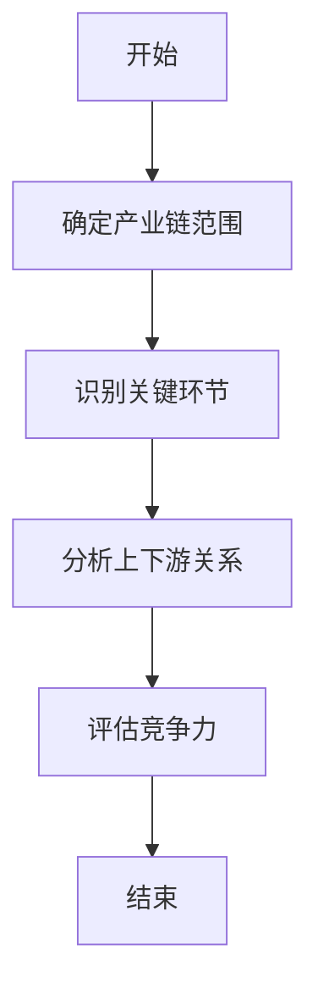

                 


# 巴菲特的产业链分析方法：全面理解公司的竞争环境

> 关键词：巴菲特、产业链分析、竞争环境、投资策略、企业分析

> 摘要：本文详细介绍巴菲特的产业链分析方法，通过系统的结构化方法，帮助读者全面理解公司的竞争环境，掌握投资决策的核心逻辑。文章结合实际案例，深入剖析产业链的结构、关键环节和竞争优势，提供实用的分析工具和方法。

---

# 目录

## 第1章：产业链分析方法概述

### 1.1 产业链的基本概念

- 产业链的定义
- 产业链的组成要素
- 产业链的分类

### 1.2 巴菲特的产业链分析方法

- 巴菲特的投资哲学
- 产业链分析在巴菲特投资策略中的作用
- 产业链分析的核心要素

### 1.3 产业链分析的背景与重要性

- 当前经济环境下的产业链分析
- 产业链分析对投资决策的影响
- 产业链分析对企业战略的意义

---

## 第2章：产业链的核心概念与联系

### 2.1 产业链的结构与功能

- 产业链的层次划分
- 产业链的功能特点
- 产业链的动态变化

### 2.2 关键环节与核心竞争力

- 关键环节的识别方法
- 核心竞争力的定义与评估
- 关键环节对整体竞争力的影响

### 2.3 产业链上下游关系分析

- 上游供应商的影响
- 下游客户的需求
- 产业链协同效应的分析

---

## 第3章：产业链分析的算法原理

### 3.1 产业链分析的基本流程

- 确定产业链范围
- 识别关键环节
- 分析上下游关系
- 评估竞争力

### 3.2 数学模型与公式

- 产业链竞争力指数模型
  $$C = \frac{S + T}{2}$$
  其中，$S$ 表示上游供应链的稳定性，$T$ 表示下游需求的稳定性。

- 市场占有率模型
  $$M = \frac{S}{T}$$
  其中，$S$ 表示企业的市场份额，$T$ 表示行业总市场份额。

### 3.3 算法流程图



---

## 第4章：系统分析与架构设计

### 4.1 问题场景介绍

- 产业链分析的目标
- 产业链分析的常见问题
- 系统分析的必要性

### 4.2 项目介绍

- 项目背景
- 项目目标
- 项目范围

### 4.3 系统功能设计

- 领域模型
  ```mermaid
  classDiagram
  class 产业链分析系统 {
    用户界面
    数据处理模块
    分析模块
    输出模块
  }
  ```

- 系统架构设计
  ```mermaid
  graph TD
  A[用户] --> B[用户界面]
  B --> C[数据处理模块]
  C --> D[分析模块]
  D --> E[输出模块]
  ```

### 4.4 接口设计与交互流程图

- 系统接口设计
- 用户与系统的交互流程
  ```mermaid
  graph TD
  A[用户] --> B[系统开始]
  B --> C[输入数据]
  C --> D[数据处理]
  D --> E[生成分析结果]
  E --> F[用户接收结果]
  ```

---

## 第5章：项目实战

### 5.1 实战背景

- 选择的行业
- 行业背景介绍
- 实战目标

### 5.2 核心实现源代码

- 代码实现步骤
- 关键代码片段

### 5.3 代码应用解读与分析

- 代码的功能说明
- 代码的优化建议
- 代码的实际效果

### 5.4 实战案例分析

- 案例背景
- 案例分析过程
- 案例结论与启示

---

## 第6章：最佳实践

### 6.1 小结

- 本文的主要内容总结
- 产业链分析方法的核心要点
- 投资决策的关键因素

### 6.2 注意事项

- 分析过程中需要注意的问题
- 数据收集与处理的注意事项
- 方法应用中的常见误区

### 6.3 拓展阅读

- 推荐的相关书籍
- 推荐的在线资源
- 进一步学习的方向

---

## 附录

### 附录A：术语表

- 术语解释
- 关键概念定义

### 附录B：工具与资源

- 推荐的工具软件
- 数据来源与获取方式

---

通过以上目录结构，读者可以系统地学习巴菲特的产业链分析方法，掌握从理论到实践的应用技巧，提升对公司的竞争环境和投资决策的理解能力。

