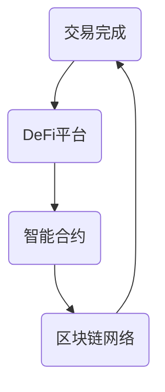

                 


# 巴菲特的价值投资在数字资产市场中的新维度

## 关键词：巴菲特，价值投资，数字资产，区块链，DeFi，加密货币

## 摘要：本文探讨了巴菲特的价值投资理念在数字资产市场中的应用，分析了数字资产市场的特点、投资策略、技术分析和风险管理，并提供了实际案例，展示了如何将传统投资策略延伸到新兴领域。

---

## 第一部分：引言

### 1.1 巴菲特的价值投资理念

#### 1.1.1 巴菲特的价值投资概述

沃伦·巴菲特的价值投资理念强调以合理的价格投资具有持续竞争优势的优秀企业。他注重企业的基本面分析，寻找那些具有强大竞争优势、稳固财务状况和优秀管理团队的公司。

**关键概念：**

- **质量**：企业的产品或服务是否具有独特的竞争优势。
- **价值**：股票价格是否低于其内在价值。
- **能力圈**：投资者应专注于自己熟悉的企业和行业。

#### 1.1.2 价值投资在传统市场中的应用

巴菲特通过长期持有优质股票，依靠复利效应实现财富增长。他的成功案例包括投资可口可乐和美国运通等企业，这些企业具有强大的市场地位和竞争优势。

---

### 1.2 数字资产市场的兴起

#### 1.2.1 数字资产的定义与分类

数字资产是指基于区块链技术的虚拟资产，包括加密货币（如比特币、以太坊）和代币（如ERC-20代币）。数字资产具有去中心化、透明性和不可篡改的特性。

**关键概念：**

- **区块链**：分布式账本技术，确保交易的透明性和安全性。
- **加密货币**：使用加密技术进行的数字货币，具有去中心化特点。
- **代币经济**：通过代币发行融资的经济模式，常见于DeFi和NFT领域。

#### 1.2.2 数字资产市场的独特性

数字资产市场具有高波动性、去中心化和技术创新等特点。与传统市场相比，数字资产市场的参与者更多依赖技术分析和市场情绪，而非传统的基本面分析。

---

## 第二部分：数字资产市场的核心要素

### 2.1 区块链技术与数字资产

#### 2.1.1 区块链技术的基本原理

区块链是一种分布式账本技术，通过去中心化的节点记录交易信息，确保数据的安全性和不可篡改性。每个区块包含交易信息和时间戳，通过哈希指针连接形成链式结构。

**数学模型：**

区块链的结构可以用图论中的链式结构表示：

$$
\text{区块链} = \{B_1, B_2, ..., B_n\}
$$

其中，每个节点 $B_i$ 包含交易信息和哈希指针。

#### 2.1.2 数字资产的发行机制

数字资产的发行通常通过初始代币发行（ICO）或链上发行完成。发行机制涉及智能合约，用于自动执行代币的分配和转让。

**代码示例：**

以太坊上的智能合约代码（Solidity）：

```solidity
// SPDX-License-Identifier: MIT
pragma solidity ^0.8.0;

contract Token {
    string public name = "Digital Asset";
    uint256 public supply = 1000000;

    function transfer(address recipient, uint256 amount) external {
        require(balanceOf[msg.sender] >= amount, "Insufficient balance");
        balanceOf[msg.sender] -= amount;
        balanceOf[recipient] += amount;
    }
}
```

### 2.2 去中心化金融（DeFi）的崛起

#### 2.2.1 DeFi的基本概念与运作方式

DeFi是指基于区块链技术的去中心化金融应用，涵盖借贷、交易和融资等领域。DeFi通过智能合约实现金融业务的自动化，避免传统金融体系的中间人。

**系统架构图：**



---

## 第三部分：价值投资理念的数字化延伸

### 3.1 巴菲特投资理念的核心要素

#### 3.1.1 投资组合的构建原则

巴菲特强调分散投资和长期持有，避免短期波动的影响。在数字资产市场中，投资者应选择具有强大技术支撑和良好生态系统的项目。

**数学模型：**

投资组合的收益计算：

$$
\text{总收益} = \sum_{i=1}^n (r_i \times w_i)
$$

其中，$r_i$ 是第 $i$ 个资产的收益率，$w_i$ 是权重。

### 3.2 数字资产市场的竞争优势分析

#### 3.2.1 企业的竞争优势在数字资产中的体现

在数字资产市场中，企业的竞争优势体现在技术团队的能力、项目的应用场景和社区支持等方面。选择具有强大技术团队和广泛应用场景的项目是关键。

**案例分析：**

以太坊的智能合约功能使其成为DeFi领域的首选平台，具有强大的竞争优势。

### 3.3 价值投资在数字资产中的适用性

#### 3.3.1 传统价值投资理念的适用性探讨

数字资产市场的高波动性和技术驱动特性使得传统价值投资理念需要调整。投资者应关注项目的长期价值和内在质量，而非短期价格波动。

---

## 第四部分：数字资产市场的投资策略

### 4.1 技术分析与投资决策

#### 4.1.1 常用技术指标

技术分析在数字资产市场中尤为重要，常用的指标包括：

- **移动平均线（MA）**：用于判断价格趋势。
- **相对强弱指数（RSI）**：用于判断超买或超卖状态。

**代码示例：**

计算移动平均线的Python代码：

```python
import pandas as pd

def calculate_ma(data, window):
    return data['close'].rolling(window=window).mean()

# 示例数据
data = {'close': [100, 105, 110, 115, 120]}
df = pd.DataFrame(data)
ma_5 = calculate_ma(df, 5)
print(ma_5)
```

---

## 第五部分：风险管理与投资组合优化

### 5.1 数字资产市场的风险管理

#### 5.1.1 风险管理策略

在数字资产市场中，投资者应采取以下风险管理策略：

1. **分散投资**：将资金分配到不同的项目和资产类别中。
2. **设置止损**：为每个投资设定止损点，以限制潜在损失。
3. **定期评估**：定期审查投资组合，调整以适应市场变化。

---

## 结论

巴菲特的价值投资理念在数字资产市场中仍然具有重要的指导意义。通过分析项目的长期价值、技术优势和市场地位，投资者可以在高波动性的市场中找到优质的数字资产项目。然而，数字资产市场的特殊性要求投资者具备技术分析能力和风险管理系统，以应对市场的不确定性和波动性。

---

## 参考文献

- 巴菲特股东大会演讲
- 《区块链革命》
- 《DeFi实战指南》

---

## 附录

### A. 术语解释

- **区块链**：分布式账本技术。
- **DeFi**：去中心化金融。

---

## 索引

- 巴菲特，沃伦
- 数字资产
- 区块链
- DeFi
- 技术分析

---

通过以上分析，我们可以看到，巴菲特的价值投资理念在数字资产市场中仍然适用，但需要结合数字资产市场的特点和技术创新进行调整和优化。投资者需要具备技术分析能力和风险管理意识，才能在数字资产市场中获得长期稳定的收益。

