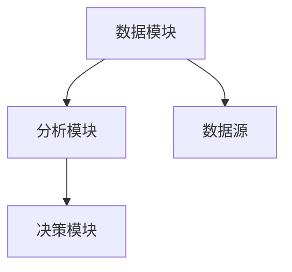

                 


# 巴菲特的价值投资在新兴市场科技股中的调整

## 关键词：
- 巴菲特价值投资
- 新兴市场
- 科技股
- 估值调整
- 投资策略

## 摘要：
本文深入探讨了巴菲特价值投资理念在新兴市场科技股投资中的应用与调整。通过分析新兴市场科技股的独特性，结合价值投资的核心原则，提出了一套适用于新兴市场科技股的估值与投资策略。文章从背景介绍、核心概念、算法原理、系统架构到项目实战，全面解析了如何在新兴市场中有效应用巴菲特的投资理念，并通过具体案例展示了策略的实际应用效果。

---

# 第1章: 价值投资与新兴市场科技股概述

## 1.1 价值投资的基本概念

### 1.1.1 价值投资的定义与核心理念
价值投资是一种长期投资策略，强调以低于内在价值的价格买入优质资产。其核心理念包括：
1. **安全边际**：买入价格低于内在价值，确保投资的安全性。
2. **企业基本面**：关注企业的盈利能力、财务状况和竞争优势。
3. **长期视角**：注重企业的长期价值，而非短期市场波动。

### 1.1.2 巴菲特价值投资策略的特点
- **注重企业内在价值**：巴菲特认为股票的价值取决于企业的盈利能力。
- **关注ROE（净资产收益率）**：ROE是衡量企业盈利能力的重要指标。
- **长期持有**：巴菲特倾向于长期持有优质股票，避免频繁交易。

### 1.1.3 新兴市场科技股的独特性
- **高增长性**：新兴市场的科技企业通常处于快速成长阶段。
- **高波动性**：新兴市场的股票价格波动较大。
- **行业差异性**：科技企业在不同新兴市场的表现可能差异显著。

## 1.2 新兴市场科技股的现状与挑战

### 1.2.1 新兴市场的定义与特点
新兴市场是指经济快速发展但尚未完全工业化的国家，如中国、印度等。其特点包括：
1. **经济增长快**：新兴市场的GDP增速通常高于发达市场。
2. **市场波动大**：新兴市场的股票市场波动性较高。
3. **政策影响大**：政府政策对市场影响较大。

### 1.2.2 科技股在新兴市场的崛起
- **科技行业的重要性**：科技行业在新兴市场中扮演着越来越重要的角色。
- **科技企业的快速成长**：新兴市场的科技企业通过创新和规模化迅速扩张。

### 1.2.3 新兴市场科技股投资的主要挑战
- **信息不对称**：新兴市场信息透明度较低，投资者难以获取准确的企业信息。
- **政策风险**：新兴市场的政策变化可能对科技企业产生重大影响。
- **估值偏差**：新兴市场科技股的估值可能偏离其内在价值。

## 1.3 价值投资在新兴市场科技股中的适用性

### 1.3.1 价值投资的核心原则
- **买入低估资产**：寻找价格低于内在价值的股票。
- **长期持有**：避免短期波动，关注企业的长期价值。
- **注重基本面**：分析企业的财务状况和竞争优势。

### 1.3.2 新兴市场科技股的特殊性
- **高增长与高风险并存**：新兴市场的科技企业增长潜力大，但风险也较高。
- **行业周期性**：科技行业受政策和市场周期影响较大。
- **国际竞争力**：新兴市场的科技企业需要具备全球竞争力。

### 1.3.3 价值投资在新兴市场科技股中的调整方向
- **调整估值方法**：结合新兴市场的特点，调整传统的估值模型。
- **加强行业分析**：深入了解科技行业的竞争格局和政策环境。
- **关注管理层能力**：管理层的决策能力和企业战略对科技企业的成功至关重要。

---

# 第2章: 价值投资的核心概念与分析框架

## 2.1 价值投资的核心概念

### 2.1.1 内在价值的定义与计算
内在价值是指企业未来现金流的现值。计算公式如下：

$$
\text{内在价值} = \sum_{t=1}^{\infty} \frac{\text{CF}_t}{(1+r)^t}
$$

其中，CF<sub>t</sub>是第t年的现金流，r是折现率。

### 2.1.2 市场先生与投资者的角色
巴菲特将市场比作“市场先生”，投资者需要在市场先生报价低于内在价值时买入，高于内在价值时卖出。

### 2.1.3 股票的三重属性
股票具有资产、资本和企业所有权三重属性，投资者需要综合考虑这三重属性。

## 2.2 新兴市场科技股的分析框架

### 2.2.1 企业基本面分析
- **财务状况**：分析企业的收入、利润、现金流和资产负债情况。
- **竞争优势**：评估企业的核心竞争力，如技术优势、成本优势等。
- **管理层能力**：关注管理层的决策能力和企业战略。

### 2.2.2 行业竞争分析
- **行业格局**：分析行业内的主要竞争对手和市场集中度。
- **政策环境**：研究政府政策对行业的影响，如补贴、税收优惠等。
- **技术发展**：关注行业的技术创新和未来发展趋势。

### 2.2.3 市场周期分析
- **行业周期**：分析行业的生命周期，判断企业所处阶段。
- **宏观经济环境**：考虑宏观经济指标对市场的整体影响。

---

# 第3章: 新兴市场科技股的估值方法与调整策略

## 3.1 传统价值投资的估值方法

### 3.1.1 市盈率（P/E）分析
市盈率=股价/每股收益，公式为：

$$
\text{P/E} = \frac{\text{股价}}{\text{每股收益}}
$$

### 3.1.2 市净率（P/B）分析
市净率=股价/每股净资产，公式为：

$$
\text{P/B} = \frac{\text{股价}}{\text{每股净资产}}
$$

### 3.1.3 股息率分析
股息率=股息/股价，公式为：

$$
\text{股息率} = \frac{\text{股息}}{\text{股价}}
$$

## 3.2 新兴市场科技股的估值调整

### 3.2.1 现金流折现模型（DCF）的应用
DCF模型是评估科技股的重要工具，公式如下：

$$
\text{内在价值} = \frac{\text{自由现金流}}{(1+r)^t}
$$

### 3.2.2 市盈率与市净率的调整
- **市盈率调整**：考虑新兴市场的高增长性，适当提高市盈率的容忍度。
- **市净率调整**：对于高成长性的科技企业，市净率可能高于传统企业。

### 3.2.3 风险调整后的折现率
新兴市场的风险较高，需要在折现率中加入风险溢价。公式为：

$$
r = r_f + \text{风险溢价}
$$

其中，r<sub>f</sub>是无风险利率。

---

# 第4章: 新兴市场科技股投资的系统分析与架构设计

## 4.1 投资框架的设计

### 4.1.1 数据收集与处理
- **数据来源**：包括企业财务数据、行业数据和宏观经济数据。
- **数据清洗**：处理缺失值和异常值。

### 4.1.2 投资策略的设计
- **筛选标准**：基于DCF模型和财务指标筛选低估股票。
- **风险控制**：设定止损点和分散投资。

## 4.2 系统架构设计

### 4.2.1 系统功能设计
- **数据模块**：负责数据的收集和存储。
- **分析模块**：包括财务分析、行业分析和估值分析。
- **决策模块**：基于分析结果生成投资决策。

### 4.2.2 系统架构图


---

# 第5章: 项目实战与案例分析

## 5.1 项目环境与目标
- **目标**：通过DCF模型评估某新兴市场科技企业的内在价值。
- **工具**：使用Excel或Python进行数据分析。

## 5.2 核心代码实现

### 5.2.1 Python代码示例
```python
import pandas as pd
import numpy as np

# 假设df是包含财务数据的DataFrame
def calculate_intrinsic_value(df, discount_rate):
    # 计算自由现金流
    free_cash_flow = df['净利润'] - df['资本支出']
    # 计算永续年份的现金流
    terminal_value = free_cash_flow[-1] / (1 + discount_rate)
    # 计算内在价值
    intrinsic_value = terminal_value / (1 + discount_rate)
    return intrinsic_value

# 示例数据
data = {
    '净利润': [100, 120, 140],
    '资本支出': [50, 60, 70],
    '折现率': 0.1
}
df = pd.DataFrame(data)
discount_rate = data['折现率'][0]

iv = calculate_intrinsic_value(df, discount_rate)
print(f"内在价值：{iv:.2f}")
```

## 5.3 案例分析
以某新兴市场科技企业为例，分析其财务状况、行业地位和竞争优势，应用DCF模型计算其内在价值，并与当前股价进行对比，判断是否低估。

---

# 第6章: 投资策略与风险控制

## 6.1 投资策略的优化
- **动态调整**：根据市场变化和企业情况动态调整投资组合。
- **分散投资**：避免过度集中，降低风险。

## 6.2 风险控制的实践
- **止损机制**：设定止损点，控制回撤风险。
- **仓位管理**：根据市场环境调整持仓比例。

---

# 第7章: 总结与展望

## 7.1 总结
本文通过分析巴菲特价值投资理念在新兴市场科技股中的应用，提出了适合新兴市场的估值与投资策略，强调了系统分析和动态调整的重要性。

## 7.2 展望
未来的研究可以进一步探讨新兴市场科技股的国际化投资策略，以及如何利用大数据和人工智能技术提升投资分析的效率和精度。

---

# 注意事项：
- **数据来源**：确保数据的准确性和可靠性。
- **模型适用性**：DCF模型适用于稳定增长的企业，新兴市场的波动性可能会影响其准确性。
- **风险管理**：投资需谨慎，建议在专业人士指导下进行。

# 拓展阅读：
- 巴菲特的经典著作《巴菲特的智慧》。
- 《价值投资实战》：深入讲解价值投资的实践技巧。

