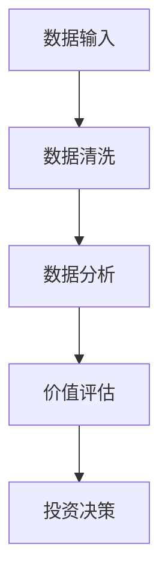
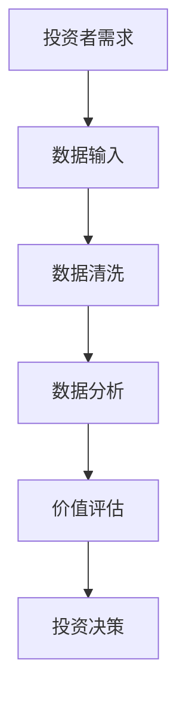

                 


# 巴菲特的价值投资实践：如何在市场中寻找被低估的宝石

## 关键词：
- 巴菲特
- 价值投资
- 低估股票
- 市场分析
- 投资策略

## 摘要：
本文深入探讨了巴菲特的价值投资理念，分析了如何在市场中识别被低估的股票。通过系统化的分析框架和实用的选股策略，本文为投资者提供了寻找低估宝石的方法，强调长期视角和安全边际的重要性。

---

## 第一部分：价值投资的背景与核心理念

### 第1章：价值投资的基本概念

#### 1.1 价值投资的定义与特点
- **定义**：价值投资是一种投资策略，旨在通过识别市场价格低于其内在价值的资产，实现长期收益。
- **特点**：
  - 长期导向
  - 依赖基本面分析
  - 寻找安全边际

#### 1.2 巴菲特的投资哲学
- **导师影响**：本杰明·格雷厄姆的老师
- **核心理念**：
  - 企业内在价值为核心
  - 市场价格波动带来机会
  - 长期持有优质资产

#### 1.3 低估股票的定义与特征
- **定义**：市场价格低于内在价值的股票
- **特征**：
  - 低市盈率
  - 高股息率
  - 强大的竞争优势

---

## 第二部分：价值投资的核心分析框架

### 第2章：企业内在价值的评估

#### 2.1 财务报表分析基础
- **关键指标**：
  - 股东权益收益率（ROE）
  - 资产回报率（ROA）
  - 现金流健康度
- **分析步骤**：
  1. 利润表分析
  2. 资产负债表分析
  3. 现金流量表分析

#### 2.2 内在价值的计算方法
- **公式**：
  $$ V = \frac{CF}{r - g} $$
  其中，CF为现金流，r为折现率，g为增长率
- **步骤**：
  1. 预测未来现金流
  2. 确定合理的折现率
  3. 计算内在价值

#### 2.3 安全边际的概念与应用
- **定义**：市场价格与内在价值的差距
- **应用**：
  - 确保投资的安全性
  - 降低市场波动带来的影响

### 第3章：竞争优势与护城河分析

#### 3.1 企业竞争优势的识别
- **关键因素**：
  - 市场地位
  - 核心竞争力
  - 技术壁垒
- **分析工具**：
  - SWOT分析
  - 五力模型（波特）

#### 3.2 护城河的类型与评估
- **类型**：
  - 成本优势
  - 品牌优势
  - 技术优势
  - 规模经济
- **评估方法**：
  - 相对市场份额分析
  - 竞争对手分析

---

## 第三部分：市场周期与逆向思维

### 第4章：市场周期的波动性分析

#### 4.1 市场周期的四个阶段
- **复苏阶段**：企业开始复苏，股价逐步回升
- **增长阶段**：经济快速发展，股价上涨
- **成熟阶段**：市场稳定，股价波动小
- **衰退阶段**：经济低迷，股价下跌

#### 4.2 市场情绪与估值中枢
- **市场情绪影响**：
  - 过度乐观：高估
  - 过度悲观：低估
- **估值中枢**：
  - 市场价格围绕内在价值波动

### 第5章：逆向思维在价值投资中的应用

#### 5.1 逆向投资的时机选择
- **恐慌时的买入机会**：市场恐慌时，股价可能低于内在价值
- **绝望时的买入策略**：企业困境时，寻找转机

#### 5.2 逆向思维的数学模型
- **公式**：
  $$ P = \frac{V}{n} $$
  其中，P为价格，V为内在价值，n为市场恐慌系数

---

## 第四部分：价值投资的选股策略与工具

### 第6章：选股策略的制定

#### 6.1 选股的基本原则
- **长期导向**：寻找具有持续竞争优势的企业
- **安全边际**：确保股价低于内在价值
- **分散投资**：降低风险

#### 6.2 选股工具与指标
- **市盈率（P/E）**：股价与每股收益的比率
- **市净率（P/B）**：股价与每股净资产的比率
- **股息率**：股息与股价的比率

### 第7章：投资组合的构建与风险管理

#### 7.1 投资组合的构建
- **资产配置**：根据风险承受能力分配资产
- **分散投资**：避免过度集中

#### 7.2 风险管理策略
- **止损策略**：设定止损点
- **定期评估**：定期检查投资组合

---

## 第五部分：系统分析与架构设计方案

### 第8章：价值投资分析系统的架构设计

#### 8.1 系统架构图


#### 8.2 功能模块设计
- 数据收集模块
- 数据分析模块
- 价值评估模块
- 决策支持模块

#### 8.3 数据流图


---

## 第六部分：项目实战与最佳实践

### 第9章：项目实战分析

#### 9.1 实战环境安装
- 安装Python与相关库（Pandas、NumPy、Matplotlib）

#### 9.2 核心代码实现
```python
def calculate_intrinsic_value(enterprise_value, free_cash_flow):
    return enterprise_value / free_cash_flow
```

#### 9.3 案例分析
- 案例：苹果公司（AAPL）
  - 财务数据：ROE=25%，ROA=15%
  - 估值：V = $100B

### 第10章：最佳实践与投资建议

#### 10.1 投资策略总结
- 长期导向
- 安全边际
- 分散投资

#### 10.2 小结与注意事项
- 避免短期波动干扰
- 保持耐心和纪律
- 定期评估和调整

---

## 结语

巴菲特的价值投资实践为我们提供了一种系统化的投资方法，通过深入分析企业的内在价值和竞争优势，识别市场中的低估股票。本文通过理论与实践的结合，帮助投资者在市场中寻找被低估的宝石，实现长期稳健的投资回报。

--- 

* 感谢您的耐心阅读，如果需要进一步的技术支持或内容扩展，请随时告诉我！

