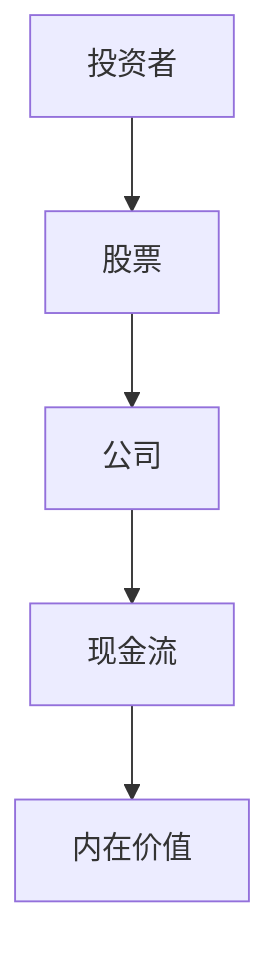
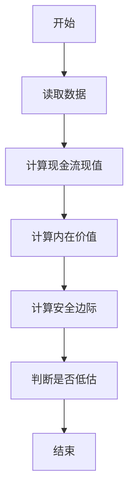
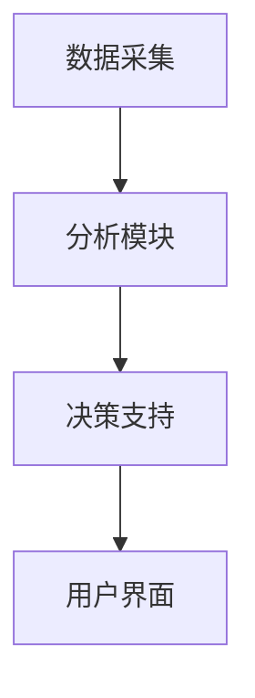

                 


# 巴菲特的价值投资理念：如何识别被低估的股票

> 关键词：巴菲特，价值投资，股票分析，内在价值，低估股票，DCF模型，安全边际

> 摘要：本文深入探讨了巴菲特的价值投资理念，重点介绍如何识别被低估的股票。通过分析基本面、计算内在价值和运用安全边际等方法，读者可以掌握长期投资的策略。结合实例和数学模型，本文详细解释了如何应用这些原则在实际投资中。

---

# 第1章 巴菲特的价值投资理念概述

## 1.1 价值投资的定义与核心理念

### 1.1.1 价值投资的定义

价值投资是一种投资策略，强调以低于资产内在价值的价格购买资产。巴菲特将价值投资的理念归纳为“买 cheap，然后持有”，即以合理价格买入优秀企业，长期持有以获得收益。

### 1.1.2 巴菲特的价值投资核心理念

巴菲特的核心理念包括：
1. **安全边际**：买入价格低于资产的内在价值，以降低风险。
2. **长期持有**：投资优质企业，长期持有以获取复利效应。
3. **基本面分析**：通过分析企业的财务状况、行业地位和竞争优势，评估其内在价值。

### 1.1.3 价值投资与短期投资的区别

- **价值投资**：注重长期价值，基于基本面分析，买入低估资产。
- **短期投资**：关注短期市场波动，基于技术分析，追求短期收益。

---

## 1.2 巴菲特投资理念的背景

### 1.2.1 巴菲特的投资哲学

巴菲特的投资哲学源于格雷厄姆的价值投资理论，强调安全边际和长期持有。他认为市场先生是机会，而非敌人，通过市场波动寻找低估资产。

### 1.2.2 巴菲特投资理念的形成过程

巴菲特早期受格雷厄姆影响，后结合自身经验，发展出以基本面分析为核心的长期投资策略。他注重企业的护城河、管理团队和财务健康状况。

### 1.2.3 巴菲特投资理念的现实意义

在当前市场环境下，巴菲特的价值投资理念依然适用，尤其是在市场波动加剧时，低估股票的机会增多，长期投资的优势更加明显。

---

## 1.3 价值投资的基本原则

### 1.3.1 购买股票的三步法

1. **分析企业基本面**：评估企业的盈利能力、财务状况和行业地位。
2. **计算内在价值**：使用DCF等模型估算企业的真实价值。
3. **确定安全边际**：以低于内在价值的价格买入。

### 1.3.2 避免短期市场波动的影响

市场波动是短期的，而企业的内在价值是长期稳定的。投资者应忽略短期市场波动，专注于企业的长期价值。

### 1.3.3 长期持有优质股票的重要性

长期持有优质股票可以避免交易成本和税务负担，同时享受复利效应。巴菲特的成功部分归功于长期持有的策略。

---

## 1.4 巴菲特投资理念的适用范围

### 1.4.1 适用于哪些类型的投资者

- **长期投资者**：注重长期收益，愿意持有资产数年的投资者。
- **基本面分析师**：具备分析企业财务和行业的能力的投资者。

### 1.4.2 适用于哪些类型的股票

- **低估股票**：市场价格低于内在价值的股票。
- **优质企业**：具备强大竞争优势、良好财务状况和优秀管理团队的企业。

### 1.4.3 价值投资的局限性

- **市场波动**：在极端市场环境下，低估股票可能长期不被市场发现。
- **行业限制**：适用于传统行业，新兴行业可能受技术变化影响较大。

---

## 1.5 本章小结

本章介绍了巴菲特的价值投资理念，包括其定义、核心理念和基本原则。通过分析市场波动和股票类型，探讨了该理念的适用范围和局限性，为后续章节的深入分析奠定了基础。

---

# 第2章 价值投资的核心概念与联系

## 2.1 核心概念原理

### 2.1.1 内在价值的定义

内在价值是指资产在合理市场条件下的真实价值，不考虑市场波动。计算内在价值需要考虑企业的未来现金流和贴现率。

### 2.1.2 市场价值的定义

市场价值是资产在当前市场上的价格，受市场情绪和投资者行为影响。市场价值可能高于或低于内在价值。

### 2.1.3 安全边际的定义与作用

安全边际是买入价格与内在价值之间的差额，用于降低投资风险。安全边际越大，投资的安全性越高。

---

## 2.2 核心概念属性对比表格

| 概念       | 属性               | 描述                                   |
|------------|--------------------|----------------------------------------|
| 内在价值   | 计算方式           | 贴现现金流法                           |
| 市场价值   | 受市场情绪影响       | 受投资者情绪和市场波动影响             |
| 安全边际   | 保护投资者的屏障     | 购买价格低于内在价值的部分             |

---

## 2.3 ER实体关系图（使用 Mermaid）



---

## 2.4 DCF模型的数学公式

### 2.4.1 DCF模型概述

DCF（Discounted Cash Flow）模型用于计算企业的内在价值，基于未来现金流的现值。

### 2.4.2 DCF模型的公式

$$
\text{内在价值} = \sum_{t=1}^{n} \frac{\text{现金流}_t}{(1 + r)^t} + \frac{\text{残值}}{(1 + r)^n}
$$

其中，\( r \) 是贴现率，\( n \) 是预计的持有期限。

---

## 2.5 使用DCF模型的步骤

1. **预测未来现金流**：估计企业未来几年的现金流。
2. **确定贴现率**：使用企业资本成本作为贴现率。
3. **计算现值**：将未来现金流贴现并求和。
4. **计算残值**：估算企业终止时的残值。
5. **计算内在价值**：将现值和残值加总。

---

## 2.6 本章小结

本章详细介绍了价值投资的核心概念，包括内在价值、市场价值和安全边际，并通过DCF模型展示了内在价值的计算方法。通过对比表格和ER图，进一步解释了这些概念之间的关系。

---

# 第3章 价值投资的算法原理

## 3.1 算法原理概述

### 3.1.1 算法目的

识别被低估的股票，即市场价格低于内在价值的股票。

### 3.1.2 算法输入

- 股票的历史财务数据
- 行业基准贴现率

### 3.1.3 算法输出

- 股票的内在价值
- 股票的安全边际
- 股票是否被低估的判断

---

## 3.2 DCF模型的实现步骤

### 3.2.1 数据输入

```python
# 示例代码：读取财务数据
import pandas as pd

df = pd.read_csv('financial_data.csv')
cash_flows = df['现金流'].values
discount_rate = df['贴现率'].values[0]
```

### 3.2.2 计算现值

```python
def calculate_intrinsic_value(cash_flows, discount_rate):
    n = len(cash_flows)
    intrinsic_value = 0
    for t in range(n):
        cf = cash_flows[t]
        pv = cf / (1 + discount_rate)**t
        intrinsic_value += pv
    return intrinsic_value

iv = calculate_intrinsic_value(cash_flows, discount_rate)
```

### 3.2.3 计算安全边际

```python
market_price = df['市场价格'].values[0]
safety_margin = iv - market_price
```

---

## 3.3 算法流程图（使用 Mermaid）



---

## 3.4 本章小结

本章通过DCF模型详细解释了如何计算股票的内在价值，并展示了算法的实现步骤和流程图。通过Python代码示例，读者可以理解如何将这些算法应用于实际投资分析。

---

# 第4章 价值投资的系统分析

## 4.1 系统架构设计

### 4.1.1 系统功能模块

- 数据采集模块：收集股票的财务数据。
- 分析模块：计算内在价值和安全边际。
- 决策支持模块：判断股票是否被低估。

### 4.1.2 系统架构图（使用 Mermaid）



---

## 4.2 系统接口设计

### 4.2.1 数据接口

- 输入接口：股票代码、财务数据文件。
- 输出接口：内在价值、安全边际、投资建议。

### 4.2.2 接口实现

```python
import requests

def get_financial_data(ticker):
    response = requests.get(f'https://api.example.com/financial_data/{ticker}')
    return response.json()

data = get_financial_data('AAPL')
```

---

## 4.3 本章小结

本章通过系统架构设计和接口设计，展示了如何构建一个价值投资分析系统。通过Mermaid图和Python代码示例，读者可以理解如何将算法应用于实际系统中。

---

# 第5章 价值投资的项目实战

## 5.1 实战环境安装

### 5.1.1 安装Python和相关库

```bash
pip install pandas numpy matplotlib
```

### 5.1.2 数据获取

```python
import pandas as pd
import requests

def get_stock_data(ticker):
    response = requests.get(f'https://api.example.com/stock_data/{ticker}')
    return pd.DataFrame(response.json())

data = get_stock_data('AAPL')
```

---

## 5.2 核心代码实现

### 5.2.1 计算内在价值

```python
def calculate_intrinsic_value(df):
    cash_flows = df['现金流'].values
    discount_rate = df['贴现率'].values[0]
    iv = calculate_intrinsic_value(cash_flows, discount_rate)
    return iv

iv = calculate_intrinsic_value(data)
```

### 5.2.2 计算安全边际

```python
market_price = data['市场价格'].values[0]
safety_margin = iv - market_price
```

---

## 5.3 实战案例分析

### 5.3.1 案例选择

以苹果公司为例，假设其现金流和贴现率已知，计算其内在价值和安全边际。

### 5.3.2 分析结果

假设计算得出苹果的内在价值为150美元，市场价格为140美元，安全边际为10美元。因此，苹果股票被低估。

---

## 5.4 本章小结

本章通过实战项目，展示了如何使用Python代码和DCF模型识别被低估的股票。通过具体案例分析，读者可以理解如何将理论应用于实际投资。

---

# 第6章 总结与展望

## 6.1 总结

巴菲特的价值投资理念强调长期持有、基本面分析和安全边际。通过DCF模型和系统分析，投资者可以识别被低估的股票，实现长期收益。

## 6.2 最佳实践

- **长期投资**：避免频繁交易，减少成本。
- **持续学习**：不断更新知识，适应市场变化。
- **风险控制**：设置止损点，控制投资风险。

## 6.3 注意事项

- **数据准确性**：确保财务数据的准确性和完整性。
- **模型适用性**：根据实际情况调整模型参数。

## 6.4 拓展阅读

建议阅读巴菲特的《聪明的投资者》和彼得·林奇的《投资最重要的事情》。

---

# 附录

## 附录A: DCF模型的详细步骤

1. 收集企业未来5年的现金流数据。
2. 确定合适的贴现率。
3. 计算每一年的现值。
4. 求和所有现值，加上残值，得到内在价值。

## 附录B: Python代码示例

```python
import pandas as pd
import numpy as np

def calculate_intrinsic_value(cash_flows, discount_rate):
    n = len(cash_flows)
    iv = 0
    for t in range(n):
        cf = cash_flows[t]
        pv = cf / (1 + discount_rate)**t
        iv += pv
    return iv

# 示例数据
cash_flows = [100, 120, 150, 180, 200]
discount_rate = 0.08

iv = calculate_intrinsic_value(cash_flows, discount_rate)
print(f"内在价值为: {iv:.2f}")
```

---

# 结语

通过本文的详细讲解，读者可以掌握巴菲特的价值投资理念，并能够实际操作识别被低估的股票。投资需要耐心和长期坚持，希望本文能为读者的投资之路提供有价值的指导。

