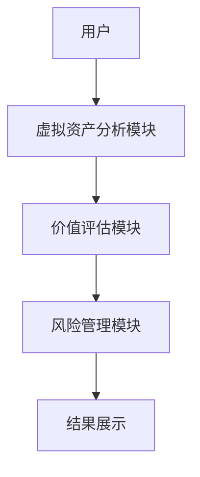
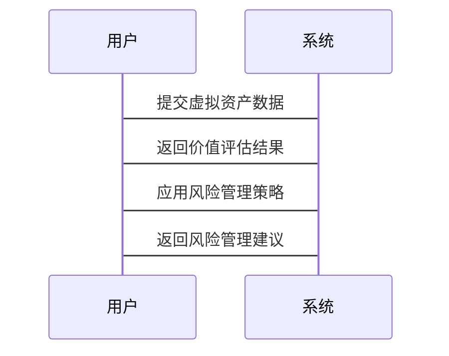

                 

# 巴菲特的价值链分析：元宇宙经济下的价值重构

## 关键词
- 巴菲特投资理论
- 元宇宙经济
- 价值重构
- 数字资产
- 虚拟经济
- 价值链分析
- 系统架构

## 摘要
本文探讨如何将巴菲特的价值链分析理论应用于元宇宙经济环境中的价值重构。通过分析元宇宙经济的背景、巴菲特的理论、元宇宙中的价值重构方法以及系统架构，结合实际案例和工具，展示如何在虚拟经济中应用这些方法进行价值评估和重构。

---

# 第一部分：引言

## 1.1 元宇宙与巴菲特的价值链分析
### 1.1.1 元宇宙的基本概念
元宇宙是一个虚拟的、持续的、可交互的数字世界，用户通过虚拟现实技术在这个世界中进行社交、交易和创造。元宇宙的经济体系类似于现实世界，包括虚拟资产、数字商品和虚拟货币。

### 1.1.2 巴菲特投资理念的核心要素
巴菲特的价值投资理念强调长期主义、安全边际和企业基本面分析。他注重企业的财务健康、竞争优势和管理团队。

### 1.1.3 元宇宙经济中的价值重构意义
在元宇宙中，虚拟资产的价值评估需要新的方法。巴菲特的价值链分析可以为元宇宙经济中的价值重构提供理论基础和实践指导。

---

# 第二部分：元宇宙经济的背景与现状

## 2.1 元宇宙经济的基本概念
### 2.1.1 元宇宙经济的定义与特征
元宇宙经济是基于虚拟资产和数字商品的经济体系，具有去中心化、透明化和可编程的特性。

### 2.1.2 元宇宙经济的参与者与生态系统
参与者包括用户、开发者、平台运营商和监管机构。生态系统包括虚拟资产、数字商品、虚拟货币和区块链技术。

## 2.2 元宇宙经济的发展现状
### 2.2.1 元宇宙经济的主要模式
包括虚拟土地、数字艺术品、虚拟货币和NFTs。这些模式推动了元宇宙经济的发展。

### 2.2.2 元宇宙经济中的主要问题与挑战
包括虚拟资产的流动性、价值波动性和监管不确定性。这些问题影响了元宇宙经济的稳定性和可持续性。

---

# 第三部分：巴菲特的价值链分析理论

## 3.1 巴菲特投资理念的核心要素
### 3.1.1 巴菲特的价值投资理念
巴菲特强调购买低于内在价值的股票，关注企业的长期盈利能力。

### 3.1.2 巴菲特的选股标准与分析框架
包括企业的财务健康状况、竞争优势、管理团队和股东权益。

## 3.2 巴菲特的价值链分析方法
### 3.2.1 企业价值评估的核心要素
包括企业的收入、利润、现金流和资产质量。

### 3.2.2 财务指标分析与企业价值的关系
通过分析财务指标，如市盈率、市净率和股息率，评估企业的内在价值。

---

# 第四部分：元宇宙经济中的价值重构

## 4.1 元宇宙经济中的价值重构理论
### 4.1.1 元宇宙经济中的虚拟资产价值评估
虚拟资产如NFTs的价值取决于其稀缺性、流动性和市场需求。

### 4.1.2 元宇宙经济中的数字商品与服务价值分析
数字商品的价值受用户需求、供给和平台规则的影响。

## 4.2 元宇宙经济中的价值重构方法
### 4.2.1 元宇宙经济中的价值评估模型构建
基于巴菲特的理论，构建虚拟资产的价值评估模型，考虑市场、技术和用户行为因素。

### 4.2.2 元宇宙经济中的价值重构策略
包括优化资产配置、风险管理和技术创新，以实现价值最大化。

---

# 第五部分：元宇宙经济中的价值重构实践

## 5.1 元宇宙经济中的价值重构案例分析
### 5.1.1 元宇宙经济中的虚拟资产投资案例
以虚拟土地为例，分析其投资价值和市场波动。

### 5.1.2 元宇宙经济中的数字商品价值重构案例
以数字艺术品为例，探讨其价值提升策略。

## 5.2 元宇宙经济中的价值重构工具与方法
### 5.2.1 元宇宙经济中的价值评估工具
包括虚拟资产分析工具和市场趋势分析工具。

### 5.2.2 元宇宙经济中的价值重构策略与技巧
包括市场研究、风险管理和技术应用，帮助投资者实现价值重构。

---

# 第六部分：系统架构与实现

## 6.1 系统架构设计
### 6.1.1 系统功能模块划分
包括虚拟资产分析模块、价值评估模块和风险管理模块。

### 6.1.2 系统功能实现
通过系统化的方法，实现虚拟资产的价值评估和风险控制。

## 6.2 系统架构图

### 6.3 系统接口设计
包括用户接口、数据接口和第三方接口，确保系统的高效运行。

### 6.4 系统交互序列图

---

# 第七部分：总结与展望

## 7.1 总结
通过巴菲特的价值链分析，结合元宇宙经济的背景和现状，提出价值重构的理论和实践方法，为投资者提供新的思路。

## 7.2 未来展望
随着元宇宙技术的发展，价值重构方法将更加复杂，需要不断创新和优化。

---

# 附录

## 附录A：工具与技术资料
包括价值评估工具、数据分析工具和区块链技术资料。

## 附录B：参考文献
列出相关书籍、论文和研究报告，供读者参考。

---

通过以上结构，本文系统地分析了巴菲特的价值链分析在元宇宙经济中的应用，结合理论和实践，为投资者提供了新的视角和方法。

