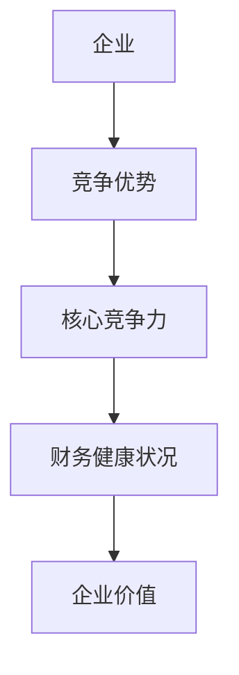
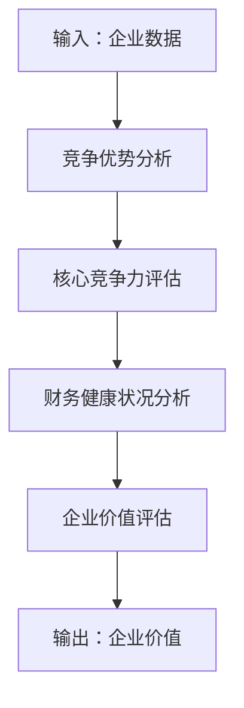
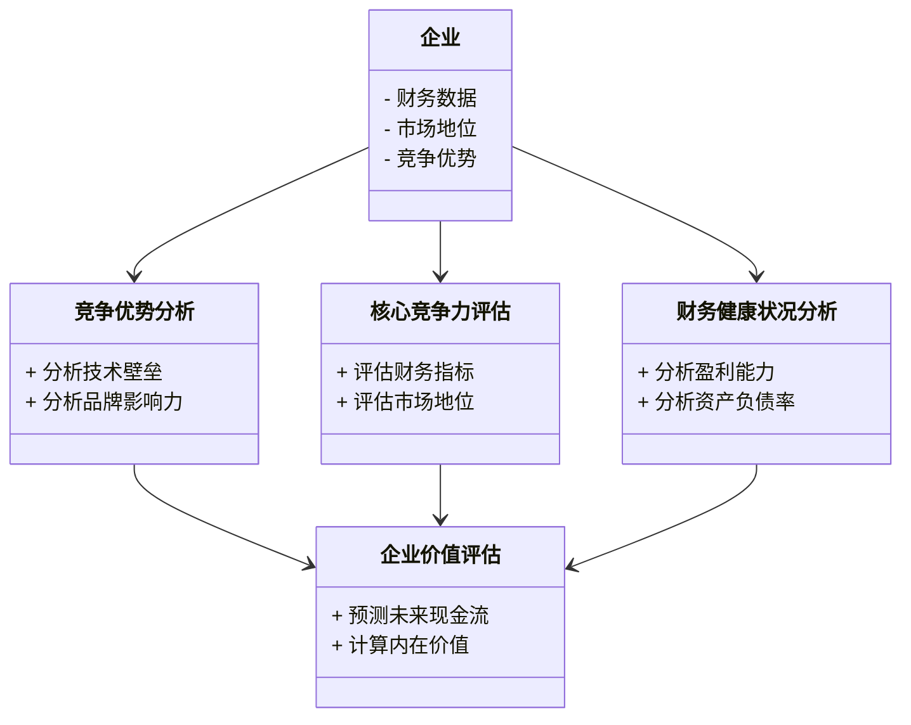
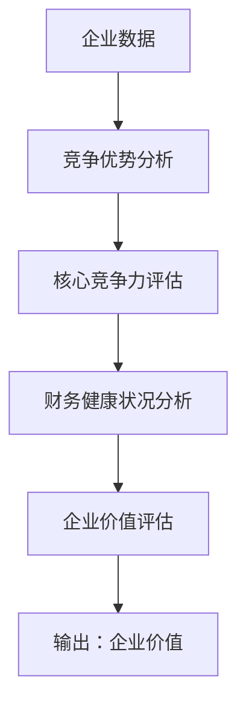
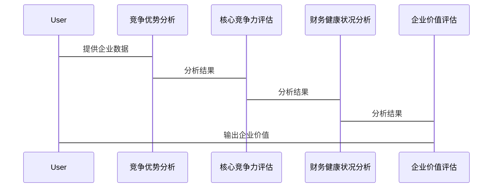

                 


# 巴菲特的价值链分析：数字平台经济下的价值创造

## 关键词：巴菲特，价值链分析，数字平台经济，价值创造，企业价值评估

## 摘要：  
本文深入探讨了巴菲特的价值链分析方法在数字平台经济中的应用，分析了数字平台经济的核心模式和价值创造过程，结合巴菲特的投资理念，提出了在数字平台经济下如何通过价值链分析实现价值创造的具体方法和策略。文章从理论到实践，结合实际案例，详细解读了巴菲特的价值链分析框架在数字平台经济中的应用，为投资者和企业管理者提供了有益的参考。

---

# 第一部分: 巴菲特的价值链分析基础

## 第1章: 巴菲特的价值链分析概述

### 1.1 巴菲特投资理念的起源与演变  
#### 1.1.1 价值投资的起源  
价值投资是一种长期投资策略，起源于20世纪初。本杰明·格雷厄姆和戴维·多德是这一理念的先驱者。他们强调以低于内在价值的价格购买优质资产，以获取长期稳定的收益。巴菲特早期的投资理念深受格雷厄姆的影响，但后来发展出了自己的独特方法。  

#### 1.1.2 巴菲特对价值投资的贡献  
巴菲特将价值投资的理念发扬光大，提出了“安全边际”和“企业内在价值”的概念。他强调，投资的核心是理解企业的内在价值，而不是市场的波动。他通过分析企业的财务状况、竞争优势和管理层能力，来评估企业的长期发展潜力。  

#### 1.1.3 数字平台经济的兴起与价值创造  
随着互联网和信息技术的发展，数字平台经济迅速崛起。数字平台通过连接供需双方，降低了交易成本，提高了效率。在数字平台经济中，企业的价值创造不仅体现在传统的产品和服务上，还体现在数据、技术、用户粘性和网络效应上。巴菲特的价值链分析方法可以为数字平台经济下的企业价值评估提供新的视角。  

### 1.2 数字平台经济的基本概念  
#### 1.2.1 数字平台的定义与特点  
数字平台是指通过互联网技术和数据驱动的方式，连接供需双方的在线平台。其特点是去中介化、数据驱动、用户参与度高和网络效应强。数字平台的核心竞争力在于其技术基础设施、用户规模和数据处理能力。  

#### 1.2.2 数字平台经济的核心模式  
数字平台经济的主要模式包括双边市场、广告模式、订阅模式和数据变现模式。这些模式通过数据的收集和分析，实现精准营销和个性化服务，从而创造更大的价值。  

#### 1.2.3 数字平台经济与传统经济的对比  
与传统经济相比，数字平台经济具有以下特点：  
- **去中介化**：通过平台直接连接供需双方，减少中间环节。  
- **数据驱动**：依赖于数据的收集和分析，实现精准匹配。  
- **网络效应**：用户规模越大，平台的价值越高。  
- **边际成本低**：数字产品的边际成本接近于零，可以快速复制和推广。  

### 1.3 巴菲特价值链分析的核心要素  
#### 1.3.1 企业竞争优势的来源  
巴菲特认为，企业的竞争优势是其长期价值的核心驱动力。这些竞争优势可能来自技术壁垒、品牌影响力、成本优势或客户忠诚度。  

#### 1.3.2 企业核心竞争力的评估  
核心竞争力是企业在市场上立足的根本。巴菲特通过分析企业的财务状况、管理团队和市场地位，评估其核心竞争力。  

#### 1.3.3 企业财务健康状况的分析  
财务健康状况是企业价值的重要指标。巴菲特通过分析企业的盈利能力、资产负债率和现金流，评估其财务健康状况。  

### 1.4 巴菲特价值链分析的应用场景  
#### 1.4.1 企业价值评估的常见问题  
企业在价值评估中常见的问题包括：  
- 如何准确评估企业的内在价值？  
- 如何识别企业的竞争优势？  
- 如何预测企业的未来现金流？  

#### 1.4.2 数字平台经济中的价值创造  
数字平台经济通过数据和技术创造价值。巴菲特的价值链分析方法可以帮助投资者识别数字平台的核心竞争力，评估其财务健康状况，并预测其未来现金流。  

#### 1.4.3 巴菲特分析法的适用性与局限性  
巴菲特分析法适用于那些具有持续竞争优势和稳定财务状况的企业。然而，在数字平台经济中，由于技术更新快、竞争激烈，其分析方法需要结合新的特点进行调整。  

### 1.5 本章小结  
本章介绍了巴菲特的价值链分析方法，分析了数字平台经济的基本概念和核心模式，并探讨了其在价值创造中的应用。下一章将深入分析巴菲特价值链分析的核心概念及其联系。

---

## 第2章: 巴菲特价值链分析的核心概念与联系

### 2.1 巴菲特价值链分析的原理  
#### 2.1.1 企业价值的构成要素  
企业价值由核心竞争力、竞争优势、财务健康状况和市场地位等多个要素构成。巴菲特通过分析这些要素，评估企业的长期发展潜力。  

#### 2.1.2 企业竞争优势的分析框架  
竞争优势是企业价值的核心驱动力。巴菲特通过分析企业的技术壁垒、品牌影响力和成本优势，评估其竞争优势。  

#### 2.1.3 企业财务健康状况的评估指标  
财务健康状况是企业价值的重要指标。巴菲特通过分析企业的盈利能力、资产负债率和现金流，评估其财务健康状况。  

### 2.2 核心概念对比表格  
以下表格对比了传统经济和数字平台经济在核心概念上的差异：  

| **核心概念**       | **传统经济**                     | **数字平台经济**                 |  
|---------------------|---------------------------------|---------------------------------|  
| **竞争优势**       | 技术壁垒、品牌影响力           | 数据、技术、用户粘性           |  
| **核心竞争力**     | 产品和服务质量                 | 数据和技术驱动                 |  
| **财务健康状况**   | 净利润、资产负债率             | 现金流、用户增长和收入         |  

### 2.3 ER实体关系图架构  
以下是巴菲特价值链分析的ER实体关系图：  



### 2.4 本章小结  
本章通过对比分析，明确了巴菲特价值链分析的核心概念及其在数字平台经济中的应用。下一章将详细讲解其算法原理。

---

## 第3章: 巴菲特价值链分析的算法原理

### 3.1 算法原理概述  
#### 3.1.1 价值评估的基本流程  
价值评估的基本流程包括：  
1. **确定企业竞争优势**：分析企业的技术壁垒、品牌影响力和成本优势。  
2. **评估核心竞争力**：通过财务指标和市场地位评估企业的核心竞争力。  
3. **分析财务健康状况**：评估企业的盈利能力、资产负债率和现金流。  
4. **预测未来现金流**：基于企业的竞争优势和财务状况，预测其未来现金流。  
5. **计算企业价值**：使用DCF模型计算企业的内在价值。  

#### 3.1.2 巴菲特分析法的核心算法  
巴菲特分析法的核心算法是通过DCF（Discounted Cash Flow）模型计算企业的内在价值。  

#### 3.1.3 算法的输入与输出  
- **输入**：企业的财务数据、市场地位和竞争优势。  
- **输出**：企业的内在价值和投资建议。  

### 3.2 算法流程图  
以下是巴菲特分析法的流程图：  



### 3.3 算法实现代码  
以下是使用Python实现的DCF模型代码：  

```python
def discounted_cash_flow(cash_flows, discount_rate, periods):
    # 计算现值
    present_value = 0
    for i in range(periods):
        cash_flow = cash_flows[i]
        present_value += cash_flow / (1 + discount_rate) ** (i + 1)
    return present_value

# 示例数据
cash_flows = [100, 200, 300, 400, 500]
discount_rate = 0.1
periods = 5

# 计算现值
intrinsic_value = discounted_cash_flow(cash_flows, discount_rate, periods)
print("内在价值：", intrinsic_value)
```

### 3.4 本章小结  
本章详细讲解了巴菲特价值链分析的算法原理，包括流程图和代码实现。下一章将分析系统的架构设计。

---

## 第4章: 巴菲特价值链分析的系统架构设计

### 4.1 系统功能设计  
#### 4.1.1 领域模型设计  
以下是领域模型设计图：  



### 4.2 系统架构设计  
以下是系统架构设计图：  



### 4.3 系统接口设计  
系统接口设计包括以下部分：  
- 输入接口：企业数据（财务数据、市场地位、竞争优势）。  
- 输出接口：企业价值评估结果。  

### 4.4 系统交互流程图  
以下是系统交互流程图：  



### 4.5 本章小结  
本章详细讲解了系统的架构设计，包括功能设计、架构设计和交互流程图。下一章将通过项目实战，展示如何应用这些方法。

---

## 第5章: 巴菲特价值链分析的项目实战

### 5.1 项目背景介绍  
以某数字平台企业为例，分析其竞争优势、核心竞争力和财务状况，评估其企业价值。  

### 5.2 系统环境安装  
需要安装以下工具：  
- Python编程语言  
- Mermaid图表工具  
- 数据分析工具（如Excel、Python的Pandas库）  

### 5.3 系统核心实现代码  
以下是实现代码：  

```python
import pandas as pd

# 示例数据
data = {
    '年份': [2018, 2019, 2020, 2021, 2022],
    '现金流': [100, 200, 300, 400, 500],
    '折扣率': [0.1, 0.1, 0.1, 0.1, 0.1]
}

df = pd.DataFrame(data)

# 计算现值
def discounted_cash_flow(row):
    return row['现金流'] / (1 + row['折扣率']) ** row['年份']

df['现值'] = df.apply(discounted_cash_flow, axis=1)
total_pv = df['现值'].sum()

print("现值总和：", total_pv)
```

### 5.4 代码应用解读与分析  
上述代码通过Pandas库实现现金流的现值计算，展示了如何使用DCF模型评估企业价值。  

### 5.5 实际案例分析  
以亚马逊为例，分析其竞争优势、核心竞争力和财务状况，评估其企业价值。  

### 5.6 项目小结  
本章通过实际案例分析，展示了如何应用巴菲特的价值链分析方法评估数字平台企业的价值。

---

## 第6章: 巴菲特价值链分析的最佳实践

### 6.1 最佳实践 Tips  
- **持续学习**：不断更新对数字平台经济的理解。  
- **数据驱动**：利用数据分析工具提高效率。  
- **风险管理**：关注企业的财务健康状况和竞争优势。  

### 6.2 本章小结  
本章总结了巴菲特价值链分析的最佳实践，为读者提供了有益的参考。

---

## 附录  
- **附录A**：常用数据分析工具列表  
- **附录B**：常用数学公式和模型  

---

## 参考文献  
1. 巴菲特《聪明的投资者》  
2. 格雷厄姆《证券分析》  
3. 大卫·杜兰特《巴菲特的股票投资策略》  
4. 罗伯特·希勒《金融与经济行为》

