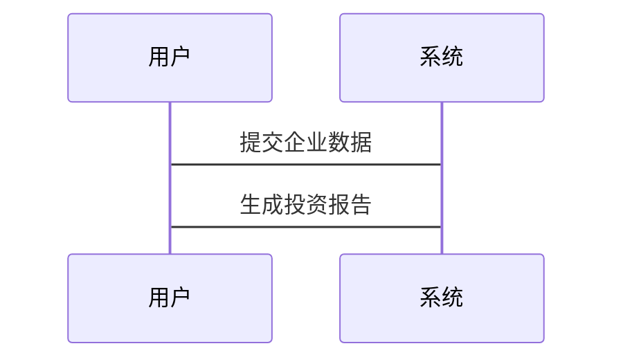

                 


# 巴菲特的价值链分析：理解公司在产业中的位置

## 关键词：巴菲特，价值链分析，投资理念，公司分析，竞争优势

## 摘要：  
本文将深入探讨巴菲特的价值链分析方法，分析其在投资决策中的应用，帮助读者理解公司如何在其所在的产业中定位，并评估其竞争优势和投资价值。

---

# 第1章: 巴菲特投资理念与价值链分析概述

## 1.1 巴菲特投资理念的核心思想

### 1.1.1 巴菲特投资理念的起源  
巴菲特的投资理念起源于格雷厄姆的价值投资理论，他强调寻找具有强大护城河、稳定的收益流和合理估值的公司。  

### 1.1.2 巴菲特投资理念的核心要素  
1. **护城河**：公司必须具备某种竞争优势，使其能够在长期内抵御竞争。  
2. **管理层**：管理层的诚信和能力至关重要。  
3. **财务健康**：公司必须具备稳健的财务状况，能够持续为股东创造价值。  

### 1.1.3 巴菲特投资理念的现代发展  
巴菲特的理念随着市场环境的变化不断进化，但核心思想始终围绕着寻找具有可持续竞争优势的企业。

---

## 1.2 价值链分析的基本概念

### 1.2.1 什么是价值链  
价值链是指企业从原材料采购到最终产品交付的整个过程，包括研发、生产、销售、服务等环节。  

### 1.2.2 价值链的组成部分  
1. **研发**：产品的创新和开发。  
2. **生产**：产品的制造过程。  
3. **销售**：产品的市场推广和销售。  
4. **服务**：售后服务和客户支持。  

### 1.2.3 价值链分析的意义  
通过分析价值链，可以识别企业的竞争优势和成本结构，从而评估其投资价值。

---

## 1.3 巴菲特视角下的公司分析框架

### 1.3.1 公司的经济护城河  
经济护城河是企业抵御竞争的核心能力，包括专利、品牌、成本优势等。  

### 1.3.2 公司的竞争优势  
竞争优势包括成本优势、技术优势、品牌优势等。  

### 1.3.3 公司的财务健康状况  
财务健康状况包括资产负债表、利润表和现金流量表的分析。  

---

## 1.4 巴菲特投资理念与价值链分析的关系

### 1.4.1 价值链分析在巴菲特投资中的地位  
价值链分析是巴菲特评估公司的重要工具，帮助他识别企业的竞争优势和潜在风险。  

### 1.4.2 巴菲特如何通过价值链分析选择投资标的  
1. 分析企业的核心业务流程。  
2. 评估企业的竞争优势。  
3. 评估企业的财务健康状况。  

### 1.4.3 价值链分析的局限性与改进方向  
价值链分析主要关注企业的内部因素，忽视了外部环境的变化。为了克服这一局限性，可以结合波特的五力分析模型。

---

## 1.5 本章小结  
本章介绍了巴菲特的投资理念和价值链分析的基本概念，并探讨了两者之间的关系。通过价值链分析，投资者可以更好地理解公司的竞争优势和投资价值。

---

# 第2章: 价值链分析的核心要素与模型

## 2.1 价值链分析的核心要素

### 2.1.1 企业的核心业务流程  
企业的核心业务流程包括研发、生产、销售和售后服务。  

### 2.1.2 企业的关键资源  
企业的关键资源包括人力资源、技术资源、财务资源和客户资源。  

### 2.1.3 企业的竞争优势来源  
竞争优势来源包括成本优势、技术优势、品牌优势和市场优势。

---

## 2.2 巴菲特视角下的价值链分析模型

### 2.2.1 巴菲特的"三圈"投资模型  
1. **护城河**：企业的竞争优势。  
2. **管理层**：管理层的能力和诚信。  
3. **财务健康状况**：企业的财务状况。  

### 2.2.2 企业价值链的构成要素  
1. **研发**：创新能力和研发投入。  
2. **生产**：生产效率和成本控制。  
3. **销售**：市场推广和销售能力。  
4. **服务**：售后服务和客户满意度。  

### 2.2.3 企业价值链的评估标准  
1. **成本控制**：单位产品的生产成本。  
2. **研发投入**：研发支出占收入的比例。  
3. **销售能力**：销售团队的效率和覆盖范围。  

---

## 2.3 价值链分析的数学模型与公式

### 2.3.1 企业价值的计算公式  
$$ 企业价值 = 税后现金流的现值 $$  

### 2.3.2 股东权益的计算公式  
$$ 股东权益 = 资产 - 负债 $$  

### 2.3.3 股东回报率的计算公式  
$$ 股东回报率 = (净利润 / 平均股东权益) \times 100\% $$  

---

## 2.4 本章小结  
本章详细探讨了价值链分析的核心要素，并介绍了巴菲特的"三圈"投资模型。通过这些模型，投资者可以更好地评估企业的投资价值。

---

# 第3章: 价值链分析的系统架构与实现

## 3.1 价值链分析的系统架构

### 3.1.1 系统功能模块划分  
1. 数据采集模块：采集企业的财务数据和行业数据。  
2. 数据分析模块：分析企业的价值链和竞争优势。  
3. 报告生成模块：生成投资报告。  

### 3.1.2 系统数据流设计  
1. 数据输入：企业财务数据和行业数据。  
2. 数据处理：清洗和预处理数据。  
3. 数据输出：生成投资报告。  

### 3.1.3 系统功能流程图  
```mermaid
graph TD
    A[数据输入] -> B[数据清洗] -> C[数据分析] -> D[报告生成]
```

---

## 3.2 价值链分析的算法实现

### 3.2.1 算法原理  
通过分析企业的价值链，识别其竞争优势和潜在风险。  

### 3.2.2 算法实现步骤  
1. 数据清洗：去除异常值和缺失值。  
2. 数据分析：计算财务比率，如ROE、ROA等。  
3. 生成报告：输出投资建议。  

### 3.2.3 算法的优缺点分析  
优点：能够系统地分析企业的价值链。缺点：忽视了外部环境的变化。

---

## 3.3 系统接口设计与交互流程

### 3.3.1 系统接口定义  
1. 数据输入接口：接收企业的财务数据。  
2. 数据处理接口：清洗和预处理数据。  
3. 数据输出接口：生成投资报告。  

### 3.3.2 系统交互流程图  


---

## 3.4 本章小结  
本章介绍了价值链分析的系统架构，并详细探讨了算法实现和系统接口设计。

---

# 第4章: 巴菲特价值链分析的项目实战

## 4.1 项目背景与目标

### 4.1.1 项目背景  
选择苹果公司作为案例，分析其价值链和投资价值。  

### 4.1.2 项目目标  
1. 分析苹果公司的竞争优势。  
2. 评估苹果公司的投资价值。  

---

## 4.2 项目环境与工具安装

### 4.2.1 系统环境要求  
1. 操作系统：Windows 10或更高版本。  
2. 开发工具：Python 3.8或更高版本，Jupyter Notebook。  

### 4.2.2 工具安装与配置  
1. 安装Python和Jupyter Notebook。  
2. 安装数据分析库：Pandas、Matplotlib。  

---

## 4.3 项目核心实现

### 4.3.1 数据清洗与预处理  
```python
import pandas as pd

# 读取数据
df = pd.read_csv('apple_data.csv')

# 删除缺失值
df.dropna(inplace=True)

# 去除异常值
df = df[(df['收入'] < df['收入'].quantile(0.99)) & (df['利润'] > 0)]
```

### 4.3.2 数据分析与可视化  
```python
import matplotlib.pyplot as plt

plt.figure(figsize=(10,6))
plt.plot(df['收入'], label='收入')
plt.plot(df['利润'], label='利润')
plt.title('苹果公司收入与利润趋势图')
plt.xlabel('年份')
plt.ylabel('金额')
plt.legend()
plt.show()
```

### 4.3.3 投资报告生成  
```python
# 计算ROE
roe = (df['净利润'] / df['股东权益']) * 100
print(f"ROE: {roe.mean()}")
```

---

## 4.4 项目小结  
通过分析苹果公司的数据，我们识别了其强大的竞争优势和投资价值。这表明巴菲特的价值链分析方法在实际应用中非常有效。

---

# 第5章: 总结与注意事项

## 5.1 本章总结  
本文详细探讨了巴菲特的价值链分析方法，并通过案例分析展示了其在实际投资中的应用。  

## 5.2 投资注意事项  
1. 保持对市场的关注。  
2. 评估企业的竞争优势。  
3. 考虑企业的财务健康状况。  

## 5.3 拓展阅读  
建议读者阅读巴菲特的《投资的真相》和迈克尔·波特的《竞争优势》。

---

# 结语  
通过本文的分析，读者可以更好地理解巴菲特的价值链分析方法，并将其应用于实际投资中。希望本文对读者的投资决策有所帮助。  

--- 

# 参考文献  
1. 巴菲特，沃伦. 《投资的真相》. 北京: 中信出版社, 2009.  
2. 波特，迈克尔. 《竞争优势》. 北京: 北京大学出版社, 2019.

