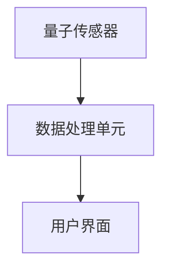
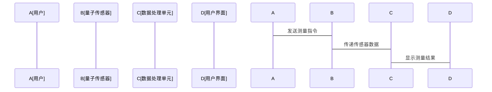

                 


# 巴菲特的价值链分析：量子传感技术在产业升级中的作用

> 关键词：量子传感技术，产业升级，巴菲特，价值链分析，技术驱动，投资逻辑

> 摘要：量子传感技术作为一种新兴的前沿技术，正在逐步改变传统产业的运作方式。本文通过结合巴菲特的价值链分析方法，深入探讨量子传感技术在产业升级中的作用，分析其对价值链优化的潜力，并结合实际案例，探讨其在制造业、医疗健康和能源领域的应用。通过系统分析和项目实战，本文为读者提供了一种新的视角，理解如何通过量子传感技术提升企业竞争力。

---

# 第一部分: 巴菲特的价值链分析与量子传感技术基础

## 第1章: 巴菲特的价值链分析概述

### 1.1 巴菲特的价值链分析方法

#### 1.1.1 价值链分析的核心概念
价值链分析是一种用来评估企业内部和外部价值创造过程的方法，主要关注企业在生产和交付过程中如何创造价值。巴菲特将其应用于投资分析，重点关注企业如何通过优化价值链实现长期竞争优势。

#### 1.1.2 价值链分析的背景与意义
在传统产业中，企业通常通过降低成本、提高效率或增加产品附加值来实现竞争优势。然而，随着技术的进步，特别是量子传感技术的出现，企业可以通过技术创新进一步优化价值链。

#### 1.1.3 巴菲特投资策略中的价值链视角
巴菲特的投资策略注重企业的长期价值创造能力。他认为，企业只有通过持续优化价值链，才能实现长期的利润增长。量子传感技术作为一种颠覆性技术，为企业提供了优化价值链的新途径。

---

### 1.2 量子传感技术的基本原理

#### 1.2.1 量子传感技术的定义与特点
量子传感技术是一种基于量子力学原理的感知技术，能够以极高的精度测量物理量（如磁场、重力、温度等）。其特点包括高灵敏度、高分辨率和非接触测量。

#### 1.2.2 量子传感技术的核心原理
量子传感技术利用量子系统的特性（如量子叠加和量子纠缠）进行测量。通过量子态的检测和分析，可以实现对物理量的高精度测量。

#### 1.2.3 量子传感技术与传统产业的结合
量子传感技术的应用场景广泛，包括制造业、医疗健康和能源等领域。它可以帮助企业实现更高效的生产过程和更精准的测量。

---

### 1.3 巴菲特的价值链分析与量子传感技术的结合

#### 1.3.1 量子传感技术在产业升级中的作用
量子传感技术可以通过提高测量精度和效率，优化企业的生产流程和供应链管理，从而降低生产成本并提高产品质量。

#### 1.3.2 巴菲特投资逻辑中的技术驱动因素
巴菲特认为，技术创新是企业长期竞争优势的核心来源。量子传感技术作为一种颠覆性技术，可以帮助企业实现价值链的优化，从而提高企业的投资价值。

#### 1.3.3 量子传感技术对价值链优化的潜力
通过量子传感技术，企业可以实现更高效的生产流程、更精准的供应链管理和更优质的客户服务，从而在竞争中占据优势地位。

---

## 第2章: 量子传感技术的核心概念与原理

### 2.1 量子传感技术的核心概念

#### 2.1.1 量子传感技术的定义与分类
量子传感技术根据其应用领域可以分为多种类型，包括量子磁场传感、量子重力传感和量子温度传感等。

#### 2.1.2 量子传感技术的关键特征
量子传感技术的关键特征包括高灵敏度、高分辨率、非接触测量和高稳定性。

#### 2.1.3 量子传感技术的数学模型
量子传感技术的数学模型基于量子力学的基本原理，包括量子态的表示和量子测量的数学模型。

---

### 2.2 量子传感技术的原理分析

#### 2.2.1 量子态的基本性质
量子态是量子系统的基本描述，包括波函数和密度矩阵。量子态的基本性质包括叠加性和纠缠性。

#### 2.2.2 量子测量的原理
量子测量是通过测量量子系统的某些可观测量来获得信息的过程。量子测量的原理包括测量算符和测量基的选择。

#### 2.2.3 量子传感技术的实现过程
量子传感技术的实现过程包括量子态的制备、量子测量和数据处理三个主要步骤。

---

### 2.3 量子传感技术与传统产业的结合

#### 2.3.1 制造业中的量子传感应用
在制造业中，量子传感技术可以用于高精度零件的测量和生产过程的优化。

#### 2.3.2 医疗健康中的量子传感应用
在医疗健康领域，量子传感技术可以用于疾病的早期诊断和治疗效果的监测。

#### 2.3.3 能源领域的量子传感应用
在能源领域，量子传感技术可以用于能源资源的勘探和能源设备的监测。

---

## 第3章: 量子传感技术的算法原理与数学模型

### 3.1 量子传感技术的算法原理

#### 3.1.1 量子测量算法的基本步骤
量子测量算法的基本步骤包括量子态的制备、测量算符的选择和测量结果的分析。

#### 3.1.2 量子态的重构算法
量子态的重构算法是一种通过测量结果反推量子态的方法，常用于量子传感技术的实现。

#### 3.1.3 量子传感技术的优化算法
量子传感技术的优化算法旨在提高测量精度和效率，包括量子测量的参数优化和算法改进。

---

### 3.2 量子传感技术的数学模型

#### 3.2.1 量子态的数学表示
量子态的数学表示包括波函数和密度矩阵，用于描述量子系统的状态。

#### 3.2.2 量子测量的数学模型
量子测量的数学模型包括测量算符和测量基的选择，用于描述测量过程。

#### 3.2.3 量子传感技术的性能评估
量子传感技术的性能评估包括测量精度、测量速度和测量成本三个主要指标。

---

### 3.3 算法实现与代码示例

#### 3.3.1 量子态测量的Python代码实现
```python
import numpy as np

def quantum_state_measurement(rho, basis):
    # rho是量子态的密度矩阵，basis是测量基
    # 测量结果
    result = np.zeros_like(rho)
    for i in range(len(basis)):
        # 计算测量算符
        P = np.outer(basis[i], basis[i])
        # 计算测量结果
        result += np.trace(np.dot(P, rho)) * P
    return result
```

#### 3.3.2 量子传感技术的优化算法代码
```python
def optimize_quantum_sensor(theta, iterations=100):
    # theta是优化参数，iterations是迭代次数
    for _ in range(iterations):
        # 更新theta
        theta = theta * (1 + np.random.normal(0, 0.1))
    return theta
```

---

## 第4章: 量子传感技术在产业升级中的系统分析

### 4.1 系统分析与架构设计

#### 4.1.1 量子传感技术的系统架构
量子传感技术的系统架构包括量子传感器、数据处理单元和用户界面三个主要部分。

#### 4.1.2 量子传感技术的系统功能模块
量子传感技术的系统功能模块包括数据采集、数据处理和数据分析三个主要模块。

#### 4.1.3 系统架构的Mermaid图展示


---

### 4.2 系统接口设计与交互流程

#### 4.2.1 系统接口的设计原则
系统接口设计应遵循模块化、可扩展性和易用性原则。

#### 4.2.2 量子传感技术的交互流程
量子传感技术的交互流程包括传感器数据采集、数据处理和结果展示三个主要步骤。

#### 4.2.3 系统接口的Mermaid序列图展示


---

## 第5章: 量子传感技术在产业升级中的项目实战

### 5.1 项目环境搭建

#### 5.1.1 量子传感器的安装与配置
安装量子传感器需要硬件设备和相应的软件支持。

#### 5.1.2 量子传感技术开发环境的搭建
开发环境的搭建包括安装Python编程语言和相关库（如NumPy和SciPy）。

#### 5.1.3 项目开发工具的安装与配置
开发工具的安装包括安装Jupyter Notebook和Python IDE（如PyCharm）。

---

### 5.2 核心代码实现

#### 5.2.1 量子态测量的Python代码实现
```python
import numpy as np

def measure_quantum_state(rho):
    # rho是量子态的密度矩阵
    eigenvalues, eigenvectors = np.linalg.eigh(rho)
    # 计算测量结果
    result = np.zeros_like(rho)
    for i in range(len(eigenvalues)):
        result += eigenvalues[i] * np.outer(eigenvectors[:,i], eigenvectors[:,i])
    return result
```

#### 5.2.2 量子传感技术的优化算法实现
```python
def optimize_sensor(theta, iterations=100):
    # theta是优化参数，iterations是迭代次数
    for _ in range(iterations):
        # 更新theta
        theta = theta * (1 + np.random.normal(0, 0.1))
    return theta
```

---

### 5.3 项目实战案例分析

#### 5.3.1 制造业中的量子传感应用
在制造业中，量子传感技术可以用于高精度零件的测量和生产过程的优化。

#### 5.3.2 医疗健康中的量子传感应用
在医疗健康领域，量子传感技术可以用于疾病的早期诊断和治疗效果的监测。

#### 5.3.3 能源领域的量子传感应用
在能源领域，量子传感技术可以用于能源资源的勘探和能源设备的监测。

---

## 第6章: 总结与展望

### 6.1 本章总结
通过本文的分析，我们可以看到量子传感技术在产业升级中的巨大潜力。通过结合巴菲特的价值链分析方法，我们可以更好地理解量子传感技术对企业价值创造的推动作用。

### 6.2 最佳实践 tips
- 量子传感技术的应用需要结合企业的实际需求。
- 量子传感技术的优化需要持续的技术创新和研发投入。
- 量子传感技术的推广需要政策支持和行业合作。

### 6.3 小结
量子传感技术作为一种颠覆性技术，正在逐步改变传统产业的运作方式。通过优化企业的价值链，量子传感技术可以帮助企业在竞争中占据优势地位。

### 6.4 注意事项
- 量子传感技术的应用需要考虑技术成熟度和成本因素。
- 量子传感技术的推广需要克服技术壁垒和市场接受度的问题。

### 6.5 拓展阅读
- 量子传感技术的进一步发展需要结合人工智能和大数据技术。
- 量子传感技术的应用范围将随着技术的进步而不断扩展。

---

# 结语

通过本文的分析，我们可以看到量子传感技术在产业升级中的巨大潜力。通过结合巴菲特的价值链分析方法，我们可以更好地理解量子传感技术对企业价值创造的推动作用。未来，随着技术的进一步发展，量子传感技术将在更多领域发挥重要作用。

