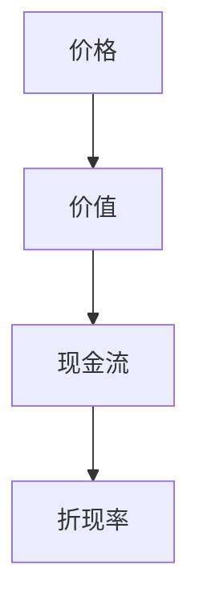
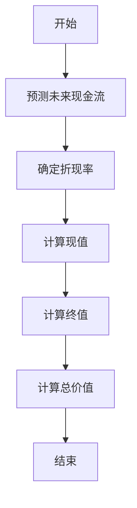
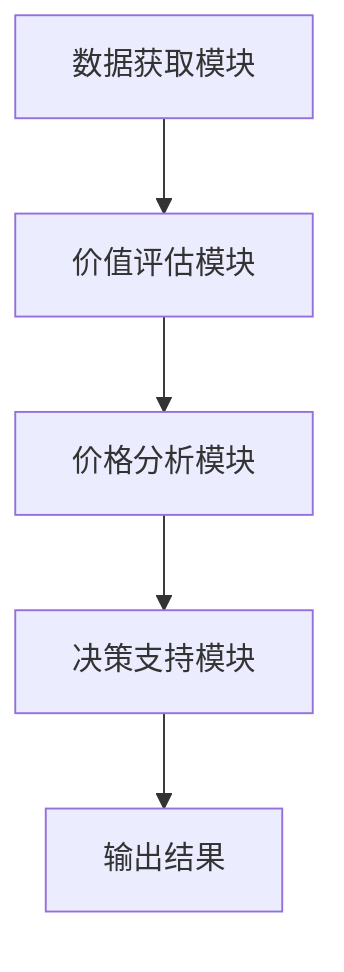
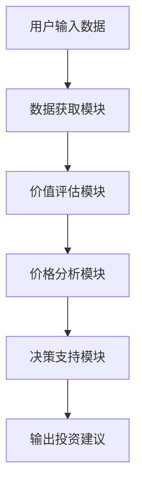

                 


# 巴菲特的价格与价值区分

## 关键词：巴菲特，价格，价值，投资，现金流折现模型，内在价值

## 摘要：本文深入探讨了巴菲特投资理念中的核心概念——价格与价值的区分。通过分析巴菲特的投资策略、价值评估方法以及实际案例，揭示了价格与价值在投资决策中的重要性。本文结合技术分析和实际操作，详细讲解了如何通过现金流折现模型等方法评估内在价值，并提供系统设计和项目实战的指导，帮助读者掌握巴菲特的投资精髓。

---

# 第一部分: 巴菲特的价格与价值区分基础

## 第1章: 巴菲特投资理念概述

### 1.1 价格与价值的基本概念

#### 1.1.1 价格的定义与特征

价格是指资产在市场上的交易价格，它是动态变化的，受市场情绪、供需关系和宏观经济因素的影响。价格的特征包括波动性、短期性以及与市场参与者的预期密切相关。

#### 1.1.2 价值的定义与特征

价值是指资产的内在价值，即其未来现金流的折现值。价值的特征包括稳定性、长期性和可计算性。内在价值不依赖于市场情绪，而是基于企业的基本面进行评估。

#### 1.1.3 价格与价值的关系

价格和价值之间的关系可以通过以下几点来理解：

1. 价格围绕价值波动：市场价格会在短期内偏离内在价值，但长期来看会回归内在价值。
2. 价格是价值的外在表现：价格的变化反映了市场对价值的重新评估。
3. 价值是投资的基石：投资者的目标是以低于内在价值的价格买入资产。

### 1.2 巴菲特投资理念的核心要素

#### 1.2.1 投资的本质

巴菲特认为，投资的本质是通过购买资产，以低于其内在价值的价格获得长期收益。投资不是一种短期的赌博行为，而是一种基于对企业深刻理解的长期价值投资。

#### 1.2.2 股票的价值评估

巴菲特强调，股票的价值不应仅仅看其市场表现，而应基于企业的盈利能力、财务状况和竞争优势进行评估。他提出了著名的“安全边际”概念，即以低于内在价值的价格买入资产，以降低投资风险。

#### 1.2.3 市场先生的角色

市场先生是巴菲特用来描述市场波动的一个比喻。市场先生每天都会根据市场情绪的变化，为资产定价。投资者的任务是以理性的态度看待市场先生的报价，避免被市场情绪左右。

### 1.3 巴菲特投资策略的演变

#### 1.3.1 早期投资风格

早期，巴菲特的投资策略主要集中在寻找那些具有稳定收益和良好管理的公司，以合理的价格买入并长期持有。

#### 1.3.2 中期价值投资

在中期，巴菲特开始系统性地研究和应用价值投资理念，提出了内在价值的概念，并通过现金流折现模型（DCF）来评估企业的价值。

#### 1.3.3 现阶段投资特点

现阶段，巴菲特的投资策略更加成熟和多元化，注重企业的竞争优势、财务健康和管理层质量，同时关注市场估值与内在价值的匹配。

### 1.4 本章小结

本章通过对巴菲特投资理念的概述，阐述了价格与价值的基本概念、关系及其在投资中的重要性。巴菲特的价值投资理念强调以内在价值为基础，以合理的价格买入优质资产，并长期持有。

---

## 第2章: 价格与价值区分的核心概念

### 2.1 价值评估的数学模型

#### 2.1.1 内在价值的计算公式

$$
\text{内在价值} = \frac{\text{现金流}}{\text{折现率}}
$$

内在价值是通过对未来现金流进行折现计算得出的，反映了资产在当前的市场环境下的真实价值。

#### 2.1.2 现金流的预测方法

现金流的预测需要基于企业的财务报表和行业趋势进行分析。主要包括：

1. **经营性现金流**：来自企业日常经营的现金流。
2. **投资性现金流**：来自企业投资活动的现金流。
3. **筹资性现金流**：来自企业筹资活动的现金流。

#### 2.1.3 折现率的影响因素

折现率是将未来现金流折算为现值的关键因素，主要受市场利率、风险偏好和通货膨胀率的影响。

### 2.2 价格与价值的对比分析

#### 2.2.1 价格波动的原因

价格波动主要由市场情绪、供需关系和宏观经济因素引起。市场价格并不总是反映资产的内在价值。

#### 2.2.2 价值的稳定性

价值的稳定性较高，因为它基于企业的基本面和未来现金流的预测。价值的变化相对缓慢，而价格则具有较高的波动性。

#### 2.2.3 价格与价值的匹配关系

价格与价值的匹配关系可以通过以下几点来理解：

1. **价格低于价值**：市场低估，买入机会。
2. **价格等于价值**：市场均衡，无明显投资机会。
3. **价格高于价值**：市场高估，卖出或避免买入。

### 2.3 核心概念的ER实体关系图



### 2.4 本章小结

本章通过数学模型和关系图，详细讲解了价格与价值的核心概念及其关系。内在价值的计算公式和现金流的预测方法为投资者提供了评估资产价值的工具，而价格与价值的对比分析则帮助投资者识别投资机会。

---

## 第3章: 巴菲特价值评估方法的算法原理

### 3.1 现金流折现模型（DCF）

#### 3.1.1 DCF模型的原理

DCF模型是一种用于评估资产内在价值的常用方法，通过将未来现金流折现为现值，计算出资产的内在价值。以下是DCF模型的步骤：

1. **预测未来现金流**：基于企业的财务报表和行业趋势，预测未来几年的现金流。
2. **确定折现率**：选择合适的折现率，通常基于市场利率和风险偏好。
3. **计算现值**：将未来现金流按确定的折现率折现，计算其现值。
4. **计算终值**：假设企业在无限期后仍有稳定的现金流，计算终值。
5. **总价值计算**：将现值和终值相加，得到资产的内在价值。

#### 3.1.2 DCF模型的实现代码

以下是DCF模型的简单实现代码：

```python
def calculate_intrinsic_value(cash_flows, discount_rate, num_periods):
    intrinsic_value = 0
    for i in range(num_periods):
        cash_flow = cash_flows[i]
        present_value = cash_flow / (1 + discount_rate) ** (i + 1)
        intrinsic_value += present_value
    return intrinsic_value
```

#### 3.1.3 DCF模型的流程图



### 3.2 股东权益分析法

#### 3.2.1 股东权益的构成

股东权益包括股本、资本公积、盈余公积、未分配利润等部分。股东权益是企业资产减去负债后的净值，反映了企业的净资产价值。

#### 3.2.2 股东权益与价值的关系

股东权益是评估企业内在价值的重要组成部分，通常用于计算市净率等估值指标。市净率=股价/每股净资产，市净率低于1通常被视为低估。

### 3.3 本章小结

本章通过DCF模型和股东权益分析法，详细讲解了巴菲特价值评估方法的算法原理。DCF模型通过现金流的折现计算内在价值，而股东权益分析法则提供了另一种评估企业价值的方法。

---

## 第4章: 价格与价值区分的系统分析

### 4.1 投资决策的系统架构

#### 4.1.1 系统功能设计

投资决策系统需要具备以下功能：

1. **数据获取**：获取企业的财务报表、行业数据和市场数据。
2. **价值评估**：基于DCF模型和股东权益分析法，计算资产的内在价值。
3. **价格分析**：分析市场价格与内在价值的匹配关系。
4. **决策支持**：根据评估结果，提供买入、持有或卖出的决策建议。

#### 4.1.2 系统架构设计

以下是投资决策系统的架构图：



#### 4.1.3 系统接口设计

投资决策系统的接口设计需要考虑数据输入、模型计算和结果输出。以下是接口设计的简单示例：

1. **输入接口**：接收企业的财务数据和市场数据。
2. **计算接口**：调用DCF模型和股东权益分析法进行计算。
3. **输出接口**：输出内在价值、市场价格和投资建议。

### 4.2 系统交互设计

#### 4.2.1 系统交互流程

以下是系统交互的流程图：



### 4.3 本章小结

本章通过对投资决策系统的系统分析，详细讲解了系统的功能设计、架构设计和交互设计。投资者可以通过该系统快速评估资产的内在价值，分析市场价格与价值的匹配关系，并根据评估结果做出投资决策。

---

## 第5章: 巴菲特价格与价值区分的项目实战

### 5.1 项目环境安装

#### 5.1.1 系统需求

项目实战需要以下系统环境：

1. **操作系统**：Windows、MacOS或Linux。
2. **编程语言**：Python 3.6以上版本。
3. **开发工具**：PyCharm或Jupyter Notebook。
4. **数据源**：企业的财务报表和市场数据。

#### 5.1.2 安装依赖库

以下是项目实战中需要安装的Python库：

```bash
pip install pandas numpy matplotlib seaborn
```

### 5.2 系统核心实现源代码

#### 5.2.1 DCF模型的实现

以下是DCF模型的Python代码：

```python
import pandas as pd
import numpy as np

def calculate_intrinsic_value(cash_flows, discount_rate, num_periods):
    intrinsic_value = 0
    for i in range(num_periods):
        cash_flow = cash_flows[i]
        present_value = cash_flow / (1 + discount_rate) ** (i + 1)
        intrinsic_value += present_value
    return intrinsic_value

# 示例数据
cash_flows = [100, 120, 130, 140, 150]
discount_rate = 0.08
num_periods = 5

intrinsic_value = calculate_intrinsic_value(cash_flows, discount_rate, num_periods)
print("内在价值：", intrinsic_value)
```

#### 5.2.2 股东权益分析法的实现

以下是股东权益分析法的Python代码：

```python
import pandas as pd
import numpy as np

def calculate_book_value equity:
    equity = (assets - liabilities)
    return equity

# 示例数据
assets = 500
liabilities = 300

book_value = calculate_book_value equity
print("股东权益：", book_value)
```

### 5.3 代码应用解读与分析

#### 5.3.1 DCF模型的代码解读

DCF模型的代码通过循环计算未来现金流的现值，并将现值累加得到内在价值。折现率的选择对内在价值的计算结果有重要影响。

#### 5.3.2 股东权益分析法的代码解读

股东权益分析法的代码通过计算资产减去负债得到股东权益，反映了企业的净资产价值。

### 5.4 实际案例分析

#### 5.4.1 案例选择

以苹果公司为例，分析其内在价值和市场价格。

#### 5.4.2 数据收集

收集苹果公司的财务数据和市场数据，包括现金流、折现率、资产和负债等。

#### 5.4.3 数据分析

通过DCF模型和股东权益分析法，计算苹果公司的内在价值，并与市场价格进行对比。

#### 5.4.4 投资建议

如果苹果公司的市场价格低于内在价值，则建议买入；如果市场价格高于内在价值，则建议卖出或避免买入。

### 5.5 项目小结

本章通过项目实战，详细讲解了如何使用DCF模型和股东权益分析法评估企业的内在价值，并通过实际案例分析，帮助投资者做出理性的投资决策。

---

## 第6章: 巴菲特价格与价值区分的最佳实践

### 6.1 小结

本章通过对巴菲特投资理念的深入分析，结合实际案例，总结了价格与价值区分的核心概念和实际操作方法。

### 6.2 注意事项

在实际投资中，需要注意以下几点：

1. **数据的准确性**：确保财务数据和市场数据的准确性。
2. **模型的适用性**：根据企业的具体情况选择合适的估值模型。
3. **市场的波动性**：市场价格波动较大，需耐心等待合适的投资机会。
4. **风险管理**：分散投资，降低风险。

### 6.3 拓展阅读

以下是拓展阅读的推荐书目：

1. 《巴菲特传》：了解巴菲特的投资历程和哲学。
2. 《价值投资入门》：学习价值投资的基本理论和方法。
3. 《股票分析实战》：掌握股票分析的技术和方法。

### 6.4 本章小结

本章总结了巴菲特价格与价值区分的核心理念，并提供了实际操作中的注意事项和拓展阅读建议，帮助投资者更好地理解和应用巴菲特的投资理念。

---

## 第7章: 总结与展望

### 7.1 总结

本文通过详细讲解巴菲特的价格与价值区分理念，结合技术分析和实际案例，帮助投资者掌握价值评估的方法和技巧。本文还提供了系统设计和项目实战的指导，为投资者提供了实用的工具和方法。

### 7.2 展望

未来，随着人工智能和大数据技术的发展，价值评估的方法和工具将更加多样化和智能化。投资者需要不断学习和更新知识，以适应市场的变化和挑战。

---

## 参考文献

1. 巴菲特，沃伦。《巴菲特投资思想》
2. 格雷厄姆，本杰明。《价值投资入门》
3. 罗伯特，清崎。《富爸爸穷爸爸》

---

## 致谢

感谢读者的支持和关注，希望本文能为投资者提供有价值的参考和启发。

