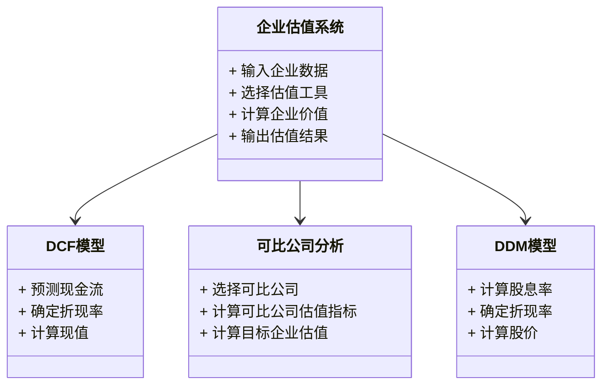

                 


# 巴菲特的企业估值秘诀解析

> **关键词**: 巴菲特, 企业估值, 投资策略, 现金流折现模型, 股票投资, 价值投资

> **摘要**: 本文详细解析了巴菲特的企业估值秘诀，从其投资理念、核心工具与方法、数学模型、系统分析与架构设计、项目实战到最佳实践，全面阐述了巴菲特的估值方法及其在现代投资中的应用。文章通过技术语言和逻辑推理，深入剖析了巴菲特的价值投资哲学、DCF模型、可比公司分析等核心工具，并通过实际案例展示了如何将这些方法应用于企业估值。

---

# 第1章: 巴菲特投资理念概述

## 1.1 价值投资的定义与核心理念

### 1.1.1 价值投资的定义

价值投资是一种基于对企业内在价值评估的投资策略，其核心在于寻找市场价格低于企业内在价值的股票。巴菲特是价值投资的代表人物，他认为市场的短期波动并不影响企业的长期价值，真正的投资机会来自于对企业的深入研究和对其未来现金流的合理预期。

### 1.1.2 巴菲特的价值投资哲学

巴菲特的价值投资哲学可以总结为以下几点：
1. **长期投资**：巴菲特强调长期投资，认为短期市场的波动不应该影响长期的投资决策。
2. **安全边际**：巴菲特认为，投资者应该以低于企业内在价值的价格买入股票，这种价差即为“安全边际”，能够为投资者提供一个安全垫，避免因短期市场波动而遭受损失。
3. **企业质量**：巴菲特倾向于投资那些具有强大竞争优势、稳定现金流和良好管理的企业。

### 1.1.3 价值投资的核心要素

1. **内在价值**：企业未来现金流的现值。
2. **市场价格**：股票在市场上的交易价格。
3. **安全边际**：内在价值与市场价格之间的差额。

---

## 1.2 巴菲特的投资策略与方法

### 1.2.1 股票投资的基本原则

巴菲特的股票投资基本原则包括：
1. **只投资你理解的企业**：巴菲特强调，投资者应该只投资于那些自己能够理解的企业。
2. **关注企业的竞争优势**：巴菲特认为，具有强大竞争优势的企业能够长期保持高利润率。
3. **关注企业的财务健康状况**：巴菲特重视企业的财务健康状况，尤其是企业的现金流和负债情况。

### 1.2.2 巴菲特的选股标准

巴菲特选股的标准可以总结为以下几点：
1. **高ROE（净资产收益率）**：巴菲特倾向于投资那些ROE长期稳定的公司。
2. **低市盈率**：巴菲特喜欢低市盈率的股票，因为这意味着市场可能低估了企业的价值。
3. **高股息率**：巴菲特倾向于投资那些能够稳定派发股息的企业。

### 1.2.3 长期投资与复利效应

巴菲特认为，长期投资能够通过复利效应实现财富的快速增长。他强调，复利的效果取决于两个因素：一是投资的回报率，二是投资的时间长度。长期投资能够使复利效应最大化，从而实现财富的快速增长。

---

## 1.3 巴菲特的企业估值思想

### 1.3.1 企业估值的基本概念

企业估值是指通过对企业的财务状况、经营状况和市场环境的分析，估算出企业未来能够产生的现金流的现值。企业估值的核心在于对企业未来现金流的预测。

### 1.3.2 巴菲特的企业估值框架

巴菲特的企业估值框架主要包括以下几个步骤：
1. **分析企业的财务状况**：包括企业的收入、利润、现金流和资产负债表等。
2. **评估企业的竞争优势**：包括企业的市场地位、品牌影响力、技术优势等。
3. **预测企业的未来现金流**：基于企业的财务状况和竞争优势，预测企业未来能够产生的现金流。
4. **计算企业的内在价值**：通过现金流折现模型（DCF）计算企业的内在价值。

### 1.3.3 企业价值与市场价值的对比

企业价值是指企业未来现金流的现值，而市场价值是指企业在市场上交易的价值。巴菲特认为，市场价值可能会偏离企业价值，而真正的投资机会来自于市场价格低于企业价值的情况。

---

## 1.4 巴菲特投资理念的现实意义

### 1.4.1 价值投资在现代投资中的地位

尽管现代投资理论强调市场有效性和多元化投资，但价值投资仍然在投资实践中占据重要地位。价值投资强调对企业内在价值的深入研究，能够在一定程度上弥补市场有效性的不足。

### 1.4.2 巴菲特的价值投资对企业投资的启示

巴菲特的价值投资思想启示我们，企业估值不仅仅是对财务数据的简单计算，更需要对企业的经营状况和市场环境进行深入研究。只有通过对企业内在价值的深入研究，才能找到真正具有投资价值的企业。

### 1.4.3 巴菲特理念的局限性与改进方向

尽管巴菲特的价值投资思想在实践中取得了巨大成功，但其也存在一定的局限性。例如，巴菲特的估值方法依赖于对企业未来现金流的预测，而这种预测在实际操作中往往难以准确实现。因此，我们需要在巴菲特的估值框架基础上，结合现代金融理论和技术创新，进一步完善企业估值的方法。

---

## 1.5 本章小结

本章主要介绍了巴菲特的投资理念，包括价值投资的定义、核心要素、投资策略和企业估值思想。通过本章的学习，读者可以初步了解巴菲特的投资哲学及其对企业估值的核心观点。

---

# 第2章: 巴菲特企业估值的核心工具与方法

## 2.1 现金流折现模型（DCF）

### 2.1.1 DCF模型的基本原理

现金流折现模型（DCF）是一种基于未来现金流现值计算企业内在价值的方法。其基本原理是将企业未来现金流按适当的折现率折现到当前时点，从而计算出企业的内在价值。

### 2.1.2 DCF模型的计算步骤

1. **预测未来现金流**：包括自由现金流、股息现金流等。
2. **确定折现率**：通常使用加权平均资本成本（WACC）作为折现率。
3. **计算现值**：将未来现金流按折现率折现，求出现值。
4. **计算企业价值**：将现值加总，减去净债务，得到企业的股权价值。

### 2.1.3 DCF模型的优缺点

- **优点**：DCF模型能够将企业未来现金流的现值与市场价格进行对比，从而找到具有投资价值的企业。
- **缺点**：DCF模型的预测准确性依赖于对未来现金流的准确预测，而这种预测在实际操作中往往难以实现。

---

## 2.2 可比公司分析

### 2.2.1 可比公司分析的定义

可比公司分析是一种通过比较同类企业的市场估值指标（如市盈率、市净率等）来估算目标企业价值的方法。

### 2.2.2 可比公司分析的实施步骤

1. **选择可比公司**：选择与目标企业在行业、规模、盈利能力等方面相似的企业。
2. **计算可比公司的估值指标**：如市盈率、市净率等。
3. **计算目标企业的估值指标**：将可比公司的估值指标平均值乘以目标企业的相应指标，得到目标企业的估值。

### 2.2.3 可比公司分析的注意事项

- **可比公司的选择**：需要确保可比公司与目标企业在行业、规模、盈利能力等方面具有较高的相似性。
- **估值指标的选择**：需要根据目标企业的具体情况选择合适的估值指标。

---

## 2.3 股息率与股息贴现模型（DDM）

### 2.3.1 股息率的定义与计算

股息率是指股票每年派发的股息与股票价格的比率。其计算公式为：
$$ \text{股息率} = \frac{\text{股息}}{\text{股价}} $$

### 2.3.2 DDM模型的基本原理

股息贴现模型（DDM）是一种基于股息的现金流折现模型。其基本原理是将企业未来派发的股息按适当的折现率折现，从而计算出企业的内在价值。

### 2.3.3 DDM模型的应用场景

DDM模型适用于那些股息稳定且可预测的企业，尤其是那些具有稳定股息支付能力的成熟企业。

---

## 2.4 市盈率与市净率分析

### 2.4.1 市盈率的定义与计算

市盈率是指股票价格与每股收益的比率。其计算公式为：
$$ \text{市盈率} = \frac{\text{股价}}{\text{每股收益}} $$

### 2.4.2 市净率的定义与计算

市净率是指股票价格与每股净资产的比率。其计算公式为：
$$ \text{市净率} = \frac{\text{股价}}{\text{每股净资产}} $$

### 2.4.3 市盈率与市净率的优缺点

- **优点**：市盈率和市净率都是简单易懂的估值指标，适用于快速评估企业的市场价值。
- **缺点**：市盈率和市净率的准确性依赖于企业的盈利能力和净资产质量，且不同行业之间具有较大的可比性差异。

---

## 2.5 巴菲特对企业估值工具的偏好

### 2.5.1 巴菲特对DCF模型的偏好

巴菲特倾向于使用DCF模型对企业进行估值，因为DCF模型能够将企业未来现金流的现值与市场价格进行对比，从而找到具有投资价值的企业。

### 2.5.2 巴菲特对可比公司分析的偏好

巴菲特也喜欢使用可比公司分析来辅助企业估值，尤其是当目标企业与可比公司在行业、规模和盈利能力等方面具有较高相似性时。

### 2.5.3 巴菲特对股息率与股息贴现模型的偏好

巴菲特对股息率和DDM模型的偏好较低，主要是因为这些模型的适用性较窄，主要适用于那些股息稳定且可预测的企业。

---

## 2.6 本章小结

本章主要介绍了巴菲特企业估值的核心工具与方法，包括现金流折现模型（DCF）、可比公司分析、股息率与股息贴现模型（DDM）以及市盈率与市净率分析。通过本章的学习，读者可以了解巴菲特在企业估值中常用的工具与方法。

---

# 第3章: 巴菲特的企业估值核心公式与数学模型

## 3.1 现金流折现模型的数学公式

### 3.1.1 现金流折现模型的基本公式

现金流折现模型（DCF）的基本公式为：
$$ \text{企业价值} = \sum_{t=1}^{n} \frac{\text{现金流}}{(1 + r)^t} $$
其中，\( r \) 是折现率，\( n \) 是预测的年数。

### 3.1.2 现金流折现模型的应用实例

假设某企业的未来现金流如下：
- 年现金流：1000万元
- 折现率：8%
- 预测年数：5年

则该企业的内在价值为：
$$ \text{企业价值} = \frac{1000}{(1 + 0.08)^1} + \frac{1000}{(1 + 0.08)^2} + \frac{1000}{(1 + 0.08)^3} + \frac{1000}{(1 + 0.08)^4} + \frac{1000}{(1 + 0.08)^5} $$

---

## 3.2 股息贴现模型的数学公式

### 3.2.1 股息贴现模型的基本公式

股息贴现模型（DDM）的基本公式为：
$$ \text{股价} = \frac{\text{股息}}{r - g} $$
其中，\( r \) 是折现率，\( g \) 是股息增长率。

### 3.2.2 股息贴现模型的应用实例

假设某企业的股息为2元，折现率为10%，股息增长率为5%，则该企业的股价为：
$$ \text{股价} = \frac{2}{0.10 - 0.05} = 40 \text{元} $$

---

## 3.3 可比公司分析的数学公式

### 3.3.1 可比公司分析的平均市盈率计算

可比公司分析的平均市盈率计算公式为：
$$ \text{平均市盈率} = \frac{\sum \text{市盈率}}{n} $$

### 3.3.2 目标企业的估值计算

目标企业的估值计算公式为：
$$ \text{目标企业估值} = \text{目标企业每股收益} \times \text{平均市盈率} $$

---

## 3.4 巴菲特估值模型的数学公式总结

1. 现金流折现模型（DCF）：
$$ \text{企业价值} = \sum_{t=1}^{n} \frac{\text{现金流}}{(1 + r)^t} $$

2. 股息贴现模型（DDM）：
$$ \text{股价} = \frac{\text{股息}}{r - g} $$

3. 可比公司分析：
$$ \text{目标企业估值} = \text{目标企业每股收益} \times \text{平均市盈率} $$

---

## 3.5 本章小结

本章主要介绍了巴菲特企业估值的核心公式与数学模型，包括现金流折现模型（DCF）、股息贴现模型（DDM）以及可比公司分析的数学公式。通过本章的学习，读者可以掌握巴菲特估值方法中的数学原理，并能够将其应用于实际的企业估值中。

---

# 第4章: 巴菲特企业估值的系统分析与架构设计

## 4.1 系统分析

### 4.1.1 问题场景介绍

在企业估值中，我们需要构建一个能够综合运用多种估值工具和方法的系统，以实现对企业内在价值的准确评估。

### 4.1.2 项目介绍

本项目旨在构建一个基于巴菲特估值方法的企业估值系统，能够综合运用DCF模型、可比公司分析、DDM模型等多种估值工具，为企业提供全面的估值服务。

---

## 4.2 系统功能设计

### 4.2.1 领域模型（Mermaid 类图）



### 4.2.2 系统架构设计（Mermaid 架构图）


---

## 4.3 系统接口设计

### 4.3.1 系统输入接口

1. **企业数据输入**：包括企业的财务数据、行业数据等。
2. **估值工具选择**：包括DCF模型、可比公司分析、DDM模型等。

### 4.3.2 系统输出接口

1. **估值结果输出**：包括企业的内在价值、市场价格、安全边际等。
2. **可视化界面**：包括估值结果的图表展示、估值工具的选择与操作等。

---

## 4.4 本章小结

本章主要介绍了巴菲特企业估值的系统分析与架构设计，包括系统分析、功能设计、架构设计和接口设计。通过本章的学习，读者可以了解如何将巴菲特的估值方法应用于实际的系统设计中。

---

# 第5章: 巴菲特企业估值的项目实战

## 5.1 环境安装与配置

### 5.1.1 环境要求

1. **操作系统**：Windows 10 或更高版本，或macOS 10.15 或更高版本。
2. **编程语言**：Python 3.8 或更高版本。
3. **开发工具**：PyCharm 或 Jupyter Notebook。

### 5.1.2 安装依赖库

1. **Pandas**：用于数据处理。
2. **Matplotlib**：用于数据可视化。
3. **Scipy**：用于科学计算。

---

## 5.2 系统核心实现

### 5.2.1 现金流折现模型（DCF）的实现

```python
import pandas as pd
import numpy as np

def dcfvaluation(enterprise_data, discount_rate, years):
    cash_flows = enterprise_data['现金流']
    dc

