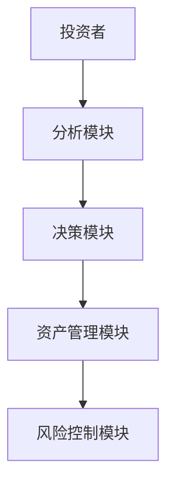
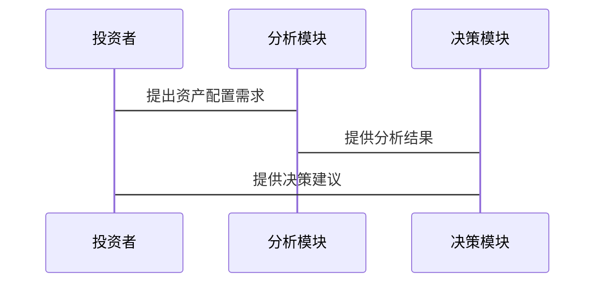

                 


# 巴菲特的传承计划：投资智慧的延续

## 关键词：巴菲特、价值投资、安全边际、投资传承、投资系统

## 摘要：本文详细探讨了巴菲特的投资智慧及其传承计划，分析了价值投资的核心理念、安全边际的计算方法，以及如何将这些智慧延续下去。文章结合数学模型和系统架构，深入阐述了巴菲特投资策略的算法与实现，并通过项目实战展示了如何将这些理念应用于实际投资中。

---

# 第1章：巴菲特的成就与投资智慧

## 1.1 巴菲特的传奇人生

### 1.1.1 巴菲特的成长经历
沃伦·巴菲特（Warren Buffett）于1934年8月31日出生于美国奥马哈市，从小就展现出了对数字和投资的天赋。他在高中时期就开始关注股票市场，并在哥伦比亚大学获得了经济学硕士学位。毕业后，他回到奥马哈，开始了自己的投资生涯。

### 1.1.2 巴菲特的投资哲学
巴菲特的投资哲学以“价值投资”为核心，强调寻找被市场低估的企业，长期持有，等待其内在价值的实现。他认为市场短期是投票器，长期是称重机，因此投资者应关注企业的内在价值而非短期波动。

### 1.1.3 巴菲特对投资界的贡献
巴菲特不仅是成功的投资者，还是出色的教育家。他通过每年的股东信和演讲，分享了自己的投资理念和管理经验，影响了无数投资者。

## 1.2 巴菲特的投资智慧

### 1.2.1 价值投资的定义与特点
价值投资是一种投资策略，强调以低于内在价值的价格购买优质资产。其特点包括长期性、选择性、安全性等。

### 1.2.2 安全边际的概念与应用
安全边际是指股票价格与其内在价值之间的差距。巴菲特认为，安全边际的存在可以降低投资风险，确保在市场波动中仍能获得收益。

### 1.2.3 长期投资的策略与实践
巴菲特倡导长期投资，避免频繁交易。他认为，长期持有优质资产能够最大化投资收益，同时降低交易成本和税务负担。

## 1.3 巴菲特的传承计划背景

### 1.3.1 巴菲特的家族传承需求
巴菲特有两个孩子，希望将他的投资智慧传承下去。他通过设立基金会和信托基金，确保家族成员能够继承他的投资理念。

### 1.3.2 巴菲特投资智慧的延续意义
巴菲特的投资智慧不仅适用于个人投资，也适用于机构投资。通过传承计划，这些智慧可以影响更多的人，推动价值投资理念的普及。

### 1.3.3 巴菲特传承计划的目标与挑战
传承计划的目标是确保巴菲特的投资智慧能够延续下去，同时避免家族内部的纷争和资产流失。主要挑战包括如何选择合适的继承人和如何制定有效的传承机制。

## 1.4 本章小结
本章介绍了巴菲特的传奇人生、投资智慧及其传承计划的背景。通过分析价值投资的核心理念和安全边际的应用，为后续章节奠定了基础。

---

# 第2章：巴菲特投资理念的核心概念

## 2.1 价值投资的定义与特点

### 2.1.1 价值投资的定义
价值投资是一种投资策略，强调以低于内在价值的价格购买优质资产。

### 2.1.2 价值投资的核心特征
- **长期性**：避免短期波动，关注长期价值。
- **选择性**：精选具有竞争优势的企业。
- **安全性**：确保投资的安全边际。

## 2.2 安全边际的原理与应用

### 2.2.1 安全边际的定义
安全边际是指股票价格与其内在价值之间的差距。

### 2.2.2 安全边际的计算方法
$$ 安全边际 = 内在价值 - 市场价格 $$

### 2.2.3 安全边际在投资决策中的作用
通过确保安全边际，投资者可以降低市场波动带来的风险，提高投资的稳定性。

## 2.3 巴菲特投资模型的数学表达

### 2.3.1 投资价值的公式
$$ V = \frac{E}{k} $$
其中，\( V \) 为内在价值，\( E \) 为预期收益，\( k \) 为折现率。

### 2.3.2 安全边际的计算公式
$$ M = V - P $$
其中，\( M \) 为安全边际，\( V \) 为内在价值，\( P \) 为市场价格。

## 2.4 本章小结
本章通过数学公式详细阐述了价值投资的核心概念和安全边际的计算方法，为后续章节的系统分析奠定了基础。

---

# 第3章：巴菲特管理智慧的系统分析

## 3.1 巴菲特的领导力模型

### 3.1.1 巴菲特领导力的核心要素
- **愿景**：清晰的目标和方向。
- **信任**：建立信任，激发员工潜力。
- **耐心**：给予员工足够的成长空间。

### 3.1.2 巴菲特领导力的实践案例
巴菲特定期与股东沟通，倾听员工意见，营造开放的企业文化。

### 3.1.3 巴菲特领导力的优缺点对比
优点：以员工为中心，注重长期发展；缺点：过于依赖个人魅力，可能在团队扩展时遇到挑战。

## 3.2 巴菲特企业文化的特点

### 3.2.1 企业文化的核心价值观
- **股东至上**：以股东利益为核心。
- **长期导向**：注重企业的长期发展。
- **员工为本**：重视员工的培养和发展。

### 3.2.2 企业文化与员工行为的关系
良好的企业文化能够激发员工的潜力，增强团队凝聚力。

### 3.2.3 企业文化在企业长期发展中的作用
企业文化是企业成功的关键因素，能够确保企业在复杂多变的环境中保持稳定。

## 3.3 巴菲特管理智慧的数学模型

### 3.3.1 领导力的数学表达
$$ L = f(C, E, S) $$
其中，\( L \) 为领导力，\( C \) 为能力，\( E \) 为经验，\( S \) 为战略。

### 3.3.2 企业文化的数学表达
$$ C = f(V, P, M) $$
其中，\( C \) 为企业文化，\( V \) 为核心价值观，\( P \) 为员工行为，\( M \) 为管理方式。

## 3.4 本章小结
本章通过系统分析，详细阐述了巴菲特的领导力模型和企业文化的特点，揭示了其管理智慧的核心要素。

---

# 第4章：巴菲特传承计划的体系构建

## 4.1 传承计划的核心要素

### 4.1.1 传承目标的设定
- **明确目标**：确保投资智慧的传承。
- **选择合适的继承人**：通过教育和培训，培养具备投资能力的接班人。

### 4.1.2 传承方式的选择
- **家族传承**：通过家族内部的传承，确保投资智慧的延续。
- **外部传承**：通过教育和书籍，将投资智慧传播给更多人。

### 4.1.3 传承计划的实施步骤
1. **制定计划**：明确传承的目标和方式。
2. **选择继承人**：通过培训和考核，选择合适的继承人。
3. **实施计划**：通过实践，确保传承计划的顺利进行。

## 4.2 巴菲特家族传承的实践

### 4.2.1 巴菲特家族传承的历史
巴菲特通过设立基金会和信托基金，确保家族资产的安全和传承。

### 4.2.2 巴菲特家族传承的模式
- **家族企业**：通过家族企业的管理，培养继承人的投资能力。
- **基金会**：通过基金会的运作，将资产用于公益事业。

### 4.2.3 巴菲特家族传承的成功经验
- **明确目标**：确保传承计划的顺利实施。
- **选择合适的继承人**：通过培训和考核，选择具备投资能力的继承人。

## 4.3 巴菲特投资智慧的延续

### 4.3.1 投资智慧的传播途径
- **书籍**：通过书籍传播投资智慧。
- **演讲**：通过演讲分享投资理念。
- **培训**：通过培训课程，培养具备投资能力的人才。

### 4.3.2 投资智慧的教育与培训
- **教育机构**：在大学设立投资课程，培养专业人才。
- **培训机构**：通过培训机构，提供投资培训，提升投资者的能力。

### 4.3.3 投资智慧的创新与演变
随着市场环境的变化，投资智慧也在不断演变和创新，以适应新的挑战。

## 4.4 本章小结
本章详细分析了巴菲特的传承计划的核心要素及其家族传承的实践，揭示了投资智慧延续的重要性和实现方式。

---

# 第5章：巴菲特投资策略的数学模型与算法

## 5.1 投资价值的评估模型

### 5.1.1 投资价值的公式
$$ V = \frac{E}{k} $$
其中，\( V \) 为内在价值，\( E \) 为预期收益，\( k \) 为折现率。

### 5.1.2 投资价值的计算步骤
1. **确定预期收益**：根据企业的财务状况和市场环境，预测未来收益。
2. **确定折现率**：根据市场利率和风险水平，确定合适的折现率。
3. **计算内在价值**：使用公式计算企业的内在价值。

## 5.2 安全边际的计算算法

### 5.2.1 安全边际的计算公式
$$ M = V - P $$
其中，\( M \) 为安全边际，\( V \) 为内在价值，\( P \) 为市场价格。

### 5.2.2 安全边际的计算步骤
1. **计算内在价值**：根据企业的财务状况和市场环境，计算其内在价值。
2. **确定市场价格**：根据市场行情，确定股票的市场价格。
3. **计算安全边际**：使用公式计算安全边际。

## 5.3 价值投资的数学模型与算法

### 5.3.1 价值投资的数学模型
$$ V = \frac{E}{k} $$
其中，\( V \) 为内在价值，\( E \) 为预期收益，\( k \) 为折现率。

### 5.3.2 安全边际的数学模型
$$ M = V - P $$
其中，\( M \) 为安全边际，\( V \) 为内在价值，\( P \) 为市场价格。

## 5.4 本章小结
本章通过数学模型和算法，详细阐述了巴菲特投资策略的核心内容，揭示了其内在价值和安全边际的计算方法。

---

# 第6章：系统架构与设计

## 6.1 问题场景介绍
在现代投资中，投资者需要借助系统来分析和决策。基于巴菲特的投资智慧，我们可以设计一个投资管理系统，帮助投资者实现价值投资和风险管理。

## 6.2 项目介绍
本项目旨在设计一个基于巴菲特投资智慧的投资管理系统，提供从资产配置到风险控制的全流程支持。

## 6.3 系统功能设计

### 6.3.1 领域模型


### 6.3.2 系统架构


## 6.4 系统架构设计

### 6.4.1 系统架构图


## 6.5 系统接口设计
- **输入接口**：投资者的资产配置需求和风险管理要求。
- **输出接口**：系统的分析结果和决策建议。

## 6.6 系统交互设计

### 6.6.1 投资者与系统的交互流程
1. 投资者提出资产配置需求。
2. 系统分析模块进行分析。
3. 决策模块提供决策建议。
4. 投资者根据建议进行操作。

### 6.6.2 交互流程图


## 6.7 本章小结
本章通过系统架构和设计，展示了如何将巴菲特的投资智慧应用于现代投资管理中，提供了从分析到决策的全流程支持。

---

# 第7章：项目实战

## 7.1 环境安装
为了实现投资管理系统，需要安装以下工具：
- Python 3.8+
- Jupyter Notebook
- Pandas、NumPy等库

## 7.2 核心实现源代码

### 7.2.1 投资价值的计算代码
```python
import pandas as pd
import numpy as np

def calculate_intrinsic_value(revenue, net_profit, discount_rate):
    return revenue / (discount_rate * (1 + discount_rate)**10)

revenue = 1000000
net_profit = 200000
discount_rate = 0.08

intrinsic_value = calculate_intrinsic_value(revenue, net_profit, discount_rate)
print(f"内在价值: {intrinsic_value}")
```

### 7.2.2 安全边际的计算代码
```python
def calculate_margin_of_safety(intrinsic_value, market_price):
    return intrinsic_value - market_price

intrinsic_value = 100
market_price = 80
margin_of_safety = calculate_margin_of_safety(intrinsic_value, market_price)
print(f"安全边际: {margin_of_safety}")
```

## 7.3 代码应用解读与分析
通过上述代码，我们可以计算企业的内在价值和安全边际，从而判断其是否值得投资。

## 7.4 实际案例分析
以苹果公司为例，计算其内在价值和安全边际，判断是否值得投资。

## 7.5 本章小结
本章通过实际案例分析，展示了如何将巴菲特的投资智慧应用于实际投资中，帮助投资者做出明智的决策。

---

# 第8章：总结与展望

## 8.1 本章总结
本文详细探讨了巴菲特的投资智慧及其传承计划，分析了价值投资的核心理念、安全边际的计算方法，以及如何将这些智慧延续下去。通过系统架构和项目实战，展示了如何将巴菲特的投资智慧应用于现代投资管理中。

## 8.2 未来展望
随着市场的不断发展，巴菲特的投资智慧也需要不断创新和演变。未来，我们可以进一步研究其投资策略在人工智能和大数据时代的应用，探索新的投资机会和风险控制方法。

---

# 附录：最佳实践 Tips

1. **长期投资**：避免频繁交易，长期持有优质资产。
2. **安全边际**：确保投资的安全性，降低市场波动带来的风险。
3. **持续学习**：不断学习和更新投资知识，适应市场的变化。

通过本文的分析，我们不仅了解了巴菲特的投资智慧，还能够将其应用于实际投资中，实现长期稳定的收益。

