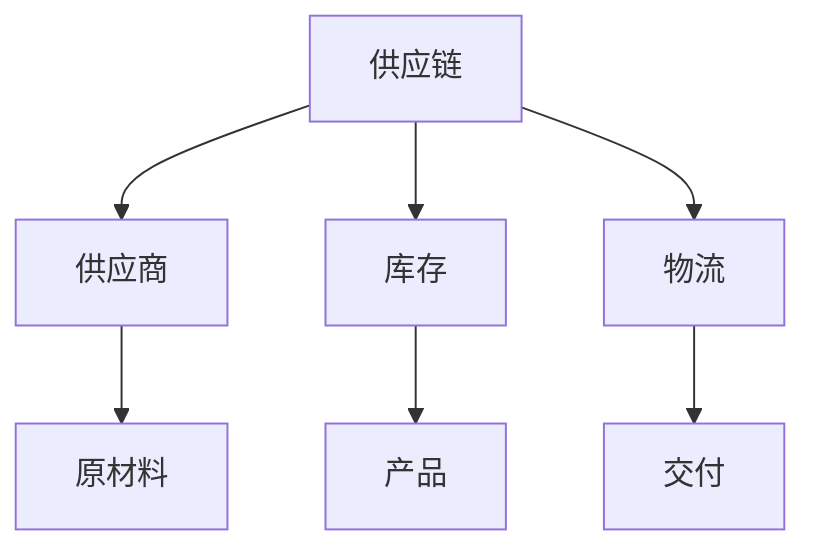
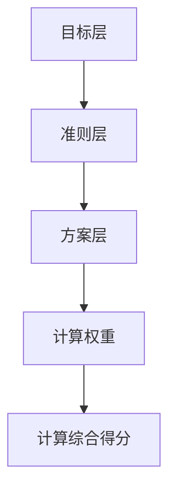
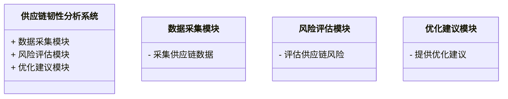

                 


# 巴菲特的供应链韧性分析：全球化挑战下的应对之策

> 关键词：供应链韧性，全球化，巴菲特分析，供应链管理，风险评估，系统设计

> 摘要：本文通过对供应链韧性的深入分析，结合巴菲特的投资哲学，探讨在全球化挑战下如何构建和优化供应链韧性。文章从供应链韧性的核心概念、算法原理、系统架构设计到项目实战，全面解析供应链韧性的评估与优化方法，为企业应对全球化挑战提供有价值的参考。

---

## 第一部分：供应链韧性与全球化的背景

### 第1章：供应链韧性概述

#### 1.1 供应链韧性的定义与核心要素

供应链韧性是指供应链在面对外部冲击时能够保持稳定并迅速恢复的能力。其核心要素包括：

- **稳定性**：供应链在正常情况下的运作能力。
- **弹性**：供应链在面对突发事件时调整和适应的能力。
- **恢复力**：供应链从中断中恢复的能力。

供应链韧性不仅是企业生存的关键，也是企业竞争力的重要组成部分。

#### 1.2 全球化背景下的供应链挑战

全球化使得供应链更加复杂，但也带来了更高的风险。以下是全球化带来的主要挑战：

- **供应链断裂**：地缘政治冲突、疫情等事件可能导致供应链中断。
- **地缘政治风险**：贸易摩擦、政策变化等影响供应链稳定性。
- **疫情冲击**：疫情导致的物流中断和劳动力短缺对供应链造成重大影响。

#### 1.3 巴菲特的供应链分析方法

巴菲特的投资哲学强调长期稳定和风险管理。他的供应链分析方法包括：

- **供应商多样性**：通过多元化供应商降低风险。
- **库存管理**：合理管理库存水平，确保供应稳定性。
- **物流能力**：优化物流网络，提高供应链弹性。

---

## 第二部分：供应链韧性分析的核心概念

### 第2章：供应链韧性分析的核心要素

#### 2.1 核心概念原理

供应链韧性分析的核心在于识别和评估影响供应链的关键因素。这些因素包括供应商多样性、库存管理和物流能力。通过分析这些因素，可以评估供应链的稳定性和弹性。

#### 2.2 核心要素对比分析

以下是供应链韧性核心要素的属性特征对比表：

| 要素       | 属性       | 描述                     |
|------------|------------|--------------------------|
| 供应商多样性 | 数量       | 供应商数量越多，韧性越高 |
| 库存管理     | 水平       | 库存水平影响抗风险能力   |
| 物流能力     | 稳定性     | 物流网络的稳定性与韧性相关 |

#### 2.3 实体关系图（Mermaid流程图）

以下是供应链韧性分析的实体关系图：



---

## 第三部分：供应链韧性分析的算法原理

### 第3章：供应链韧性评估的算法

#### 3.1 层次分析法（AHP）原理

层次分析法是一种用于评估多因素决策问题的方法。以下是其步骤：

1. **构建层次结构**：将问题分解为目标、准则和方案。
2. **建立比较矩阵**：根据各准则的重要性进行比较。
3. **计算权重**：通过计算矩阵的特征值和特征向量，得到各准则的权重。
4. **计算综合得分**：根据权重对各方案进行排序。

#### 3.2 AHP算法流程图（Mermaid）



#### 3.3 权重计算公式

层次分析法中，权重计算公式为：

$$
AHP权重 = \frac{\lambda_i}{\sum_{j} \lambda_j}
$$

其中，$\lambda_i$ 是第$i$个准则的特征值。

#### 3.4 综合得分公式

综合得分公式为：

$$
综合得分 = \sum_{i=1}^{n} w_i \cdot s_i
$$

其中，$w_i$ 是第$i$个准则的权重，$s_i$ 是第$i$个准则的得分。

#### 3.5 Python代码实现

以下是AHP算法的Python代码实现：

```python
import numpy as np

# 定义比较矩阵
matrix = [
    [1, 3, 2],
    [1/3, 1, 2/3],
    [1/2, 3/2, 1]
]

# 计算权重
eigenvalues, eigenvectors = np.linalg.eig(matrix)
weights = eigenvalues / np.sum(eigenvalues)

print("权重为：", weights)
```

---

## 第四部分：系统分析与架构设计

### 第4章：供应链韧性分析系统

#### 4.1 系统功能设计

供应链韧性分析系统的功能模块包括：

- **数据采集**：收集供应链各环节的数据。
- **风险评估**：评估供应链的潜在风险。
- **优化建议**：提供优化供应链的建议。

#### 4.2 系统架构设计（Mermaid）



#### 4.3 系统接口设计

系统接口包括：

- 数据输入接口
- 数据处理接口
- 结果输出接口

---

## 第五部分：项目实战

### 第5章：供应链韧性分析项目

#### 5.1 环境安装

安装Python和相关库：

```bash
pip install numpy
pip install scipy
```

#### 5.2 核心代码实现

以下是供应链韧性分析的核心代码：

```python
from scipy.cluster.hierarchy import linkage, fcluster

# 数据预处理
data = [...]  # 供应链数据

# 计算聚类
Z = linkage(data, 'ward')

# 划分聚类
clusters = fcluster(Z, t=0.5, criterion='distance')

print("聚类结果：", clusters)
```

#### 5.3 代码解读与分析

代码实现供应链数据的聚类分析，帮助识别供应链中的潜在风险点。

#### 5.4 实际案例分析

以疫情期间的供应链中断为例，分析如何通过优化供应商多样性提高供应链韧性。

#### 5.5 项目小结

通过项目实战，我们可以看到供应链韧性分析的实际应用价值。

---

## 第六部分：总结与展望

### 第6章：总结与展望

#### 6.1 最佳实践

- 定期评估供应链韧性
- 优化供应商多样性
- 提高库存管理水平

#### 6.2 小结

供应链韧性是企业在全球化挑战下生存和发展的关键。通过本文的分析，我们可以更好地应对供应链韧性问题。

#### 6.3 注意事项

- 供应链韧性分析需要结合企业的实际情况
- 数据采集和处理是关键

#### 6.4 拓展阅读

- 《供应链管理：原理与应用》
- 《巴菲特的投资哲学》

---

# 结语

供应链韧性是企业在全球化挑战下应对的核心能力。通过本文的分析，我们可以更好地理解供应链韧性的重要性，并采取有效措施提高供应链韧性。

