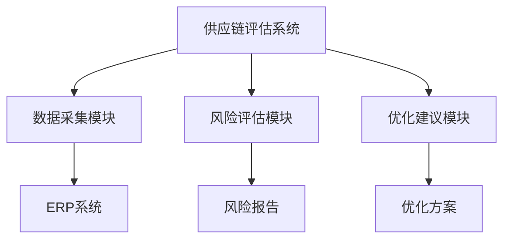

                 


# 巴菲特的供应链韧性分析：全球化时代的重要考量

## 关键词：供应链韧性，巴菲特，全球化，供应链管理，供应链优化

## 摘要：本文从巴菲特的投资视角出发，分析供应链韧性在全球化背景下的重要性。通过介绍供应链韧性的核心概念、数学模型、系统架构及项目实战，探讨如何构建和优化供应链韧性，以应对全球化时代的挑战。

---

## 第一部分：供应链韧性与全球化背景

### 第1章：供应链韧性概述

#### 1.1 供应链的基本概念
供应链是指从原材料采购到产品交付给最终用户的整个链条，包括供应商、制造商、分销商、零售商和消费者。供应链的关键特征包括复杂性、动态性和协作性。供应链的稳定性直接影响企业的运营效率和抗风险能力。

#### 1.2 供应链韧性的重要性
在全球化时代，供应链中断的风险显著增加，如疫情、自然灾害和地缘政治冲突等因素都可能影响供应链的稳定性。供应链韧性是企业在复杂环境中维持运营和竞争力的关键因素。

#### 1.3 巴菲特视角下的供应链分析
巴菲特的投资策略强调企业供应链的稳定性和成本控制。他倾向于投资那些供应链管理能力强、能够在逆境中保持稳定的公司。巴菲特的供应链分析框架注重企业的供应商多元化、库存管理和物流效率。

---

## 第二部分：供应链韧性分析的核心概念与联系

### 第2章：供应链韧性分析的核心要素

#### 2.1 供应链稳定性
供应链稳定性是供应链韧性的重要组成部分，涉及供应链各环节的协调性和可靠性。稳定性可以通过供应商多元化、库存管理和物流优化来实现。

#### 2.2 供应链响应能力
供应链响应能力是指企业在需求变化时快速调整的能力。通过灵活的生产和配送机制，企业可以更好地应对市场波动和消费者需求变化。

#### 2.3 供应链恢复能力
供应链恢复能力是指企业在遭受中断后迅速恢复的能力。这需要企业在关键环节上有备份和冗余机制，并定期进行应急演练。

### 第3章：供应链韧性分析的理论框架

#### 3.1 供应链韧性分析的理论基础
供应链韧性分析的理论基础包括复杂性理论和网络流理论。复杂性理论强调供应链的动态性和适应性，网络流理论则用于优化供应链的流动效率。

#### 3.2 供应链韧性分析的数学模型
供应链韧性分析的数学模型包括线性规划和网络流模型。以下是供应链优化的线性规划模型示例：

$$
\text{最大化} \quad \sum_{i=1}^{n} \sum_{j=1}^{m} c_{ij}x_{ij}
$$

$$
\text{满足} \quad \sum_{i=1}^{n} x_{ij} = d_j, \quad \forall j
$$

$$
\sum_{j=1}^{m} x_{ij} \leq s_i, \quad \forall i
$$

其中，$c_{ij}$ 是从节点 $i$ 到节点 $j$ 的成本，$x_{ij}$ 是从 $i$ 到 $j$ 的流量，$d_j$ 是节点 $j$ 的需求，$s_i$ 是节点 $i$ 的供应能力。

---

## 第三部分：供应链韧性分析的系统架构与算法

### 第4章：系统分析与架构设计

#### 4.1 系统功能设计
供应链韧性评估系统需要具备以下功能：
- 数据采集：从ERP系统获取供应链各环节的数据。
- 风险评估：识别潜在的供应链中断风险。
- 优化建议：提供供应商多元化、库存优化和物流调整的建议。

#### 4.2 系统架构设计
以下是供应链评估系统的架构图：



---

## 第四部分：供应链韧性分析的项目实战

### 第5章：项目实战与案例分析

#### 5.1 项目环境与工具安装
需要安装Python、PyTorch和numpy等工具。以下是安装命令：

```bash
pip install numpy
pip install pytorch
```

#### 5.2 核心代码实现
以下是供应链优化的Python代码：

```python
import numpy as np

# 定义目标函数
def objective_function(x):
    return np.sum(x)

# 定义约束条件
def constraint1(x, d):
    return np.sum(x) == d

# 使用遗传算法求解
class GeneticAlgorithm:
    def __init__(self, population_size, fitness_function):
        self.population_size = population_size
        self.fitness_function = fitness_function

    def evolve(self, pop, fitness):
        # 选择
        pop_sorted = sorted(pop, key=lambda x: -fitness(x))
        elite = pop_sorted[:int(0.2 * self.population_size)]
        rest = pop_sorted[int(0.2 * self.population_size):]

        # 交叉
        new_pop = []
        for _ in range(self.population_size - len(elite)):
            parent1 = rest[np.random.randint(len(rest))]
            parent2 = rest[np.random.randint(len(rest))]
            child = self.crossover(parent1, parent2)
            new_pop.append(child)
        new_pop.extend(elite)
        return new_pop

    def crossover(self, parent1, parent2):
        return [parent1[i] if i % 2 == 0 else parent2[i] for i in range(len(parent1))]

# 初始化种群
population = np.random.randint(0, 100, size=(100, 10))
d = 500

# 进化
ga = GeneticAlgorithm(100, objective_function)
new_population = ga.evolve(population, constraint1)

# 输出结果
print(new_population)
```

---

## 第五部分：总结与展望

### 第6章：总结与最佳实践

#### 6.1 总结
供应链韧性是企业在全球化时代的重要竞争优势。通过优化供应链的稳定性、响应能力和恢复能力，企业可以更好地应对供应链中断的风险。

#### 6.2 最佳实践
- 定期进行供应链风险评估和应急演练。
- 采用先进的供应链管理技术和工具。
- 加强与供应商的协作，建立长期合作关系。

#### 6.3 未来展望
未来，随着人工智能和大数据技术的发展，供应链韧性分析将更加智能化和精准化。企业需要不断学习和适应新的技术和管理方法，以保持供应链的竞争力。

---

通过以上分析，我们深入探讨了供应链韧性的核心概念、算法原理、系统设计和项目实战。希望本文能够为企业在全球化时代优化供应链管理提供有益的启示和指导。

