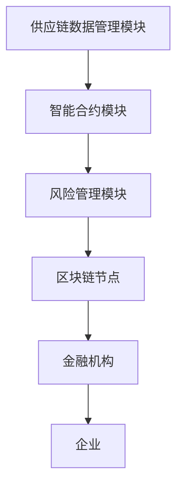

                 

# 巴菲特的供应链韧性分析：区块链技术在供应链金融中的应用

## 关键词：
- 供应链金融
- 区块链技术
- 供应链韧性
- 信息不对称
- 智能合约
- 供应链管理
- 金融创新

## 摘要：
本文深入分析了区块链技术在供应链金融中的应用，探讨了如何通过区块链技术提升供应链的透明度、信任度和效率，从而增强供应链韧性。文章结合实际案例，详细阐述了区块链技术如何解决供应链金融中的信息不对称问题，并通过智能合约、可追溯性等技术手段优化供应链管理流程。此外，本文还探讨了区块链技术对供应链金融未来发展的潜在影响，为相关领域的研究和实践提供了有益的参考。

---

# 第一部分：供应链金融与区块链技术基础

## 第1章：供应链金融概述

### 1.1 供应链金融的基本概念
#### 1.1.1 供应链金融的定义
供应链金融是指通过整合供应链上下游企业，提供资金支持和风险管理服务，优化企业间的资金流动和资源配置。其核心目标是降低供应链中的资金成本，提高供应链的整体效率和稳定性。

#### 1.1.2 供应链金融的核心流程
供应链金融的核心流程包括：
1. **融资支持**：为供应链上下游企业提供贷款、应收账款融资等金融服务。
2. **风险管理**：通过评估企业的信用状况、交易数据等，控制供应链金融中的风险。
3. **支付结算**：提供高效的支付结算服务，确保资金流动的透明和安全。

#### 1.1.3 供应链金融的参与者与角色
供应链金融的主要参与者包括：
- **核心企业**：供应链中的主导企业，通常为供应链提供资金支持。
- **供应商**：为供应链提供原材料、零部件的企业。
- **客户**：供应链的最终消费者或下游企业。
- **金融机构**：提供融资、信贷等金融服务的银行或其他金融机构。

---

### 1.2 供应链金融的重要性
#### 1.2.1 供应链金融在企业运营中的作用
供应链金融是企业优化运营、降低成本的重要手段。通过供应链金融，企业可以更好地管理现金流，提升供应链的整体效率。

#### 1.2.2 供应链金融对中小企业的支持
中小企业在供应链中往往面临融资难的问题。供应链金融通过整合供应链信息，为中小企业提供融资支持，帮助其渡过资金短缺的难关。

#### 1.2.3 供应链金融与企业竞争力的关系
供应链金融能够提高企业的供应链管理水平，增强企业的市场竞争力。通过优化供应链中的资金流动和资源配置，企业可以更快地响应市场需求，提升整体竞争力。

---

### 1.3 供应链金融的挑战
#### 1.3.1 信息不对称问题
供应链中的信息分散在不同企业之间，导致信息不对称问题。这使得金融机构难以准确评估供应链上下游企业的信用状况，增加了金融风险。

#### 1.3.2 资金流动性问题
供应链中的资金流动不畅可能导致企业面临流动性压力。特别是在经济下行周期，供应链金融的流动性问题更加突出。

#### 1.3.3 信用风险与欺诈问题
供应链金融中的信用风险和欺诈问题也是主要挑战。由于信息不对称，企业可能通过虚假交易或虚构应收账款等方式进行欺诈。

---

### 1.4 供应链金融的未来趋势
#### 1.4.1 数字化转型趋势
随着信息技术的发展，供应链金融正在向数字化方向转型。通过大数据、人工智能等技术，供应链金融可以实现更高效的业务流程和风险控制。

#### 1.4.2 区块链技术的应用前景
区块链技术以其去中心化、不可篡改的特点，为供应链金融提供了新的解决方案。通过区块链技术，可以实现供应链信息的透明共享，降低信息不对称问题。

#### 1.4.3 供应链金融的可持续发展
供应链金融的可持续发展不仅关注经济效益，还注重环境保护和社会责任。通过绿色供应链金融等创新模式，企业可以更好地履行社会责任。

---

## 第2章：区块链技术基础

### 2.1 区块链的基本概念
#### 2.1.1 区块链的定义
区块链是一种分布式账本技术，通过去中心化的方式记录数据，确保数据的安全性和不可篡改性。

#### 2.1.2 区块链的核心特征
区块链的核心特征包括：
- **去中心化**：数据不由单个中心控制，而是分布在网络中的多个节点。
- **不可篡改**：数据一旦记录在区块链上，就无法被修改或删除。
- **透明性**：区块链上的数据对所有参与者透明，可以通过权限控制访问。

#### 2.1.3 区块链的分类与应用场景
区块链可以根据不同的分类标准分为多种类型，如公有链、联盟链、私有链等。区块链在供应链金融中的主要应用场景包括智能合约、可追溯性、风险管理等。

---

### 2.2 区块链的技术原理
#### 2.2.1 区块链的共识机制
共识机制是区块链的核心技术之一，用于确保所有节点达成一致。常见的共识机制包括工作量证明（PoW）、权益证明（PoS）等。

#### 2.2.2 区块链的分布式账本
区块链的分布式账本通过多个节点共同维护，确保数据的安全性和一致性。每个节点都有一份完整的账本副本，数据同步更新。

#### 2.2.3 区块链的智能合约
智能合约是区块链上的自动化程序，可以根据预设的条件自动执行合同条款。智能合约可以用于供应链金融中的支付、结算、风险管理等环节。

---

### 2.3 区块链在供应链中的应用潜力
#### 2.3.1 供应链金融中的信息不对称问题
区块链可以通过共享账本的方式，消除供应链金融中的信息不对称问题。所有参与者都可以实时查看供应链中的交易数据，确保数据的透明性和准确性。

#### 2.3.2 供应链金融中的信任机制
区块链的去中心化特性可以建立信任机制，减少供应链金融中的欺诈行为。通过区块链技术，金融机构可以更准确地评估企业的信用状况。

#### 2.3.3 供应链金融中的效率提升
区块链技术可以简化供应链金融的流程，减少中间环节，提高效率。通过智能合约，可以实现自动化的支付和结算，降低人工操作的成本。

---

## 第3章：供应链金融与区块链的结合

### 3.1 供应链金融中的信息不对称问题
#### 3.1.1 信息不对称的成因
供应链金融中的信息不对称主要源于供应链上下游企业之间的信息分散和不透明。金融机构难以准确掌握企业的实际经营状况和交易数据。

#### 3.1.2 信息不对称的影响
信息不对称可能导致金融机构对企业的信用评估不准确，增加金融风险。同时，信息不对称也增加了企业的融资成本。

#### 3.1.3 区块链如何解决信息不对称问题
区块链通过共享账本的方式，实现供应链数据的透明共享。所有参与者都可以实时查看供应链中的交易数据，确保数据的准确性和一致性。

---

### 3.2 区块链在供应链金融中的应用场景
#### 3.2.1 供应链金融中的智能合约
智能合约可以用于供应链金融中的支付、结算、风险管理等环节。例如，当供应商完成货物交付后，智能合约可以自动触发支付流程，确保资金的及时到账。

#### 3.2.2 供应链金融中的可追溯性
区块链技术可以实现供应链金融中的可追溯性。通过区块链记录的交易数据，可以追溯到每笔交易的来源和流向，确保数据的真实性和不可篡改性。

#### 3.2.3 供应链金融中的风险管理
区块链技术可以通过分析供应链中的交易数据，识别潜在的金融风险。例如，通过智能合约可以实时监控供应链中的应收账款状况，及时发现并处理逾期款项。

---

### 3.3 区块链技术对供应链金融的创新
#### 3.3.1 提高供应链透明度
区块链技术可以实现供应链数据的透明共享，降低信息不对称问题。通过区块链，金融机构可以更准确地评估企业的信用状况，降低金融风险。

#### 3.3.2 优化供应链信任机制
区块链的去中心化特性可以建立信任机制，减少供应链金融中的欺诈行为。通过区块链技术，供应链中的交易数据可以被所有参与者共同验证，确保数据的真实性和不可篡改性。

#### 3.3.3 提高供应链效率
区块链技术可以简化供应链金融的流程，减少中间环节，提高效率。通过智能合约，可以实现自动化的支付和结算，降低人工操作的成本。

---

## 第4章：区块链技术在供应链金融中的系统设计与实现

### 4.1 系统架构设计
#### 4.1.1 系统功能模块
- 供应链数据管理模块：负责记录和管理供应链中的交易数据。
- 智能合约模块：实现供应链金融中的自动化支付和结算。
- 风险管理模块：通过分析供应链数据，识别潜在的金融风险。

#### 4.1.2 系统架构图

### 4.2 系统实现
#### 4.2.1 区块链框架选择
选择适合供应链金融的区块链框架，如Hyperledger Fabric。

#### 4.2.2 智能合约开发
使用Solidity语言编写智能合约，实现供应链金融中的支付、结算等功能。

#### 4.2.3 系统接口设计
设计系统接口，确保不同模块之间的数据交互顺畅。

---

## 第5章：区块链技术在供应链金融中的应用案例

### 5.1 案例分析
#### 5.1.1 案例背景
介绍一个实际的供应链金融案例，描述其应用场景和目标。

#### 5.1.2 案例实现
详细描述案例的实现过程，包括区块链框架的选择、智能合约的开发、系统接口的设计等。

#### 5.1.3 案例效果
分析案例的实施效果，包括效率提升、成本降低、风险管理优化等。

---

## 第6章：总结与展望

### 6.1 总结
总结区块链技术在供应链金融中的应用价值，分析其对供应链韧性的提升作用。

### 6.2 展望
展望区块链技术在供应链金融中的未来发展方向，提出进一步研究的方向和建议。

---

通过以上章节的内容，我们可以看到，区块链技术在供应链金融中的应用具有巨大的潜力。通过解决信息不对称问题，优化供应链的信任机制和效率，区块链技术可以帮助企业实现更高效的供应链管理，提升供应链的整体韧性。未来，随着区块链技术的不断发展，供应链金融将更加智能化、透明化和高效化。

---

希望这个思考过程和最终的文章目录结构对您有所帮助！

