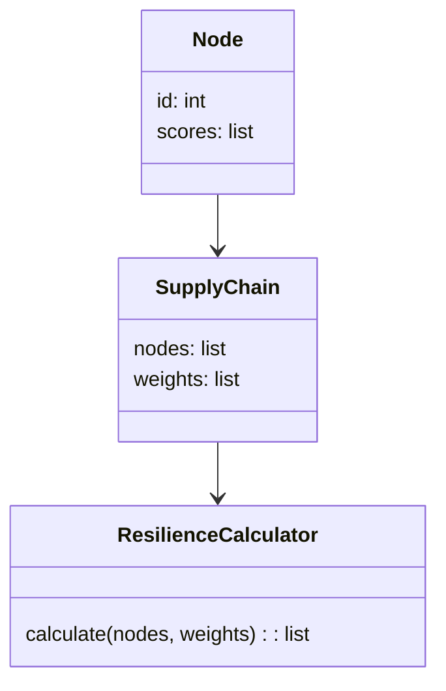
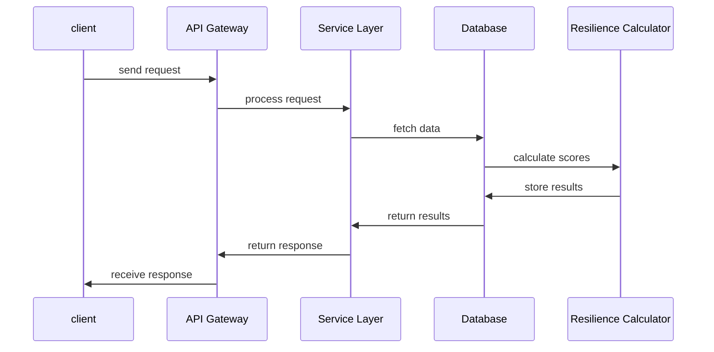

                 


```markdown
# 巴菲特的供应链韧性分析：极端气候下的风险管理

> 关键词：供应链韧性，风险管理，极端气候，巴菲特，投资策略

> 摘要：本文通过分析巴菲特的供应链韧性分析方法，探讨在极端气候下的风险管理策略。文章从供应链的基本概念出发，结合极端气候的影响，深入解析巴菲特的分析框架，并通过数学模型和实际案例，展示如何构建韧性供应链，应对气候变化带来的挑战。

---

# 第1章: 背景介绍

## 1.1 供应链的基本概念

### 1.1.1 供应链的定义与组成
供应链是指从原材料采购到产品交付给最终用户的整个过程，包括供应商、制造商、分销商和零售商等环节。供应链的韧性是指在面对突发事件时，维持供应稳定的能力。

### 1.1.2 供应链的重要性与脆弱性
供应链是企业运营的核心，任何中断都可能导致成本增加、交货延迟甚至业务中断。极端气候事件（如洪水、干旱、台风等）会严重威胁供应链的稳定性。

### 1.1.3 供应链风险管理的必要性
在全球化背景下，供应链往往跨越多个地区和国家，极端气候事件的发生频率和强度增加，使得供应链风险管理变得尤为重要。

## 1.2 极端气候对供应链的影响

### 1.2.1 气候变化对全球供应链的威胁
气候变化导致的自然灾害（如洪水、干旱、飓风等）会破坏供应链中的关键节点，导致原材料短缺或生产中断。

### 1.2.2 极端气候事件对供应链的具体影响
极端气候可能导致供应商无法按时交付原材料，物流中断，库存积压或短缺，进而影响整个供应链的运作。

### 1.2.3 供应链韧性在极端气候下的重要性
供应链韧性是企业在面对极端气候时保持业务连续性的关键。具备韧性的供应链能够快速恢复，减少损失。

## 1.3 巴菲特的供应链韧性分析方法

### 1.3.1 巴菲特的投资哲学与供应链管理
巴菲特的投资策略注重长期稳健，他关注企业的基本面、管理层和竞争优势。这些原则同样适用于供应链管理，强调稳定性和可持续性。

### 1.3.2 巴菲特对供应链韧性的独特见解
巴菲特认为，供应链的韧性是企业抵御外部冲击的重要因素。他倾向于投资那些拥有稳定供应链、强大供应商关系和灵活生产布局的企业。

### 1.3.3 巴菲特分析框架的适用性与局限性
巴菲特的分析框架适用于评估企业的供应链韧性，但可能需要结合具体行业的特点进行调整。

---

# 第2章: 核心概念与联系

## 2.1 供应链韧性的核心概念

### 2.1.1 供应链韧性的定义与特征
供应链韧性是指在面对突发事件时，供应链能够快速恢复并维持稳定运作的能力。其特征包括冗余性、灵活性和恢复能力。

### 2.1.2 供应链韧性的核心要素
供应链韧性涉及多个方面，包括供应链的复杂性、供应商的多样性、库存策略、物流网络的弹性以及信息共享机制。

### 2.1.3 供应链韧性与企业可持续发展的关系
具备韧性的供应链不仅有助于企业应对短期危机，还能支持长期的可持续发展，增强企业的竞争力。

## 2.2 风险管理模型的构建

### 2.2.1 风险管理模型的原理与框架
风险管理模型通过识别、评估和应对风险，帮助企业降低供应链中断的可能性。模型通常包括风险识别、风险评估和风险应对三个阶段。

### 2.2.2 风险评估指标与权重分配
常见的风险评估指标包括供应链中断的概率、影响程度和恢复时间。权重分配需要根据企业的具体情况进行调整。

### 2.2.3 风险管理模型的数学表达

$$
\text{风险值} = \sum_{i=1}^{n} w_i \times r_i
$$

其中，\( w_i \) 是第 \( i \) 个风险指标的权重，\( r_i \) 是第 \( i \) 个风险指标的风险值。

---

## 2.3 巴菲特分析框架的特点

### 2.3.1 巴菲特分析框架的核心要素
巴菲特的分析框架关注企业的财务健康、管理团队和竞争优势。在供应链管理中，他注重供应商的稳定性、生产布局的灵活性和库存管理的合理性。

### 2.3.2 巴菲特分析框架与风险管理模型的对比

| **特点**       | **风险管理模型**               | **巴菲特分析框架**             |
|----------------|-------------------------------|------------------------------|
| **核心目标**   | 降低供应链中断风险             | 评估企业供应链的长期稳定性     |
| **关键因素**   | 供应链的复杂性、冗余性         | 供应商的稳定性、生产布局的灵活性 |
| **应用范围**   | 适用于各种行业                 | 更适用于制造业和零售业         |

---

# 第3章: 算法原理

## 3.1 供应链韧性评估算法

### 3.1.1 层次分析法（AHP）

#### 3.1.1.1 层次分析法的基本原理
层次分析法是一种定性和定量相结合的决策方法，适用于多指标决策问题。它通过构建层次结构，计算各指标的权重，最终得出决策结果。

#### 3.1.1.2 层次分析法的步骤

1. 构建层次结构图。
2. 确定各层指标的权重。
3. 计算综合得分。
4. 根据得分进行排序。

#### 3.1.1.3 层次分析法的数学模型

$$
\text{综合得分} = \sum_{i=1}^{n} w_i \times x_i
$$

其中，\( w_i \) 是第 \( i \) 个指标的权重，\( x_i \) 是第 \( i \) 个指标的得分。

### 3.1.2 模糊综合评价法

#### 3.1.2.1 模糊综合评价法的基本原理
模糊综合评价法通过模糊集理论，对多个指标进行综合评价。它适用于指标之间存在模糊性和不确定性的场景。

#### 3.1.2.2 模糊综合评价法的步骤

1. 确定评价指标。
2. 建立模糊评价矩阵。
3. 计算模糊合成结果。
4. 确定最优方案。

#### 3.1.2.3 模糊综合评价法的数学模型

$$
\text{模糊合成结果} = \bigcup_{i=1}^{n} (\alpha_i \bigcap \beta_i)
$$

其中，\( \alpha_i \) 是第 \( i \) 个指标的评价结果，\( \beta_i \) 是第 \( i \) 个指标的权重。

### 3.1.3 巴菲特供应链韧性评估算法

#### 3.1.3.1 算法流程

1. 识别关键供应链节点。
2. 评估各节点的韧性。
3. 根据权重计算综合得分。
4. 确定最优供应链布局。

#### 3.1.3.2 算法实现

```python
def calculate_supply_chain_resilience(nodes, weights):
    resilience_scores = []
    for node in nodes:
        score = sum(w * node_score for w, node_score in zip(weights, node['scores']))
        resilience_scores.append(score)
    return resilience_scores

nodes = [
    {'scores': [9, 8, 7]},
    {'scores': [6, 5, 4]},
    {'scores': [8, 7, 6]}
]
weights = [0.5, 0.3, 0.2]

resilience_scores = calculate_supply_chain_resilience(nodes, weights)
print(resilience_scores)
```

---

## 3.2 数学模型与公式

### 3.2.1 供应链韧性评估模型

$$
\text{总韧性得分} = \sum_{i=1}^{n} w_i \times r_i
$$

其中，\( w_i \) 是第 \( i \) 个指标的权重，\( r_i \) 是第 \( i \) 个指标的韧性得分。

### 3.2.2 风险管理模型

$$
\text{风险值} = \sum_{i=1}^{m} p_i \times i_i
$$

其中，\( p_i \) 是第 \( i \) 个风险事件发生的概率，\( i_i \) 是第 \( i \) 个风险事件的影响程度。

---

# 第4章: 系统分析与架构设计

## 4.1 系统分析

### 4.1.1 问题场景介绍
极端气候可能导致供应链中断，影响企业的生产和交付。如何构建一个具备韧性的供应链系统，以应对极端气候的挑战？

### 4.1.2 项目介绍
本项目旨在设计一个基于巴菲特供应链韧性分析方法的系统，帮助企业在极端气候下有效管理供应链风险。

## 4.2 系统功能设计

### 4.2.1 领域模型



### 4.2.2 系统架构设计


---

## 4.3 接口设计与交互流程图

### 4.3.1 系统接口设计



---

# 第5章: 项目实战

## 5.1 环境配置

### 5.1.1 系统环境
操作系统：Linux
编程语言：Python
依赖库：numpy, pandas, scikit-learn

### 5.1.2 安装依赖
```bash
pip install numpy pandas scikit-learn
```

## 5.2 核心代码实现

### 5.2.1 供应链韧性评估代码

```python
import numpy as np
from sklearn.metrics import pairwise_distances

def calculate_resilience(nodes, weights):
    normalized_weights = weights / np.sum(weights)
    resilience = 0
    for node in nodes:
        node_vector = np.array(node['scores'])
        normalized_weights_vector = np.array(normalized_weights)
        resilience += np.dot(normalized_weights_vector, node_vector)
    return resilience

nodes = [
    {'scores': [9, 8, 7]},
    {'scores': [6, 5, 4]},
    {'scores': [8, 7, 6]}
]
weights = [0.5, 0.3, 0.2]

resilience = calculate_resilience(nodes, weights)
print(resilience)
```

---

## 5.3 案例分析

### 5.3.1 案例介绍
某汽车制造企业在全球多地设有供应商。为了应对极端气候，企业需要评估各供应商的韧性，选择最优的生产布局。

### 5.3.2 案例分析与结果解读
通过上述算法，企业可以评估各供应商的韧性得分，选择得分最高的供应商进行合作，降低供应链中断风险。

---

# 第6章: 最佳实践与小结

## 6.1 最佳实践

### 6.1.1 供应链韧性管理的关键点
- 建立冗余的供应链网络
- 采用灵活的生产布局
- 加强信息共享与协作

### 6.1.2 风险管理工具的选择
- 使用层次分析法和模糊综合评价法进行风险评估
- 定期更新供应链韧性评估模型

## 6.2 小结
本文通过分析巴菲特的供应链韧性分析方法，结合数学模型和实际案例，展示了如何在极端气候下有效管理供应链风险。企业应注重供应链的韧性建设，采用科学的管理工具，确保业务的持续性。

## 6.3 注意事项
- 风险评估模型需要根据企业的实际情况进行调整
- 数据的准确性和完整性对评估结果有重要影响
- 供应链韧性管理是一个长期的过程，需要持续优化

## 6.4 拓展阅读
- 巴菲特定律与供应链管理
- 数学建模在供应链管理中的应用
- 极端气候下的企业风险管理策略

---

# 结语
在极端气候频发的今天，供应链韧性管理已成为企业生存和发展的关键能力。通过巴菲特的供应链韧性分析方法和科学的风险管理工具，企业可以在复杂多变的环境中保持竞争优势，实现可持续发展。
```

