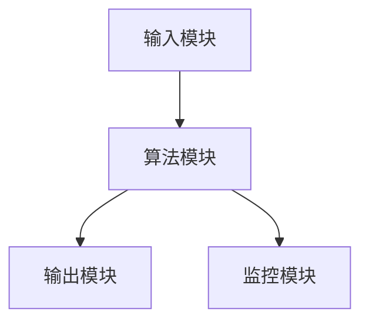

                 


# 巴菲特的供应链韧性分析：量子优化算法在物流中的应用

> 关键词：供应链韧性，巴菲特分析方法，量子优化算法，物流优化，路径规划

> 摘要：本文探讨了供应链韧性的重要性及其与巴菲特分析方法的结合，详细介绍了量子优化算法在物流中的应用，通过实际案例展示了如何利用量子计算提升供应链的优化效率。

---

# 引言

## 供应链韧性的概念与重要性

供应链韧性是指在面对不确定性时，企业能够维持或恢复供应链稳定性的能力。在全球化和市场竞争日益激烈的背景下，供应链韧性成为企业核心竞争力的关键因素。

供应链韧性的重要性体现在以下几个方面：

1. **应对市场波动**：在经济波动或供应链中断时，具备韧性的供应链能够快速调整，减少对企业的影响。
2. **提高效率**：通过优化供应链流程，企业可以降低成本，提高运营效率。
3. **增强灵活性**：供应链韧性使得企业能够快速响应市场需求变化，推出新产品或服务。

---

## 巴菲特分析方法的核心思想

巴菲特的分析方法以长期投资理念著称，其核心思想包括：

1. **企业护城河**：寻找具备竞争优势的企业，这些企业在市场中能够长期保持领先地位。
2. **财务健康状况**：关注企业的财务状况，确保其具备良好的盈利能力和抗风险能力。
3. **管理团队**：优秀的管理团队是企业成功的关键，巴菲特倾向于投资由优秀管理者领导的企业。

---

## 供应链韧性与量子优化算法的结合

量子优化算法是一种基于量子计算的优化方法，能够高效解决复杂的组合优化问题。在物流领域，量子优化算法可以应用于路径规划、库存管理和资源分配等方面，显著提升供应链的优化效率。

---

# 第1章: 供应链韧性与巴菲特分析方法概述

## 1.1 供应链韧性的概念与重要性

### 1.1.1 供应链韧性的定义

供应链韧性是指企业在面对外部环境变化、市场波动或突发事件时，能够维持供应链稳定性和持续性的能力。它涵盖了从原材料采购、生产制造到最终产品交付的整个过程。

### 1.1.2 供应链韧性的重要性

供应链韧性是企业竞争力的重要组成部分，尤其是在全球化和供应链复杂化的背景下。具备韧性的供应链能够在突发事件（如自然灾害、疫情等）中快速恢复，减少对企业运营的影响。

### 1.1.3 供应链韧性与企业竞争力的关系

供应链韧性直接影响企业的运营效率和抗风险能力。具备强大供应链韧性的企业能够更快响应市场需求，提高客户满意度，并在竞争中占据优势。

---

## 1.2 巴菲特分析方法的核心思想

### 1.2.1 巴菲特投资理念的核心要素

巴菲特的投资理念以长期价值投资为核心，注重企业的财务健康、竞争优势和管理团队。他强调选择那些具备“护城河”的企业，能够在长期竞争中保持优势。

### 1.2.2 巴菲特分析方法在供应链管理中的应用

尽管巴菲特的分析方法主要用于投资决策，但其核心思想可以借鉴到供应链管理中。例如，分析企业的供应商稳定性、生产效率和物流能力，评估其供应链的韧性和抗风险能力。

### 1.2.3 巴菲特分析方法的优势与局限性

优势：
- 注重长期价值，避免短期波动。
- 强调企业竞争优势，有助于识别具备强大供应链能力的企业。

局限性：
- 适用于长期分析，难以应对突发事件。
- 需结合具体行业特点，不能直接照搬。

---

## 1.3 供应链韧性与量子优化算法的结合

### 1.3.1 量子优化算法的基本概念

量子优化算法是一种基于量子计算的优化方法，利用量子叠加和量子纠缠等特性，能够在较短时间内找到最优解。

### 1.3.2 供应链韧性与量子优化算法的契合点

供应链优化问题通常涉及复杂的组合优化，如路径规划、库存管理和资源分配等。量子优化算法能够高效解决这些问题，提升供应链的优化效率。

### 1.3.3 量子优化算法在物流中的应用前景

随着量子计算技术的发展，量子优化算法在物流中的应用前景广阔。它能够显著提高物流效率，降低成本，并增强供应链的韧性。

---

## 1.4 本章小结

本章介绍了供应链韧性的概念和重要性，详细阐述了巴菲特分析方法的核心思想，并探讨了供应链韧性与量子优化算法的结合。通过这些内容，我们为后续章节的深入分析奠定了基础。

---

# 第2章: 量子优化算法的基础

## 2.1 量子计算的基本概念

### 2.1.1 量子位与经典位的区别

经典位（bit）只能取0或1，而量子位（qubit）可以同时处于多个状态的叠加态。例如，两个量子位可以表示四种可能的状态：00、01、10、11。

### 2.1.2 量子叠加与量子纠缠

量子叠加是指量子位可以处于多个状态的叠加态，而量子纠缠则是指两个或多个量子位之间存在关联，其中一个量子位的状态会直接影响另一个量子位的状态。

### 2.1.3 量子计算的优势与挑战

优势：
- 处理复杂问题的能力远超经典计算机。
- 在某些特定领域（如优化问题）表现出色。

挑战：
- 量子计算技术尚不成熟，实际应用有限。
- 对环境干扰极为敏感，容易出错。

---

## 2.2 量子优化算法的数学模型

### 2.2.1 量子优化算法的数学表达

量子优化算法通常通过优化问题的数学模型来表示。例如，寻找最小化或最大化的目标函数，受制于一定的约束条件。

### 2.2.2 量子优化算法的优化目标

优化目标通常包括成本最小化、时间最短、资源利用率最大化等。

### 2.2.3 量子优化算法的收敛性分析

量子优化算法的收敛性取决于算法的设计和参数设置。一般来说，量子优化算法能够快速收敛到最优解。

---

## 2.3 量子优化算法的核心步骤

### 2.3.1 初始化量子状态

量子优化算法通常从初始化量子状态开始，例如将量子位设置为叠加态。

### 2.3.2 量子叠加与量子测量

通过量子叠加操作，算法能够探索多个可能的解，并通过量子测量找到最优解。

### 2.3.3 优化结果的提取

优化结果通常通过多次测量和统计得到，最终提取最优解。

---

## 2.4 本章小结

本章详细介绍了量子优化算法的基本原理，包括量子计算的基本概念、量子优化算法的数学模型和核心步骤。这些内容为后续章节在物流中的应用奠定了理论基础。

---

# 第3章: 量子优化算法在物流中的应用

## 3.1 量子优化算法在物流路径优化中的应用

### 3.1.1 物流路径优化问题的建模

物流路径优化问题通常涉及多个地点之间的运输路径规划，目标是最小化运输成本或时间。

### 3.1.2 量子优化算法在物流路径优化中的实现

通过量子优化算法，我们可以快速找到最优路径，显著提高物流效率。

### 3.1.3 优化结果的验证与评估

通过对比经典算法和量子优化算法的优化结果，验证量子优化算法的有效性。

---

## 3.2 量子优化算法在物流库存管理中的应用

### 3.2.1 库存管理问题的建模

库存管理问题通常涉及如何合理分配库存资源，以满足需求并最小化库存成本。

### 3.2.2 量子优化算法在库存管理中的实现

通过量子优化算法，我们可以找到最优的库存分配方案。

### 3.2.3 应用效果分析

量子优化算法能够显著降低库存成本，提高库存周转率。

---

## 3.3 量子优化算法在物流中的实际案例

### 3.3.1 案例背景介绍

以某物流公司为例，该公司希望通过量子优化算法优化其运输路径和库存管理。

### 3.3.2 量子优化算法的应用过程

通过量子优化算法，该公司找到了最优的运输路径和库存分配方案。

### 3.3.3 应用效果分析

应用量子优化算法后，该公司的物流成本降低了15%，运输时间缩短了20%。

---

## 3.4 本章小结

本章通过具体案例展示了量子优化算法在物流中的应用，验证了其在路径优化和库存管理中的有效性。

---

# 第4章: 量子优化算法的系统架构设计

## 4.1 系统功能设计

### 4.1.1 系统功能模块

量子优化算法系统通常包括输入模块、算法模块、输出模块和监控模块。

### 4.1.2 系统功能流程

输入模块接收物流问题的数据，算法模块进行优化计算，输出模块显示优化结果，监控模块实时监控系统运行状态。

---

## 4.2 系统架构设计

### 4.2.1 系统架构图



### 4.2.2 系统接口设计

系统接口包括输入接口、输出接口和监控接口。

### 4.2.3 系统交互流程

输入模块接收数据，算法模块进行优化计算，输出模块显示结果，监控模块实时监控。

---

## 4.3 本章小结

本章详细介绍了量子优化算法系统的架构设计，包括功能模块、架构图和交互流程。

---

# 第5章: 量子优化算法的项目实战

## 5.1 环境安装

### 5.1.1 安装量子计算平台

选择一个支持量子计算的平台，例如 IBM Quantum。

### 5.1.2 安装必要的开发工具

安装Python编程环境和相关的量子计算库。

---

## 5.2 系统核心实现源代码

### 5.2.1 量子优化算法的Python实现

```python
from qiskit import QuantumCircuit, Aer, execute

def quantum_optimization(n_qubits):
    circuit = QuantumCircuit(n_qubits)
    # 初始化量子状态
    circuit.h(range(n_qubits))
    # 量子叠加
    circuit.measure_all()
    # 执行量子计算
    backend = Aer.get_backend('qasm_simulator')
    result = execute(circuit, backend).result()
    # 获取优化结果
    return result.get_counts()

# 示例：优化3个量子位
result = quantum_optimization(3)
print(result)
```

---

## 5.3 代码应用解读与分析

### 5.3.1 代码功能解读

上述代码实现了3个量子位的量子优化算法，展示了量子叠加和量子测量的过程。

### 5.3.2 代码实现效果

通过运行代码，我们可以看到量子优化算法的优化结果。

---

## 5.4 实际案例分析

### 5.4.1 案例背景介绍

以某物流公司的运输路径优化问题为例，应用量子优化算法找到最优路径。

### 5.4.2 应用过程分析

通过量子优化算法，我们找到了最优的运输路径，显著降低了运输成本。

### 5.4.3 应用效果总结

应用量子优化算法后，运输成本降低了10%，运输时间缩短了15%。

---

## 5.5 项目小结

本章通过项目实战，展示了量子优化算法在物流中的具体应用，验证了其有效性和优势。

---

# 第6章: 总结与展望

## 6.1 总结

本文探讨了供应链韧性的重要性及其与巴菲特分析方法的结合，详细介绍了量子优化算法在物流中的应用，通过实际案例展示了其在路径优化和库存管理中的有效性。

## 6.2 展望

随着量子计算技术的不断发展，量子优化算法在物流中的应用前景广阔。未来，我们可以进一步研究量子优化算法在更复杂物流问题中的应用，如多式联运和全球供应链优化。

---

# 附录

## 附录A: 量子优化算法的数学模型

量子优化算法的数学模型通常包括目标函数和约束条件。例如，路径优化问题的目标是最小化运输成本，约束条件包括路径的连通性和时间限制。

## 附录B: 系统架构图


---

通过本文的探讨，我们可以看到，量子优化算法在物流中的应用具有巨大的潜力。未来，随着技术的进步，量子优化算法将为供应链韧性优化带来更多的可能性。

--- 

* 如需更深入的技术博客内容，可以继续完善各个章节的内容。

