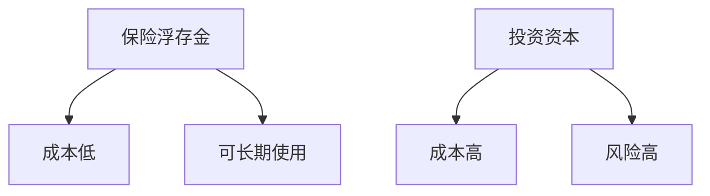
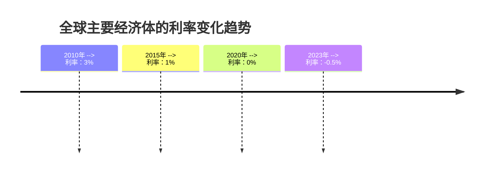
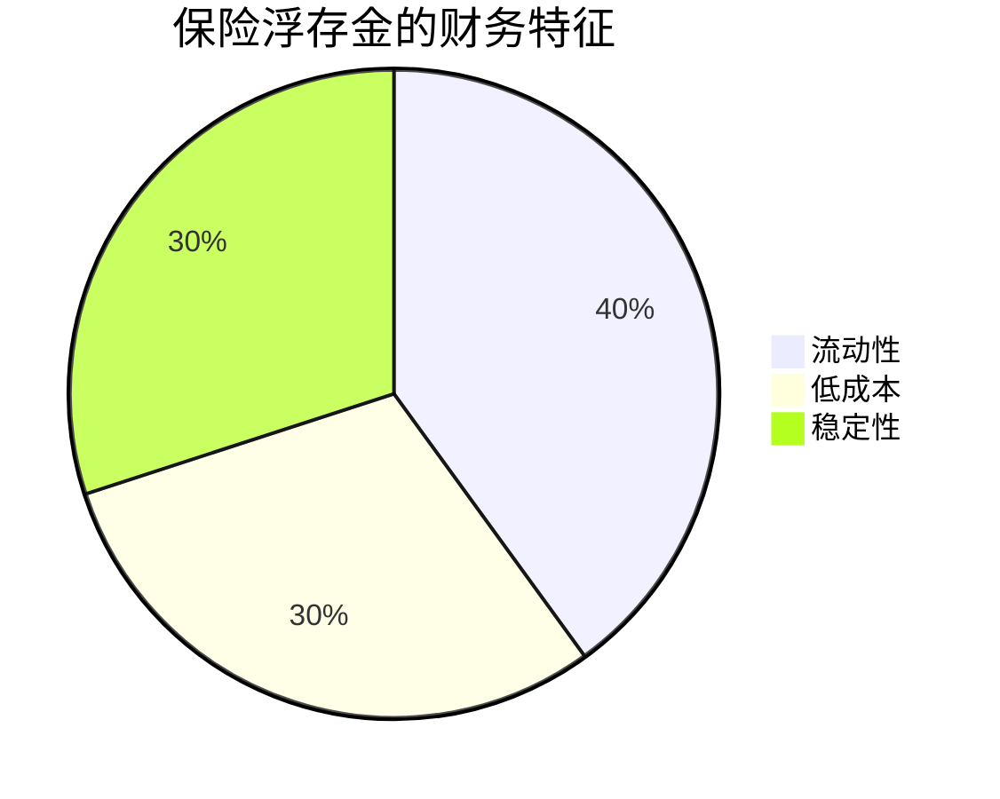

                 

# 巴菲特的保险浮存金策略：在低利率环境中的新思考

## 关键词：
- 巴菲特
- 保险浮存金
- 低利率环境
- 投资策略
- 财务分析

## 摘要：
本文探讨了巴菲特的保险浮存金策略在低利率环境下的新思考。文章从保险浮存金的基本概念入手，分析其在巴菲特投资策略中的重要性。接着，详细讨论了低利率环境对保险浮存金策略的影响，包括资金成本、投资组合优化及风险管理等方面。通过经典案例分析，阐述了巴菲特如何在低利率环境下调整策略，并对未来投资策略的演变进行了展望。本文旨在为投资者提供深度的理论与实践分析，帮助他们在当前经济环境中做出明智的投资决策。

---

## 第一部分：引言

### 第1章：保险浮存金的基本概念

#### 1.1 保险浮存金的定义
保险浮存金是指保险公司收取的保费与实际赔付金额之间的差额部分，这部分资金在保险公司运营过程中形成的一种“浮存资金”。巴菲特认为，浮存金是一种“免费的钱”，因为这些资金在保险公司中可以长期使用，且成本较低。

**关键概念对比表：**

| 概念        | 定义与特点                                                                 |
|-------------|--------------------------------------------------------------------------|
| 保险浮存金   | 保费收入与赔付支出之间的差额，属于保险公司占用资金，成本较低，可长期使用的资金。 |
| 投资资本     | 企业用于投资的自有资金，成本较高，需承担较高的市场风险。          |

**图1.1：保险浮存金与投资资本的对比**

#### 1.2 巴菲特的投资哲学
巴菲特的价值投资理念强调长期持有优质资产，追求内在价值的增长。保险浮存金作为其投资策略的重要组成部分，为其提供了低成本的资金来源，从而在低利率环境下更具优势。

**巴菲特的价值投资三要素：**
1. **安全边际**：以低于内在价值的价格买入资产。
2. **竞争优势**：投资具有持续竞争优势的企业。
3. **长期视角**：关注企业的长期价值而非短期波动。

---

### 第2章：低利率环境下的投资挑战

#### 2.1 低利率环境的定义与特征
低利率环境是指市场利率低于历史平均水平的情况，通常由中央银行降低基准利率或市场供过于求导致。当前全球经济环境下，许多国家实行零利率或负利率政策，进一步加剧了低利率环境。

**图2.1：全球主要经济体的利率变化趋势**

#### 2.2 低利率环境下的保险浮存金策略
低利率环境下，保险浮存金的成本进一步降低，但同时也面临收益率下降的挑战。巴菲特通过优化投资组合，将更多资金配置到长期债券和高评级资产，以维持收益稳定。

**保险浮存金投资组合优化的数学模型：**

- 设浮存金规模为F，投资收益率为r，市场平均利率为i。
- 在低利率环境下，r = min(F, i + α)，其中α为风险溢价。
- 通过调整资产配置，使得r尽可能接近i + α，以实现收益最大化。

---

## 第二部分：保险浮存金的财务与投资分析

### 第3章：保险浮存金的财务与投资分析

#### 3.1 保险浮存金的财务特征
保险浮存金的财务特征包括高流动性、低成本和长期稳定性。这些特征使得浮存金成为巴菲特在低利率环境下重要的资金来源。

**图3.1：保险浮存金的财务特征分析**

#### 3.2 保险浮存金的投资策略
巴菲特通过将浮存金投资于长期债券、股票和高评级资产，实现了收益最大化。在低利率环境下，他更倾向于投资具有稳定分红和高成长性的企业。

**浮存金投资组合的资产分配：**

- 债券：50%
- 股票：30%
- 现金及货币市场工具：20%

---

### 第4章：低利率环境下的投资策略调整

#### 4.1 低利率环境下的资产配置
在低利率环境下，巴菲特通过优化资产配置，将更多资金配置到长期债券和高评级资产，以应对收益率下降的风险。

**资产配置优化的数学模型：**

- 设资产组合的平均收益率为μ，波动率为σ。
- 在低利率环境下，μ = ∑(w_i * r_i)，其中w_i为资产i的权重，r_i为资产i的收益率。
- 通过调整w_i，使得组合的波动率σ最小化，同时最大化μ。

#### 4.2 低利率环境下的风险管理
风险管理是低利率环境下保险浮存金策略的重要组成部分。巴菲特通过分散投资、风险对冲和流动性管理，降低了整体投资组合的风险。

**风险管理的三要素：**
1. **分散投资**：避免过度集中于单一资产类别。
2. **风险对冲**：利用衍生工具对冲利率风险和市场波动风险。
3. **流动性管理**：确保在需要时能够迅速变现资产，应对市场变化。

---

## 第三部分：案例分析与未来展望

### 第5章：巴菲特保险浮存金策略的案例分析

#### 5.1 巴菲特的经典投资案例
以伯克希尔哈撒韦为例，分析巴菲特如何利用保险浮存金投资于长期债券和高评级企业，实现收益最大化。

**案例分析：伯克希尔哈撒韦的保险浮存金投资**
- 1985年，伯克希尔通过收购多家保险公司，获得了大量浮存金。
- 将这些资金投资于长期债券和高评级企业，年收益率稳定在7%-8%之间。
- 在低利率环境下，进一步增加债券投资比例，维持收益稳定。

#### 5.2 保险浮存金策略的实践应用
通过具体案例分析，说明保险浮存金策略在不同经济周期中的应用，及其对投资组合的影响。

---

### 第6章：未来展望与投资建议

#### 6.1 低利率环境的长期影响
预计低利率环境将持续较长时间，巴菲特的保险浮存金策略将继续发挥重要作用。未来，随着技术进步和市场变化，浮存金的运用可能会更加多样化。

#### 6.2 投资者应该如何应对
- **投资者应学习巴菲特的长期价值投资理念，注重风险控制和资产配置。**
- **在低利率环境下，优先选择具有稳定分红和高成长性的资产。**
- **保持对市场的敏感性，及时调整投资策略，应对经济变化。**

---

## 总结
巴菲特的保险浮存金策略在低利率环境下展现出了强大的生命力。通过优化资产配置、注重风险管理，投资者可以在当前经济环境中实现收益最大化。未来，随着市场变化和技术进步，保险浮存金策略将继续演变，为投资者提供更多的机遇和挑战。

