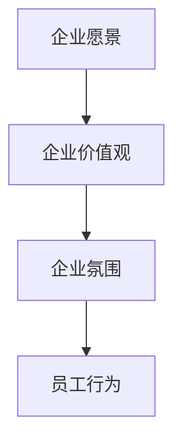
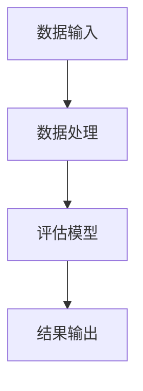

                 


```markdown
# 巴菲特的公司文化评估：优秀管理层的特征

> 关键词：巴菲特，公司文化，管理层特征，投资哲学，评估框架

> 摘要：本文从巴菲特的投资哲学出发，系统分析公司文化的核心要素和优秀管理层的关键特征，探讨如何通过评估公司文化来识别具有长期竞争优势的企业。结合实际案例，本文详细阐述了巴菲特的评估方法和工具，为投资者提供实用的指导。

---

## 第一章：背景介绍

### 1.1 公司文化与管理层特征的重要性
#### 1.1.1 公司文化的定义与内涵
公司文化是指企业在长期经营过程中形成的价值观、行为准则和工作习惯的总和。它是企业内部的共同认知和信念，影响着员工的行为和决策。

#### 1.1.2 管理层特征的核心要素
优秀管理层需要具备战略思维、决策能力和领导风格等关键特征，这些特征直接影响企业的长期发展。

#### 1.1.3 巴菲特的投资哲学
巴菲特认为，投资成功的前提是选择具有优秀管理层和强大公司文化的公司，因为这些因素是企业长期竞争优势的基石。

---

## 第二章：公司文化的关键维度

### 2.1 企业愿景与使命
企业愿景是公司长期发展的蓝图，使命则是企业存在的核心目标。清晰的愿景和使命能够指导管理层的决策，并激励员工的努力。

### 2.2 企业价值观
企业价值观是公司的核心信念，影响着企业的决策和行为。优秀的企业价值观能够促进企业与利益相关者的和谐共生。

### 2.3 企业氛围
企业氛围是员工在工作中的体验和感受，包括团队合作、创新氛围和员工满意度等方面。良好的企业氛围能够提升员工的士气和创造力。

---

## 第三章：优秀管理层的特征

### 3.1 管理层的战略思维
战略思维是指管理层能够从长远角度出发，制定符合公司愿景和使命的战略目标，并能够在复杂环境中做出正确的决策。

### 3.2 管理层的决策能力
决策能力是指管理层在面对复杂问题时，能够迅速、准确地做出决策，并能够承担相应的责任。优秀管理层的决策往往具有前瞻性和可持续性。

### 3.3 管理层的领导风格
领导风格是指管理层如何与员工互动并影响员工的行为。优秀的领导风格能够激发员工的潜力，增强团队的凝聚力和执行力。

---

## 第四章：巴菲特的公司文化评估方法

### 4.1 公司文化评估的核心工具
巴菲特通过分析公司的ROE（净资产收益率）、管理层的过往业绩、企业文化等方面来评估公司的文化健康状况。

### 4.2 管理层特征的评估维度
- **战略思维**：评估管理层是否具备长期战略眼光。
- **决策能力**：分析管理层在关键时刻的决策表现。
- **领导风格**：考察管理层如何与员工互动并影响团队氛围。

### 4.3 实际案例分析
以苹果公司为例，分析其管理层的战略思维、决策能力和领导风格，以及这些特征如何影响公司的长期发展。

---

## 第五章：系统分析与架构设计

### 5.1 评估模型的构建
- **领域模型**：展示公司文化与管理层特征之间的关系。
- **架构图**：展示评估过程的系统架构。

### 5.2 评估工具的设计
- **评估指标**：定义具体的评估指标和权重。
- **评估流程**：详细描述从数据收集到结果分析的整个流程。

---

## 第六章：项目实战

### 6.1 环境安装
- **工具安装**：介绍评估工具的安装和配置步骤。
- **数据准备**：说明如何收集和整理公司的文化数据。

### 6.2 核心实现
- **代码实现**：展示如何通过编程工具进行数据分析和评估。
- **结果解读**：解释评估结果的意义和应用。

### 6.3 案例分析
- **案例选择**：选择一个具体公司，分析其文化特征和管理层表现。
- **结果分析**：根据评估结果，得出投资决策建议。

---

## 第七章：总结与建议

### 7.1 本章小结
总结公司文化评估的重要性，以及优秀管理层特征在投资决策中的作用。

### 7.2 最佳实践 tips
- **持续学习**：建议投资者不断学习和更新评估方法。
- **注重细节**：强调在评估过程中关注细节的重要性。
- **风险管理**：提醒投资者注意评估中的潜在风险。

### 7.3 拓展阅读
推荐与公司文化评估相关的书籍和资源，帮助读者深入学习。

---

## 附录

### 附录 A：公司文化评估指标表
| 评估维度 | 具体指标 | 权重 |
|----------|----------|------|
| 企业愿景 | 愿景清晰度 | 30% |
| 企业价值观 | 价值观一致性 | 25% |
| 企业氛围 | 员工满意度 | 20% |

### 附录 B：管理层特征评估表
| 评估维度 | 具体指标 | 权重 |
|----------|----------|------|
| 战略思维 | 长期目标设定 | 40% |
| 决策能力 | 重大决策表现 | 30% |
| 领导风格 | 团队凝聚力 | 20% |

---

## 图表

### 图1：公司文化层次结构图


### 图2：管理层特征对比表格
| 特征 | 优秀管理层 | 平平管理层 |
|------|------------|------------|
| 战略思维 | 具备长期眼光 | 仅关注短期目标 |
| 决策能力 | 决策果断且准确 | 决策犹豫且失误多 |
| 领导风格 | 员工导向，注重团队 | 以自我为中心，缺乏沟通 |

### 图3：系统架构图


---

## 参考文献

1. 巴菲特的股东大会演讲集
2. 《巴菲特的投资思想》
3. 《公司文化评估的方法与实践》
4. 相关学术论文和研究报告

---

## 结语

通过系统地分析公司文化的核心要素和优秀管理层的关键特征，结合巴菲特的评估方法和工具，投资者可以更有效地识别具有长期竞争优势的企业。希望本文能够为投资者提供有价值的参考和启发。
```

