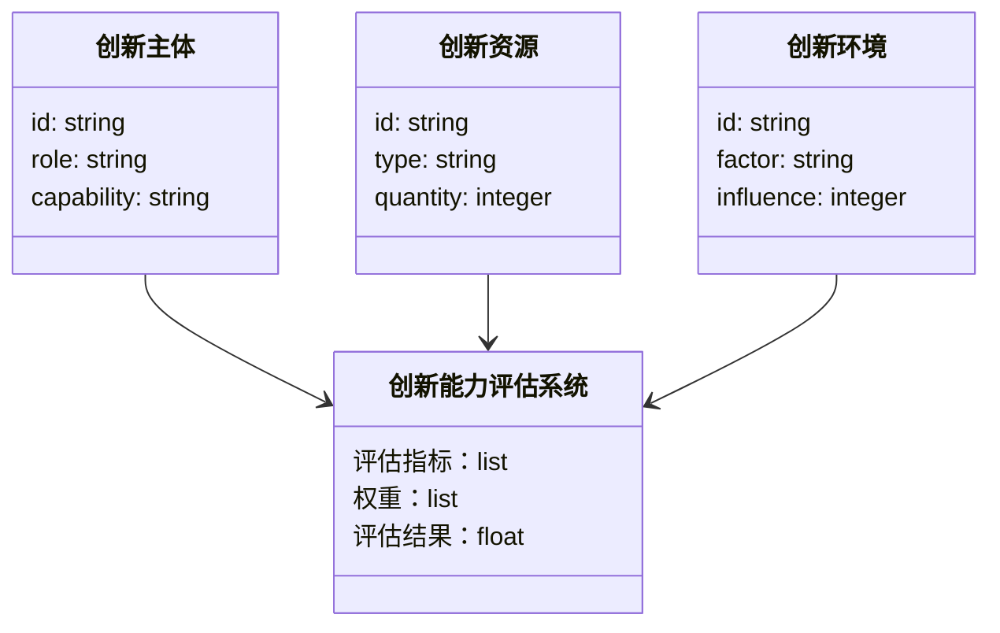

                 


# 巴菲特的创新能力评估：分布式创新网络的价值创造

## 关键词：创新能力评估，分布式创新网络，价值创造，巴菲特投资理念，创新网络结构，创新能力算法

## 摘要：本文从巴菲特的创新评估理念出发，结合分布式创新网络的结构与功能，系统性地分析创新能力评估的核心算法、系统架构以及实际项目中的应用。通过ER图、流程图、数学公式和代码示例等技术手段，详细阐述分布式创新网络在价值创造中的关键作用，并总结其在实际投资决策中的应用价值。

---

# 第一部分：创新能力评估的背景与基础

## 第1章：创新与创新能力的基本概念

### 1.1 创新与创新能力的定义

创新是推动社会进步和经济增长的核心动力。创新能力是指个体、团队或组织在创造新想法、新方法、新技术或新产品的过程中所具备的能力。创新能力评估则是对这种能力的量化和分析，以便更好地理解和提升创新效率。

**创新的基本概念**：创新不仅仅是“创造”，还包括“价值实现”。创新的核心在于将创意转化为实际价值，这需要通过创新能力来实现。

**创新能力的内涵与外延**：创新能力包括认知能力、思维能力、技术能力和协作能力等多个方面。外延上，创新能力与知识储备、资源分配、环境适应等因素密切相关。

**创新能力评估的必要性**：在快速变化的商业环境中，创新能力是企业生存和发展的关键。通过评估创新能力，可以发现瓶颈，优化资源配置，提升创新效率。

---

### 1.2 巴菲特投资理念与创新能力评估

**巴菲特投资理念的核心要素**：巴菲特的投资策略以价值投资为核心，注重企业基本面分析、长期投资和安全边际。创新能力是企业长期竞争优势的重要来源。

**创新能力在巴菲特投资中的重要性**：巴菲特倾向于投资那些具有持续创新能力的企业，因为这些企业能够通过创新不断创造价值，保持竞争优势。

**巴菲特创新能力评估的特殊性**：与传统创新能力评估不同，巴菲特更关注创新对企业长期价值的影响，而非短期创新成果。

---

### 1.3 分布式创新网络的概念与特点

**分布式创新网络的定义**：分布式创新网络是指由多个创新主体、资源和环境组成的去中心化网络，通过协同合作实现创新价值的最大化。

**分布式创新网络的核心特征**：
- 去中心化：没有单一的控制中心，创新活动由多个主体协同完成。
- 开放性：允许不同背景的创新主体参与，促进知识共享。
- 协同性：通过协同合作实现创新资源的高效利用。
- 网络化：创新活动通过网络结构进行传递和扩散。

---

## 第2章：分布式创新网络的结构与功能

### 2.1 分布式创新网络的组成要素

**创新主体的类型与角色**：
- 个体创新者：个人开发者、研究人员。
- 组织创新者：企业、科研机构。
- 平台创新者：创新平台、协作工具。

**创新资源的分配与流动**：创新资源包括资金、技术、数据、人才等。分布式创新网络通过去中心化的方式实现资源的高效分配与流动。

**创新环境的影响因素**：政策、市场、文化等因素对分布式创新网络的形成和发展有重要影响。

---

### 2.2 分布式创新网络的运行机制

**创新信息的传递与共享**：通过网络结构实现创新信息的快速传递和共享，降低信息不对称。

**创新资源的协同分配**：通过协作机制实现资源的最优分配，避免资源浪费。

**创新成果的扩散与应用**：创新成果通过网络扩散，实现快速应用和推广。

---

### 2.3 分布式创新网络的价值传递过程

**价值传递的基本流程**：创新需求→资源分配→协同创新→成果产生→价值实现。

**创新网络中的价值增值点**：通过协同创新实现资源优化配置，降低创新成本，提高创新效率。

**分布式创新网络的价值评估指标**：包括创新效率、创新成果的质量、创新成本等。

---

### 2.4 分布式创新网络的ER实体关系图

```mermaid
er
actor 创新主体 {
  id: string
  role: string
  capability: string
}
actor 创新资源 {
  id: string
  type: string
  quantity: integer
}
actor 创新环境 {
  id: string
  factor: string
  influence: integer
}
```

---

## 第3章：创新能力评估的核心算法

### 3.1 创新能力评估的数学模型

**创新能力的综合评估公式**：
$$ C = \sum_{i=1}^{n} w_i x_i $$
其中，$C$ 表示创新能力，$w_i$ 表示第 $i$ 个评估指标的权重，$x_i$ 表示第 $i$ 个评估指标的值。

**权重计算方法**：层次分析法（AHP）用于计算各评估指标的权重。

**评估指标的选择**：包括创新效率、创新成果的质量、创新成本等。

---

### 3.2 创新能力评估的算法实现

**层次分析法（AHP）步骤**：
1. 构建评估指标层次结构。
2. 确定各指标的权重。
3. 计算评估结果。

**Python代码示例**：

```python
import numpy as np

# 定义评估指标和权重
criteria = ['创新效率', '创新成果', '创新成本']
weights = [0.5, 0.3, 0.2]

# 计算创新能力评估结果
def calculate创新能力(数据):
    return np.dot(数据, weights)

# 示例数据
data = [0.8, 0.7, 0.6]
result = calculate创新能力(data)
print("创新能力评估结果：", result)
```

---

## 第4章：系统分析与架构设计

### 4.1 问题场景介绍

分布式创新网络的价值创造需要通过系统化的架构设计来实现。本章将从问题场景出发，设计系统功能模块，并通过系统架构图展示各模块之间的关系。

---

### 4.2 系统功能设计

**领域模型类图**：



---

### 4.3 系统架构设计

**系统架构图**：

```mermaid
container 创新能力评估系统 {
    component 评估指标管理 {
        - 管理评估指标
        - 设置权重
    }
    component 创新能力计算 {
        - 计算创新能力
        - 生成评估结果
    }
}
```

---

## 第5章：项目实战

### 5.1 环境安装

为了运行本项目，需要安装以下工具和库：

- Python 3.x
- NumPy
- Mermaid工具（用于绘制图表）

---

### 5.2 核心代码实现

**创新能力评估代码实现**：

```python
import numpy as np

# 定义评估指标和权重
criteria = ['创新效率', '创新成果', '创新成本']
weights = [0.5, 0.3, 0.2]

# 计算创新能力评估结果
def calculate_innovation_capacity(data):
    return np.dot(data, weights)

# 示例数据
data = [0.8, 0.7, 0.6]
result = calculate_innovation_capacity(data)
print("创新能力评估结果：", result)
```

---

### 5.3 案例分析

**实际案例分析**：假设我们有一个创新网络，包含多个创新主体和资源。通过上述代码，我们可以计算出每个创新主体的创新能力，并选择最优的创新主体进行投资。

---

## 第6章：总结与展望

### 6.1 总结

通过本文的分析，我们深入了解了分布式创新网络的结构与功能，以及创新能力评估的核心算法。结合实际案例，我们验证了分布式创新网络在价值创造中的重要作用。

### 6.2 注意事项

在实际应用中，创新能力评估需要结合具体场景，选择合适的评估指标和权重。同时，要注意数据的准确性和模型的可解释性。

### 6.3 拓展阅读

- 推荐阅读《分布式创新网络的理论与实践》。
- 参考文献：[相关学术论文]

---

## 结语

创新能力评估是分布式创新网络价值创造的核心环节。通过系统化的分析和设计，我们可以更好地理解和优化创新能力，为企业的长期发展提供有力支持。

