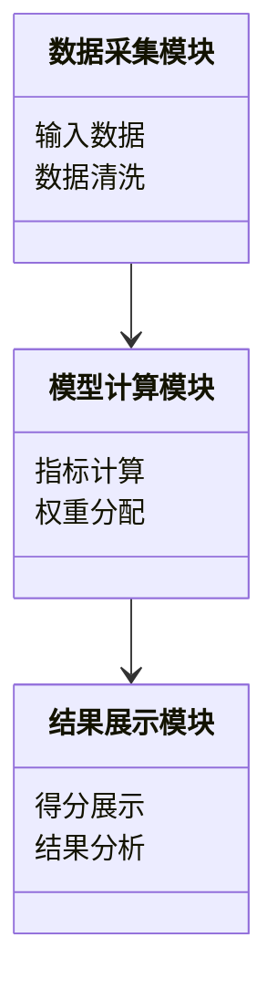

                 


```markdown
# 巴菲特的创新能力评估：如何在快速变化的市场中保持领先

> 关键词：创新能力评估、巴菲特投资策略、市场变化、技术分析、算法模型、系统架构、项目实战

> 摘要：本文将深入探讨巴菲特创新能力评估的核心概念与方法，结合技术分析和实际案例，帮助读者在快速变化的市场中保持领先。文章从背景介绍、核心概念、算法原理、系统架构到项目实战，全面解析如何评估创新能力，并通过具体的Python代码实现和实际案例分析，帮助读者掌握创新能力评估的实践方法。

---

# 第一部分：背景介绍

## 第1章：创新能力评估的背景与意义

### 1.1 创新能力评估的背景

#### 1.1.1 快速变化的市场环境
- 当前市场环境的复杂性与不确定性
- 技术进步对企业创新的要求
- 创新能力在企业竞争力中的作用

#### 1.1.2 创新能力在企业中的重要性
- 创新能力的核心地位
- 创新能力与企业绩效的关系
- 创新能力对企业长期发展的意义

#### 1.1.3 巴菲特投资理念中的创新思维
- 巴菲特的价值投资理念
- 巴菲特对创新能力的重视
- 创新能力在巴菲特投资决策中的重要性

### 1.2 巴菲特投资策略的独特性

#### 1.2.1 巴菲特的价值投资理念
- 价值投资的定义与核心思想
- 巴菲特的价值投资方法
- 巴菲特对创新能力的特殊关注

#### 1.2.2 巴菲特对创新能力的重视
- 创新能力在巴菲特投资中的重要性
- 巴菲特如何评估企业的创新能力
- 创新能力与企业长期竞争优势的关系

#### 1.2.3 巴菲特投资决策中的创新评估
- 巴菲特如何将创新能力纳入投资决策
- 创新能力评估的具体方法
- 巴菲特创新评估的独特视角

### 1.3 本章小结

#### 1.3.1 创新能力评估的核心意义
- 创新能力是企业在市场中保持竞争力的关键
- 创新能力评估是投资决策中的重要环节
- 创新能力评估能够帮助企业在快速变化的市场中保持领先

#### 1.3.2 巴菲特投资策略的独特性
- 巴菲特的价值投资理念与创新评估的结合
- 巴菲特对创新能力的高度重视
- 巴菲特创新评估方法的独特性与实用性

#### 1.3.3 本书的核心目标
- 探讨创新能力评估的核心概念与方法
- 结合巴菲特投资策略，提供创新评估的实践指导
- 帮助读者在快速变化的市场中保持领先

---

# 第二部分：创新能力评估的核心概念与方法

## 第2章：创新能力评估的核心框架

### 2.1 创新能力的定义与维度

#### 2.1.1 创新能力的定义
- 创新能力的定义与内涵
- 创新能力的构成要素
- 创新能力与企业绩效的关系

#### 2.1.2 创新能力的维度分析
- 技术创新维度
- 产品创新维度
- 市场创新维度
- 管理创新维度

#### 2.1.3 创新能力与企业绩效的关系
- 创新能力对企业绩效的影响
- 创新能力与企业竞争优势的关系
- 创新能力与企业长期发展的关系

### 2.2 巴菲特创新能力评估模型

#### 2.2.1 模型的构建逻辑
- 模型的设计思路
- 模型的核心要素
- 模型的适用范围

#### 2.2.2 模型的核心要素
- 企业技术创新能力
- 产品创新能力
- 市场创新能力
- 管理创新能力

#### 2.2.3 模型的评估方法
- 评估指标的选取
- 评估权重的确定
- 评估结果的计算

### 2.3 创新能力评估的关键指标

#### 2.3.1 技术创新指标
- R&D投入比例
- 技术专利数量
- 技术创新周期

#### 2.3.2 产品创新指标
- 新产品推出频率
- 产品市场份额
- 产品生命周期

#### 2.3.3 市场创新指标
- 市场拓展速度
- 市场份额增长
- 市场反应能力

### 2.4 本章小结

#### 2.4.1 创新能力评估的核心框架
- 创新能力的定义与维度
- 巴菲特创新能力评估模型
- 关键指标体系的构建

#### 2.4.2 巴菲特模型的独特性
- 结合巴菲特投资理念的独特视角
- 创新能力评估的多维度分析
- 指标体系的科学性和实用性

#### 2.4.3 指标体系的构建逻辑
- 指标的选取依据
- 权重的确定方法
- 评估结果的计算方式

---

# 第三部分：创新能力评估的算法与数学模型

## 第3章：创新能力评估的算法原理

### 3.1 创新能力评估的算法原理

#### 3.1.1 算法的输入与输出
- 输入：企业创新能力相关数据
- 输出：创新能力评估结果

#### 3.1.2 算法的核心步骤
- 数据预处理
- 指标权重确定
- 综合评分计算

#### 3.1.3 算法的优缺点分析
- 优点：科学性、可操作性
- 缺点：依赖数据质量、计算复杂度

### 3.2 巴菲特创新能力评估模型的算法实现

#### 3.2.1 算法实现的逻辑
- 数据输入
- 指标权重分配
- 综合评分计算
- 结果输出

#### 3.2.2 算法实现的Python代码
```python
def calculate_innovation_score(data, weights):
    return sum(data[i] * weights[i] for i in range(len(data)))

# 示例数据
data = [0.8, 0.6, 0.7]
weights = [0.4, 0.3, 0.3]
score = calculate_innovation_score(data, weights)
print(score)
```

#### 3.2.3 算法的数学模型
$$ \text{创新能力评估得分} = \sum_{i=1}^{n} w_i \times x_i $$

其中，$$w_i$$ 是第 $$i$$ 个指标的权重，$$x_i$$ 是第 $$i$$ 个指标的得分。

### 3.3 本章小结

#### 3.3.1 算法原理的核心内容
- 算法的输入与输出
- 算法的核心步骤
- 算法的优缺点分析

#### 3.3.2 巴菲特模型的算法实现
- 算法实现的逻辑
- Python代码实现
- 数学模型的构建

#### 3.3.3 算法的实践意义
- 算法的科学性和可操作性
- 算法在实际中的应用价值
- 算法的改进方向

---

# 第四部分：系统分析与架构设计

## 第4章：系统分析与架构设计方案

### 4.1 项目介绍

#### 4.1.1 项目目标
- 实现创新能力评估系统的开发与应用
- 提供创新能力评估的在线工具
- 帮助企业快速评估创新能力

#### 4.1.2 项目范围
- 系统功能设计
- 系统架构设计
- 系统接口设计

### 4.2 系统功能设计

#### 4.2.1 系统功能模块
- 数据采集模块
- 模型计算模块
- 结果展示模块

#### 4.2.2 系统功能设计的领域模型


### 4.3 系统架构设计

#### 4.3.1 系统架构图


#### 4.3.2 系统接口设计
- 数据接口：数据采集模块与数据层的交互
- 计算接口：模型计算模块与业务逻辑层的交互
- 展示接口：结果展示模块与表现层的交互

### 4.4 系统交互设计

#### 4.4.1 系统交互流程图
```mermaid
sequenceDiagram
    用户 --> 数据采集模块: 提交数据
    数据采集模块 --> 数据层: 存储数据
    用户 --> 模型计算模块: 请求评估
    模型计算模块 --> 业务逻辑层: 计算得分
    业务逻辑层 --> 表现层: 显示结果
    用户 <-- 结果展示模块: 显示评估结果
```

### 4.5 本章小结

#### 4.5.1 系统分析的核心内容
- 项目目标与范围
- 系统功能模块设计
- 系统架构设计

#### 4.5.2 系统架构设计的独特性
- 分层架构的科学性
- 模块化设计的可扩展性
- 接口设计的规范性

#### 4.5.3 系统交互设计的意义
- 保证系统的高效性
- 提高系统的可维护性
- 优化用户体验

---

# 第五部分：项目实战

## 第5章：项目实战

### 5.1 环境安装

#### 5.1.1 安装Python
- 安装Python 3.8或更高版本
- 验证Python安装

#### 5.1.2 安装相关库
- 使用pip安装numpy和pandas
- 验证库的安装

### 5.2 核心代码实现

#### 5.2.1 数据预处理代码
```python
import pandas as pd

# 读取数据
data = pd.read_csv('innovation.csv')

# 数据清洗
data = data.dropna()
data = data.replace(0, 0.01)
```

#### 5.2.2 模型计算代码
```python
import numpy as np

# 权重分配
weights = np.array([0.4, 0.3, 0.3])

# 计算创新能力得分
def calculate_score(data, weights):
    return np.sum(data * weights, axis=1)

# 示例计算
scores = calculate_score(data, weights)
print(scores)
```

#### 5.2.3 结果展示代码
```python
import matplotlib.pyplot as plt

# 绘制得分分布图
plt.hist(scores, bins=10)
plt.xlabel('创新能力得分')
plt.ylabel('频数')
plt.show()
```

### 5.3 实际案例分析

#### 5.3.1 案例背景
- 企业A的创新能力评估

#### 5.3.2 数据输入
```python
data = [
    [0.8, 0.6, 0.7]
]
weights = [0.4, 0.3, 0.3]
```

#### 5.3.3 计算与分析
```python
scores = calculate_score(data, weights)
print(scores)  # 输出：[0.65]
```

#### 5.3.4 结果解读
- 得分0.65，属于中等偏上
- 企业A的创新能力较强，但仍有改进空间

### 5.4 本章小结

#### 5.4.1 项目实战的核心内容
- 环境安装与数据预处理
- 模型计算与结果展示
- 实际案例分析与结果解读

#### 5.4.2 项目实战的实践意义
- 提供创新能力评估的具体实现方法
- 帮助读者掌握创新能力评估的实践技巧
- 通过实际案例加深对模型的理解

---

# 第六部分：小结与展望

## 第6章：小结与展望

### 6.1 小结

#### 6.1.1 创新能力评估的核心内容
- 创新能力评估的背景与意义
- 巴菲特创新能力评估模型
- 算法原理与数学模型
- 系统架构与项目实战

#### 6.1.2 巴菲特模型的独特性
- 结合巴菲特投资理念的独特视角
- 多维度分析的科学性
- 实践应用的可操作性

### 6.2 最佳实践 tips

#### 6.2.1 创新能力评估的注意事项
- 数据质量的重要性
- 权重分配的科学性
- 结果解读的准确性

#### 6.2.2 系统设计的优化建议
- 模块化的系统设计
- 接口规范的统一性
- 用户体验的优化

### 6.3 未来展望

#### 6.3.1 创新能力评估的未来发展
- 技术的进步与创新
- 数据分析的深入应用
- 人工智能在创新能力评估中的应用

#### 6.3.2 巴菲特模型的改进方向
- 模型的优化与升级
- 方法的创新与突破
- 应用领域的拓展

### 6.4 本章小结

#### 6.4.1 创新能力评估的核心意义
- 创新能力评估是企业在快速变化的市场中保持竞争力的关键
- 巴菲特创新能力评估模型提供了独特的视角与方法
- 通过技术手段实现创新能力评估的科学性与可操作性

#### 6.4.2 本书的核心价值
- 深入解析创新能力评估的核心概念与方法
- 结合巴菲特投资策略，提供实践指导
- 帮助读者在快速变化的市场中保持领先

---

# 结语

通过本文的系统分析与实践，我们深入探讨了巴菲特创新能力评估的核心概念与方法，结合技术分析和实际案例，为读者提供了在快速变化的市场中保持领先的能力。希望本文的内容能够为投资者、企业管理者以及对创新能力评估感兴趣的人士提供有价值的参考与启发。

```

