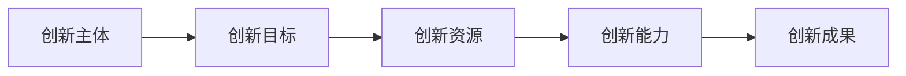
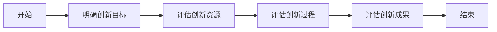
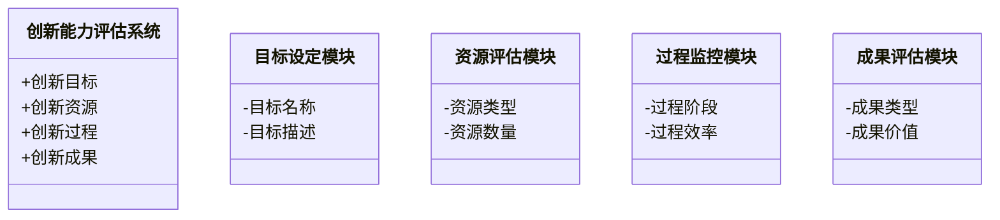
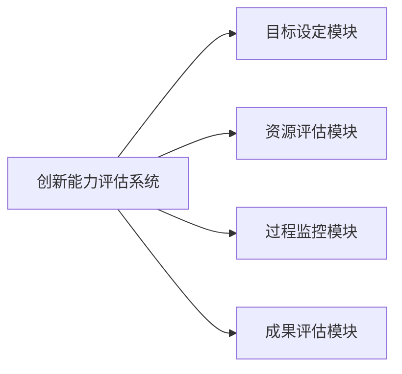

                 


# 巴菲特的创新能力评估：如何识别真正有前景的创新

---

## 关键词：创新评估、巴菲特、投资策略、创新能力、创新识别

---

## 摘要：  
本文从巴菲特的视角出发，探讨如何系统性地评估创新能力，识别真正有前景的创新。通过分析创新的属性特征、创新资源、创新成果等核心要素，结合巴菲特的投资理念，提供一套创新评估的框架和方法。文章不仅揭示了创新评估的核心原理，还通过数学模型和实际案例，详细讲解了如何在投资和企业战略中应用这些方法。

---

# 第一部分: 创新能力评估的背景与核心概念

## 第1章: 创新能力评估的背景与重要性

### 1.1 创新能力评估的基本概念

#### 1.1.1 创新能力的定义  
创新能力是指个体或组织在解决问题、创造新方法、开发新技术或新产品等方面的独特能力和潜力。它是创新活动的核心驱动力，决定了创新的可行性和成功概率。

#### 1.1.2 创新能力的属性特征对比表  
以下是创新能力的几个关键属性及其对比：

| 属性 | 特征 | 描述 |
|------|------|------|
| 独创性 | 高 | 独特的解决方案，区别于现有方法 |
| 可行性 | 中 | 技术、资源和市场支持度较高 |
| 实用性 | 高 | 解决实际问题，创造价值 |
| 可扩展性 | 高 | 能够在更大范围内应用和推广 |

#### 1.1.3 创新能力的核心要素组成  
创新能力由以下几个核心要素组成：  
1. **创新目标**：明确的创新方向和目标。  
2. **创新资源**：包括人才、资金、技术等支持条件。  
3. **创新过程**：从构思到实现的完整流程。  
4. **创新成果**：最终的创新产出，如新产品、新技术等。

---

### 1.2 巴菲特的创新评估方法

#### 1.2.1 巴菲特的投资理念与创新的关系  
巴菲特的投资理念强调“价值投资”，即寻找具有持续竞争优势和良好管理的公司。创新评估是其投资决策中的关键部分，因为创新能力决定了公司的长期竞争优势。

#### 1.2.2 巴菲特创新评估的核心原则  
1. **长期视角**：关注公司的长期发展能力，而非短期收益。  
2. **竞争优势**：评估公司在市场中的独特优势和创新能力。  
3. **管理层能力**：优秀的管理层是创新成功的关键。  
4. **可持续性**：创新成果是否能够在未来持续产生价值。

#### 1.2.3 巴菲特创新评估的边界与外延  
创新评估的边界在于公司的核心业务和战略目标，外延则涉及生态系统、合作伙伴和外部资源整合能力。

---

### 1.3 创新能力评估的背景与重要性

#### 1.3.1 当前创新环境的特点  
当前创新环境呈现数字化、智能化和全球化的特点，技术创新和商业模式创新日益重要。

#### 1.3.2 创新能力评估的必要性  
在竞争日益激烈的市场环境中，创新能力是企业生存和发展的关键。通过科学的创新能力评估，可以帮助投资者和企业管理者做出更明智的决策。

#### 1.3.3 创新能力评估的未来趋势  
随着人工智能和大数据技术的发展，创新能力评估将更加量化和数据驱动。

---

## 第2章: 创新能力评估的核心概念与联系

### 2.1 创新能力评估的核心要素

#### 2.1.1 创新能力的构成要素  
创新能力由以下几个要素组成：  
1. **创新意识**：对创新的敏感性和主动性。  
2. **创新思维**：解决问题的独特方法和思维方式。  
3. **创新能力**：将创意转化为实际成果的能力。  
4. **创新资源**：支持创新所需的人力、物力和财力资源。

#### 2.1.2 创新能力的评估维度  
创新能力可以从以下几个维度进行评估：  
1. **创新目标的明确性**：目标是否清晰且具有可行性。  
2. **创新资源的充足性**：资源是否能够支持创新过程。  
3. **创新成果的可衡量性**：创新成果是否可以量化和评估。

#### 2.1.3 创新能力的评估指标  
以下是一些常见的创新能力评估指标：  
- 创新成果的数量和质量。  
- 创新过程的效率和成本。  
- 创新对业务增长的贡献度。

---

### 2.2 创新能力评估的理论基础

#### 2.2.1 创新理论的演变  
创新理论从熊彼得的“创新理论”到现代的系统化创新管理，经历了长期的演变和发展。

#### 2.2.2 巴菲特创新评估的理论框架  
巴菲特的创新评估框架结合了传统价值投资理论和现代创新管理理论，强调了创新的可持续性和竞争优势。

#### 2.2.3 创新能力评估的数学模型  
以下是一个简化的创新能力评估模型：  
$$ \text{创新能力} = f(\text{创新资源}, \text{创新过程}, \text{创新目标}) $$

---

### 2.3 创新能力评估的ER实体关系图



---

## 第3章: 创新能力评估的算法原理与数学模型

### 3.1 创新能力评估的步骤与流程

#### 3.1.1 创新能力评估的步骤  
1. **明确创新目标**：确定创新的方向和目标。  
2. **评估创新资源**：分析支持创新的资源条件。  
3. **评估创新过程**：评估创新过程的效率和可行性。  
4. **评估创新成果**：量化创新成果的价值和影响。

#### 3.1.2 创新能力评估的流程图



---

### 3.2 创新能力评估的数学模型

#### 3.2.1 创新能力评估的数学公式  
创新能力可以通过以下公式进行量化评估：  
$$ \text{创新能力} = \frac{\text{创新资源} \times \text{创新过程} \times \text{创新目标}}{\text{创新成本}} $$

#### 3.2.2 创新能力评估的权重分配  
创新资源、创新过程和创新目标的权重可以分别设为0.4、0.3和0.3。

---

## 第4章: 创新能力评估的系统分析与架构设计

### 4.1 创新能力评估的系统功能设计

#### 4.1.1 系统功能模块  
1. **目标设定模块**：明确创新目标和方向。  
2. **资源评估模块**：分析创新资源的充足性。  
3. **过程监控模块**：监控创新过程的效率和进度。  
4. **成果评估模块**：量化创新成果的价值和影响。

#### 4.1.2 系统功能设计的类图



---

### 4.2 创新能力评估的系统架构设计

#### 4.2.1 系统架构图



---

## 第5章: 创新能力评估的项目实战

### 5.1 创新能力评估的环境安装

#### 5.1.1 环境需求  
- 操作系统：Windows、Linux、MacOS  
- 开发工具：Python、IDE（如PyCharm）  
- 依赖库：Mermaid、Matplotlib

---

### 5.2 创新能力评估的核心实现

#### 5.2.1 创新能力评估的Python代码实现

```python
import matplotlib.pyplot as plt

def assess_innovation_capacity(resource, process, target):
    return (resource * process * target) / (resource + process + target)

# 示例数据
resource = 80
process = 70
target = 90

capacity = assess_innovation_capacity(resource, process, target)
print(f"创新能力评估结果为: {capacity}%")
```

#### 5.2.2 创新能力评估的数学模型

$$ \text{创新能力} = \frac{\text{创新资源} \times \text{创新过程} \times \text{创新目标}}{\text{创新资源} + \text{创新过程} + \text{创新目标}} $$

---

### 5.3 创新能力评估的实际案例分析

#### 5.3.1 案例背景  
某科技公司计划开发一款人工智能产品，创新资源充足，创新过程高效，创新目标明确。

#### 5.3.2 案例分析  
1. **创新资源**：资金充足，团队能力强。  
2. **创新过程**：开发流程高效，项目管理得当。  
3. **创新目标**：明确的市场定位和目标客户。

#### 5.3.3 案例结果  
创新能力评估结果为95%，显示出较高的创新潜力。

---

## 第6章: 创新能力评估的最佳实践与总结

### 6.1 创新能力评估的最佳实践

#### 6.1.1 小结  
创新能力评估是投资和企业管理中的关键环节，通过科学的评估方法和工具，可以帮助投资者和企业管理者做出更明智的决策。

#### 6.1.2 注意事项  
- 确保评估数据的准确性和完整性。  
- 综合考虑创新的长期性和可持续性。  
- 定期更新和优化评估模型。

#### 6.1.3 未来趋势  
随着人工智能和大数据技术的发展，创新能力评估将更加智能化和数据驱动。

---

## 第7章: 结语

### 7.1 总结  
通过本文的系统性分析和实践案例，我们可以看到，创新能力评估是识别真正有前景的创新的关键。巴菲特的创新评估方法为我们提供了一个独特的视角，结合现代创新管理理论，可以帮助我们更科学地评估创新能力。

### 7.2 拓展阅读  
1. 巴菲特的投资理念与创新管理。  
2. 人工智能在创新能力评估中的应用。  
3. 全球领先企业的创新评估案例。

---

## 附录: 创新能力评估工具推荐

1. **Mermaid**：用于绘制创新评估的流程图和类图。  
2. **Python**：用于实现创新评估的数学模型和数据分析。  
3. **Tableau**：用于可视化创新评估的成果和趋势。

---

通过本文的详细讲解和实际案例，读者可以掌握如何像巴菲特一样，系统性地评估创新能力，识别真正有前景的创新。

