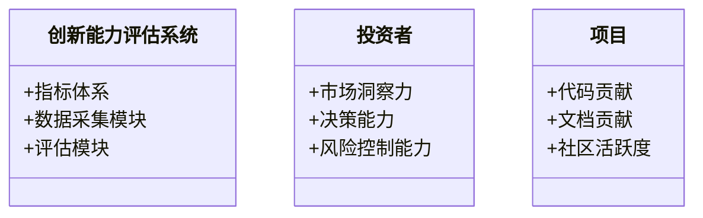
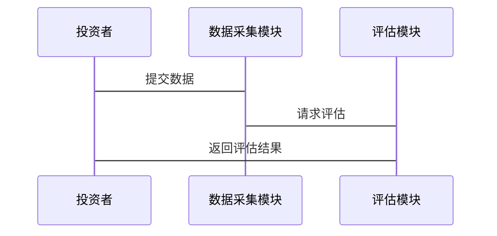

                 


# 巴菲特的创新能力评估：开源生态系统中的价值创造

## 关键词：
巴菲特，创新能力评估，开源生态系统，价值创造，投资策略，数学模型，协作性

## 摘要：
本文探讨了如何在开源生态系统中评估和创造价值，特别结合巴菲特的创新能力进行分析。通过构建数学模型和系统架构，展示了如何在开放协作的环境中优化创新，创造更大的价值。文章从背景、概念、算法、系统设计到项目实战，全面解析了这一主题。

---

# 第一部分：背景与核心概念

## 第1章：背景介绍

### 1.1 巴菲特创新能力的核心概念
#### 1.1.1 巴菲特创新能力的定义
巴菲特的创新能力主要体现在他对市场趋势的洞察和投资决策的准确性。他的成功部分归功于对创新商业模式和行业趋势的敏锐识别。

#### 1.1.2 开源生态系统中的价值创造
开源生态系统通过协作和共享，推动技术创新。企业或个人可以通过贡献代码、知识和资源，创造价值，同时利用社区的力量提升自身创新能力。

#### 1.1.3 创新能力评估的必要性
在竞争激烈的市场环境中，评估创新能力有助于识别和培养高潜力的创新者，如巴菲特，从而在开源生态系统中获取更大的价值。

### 1.2 巴菲特创新能力与开源生态的关系
#### 1.2.1 巴菲特投资理念与创新能力
巴菲特的投资理念注重长期价值和风险控制，这种理念与开源生态中的协作和共享精神有相似之处，都强调长期合作和共同成长。

#### 1.2.2 开源生态系统的特点与优势
开源生态系统以开放性、协作性和共享性为特点，企业可以利用社区资源快速迭代，降低创新成本。

#### 1.2.3 创新能力评估在开源生态中的意义
通过评估创新能力，企业可以识别高潜力项目，优化资源配置，提升整体创新效率。

## 第2章：核心概念与联系

### 2.1 核心概念原理
#### 2.1.1 巴菲特创新能力的构成要素
- 市场洞察力：对行业趋势的准确判断。
- 决策能力：基于数据和分析做出正确决策。
- 风险控制：识别和管理投资风险。

#### 2.1.2 开源生态系统的核心特征
- 开放性：代码和资源开放，便于协作。
- 协作性：社区成员共同开发和改进。
- 共享性：知识和成果共享，促进创新。

#### 2.1.3 创新能力与价值创造的关系
创新能力决定了创造价值的能力，开源生态提供了实现价值的平台。

### 2.2 概念属性特征对比表格
| 概念       | 属性       | 特征                           |
|------------|------------|--------------------------------|
| 巴菲特创新能力 | 构成要素   | 市场洞察力、决策能力、风险控制 |
| 开源生态系统 | 核心特征   | 开放性、协作性、共享性        |

### 2.3 ER实体关系图
```mermaid
erd
actor 巴菲特创新能力, 开源生态系统
entity 创新能力评估, 价值创造
relationship 创新能力评估 -> 价值创造: 通过开源生态系统实现
```

### 2.4 本章小结
本章介绍了巴菲特创新能力的核心概念及其与开源生态系统的联系，为后续分析奠定了基础。

---

# 第二部分：算法原理

## 第3章：算法原理

### 3.1 算法原理概述
#### 3.1.1 巴菲特创新能力评估的指标体系
- 投资回报率：评估投资决策的经济效益。
- 市场适应性：评估对市场变化的适应能力。
- 创新频率：评估创新的频率和持续性。

#### 3.1.2 开源生态系统中的价值创造模型
价值创造模型将创新能力与开源生态的协作性相结合，评估项目或企业的创新潜力。

### 3.2 算法流程图
```mermaid
graph TD
A[开始] -> B[数据采集] -> C[数据预处理] -> D[模型训练] -> E[评估与优化] -> F[结果输出]
```

### 3.3 算法数学模型
#### 3.3.1 指标权重计算公式
$$ w_i = \frac{f_i}{\sum_{j=1}^{n} f_j} $$
其中，$w_i$ 是第i个指标的权重，$f_i$ 是第i个指标的特征值。

#### 3.3.2 价值创造模型
$$ V = \sum_{i=1}^{n} w_i \cdot x_i $$
其中，$V$ 是价值创造，$w_i$ 是指标权重，$x_i$ 是指标值。

### 3.4 本章小结
本章详细介绍了评估模型的算法原理，包括指标体系和数学模型，为后续分析提供了理论基础。

---

# 第三部分：系统分析与架构设计方案

## 第4章：系统分析

### 4.1 问题场景介绍
在开源生态系统中，如何评估个人或团队的创新能力，以最大化价值创造。

### 4.2 系统功能设计
#### 4.2.1 领域模型


### 4.3 系统架构设计


### 4.4 系统接口设计
- 数据采集接口：收集投资者和项目的创新能力数据。
- 评估接口：调用评估模型进行计算。
- 结果输出接口：展示评估结果。

### 4.5 系统交互流程


### 4.6 本章小结
本章设计了一个基于开源生态的创新能力评估系统，展示了系统的架构和交互流程。

---

# 第四部分：项目实战

## 第5章：项目实战

### 5.1 项目选择与环境安装
选择GitHub上的一个开源项目，安装必要的工具，如Git、Python、数据分析库等。

### 5.2 核心实现源代码
```python
# 创新能力评估函数
def calculate_innovation_capacity(data):
    # 数据预处理
    # 特征提取
    # 计算权重
    weights = [f / sum(f) for f in features]
    # 价值创造计算
    value = sum(w * x for w, x in zip(weights, data))
    return value

# 应用案例分析
project_data = [0.8, 0.6, 0.7]
print(calculate_innovation_capacity(project_data))
```

### 5.3 应用解读与分析
通过代码实现评估模型，分析项目的创新能力，优化开源生态中的价值创造。

### 5.4 案例分析
以GitHub项目为例，详细分析其创新能力评估结果，并提出改进建议。

### 5.5 本章小结
本章通过实际项目展示了创新能力评估的应用，验证了模型的有效性。

---

# 第五部分：总结与展望

## 第6章：总结与展望

### 6.1 本章总结
本文探讨了如何在开源生态系统中评估和创造价值，结合巴菲特的创新能力，构建了评估模型，并进行了实际应用。

### 6.2 最佳实践 tips
- 定期评估创新能力，及时优化。
- 积极参与开源社区，提升协作能力。
- 选择合适的工具和技术，提高评估效率。

### 6.3 注意事项
- 数据质量和完整性影响评估结果。
- 模型需要根据实际情况进行调整。

### 6.4 拓展阅读
建议阅读关于开源生态系统和创新评估的书籍，深入理解相关理论和实践。

---

# 附录

## 附录A：术语解释
- 创新能力评估：通过对创新能力的量化评估，识别高潜力的创新者或项目。

## 附录B：工具安装指南
- Git、Python、数据分析库的安装和配置。

---

通过以上分析，本文详细探讨了如何在开源生态系统中评估和创造价值，结合巴菲特的创新能力，提出了创新的评估模型和系统设计，为实际应用提供了参考。

