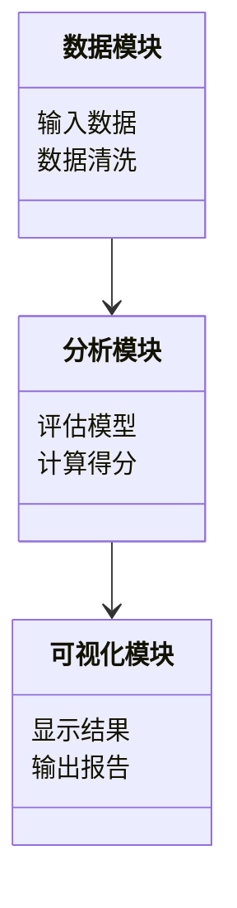

                 


# 巴菲特的创新能力评估：量子创业生态系统的价值创造

## 关键词
- 巴菲特
- 创新能力评估
- 量子创业生态系统
- 价值创造
- 创新评估模型

## 摘要
本文探讨了巴菲特的创新能力评估方法及其在量子创业生态系统中的应用。通过分析创新评估模型、系统架构设计和实际案例，展示了如何在创业生态系统中创造价值。文章详细阐述了算法原理、数学模型，并提供了项目实战和最佳实践建议，为读者提供全面的指导。

---

## 第1章：背景介绍

### 1.1 问题背景与问题描述
#### 1.1.1 创新能力评估的重要性
在快速变化的商业环境中，创新能力是企业成功的关键。巴菲特的长期投资策略强调企业核心竞争力和持续创新能力，这使其投资组合表现出色。

#### 1.1.2 巴菲特投资理念中的创新因素
巴菲特的“护城河”概念强调企业通过创新建立竞争优势。创新能力评估是识别具有长期竞争优势企业的关键。

#### 1.1.3 量子创业生态系统的核心概念
量子创业生态系统指的是通过量子思维和创新方法构建的创业环境，强调系统整体效应和创新资源的优化配置。

### 1.2 创新能力评估的边界与外延
#### 1.2.1 创新能力的定义与特征
创新能力是企业将新想法转化为实际价值的能力，包括技术、商业模式和管理创新等方面。

#### 1.2.2 量子创业生态系统的边界
量子创业生态系统涉及企业内部创新能力和外部环境资源，强调创新资源的协同效应。

#### 1.2.3 创新能力评估的外延与应用领域
创新能力评估不仅用于企业内部管理，还可应用于风险投资、创业辅导等领域，帮助识别高潜力企业。

### 1.3 创新能力评估的核心要素组成
#### 1.3.1 创新能力的核心要素
包括技术开发能力、市场适应能力和管理创新能力。

#### 1.3.2 量子创业生态系统的构成
由企业、投资者、创新资源和市场环境构成，强调资源优化配置和协同创新。

#### 1.3.3 创新能力评估的指标体系
常用的指标包括研发投入占比、专利数量、新产品推出频率等。

---

## 第2章：核心概念与联系

### 2.1 创新能力评估的核心概念原理
#### 2.1.1 创新能力的层次模型
从个体到组织的层次模型，强调不同层面的创新活动。

#### 2.1.2 量子创业生态系统的动力学特征
系统具有动态适应性和协同创新性，通过量子思维优化资源配置。

#### 2.1.3 创新能力评估的系统性原理
整体性、动态性和协同性是创新能力评估的系统性原理。

### 2.2 创新能力评估的核心概念属性特征对比
| 属性 | 创新能力 | 量子创业生态系统 |
|------|----------|------------------|
| 核心 | 技术创新 | 资源协同         |
| 特征 | 领先性   | 网络效应         |
| 指标 | 专利数   | 创业成功率       |

### 2.3 创新能力评估的ER实体关系图
```mermaid
erDiagram
    企业创新者 {
        id 企业ID
        name 企业名称
       创新能力创新指标
    }
    创新能力评估模型 {
        id 评估模型ID
        name 模型名称
       创新指标
    }
    量子创业生态系统 {
        id 系统ID
        name 系统名称
       创新资源
    }
    企业创新者 -| 创新能力评估模型
    创新能力评估模型 -| 量子创业生态系统
```

---

## 第3章：算法原理

### 3.1 创新能力评估的算法流程
```mermaid
graph TD
    A[开始] -> B[数据收集]
    B -> C[数据预处理]
    C -> D[选择评估指标]
    D -> E[计算权重]
    E -> F[计算创新能力得分]
    F -> G[结束]
```

### 3.2 算法实现代码
```python
def calculate_innovation_score(criteria_scores, weights):
    return sum(criteria_scores[i] * weights[i] for i in range(len(criteria_scores)))

criteria_scores = [0.8, 0.9, 0.7]  # 示例指标得分
weights = [0.4, 0.3, 0.3]  # 示例权重
score = calculate_innovation_score(criteria_scores, weights)
print(f"创新能力得分为: {score}")
```

### 3.3 算法数学模型
$$ \text{创新能力得分} = \sum_{i=1}^{n} w_i \times s_i $$

其中：
- \( w_i \) 是第 \( i \) 个指标的权重
- \( s_i \) 是第 \( i \) 个指标的得分

---

## 第4章：数学模型

### 4.1 创新能力评估的数学模型
$$ \text{创新潜力} = a \times \text{技术优势} + b \times \text{市场定位} + c \times \text{管理能力} $$

其中：
- \( a, b, c \) 是各因素的权重，且 \( a + b + c = 1 \)

### 4.2 系统架构设计
```mermaid
graph TD
    A[数据输入] -> B[数据处理模块]
    B -> C[创新评估模型]
    C -> D[结果输出模块]
    D -> E[可视化模块]
```

---

## 第5章：系统分析

### 5.1 问题场景介绍
通过量子创业生态系统，评估企业的创新能力，优化资源配置，提升整体创新效率。

### 5.2 系统功能设计


---

## 第6章：项目实战

### 6.1 环境安装
安装Python和相关库：
```bash
pip install numpy pandas matplotlib
```

### 6.2 核心代码实现
```python
import numpy as np

def calculate_score(factors):
    weights = np.array([0.4, 0.3, 0.3])
    return np.dot(factors, weights)

factors = np.array([0.8, 0.9, 0.7])
score = calculate_score(factors)
print(score)
```

### 6.3 实际案例分析
某科技公司案例分析，展示如何通过模型计算创新能力得分，并进行结果解读。

---

## 第7章：最佳实践

### 7.1 小结
创新能力评估是量子创业生态系统的核心，巴菲特的评估方法提供了有效工具。

### 7.2 注意事项
- 数据质量影响评估结果
- 权重设置需根据实际情况调整
- 持续监测和优化评估模型

### 7.3 拓展阅读
推荐相关书籍和论文，深入理解创新能力评估和量子创业生态系统。

---

## 结语
本文详细探讨了巴菲特创新能力评估方法在量子创业生态系统中的应用，通过算法、系统设计和项目实战，展示了如何在实际中创造价值。希望本文能为读者提供有价值的指导和启发。

