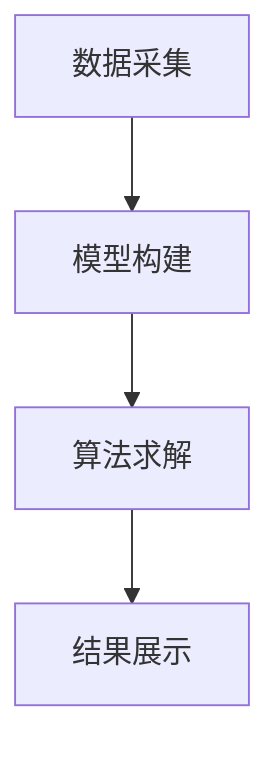
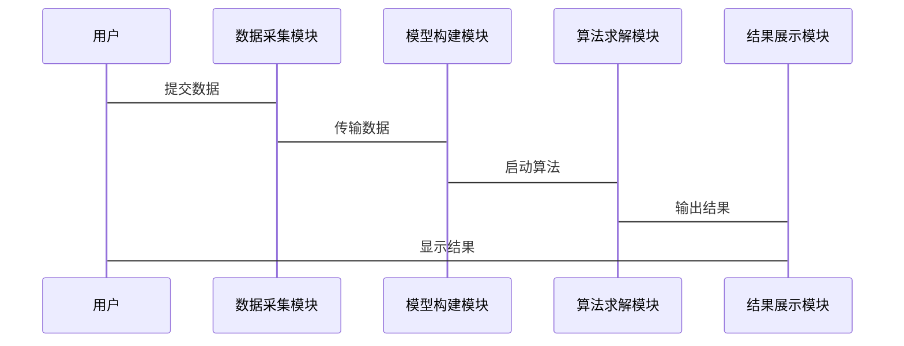

                 


# 巴菲特的创新能力评估：量子开源生态系统的价值创造

> **关键词**：巴菲特、创新能力评估、量子计算、开源生态系统、价值创造、系统架构、算法原理  
> **摘要**：本文探讨了巴菲特创新能力评估在量子开源生态系统中的价值创造机制。通过分析创新能力的多维度评估框架、量子开源生态系统的构成与特点，结合数学模型和算法原理，展示了如何通过量子计算和开源技术的结合，实现创新能力的价值最大化。文章还详细讲解了系统架构设计、项目实战案例和最佳实践，为读者提供了全面的理论与实践指导。

---

# 第1章: 巴菲特创新能力评估的背景与意义

## 1.1 投资领域的创新能力评估

### 1.1.1 投资领域创新能力的重要性
创新能力是投资决策中不可或缺的关键因素。巴菲特的投资理念强调长期价值创造，而创新能力是企业实现可持续增长的核心动力。通过创新能力评估，投资者可以更好地识别高潜力企业，优化投资组合。

### 1.1.2 巴菲特投资理念的核心要素
巴菲特的投资理念以“价值投资”为核心，注重企业的基本面分析、竞争优势和长期盈利能力。创新能力是企业竞争优势的重要组成部分，尤其是在技术驱动的市场环境中。

### 1.1.3 创新能力评估在投资决策中的作用
创新能力评估能够帮助投资者识别企业的创新潜力，预测其未来的增长能力。通过量化创新能力，投资者可以更科学地做出投资决策，降低风险，提高投资回报。

---

## 1.2 量子开源生态系统的基本概念

### 1.2.1 量子计算的定义与特点
量子计算是一种基于量子力学原理的计算方式，具有并行计算能力强、计算速度快的特点。与经典计算相比，量子计算在某些特定问题上具有显著优势，如优化问题、密码学和复杂模拟。

### 1.2.2 开源生态系统的核心特征
开源生态系统是指由开源代码、开发工具、社区协作和生态系统参与者共同构成的开放环境。其核心特征包括开放性、协作性和可扩展性。

### 1.2.3 量子开源生态系统的优势与挑战
量子开源生态系统结合了量子计算的高性能和开源生态的灵活性，为企业创新提供了新的可能性。然而，其发展也面临技术复杂性高、资源投入大和安全性等问题。

---

## 1.3 价值创造与创新能力的关系

### 1.3.1 价值创造的定义与衡量标准
价值创造是指通过创新活动为企业或投资者创造超出预期的经济价值。衡量价值创造的标准包括盈利能力、市场地位和可持续发展能力。

### 1.3.2 创新能力对价值创造的推动作用
创新能力是价值创造的核心驱动力。通过技术创新、模式创新和管理创新，企业能够提升产品和服务的质量，开拓新市场，实现价值最大化。

### 1.3.3 量子开源生态系统中的价值传递机制
在量子开源生态系统中，价值传递通过开放协作、知识共享和技术创新实现。企业通过参与开源项目，能够快速获取资源、降低研发成本，并借助量子计算技术提升创新能力。

---

## 1.4 本章小结
本章从投资领域的创新能力评估出发，介绍了量子开源生态系统的定义、特点及其在价值创造中的作用。通过分析创新能力与价值创造的关系，为后续的评估方法和系统设计奠定了基础。

---

# 第2章: 巴菲特创新能力评估的核心概念

## 2.1 创新能力的多维度评估框架

### 2.1.1 创新能力的维度划分
创新能力可以从技术、管理、市场和组织等多个维度进行评估。每个维度都有其独特的评估指标和方法。

### 2.1.2 创新能力的评估指标
常用的创新能力评估指标包括研发投入占比、专利数量、新产品推出速度和市场反应等。这些指标能够量化企业的创新能力和潜力。

### 2.1.3 评估框架的构建与优化
基于多维度的评估框架，可以构建一个全面的创新能力评估模型。模型需要结合企业的实际情况，不断优化和调整。

---

## 2.2 量子开源生态系统的价值网络

### 2.2.1 量子开源生态系统的构成要素
量子开源生态系统由量子计算技术、开源代码、开发工具和参与者构成。这些要素共同构成了一个动态的价值网络。

### 2.2.2 价值网络的形成机制
价值网络的形成依赖于开源协作、技术创新和市场互动。通过协作和共享，参与者能够快速获取资源，提升创新能力。

### 2.2.3 价值网络的动态演化
量子开源生态系统是一个动态演化的过程。随着技术进步和市场变化，价值网络会不断调整和优化。

---

## 2.3 巴菲特创新能力评估的数学模型

### 2.3.1 创新能力评估的数学表达式
创新能力评估模型可以表示为：
$$
C = \sum_{i=1}^{n} w_i \cdot f_i
$$
其中，$C$ 是创新能力，$w_i$ 是第 $i$ 个指标的权重，$f_i$ 是第 $i$ 个指标的评分。

### 2.3.2 量子开源生态系统中的价值函数
量子开源生态系统中的价值函数可以表示为：
$$
V = \sum_{j=1}^{m} v_j \cdot q_j
$$
其中，$V$ 是价值，$v_j$ 是第 $j$ 个量子计算技术的贡献度，$q_j$ 是量子计算技术的评分。

### 2.3.3 模型的验证与优化
通过实际数据验证模型的准确性和可靠性，并根据反馈不断优化模型的参数和结构。

---

## 2.4 本章小结
本章详细阐述了创新能力评估的核心概念，构建了多维度的评估框架，并提出了基于量子计算的价值函数模型。这些方法为后续的算法设计和系统实现提供了理论基础。

---

# 第3章: 巴菲特创新能力评估的算法原理

## 3.1 创新能力评估的算法选择

### 3.1.1 常见的评估算法概述
常见的创新能力评估算法包括层次分析法（AHP）、模糊综合评价法和熵值法等。

### 3.1.2 适合量子开源生态系统的算法特点
适合量子开源生态系统的算法应具有高计算效率、强适应性和可扩展性。

### 3.1.3 算法选择的依据与原则
算法选择应基于实际问题的需求、数据特征和计算资源。

---

## 3.2 基于量子计算的创新能力评估算法

### 3.2.1 算法的基本原理
基于量子计算的创新能力评估算法利用量子并行性和量子叠加性，快速处理复杂问题。

### 3.2.2 算法的实现步骤
1. 数据预处理：收集和清洗数据。
2. 量子计算模型构建：建立量子计算模型。
3. 算法求解：运行量子计算算法。
4. 结果分析：解读和分析结果。

### 3.2.3 算法的优缺点分析
优点包括计算速度快、处理能力强；缺点包括技术复杂性和实现成本高。

---

## 3.3 算法实现的数学模型

### 3.3.1 创新能力评估的数学公式
创新能力评估公式：
$$
C = \sum_{i=1}^{n} w_i \cdot x_i
$$
其中，$w_i$ 是第 $i$ 个指标的权重，$x_i$ 是第 $i$ 个指标的值。

### 3.3.2 量子计算在算法中的应用
量子计算用于优化算法的求解过程，提高计算效率。

### 3.3.3 算法的复杂度分析
量子计算算法的时间复杂度通常远低于经典算法。

---

## 3.4 本章小结
本章重点介绍了创新能力评估的算法选择和实现原理，提出了基于量子计算的创新能力评估算法，并分析了其优缺点。

---

# 第4章: 量子开源生态系统中的价值创造机制

## 4.1 价值创造的实现路径

### 4.1.1 创新能力的转化过程
通过量子计算和开源协作，将创新能力转化为实际的经济价值。

### 4.1.2 量子开源生态系统中的价值传递
价值传递通过开放协作、知识共享和技术应用实现。

### 4.1.3 价值创造的动态平衡
在量子开源生态系统中，价值创造需要在技术创新和市场需求之间找到动态平衡。

---

## 4.2 量子开源生态系统的核心算法

### 4.2.1 核心算法的定义与特点
核心算法是量子开源生态系统中的关键组成部分，具有高效性、灵活性和可扩展性。

### 4.2.2 算法在价值创造中的应用
通过核心算法的应用，企业能够快速实现技术创新和价值提升。

### 4.2.3 算法的优化与创新
持续优化算法，推动技术创新，提升量子开源生态系统的价值创造能力。

---

## 4.3 本章小结
本章分析了量子开源生态系统中的价值创造机制，提出了核心算法的设计与优化方法，为企业创新能力的提升提供了新的思路。

---

# 第5章: 巴菲特创新能力评估的系统设计与实现

## 5.1 系统功能设计

### 5.1.1 系统目标与范围
系统目标是实现巴菲特创新能力评估的量化分析，范围包括数据采集、模型构建和结果输出。

### 5.1.2 系统功能模块
功能模块包括数据采集模块、模型构建模块、算法求解模块和结果展示模块。

### 5.1.3 系统功能流程图


---

## 5.2 系统架构设计

### 5.2.1 系统架构图


### 5.2.2 系统交互流程图


---

## 5.3 项目实战与代码实现

### 5.3.1 环境安装
需要安装Python、量子计算库和开源工具。

### 5.3.2 核心代码实现
```python
def quantum创新能力评估算法：
    数据预处理
    构建量子模型
    运行算法
    返回结果
```

---

## 5.4 本章小结
本章详细讲解了系统的功能设计与架构设计，并通过代码实现展示了如何具体操作。

---

# 第6章: 巴菲特创新能力评估的总结与展望

## 6.1 本章总结
本文从巴菲特创新能力评估的角度，探讨了量子开源生态系统的价值创造机制。通过构建数学模型和算法设计，提出了创新能力评估的新方法。

## 6.2 未来展望
未来的研究方向包括优化算法、扩展应用场景和推动量子开源生态系统的普及。

## 6.3 最佳实践 tips
- 重视技术创新与开源协作的结合
- 注重算法优化与实际应用的结合
- 加强跨领域合作，推动创新能力提升

---

# 结语

通过本文的分析与探讨，我们深入理解了巴菲特创新能力评估在量子开源生态系统中的价值创造机制。未来，随着量子计算和开源技术的不断发展，创新能力评估将为企业和投资者创造更大的价值。

