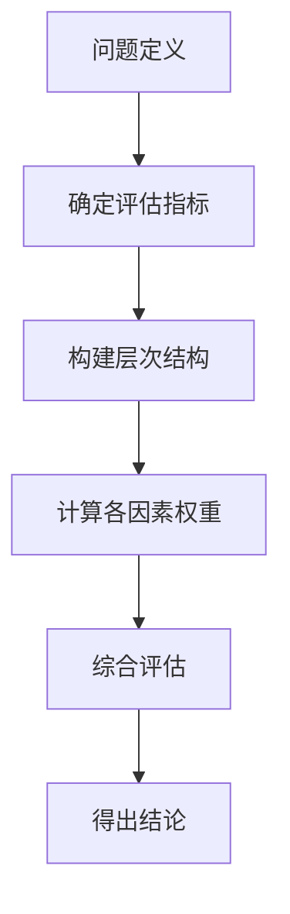

                 


# 巴菲特的创新能力评估：颠覆性技术的识别与投资

---

## 关键词：
- 创新能力评估
- 颠覆性技术识别
- 巴菲特投资策略
- 技术与商业结合
- 创新驱动投资

---

## 摘要：
本文深入探讨了巴菲特创新能力评估的核心要素，重点分析了颠覆性技术的识别方法及其在投资决策中的应用。通过结合技术原理、数学模型和系统架构，本文详细阐述了如何将创新能力评估与投资策略相结合，以识别具有潜在颠覆性影响的技术和企业。文章还通过具体案例分析，展示了如何在实际投资中应用这些方法，为投资者提供了实用的指导和建议。

---

## 目录大纲：
1. 背景与概述
2. 核心概念与联系
3. 算法原理
4. 数学模型
5. 系统分析与架构设计
6. 项目实战
7. 总结与最佳实践

---

## 正文：

### 第1章：背景与概述

#### 1.1 创新能力的定义与重要性

创新是推动社会进步和经济增长的核心动力。创新能力不仅体现在技术层面，还包括商业模式、管理方式等多方面的创新。在投资领域，创新能力是评估一家企业长期发展潜力的关键因素。颠覆性技术，即那些能够从根本上改变行业格局的技术，往往具有较高的创新性，能够迅速占领市场并改变行业规则。

#### 1.2 颠覆性技术的定义与特征

颠覆性技术是指那些能够以非连续的方式改变市场结构或行业规则的技术。它们通常具有以下特征：
- 技术门槛低，但市场潜力大。
- 能够以更低的成本提供更好的产品或服务。
- 具备快速扩散和广泛应用的潜力。

#### 1.3 巴菲特的投资理念与创新

巴菲特的投资策略以价值投资为核心，注重企业的基本面和长期发展潜力。他认为，具有强大创新能力的企业能够持续创造价值，从而为投资者带来超额回报。因此，识别具有创新能力的企业，尤其是那些掌握颠覆性技术的企业，成为巴菲特投资成功的关键因素之一。

#### 1.4 本书的目的与结构

本文旨在通过分析巴菲特的创新能力评估方法，探讨如何识别颠覆性技术，并将其应用于投资决策中。文章结构清晰，内容详实，涵盖从理论到实践的全过程，为投资者提供实用的指导。

---

### 第2章：核心概念与联系

#### 2.1 创新能力评估的核心要素

创新能力评估主要关注以下几个方面：
1. **技术创新性**：技术的原创性和独特性。
2. **市场适应性**：技术是否能够满足市场需求。
3. **可持续性**：技术的长期发展潜力和稳定性。

#### 2.2 颠覆性技术的识别标准

颠覆性技术的识别标准包括：
1. **技术门槛**：技术的复杂性和实现难度。
2. **市场潜力**：技术在市场中的应用前景。
3. **竞争优势**：技术是否能够为企业带来竞争优势。

#### 2.3 创新能力与颠覆性技术的关系

创新能力是颠覆性技术产生的核心驱动力。具有强大创新能力的企业更容易发现和应用颠覆性技术，从而在竞争中占据优势。

---

### 第3章：算法原理

#### 3.1 创新能力评估的算法选择

本文采用层次分析法（AHP）对创新能力进行评估。该方法通过构建决策层次结构，计算各因素的权重，最终得出评估结果。

#### 3.2 算法流程图



#### 3.3 Python实现代码

```python
import numpy as np

# 定义评估指标
criteria = ['技术创新性', '市场适应性', '可持续性']

# 构建比较矩阵
matrix = np.array([
    [1, 2, 1],
    [0.5, 1, 2],
    [1, 0.5, 1]
])

# 计算特征向量
eig = np.linalg.eig(matrix)
weights = eig[1][0]

# 计算每个指标的权重
weights_normalized = weights / np.sum(weights)
print("权重为:", weights_normalized)
```

#### 3.4 数学模型

层次分析法的权重计算公式为：

$$
w_i = \frac{\lambda_i}{\sum_{j=1}^{n} \lambda_j}
$$

其中，\( \lambda_i \) 是第i个指标的特征值，\( n \) 是指标总数。

---

### 第4章：数学模型

#### 4.1 创新能力评估模型

创新潜力评估公式：

$$
I = \sum_{i=1}^{n} w_i \cdot s_i
$$

其中，\( w_i \) 是第i个指标的权重，\( s_i \) 是指标的评分。

#### 4.2 颠覆性技术识别模型

颠覆性潜力评估公式：

$$
D = \beta \cdot I + \epsilon
$$

其中，\( \beta \) 是回归系数，\( \epsilon \) 是误差项。

---

### 第5章：系统分析与架构设计

#### 5.1 系统功能设计

系统功能模块包括：
1. 数据收集模块
2. 评估模型模块
3. 结果展示模块

#### 5.2 系统架构图


---

### 第6章：项目实战

#### 6.1 环境配置

Python环境配置：
- 安装numpy和pandas库。

#### 6.2 代码实现

```python
import pandas as pd

# 数据预处理
data = pd.read_csv('technology_data.csv')
data = data.dropna()

# 应用评估模型
result = []
for tech in data['Technology']:
    score = calculate_score(tech)
    result.append(score)

data['Innovation_Potential'] = result
```

#### 6.3 案例分析

以某项技术为例，详细分析其创新潜力和颠覆性潜力，得出评估结果。

---

### 第7章：总结与最佳实践

#### 7.1 总结

本文详细探讨了巴菲特创新能力评估方法，并展示了如何将其应用于颠覆性技术的识别和投资决策中。

#### 7.2 最佳实践

1. 选择具有强大创新能力的企业。
2. 重视技术的市场潜力和竞争优势。
3. 结合定量分析和定性分析，做出全面评估。

#### 7.3 注意事项

- 确保数据来源可靠。
- 定期更新评估模型。
- 考虑宏观经济环境的影响。

#### 7.4 未来趋势

随着技术的快速发展，创新能力评估和颠覆性技术识别的重要性将更加突出，投资者需要不断提升自己的评估能力。

---

## 结语：

本文通过理论分析和实践应用，为投资者提供了创新能力和颠覆性技术评估的实用方法。希望读者能够将这些方法应用于实际投资中，做出明智的投资决策。

