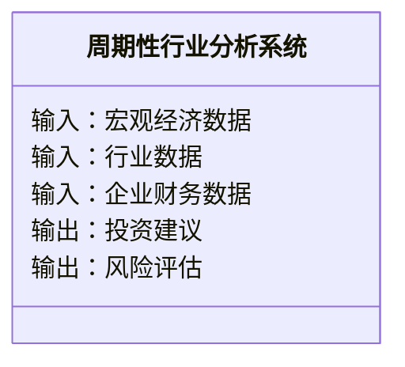

                 


# 巴菲特的周期性行业投资技巧：把握时机的艺术

## 关键词：
巴菲特，周期性行业，价值投资，投资策略，财务指标分析

## 摘要：
本文深入探讨巴菲特在周期性行业的投资策略，分析其独特见解和成功经验。通过详细讲解周期性行业的特点、巴菲特的选股标准、投资时机选择以及实际案例分析，帮助读者掌握如何在周期性行业中把握投资机会，实现长期收益。

---

## 第1章：巴菲特投资理念概述

### 1.1 巴菲特的投资哲学

#### 1.1.1 价值投资的定义与核心理念
价值投资是一种以内在价值为导向的投资方法，强调以低于内在价值的价格购买优质资产。巴菲特的哲学是寻找那些具有持续竞争优势、良好管理和合理估值的企业。

#### 1.1.2 巴菲特的投资策略
- **长期持有**：巴菲特倡导长期投资，避免频繁交易，以减少摩擦成本并专注于企业的长期表现。
- **安全边际**：通过购买价格低于内在价值的资产，确保投资的安全性。
- **竞争优势**：投资于具有强大竞争优势的企业，这些企业在市场中能够长期保持领先地位。

#### 1.1.3 巴菲特投资成功的关键因素
- **优质企业**：选择具有强大财务状况和良好管理团队的企业。
- **市场理解**：深刻理解所投资的行业和企业的商业模式。
- **耐心与纪律**：坚持长期投资，避免短期市场波动的干扰。

---

## 第2章：周期性行业的特点与分类

### 2.1 周期性行业的定义

#### 2.1.1 周期性行业的概念
周期性行业是指那些业绩波动较大，受经济周期影响显著的行业。这些行业的收入和利润在经济扩张和收缩期间波动较大。

#### 2.1.2 周期性行业的分类
周期性行业可以分为以下几类：
- **强周期性行业**：如制造业、能源和材料行业，受经济周期影响较大。
- **弱周期性行业**：如部分消费品行业，波动较小但仍然受到经济周期的影响。

#### 2.1.3 周期性行业的波动规律
周期性行业的波动通常与宏观经济指标密切相关，如GDP增长率、利率和消费者信心等。

---

## 第3章：周期性行业的财务指标分析

### 3.1 财务指标的重要性

#### 3.1.1 营业收入与利润分析
- **营业收入**：反映企业的销售能力，是评估企业规模和市场地位的重要指标。
- **净利润**：衡量企业的盈利能力，净利润率高的企业更具竞争力。

#### 3.1.2 资产负债表分析
- **资产负债率**：衡量企业的财务杠杆，资产负债率过高的企业可能面临较大的财务风险。
- **流动比率**：评估企业的短期偿债能力，流动比率过低可能表明企业面临流动性风险。

#### 3.1.3 现金流量表分析
- **经营活动现金流**：反映企业从核心业务中产生的现金流，是企业财务健康的重要指标。
- **投资活动现金流**：显示企业在固定资产和股权投资上的现金流出情况。

### 3.2 关键财务指标的计算与应用

#### 3.2.1 市盈率（P/E）的计算与应用
市盈率 = 股价 / 每股收益（EPS）

- **应用**：市盈率用于衡量股票的相对估值，低市盈率可能意味着低估，而高市盈率可能意味着高风险。

#### 3.2.2 市净率（P/B）的计算与应用
市净率 = 股价 / 每股净资产（BPS）

- **应用**：市净率用于评估股票相对于其账面价值的估值，通常用于评估银行和制造业等行业的股票。

#### 3.2.3 股东权益回报率（ROE）的计算与应用
ROE = 净利润 / 股东权益

- **应用**：ROE衡量企业使用股东资金的效率，高ROE通常意味着企业具有较强的盈利能力。

---

## 第4章：巴菲特的选股标准

### 4.1 选股的核心标准

#### 4.1.1 高质量的公司基本面
- **稳定的财务状况**：企业应具有较强的资产负债表，避免高负债和低现金流。
- **持续的盈利能力**：企业应具备稳定的盈利能力，避免依赖周期性波动。

#### 4.1.2 可持续的竞争优势
- **护城河**：企业应具备独特的竞争优势，如专利、品牌、技术或成本优势。
- **市场地位**：企业在市场中应占据领先地位，具有定价权和客户忠诚度。

#### 4.1.3 合理的估值与价格
- **估值指标**：企业应具有合理的市盈率、市净率和ROE等估值指标。
- **安全边际**：购买价格应低于企业的内在价值，确保投资的安全性。

---

## 第5章：周期性行业的投资策略

### 5.1 投资周期性行业的基本策略

#### 5.1.1 选择周期性行业的时机
- **经济周期分析**：在经济复苏和扩张阶段投资周期性行业，避免在衰退阶段进入。
- **行业周期分析**：选择那些在周期底部具有估值优势的行业和企业。

#### 5.1.2 风险控制与仓位管理
- **分散投资**：通过投资多个周期性行业分散风险，避免过度集中。
- **止损策略**：设定止损点，避免重大亏损。

#### 5.1.3 长期持有与价值发现
- **长期投资**：周期性行业的波动性较大，但长期持有优质企业能够获得超额收益。
- **价值发现**：寻找那些在周期底部被低估的企业，等待周期反转时的增值。

---

## 第6章：周期性行业的市场分析

### 6.1 宏观经济对周期性行业的影响

#### 6.1.1 经济周期与行业波动
- **经济扩张**：需求增加，企业盈利上升。
- **经济衰退**：需求下降，企业盈利下滑。

#### 6.1.2 利率政策对行业的影响
- **低利率环境**：降低企业的融资成本，促进投资和消费。
- **高利率环境**：增加企业的融资成本，抑制投资和消费。

#### 6.1.3 汇率变动对行业的影响
- **本币贬值**：出口型企业受益于价格竞争力的提升。
- **本币升值**：进口型企业面临成本增加的压力。

---

## 第7章：系统分析与架构设计

### 7.1 投资模型的设计

#### 7.1.1 系统功能设计（领域模型）


#### 7.1.2 系统架构设计
```mermaid
rectangle 巴菲特投资系统 {
    class 投资决策模块 {
        输入：宏观经济数据
        输入：行业数据
        输入：企业财务数据
        输出：投资建议
    }
    class 风险控制模块 {
        输入：投资建议
        输出：风险评估
    }
    class 系统监控模块 {
        输入：市场变化
        输入：企业变化
        输出：系统调整建议
    }
}
```

---

## 第8章：项目实战

### 8.1 环境安装

#### 8.1.1 Python环境安装
- 安装Python 3.x
- 安装必要的库：pandas、numpy、scipy

#### 8.1.2 数据获取
- 从金融数据平台获取周期性行业的财务数据和宏观经济数据。

### 8.2 系统核心实现

#### 8.2.1 数据处理代码
```python
import pandas as pd
import numpy as np

# 加载数据
df = pd.read_csv('周期性行业数据.csv')

# 计算市盈率
df['市盈率'] = df['股价'] / df['每股收益']

# 计算市净率
df['市净率'] = df['股价'] / df['每股净资产']

# 计算ROE
df['ROE'] = df['净利润'] / df['股东权益']
```

#### 8.2.2 投资决策逻辑
```python
def 巴菲特选股策略(数据):
    优质企业 = 数据[数据['市盈率'] < 数据['行业平均市盈率']] 
    优质企业 = 优质企业[优质企业['ROE'] > 数据['行业平均ROE']]
    return 优质企业
```

---

## 第9章：总结与展望

### 9.1 总结
本文系统地分析了巴菲特在周期性行业的投资策略，从选股标准、财务指标分析到投资时机选择，提供了全面的指导。通过实际案例和系统设计，帮助投资者在周期性行业中把握投资机会，实现长期收益。

### 9.2 投资建议
- **长期投资**：坚持长期价值投资，避免短期波动的干扰。
- **分散投资**：通过投资多个行业分散风险，降低整体投资的波动性。
- **持续学习**：关注宏观经济和行业动态，不断提升自身的投资能力。

### 9.3 展望
随着经济全球化和金融市场的不断发展，周期性行业的投资机会和挑战将更加复杂。投资者需要不断学习和适应，利用先进的工具和技术，提升投资决策的科学性和准确性。未来，巴菲特的投资理念将继续为投资者提供宝贵的指导。

---

通过本文的系统分析和实战指导，读者可以更好地理解巴菲特的周期性行业投资技巧，并在实际投资中灵活运用这些策略，实现稳健的投资回报。

