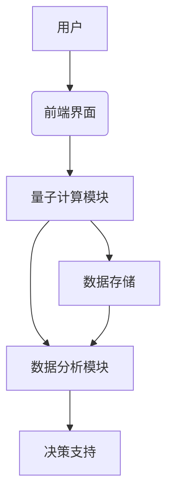
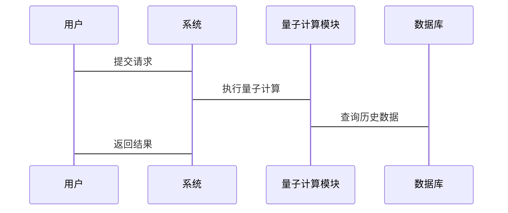

                 


# 巴菲特的周期性行业投资：量子技术在传统产业中的应用

## 关键词：巴菲特投资，周期性行业，量子技术，量子计算，传统行业应用

## 摘要：本文深入探讨了巴菲特投资周期性行业的独特理念，并结合量子技术在制造业、能源和金融等传统行业中的实际应用，分析了量子技术如何优化行业效率、降低成本，并为投资者提供新的视角和策略。通过量子技术的应用，传统产业的周期性波动将被更精准地预测和管理，从而帮助投资者做出更明智的投资决策。

---

# 第一部分 巴菲特投资理念与周期性行业分析

## 第1章 巴菲特投资理念概述

### 1.1 巴菲特投资哲学

#### 1.1.1 价值投资的核心理念

巴菲特的价值投资理念强调购买具有内在价值的公司，并长期持有。他认为市场的短期波动是噪音，而企业的内在价值是基于其未来现金流的折现值。以下是价值投资的核心要素：

- **长期视角**：投资不是短期交易，而是寻找能够持续创造价值的企业。
- **安全边际**：买入价格低于内在价值，以降低风险并确保利润空间。
- **竞争优势**：寻找具有强大护城河的企业，这些企业在市场上具有竞争优势，能够长期保持高利润率。

#### 1.1.2 安全边际的概念与应用

安全边际是巴菲特投资策略中的重要组成部分。它是指买入价格与企业内在价值之间的差距。通过建立安全边际，投资者可以在市场波动中保护自己的投资不受损失。

公式：
$$
\text{安全边际} = \text{内在价值} - \text{买入价格}
$$

#### 1.1.3 巴菲特的长期投资策略

巴菲特强调长期投资，他认为市场的短期波动无法预测，而企业的长期表现才是决定投资收益的关键。他的投资策略包括：

- **集中投资**：将资金集中在少数具有强大竞争优势的企业中。
- **耐心持有**：长期持有优质股票，避免频繁交易。
- **持续学习**：不断研究市场和企业，以识别新的投资机会。

### 1.2 周期性行业的定义与特点

周期性行业是指那些受到经济周期波动显著影响的行业。这些行业的业绩表现与宏观经济状况密切相关，通常在经济繁荣时表现良好，而在经济衰退时表现不佳。

#### 1.2.1 周期性行业的波动规律

周期性行业的波动通常与经济周期的四个阶段（繁荣、衰退、萧条、复苏）密切相关。在繁荣阶段，行业表现良好；在衰退阶段，行业面临压力；在萧条阶段，行业可能陷入亏损；在复苏阶段，行业逐渐恢复。

#### 1.2.2 巴菲特对周期性行业的看法

尽管周期性行业存在波动性，但巴菲特认为这些行业在长期来看仍然具有投资价值。他通常选择那些在周期底部具有强大竞争优势的企业，并在市场低迷时买入，以获得更高的安全边际。

### 1.3 巴菲特投资周期性行业的成功案例

#### 1.3.1 巴菲特在银行业与保险业的投资

巴菲特在银行业和保险业的投资是其周期性投资策略的经典案例。例如，他在2008年金融危机期间购买了高盛的股票，利用市场的恐慌情绪，以低于内在价值的价格买入，最终获得丰厚的回报。

#### 1.3.2 巴菲特在能源行业的布局

巴菲特对能源行业的投资也体现了其周期性投资策略。他选择那些在能源周期底部具有强大竞争优势的企业，例如伯克希尔哈撒韦公司对能源公司的投资。

---

## 第2章 量子技术的基础与应用潜力

### 2.1 量子技术的基本原理

#### 2.1.1 量子叠加原理

量子叠加是量子力学的核心原理之一，描述了量子系统处于多个状态的叠加态。例如，一个量子比特（qubit）可以同时处于0和1的状态，这为并行计算提供了理论基础。

公式：
$$
|\psi\rangle = \alpha|0\rangle + \beta|1\rangle
$$

#### 2.1.2 量子纠缠现象

量子纠缠是指两个或多个量子系统之间的关联性，无论距离多远，测量其中一个系统会立即影响另一个系统。这种现象为量子通信和量子计算提供了理论基础。

#### 2.1.3 量子测量的特性

量子测量会破坏量子系统的叠加态，导致系统坍缩到确定的状态。这一特性使得量子技术在信息处理和加密中具有独特优势。

### 2.2 量子计算与量子通信

#### 2.2.1 量子计算的基本原理

量子计算机利用量子叠加和量子纠缠进行并行计算，能够在某些特定问题上远超经典计算机的性能。例如，量子计算机可以快速分解大质数，这对密码学具有重要意义。

#### 2.2.2 量子通信的实现方式

量子通信利用量子纠缠进行信息传输，具有抗干扰和抗窃听的特性。量子通信技术在信息安全领域具有广阔的应用前景。

#### 2.2.3 量子技术的潜在应用领域

量子技术在多个领域具有广泛应用潜力，包括：

- **计算**：解决复杂的优化问题。
- **通信**：实现安全的信息传输。
- **传感**：提高测量精度和灵敏度。

### 2.3 量子技术在传统产业中的应用潜力

#### 2.3.1 制造业的量子优化

量子技术可以帮助制造业优化生产流程、降低能耗和成本。例如，量子算法可以用于优化供应链管理，提高生产效率。

#### 2.3.2 能源行业的量子解决方案

量子技术在能源行业的应用包括优化能源调度、提高能源利用效率和预测能源需求。例如，量子计算可以用于优化可再生能源的整合。

#### 2.3.3 金融领域的量子应用

量子技术在金融领域的应用包括风险评估、投资组合优化和市场预测。例如，量子算法可以用于优化投资组合，降低风险。

---

## 第3章 量子技术在周期性行业中的应用

### 3.1 量子技术在制造业中的应用

#### 3.1.1 制造业的周期性特点

制造业是一个典型的周期性行业，其表现受到经济周期的影响。在经济繁荣时期，制造业需求旺盛；在经济衰退时期，制造业面临需求下降和产能过剩的问题。

#### 3.1.2 量子计算在制造业中的应用案例

量子计算可以帮助制造业优化生产流程、降低能耗和成本。例如，量子算法可以用于优化供应链管理，提高生产效率。

#### 3.1.3 量子技术对制造业周期性的影响

量子技术可以帮助制造业更准确地预测市场趋势和需求变化，从而更好地应对周期性波动。例如，量子预测模型可以用于预测市场需求，优化生产计划。

### 3.2 量子技术在能源行业中的应用

#### 3.2.1 能源行业的周期性特点

能源行业也是一个周期性行业，其表现受到经济周期和能源价格波动的影响。在经济繁荣时期，能源需求旺盛；在经济衰退时期，能源需求下降。

#### 3.2.2 量子计算在能源优化中的应用

量子计算可以帮助能源行业优化能源调度、提高能源利用效率和预测能源需求。例如，量子算法可以用于优化可再生能源的整合，提高能源系统的稳定性。

#### 3.2.3 量子技术对能源周期性的影响

量子技术可以帮助能源行业更准确地预测能源需求和价格波动，从而更好地应对周期性变化。例如，量子预测模型可以用于预测能源价格，优化投资决策。

### 3.3 量子技术在金融行业中的应用

#### 3.3.1 金融行业的周期性特点

金融行业是一个高度周期性行业，其表现受到经济周期和市场情绪的影响。在经济繁荣时期，金融市场活跃；在经济衰退时期，金融市场波动加剧。

#### 3.3.2 量子计算在金融优化中的应用

量子计算可以帮助金融行业优化投资组合、降低风险和提高市场预测能力。例如，量子算法可以用于优化投资组合，降低风险。

#### 3.3.3 量子技术对金融周期性的影响

量子技术可以帮助金融行业更准确地预测市场趋势和风险变化，从而更好地应对周期性波动。例如，量子预测模型可以用于预测市场趋势，优化投资策略。

---

## 第4章 量子技术在周期性行业中的系统分析与架构设计

### 4.1 系统架构设计

量子技术在周期性行业中的应用需要构建一个高效的系统架构。以下是一个可能的系统架构设计：



### 4.2 系统功能设计

- **数据采集**：从传感器、数据库等来源采集数据。
- **量子计算**：利用量子计算机进行数据分析和优化。
- **数据存储**：存储量子计算结果和历史数据。
- **数据分析**：对数据进行处理和分析，生成报告。
- **决策支持**：基于分析结果，提供决策支持。

### 4.3 系统接口设计

- **输入接口**：接收数据和用户请求。
- **输出接口**：提供分析结果和决策建议。
- **通信接口**：与其他系统进行数据交换。

### 4.4 系统交互设计



---

## 第5章 量子技术在周期性行业中的项目实战

### 5.1 环境安装

#### 5.1.1 安装量子计算平台

安装量子计算平台需要以下步骤：

1. 安装必要的软件和硬件。
2. 配置量子计算模块。
3. 测试量子计算功能。

### 5.2 核心实现

#### 5.2.1 量子算法实现

以下是量子算法的Python代码示例：

```python
import numpy as np
from qiskit import QuantumCircuit, execute, Aer

def quantum_algorithm(n):
    circuit = QuantumCircuit(n)
    circuit.h(range(n))
    circuit.measure(range(n), range(n))
    backend = Aer.get_backend('qasm_simulator')
    result = execute(circuit, backend).result()
    return result.get_counts()
```

#### 5.2.2 数据分析实现

以下是数据分析的Python代码示例：

```python
import pandas as pd
from sklearn import linear_model

def data_analysis(data):
    model = linear_model.LinearRegression()
    model.fit(data[['x']], data['y'])
    return model.predict(data[['x']])
```

### 5.3 案例分析

#### 5.3.1 制造业案例

在制造业中，量子技术可以帮助优化供应链管理。例如，利用量子算法优化供应链中的物流路径，降低运输成本。

#### 5.3.2 能源案例

在能源行业中，量子技术可以帮助优化能源调度。例如，利用量子算法优化能源分配，提高能源利用效率。

#### 5.3.3 金融案例

在金融行业中，量子技术可以帮助优化投资组合。例如，利用量子算法优化投资组合，降低风险。

### 5.4 项目小结

通过项目实战，我们可以看到量子技术在周期性行业中的应用潜力。量子技术可以帮助企业优化生产流程、降低成本和提高效率，从而在周期性波动中保持竞争优势。

---

## 第6章 量子技术在周期性行业中的最佳实践与未来展望

### 6.1 最佳实践

#### 6.1.1 技术选择

选择适合的量子技术是成功应用的关键。需要根据具体行业特点和需求选择合适的技术方案。

#### 6.1.2 团队建设

构建一支专业的团队是成功应用量子技术的关键。需要具备量子计算、数据分析和行业知识的复合型人才。

#### 6.1.3 风险管理

在应用量子技术的过程中，需要重视风险管理。需要制定有效的风险管理策略，确保系统的稳定性和安全性。

### 6.2 未来展望

随着量子技术的不断发展，其在周期性行业中的应用前景广阔。未来，量子技术将帮助企业在周期性波动中更好地应对挑战，抓住机遇。

---

## 第7章 总结

本文探讨了巴菲特投资周期性行业的理念，并结合量子技术在制造业、能源和金融等传统行业中的应用，分析了量子技术如何优化行业效率、降低成本，并为投资者提供新的视角和策略。通过量子技术的应用，传统产业的周期性波动将被更精准地预测和管理，从而帮助投资者做出更明智的投资决策。

---

## 参考文献

1. 巴菲特投资思想的相关书籍和文章。
2. 量子计算和量子通信的技术资料。
3. 相关行业应用案例分析。

--- 

希望这篇文章能满足您的需求！如果需要进一步调整或补充，请随时告诉我。

