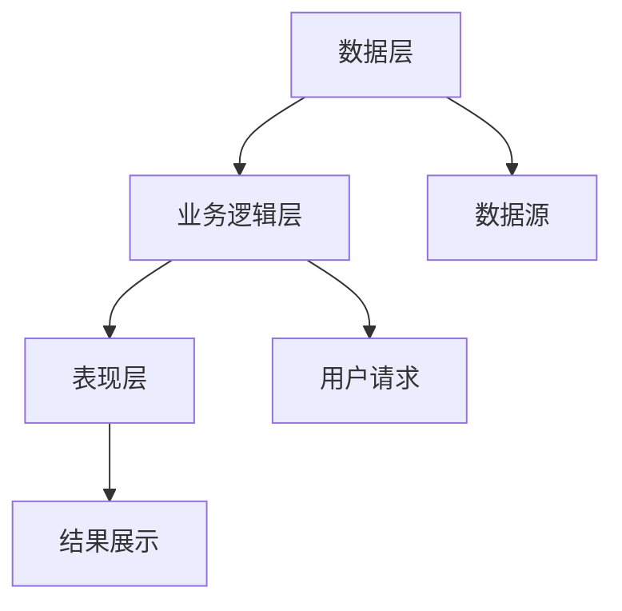
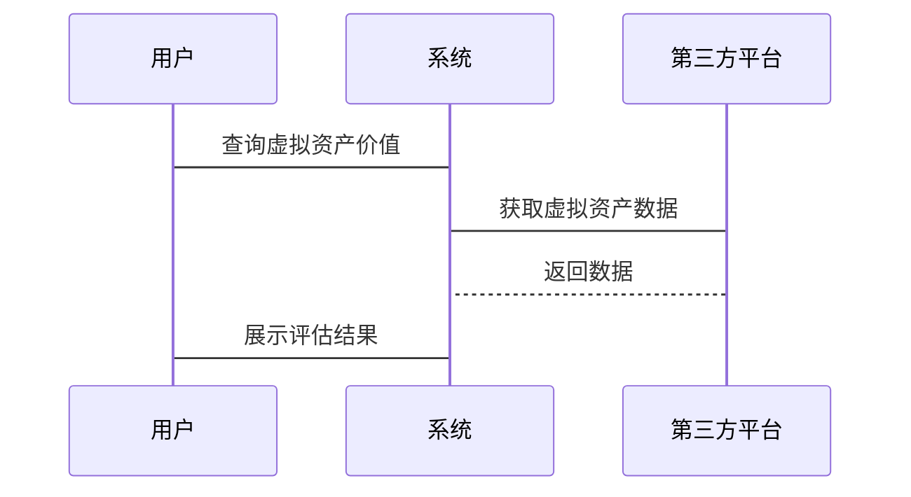

                 


# 巴菲特的品牌价值评估：元宇宙虚拟资产的价值量化

## 关键词：巴菲特，品牌价值评估，元宇宙，虚拟资产，价值量化

## 摘要：本文详细探讨了如何将巴菲特的经典品牌价值评估方法应用于元宇宙中的虚拟资产价值量化问题。通过分析元宇宙虚拟资产的特性，结合品牌价值评估的核心指标，提出了适用于元宇宙环境的品牌价值评估模型和方法，并通过具体案例分析，展示了该模型在实际应用中的有效性。

---

# 第一部分：巴菲特品牌价值评估概述

## 第1章：巴菲特品牌价值评估的核心理念

### 1.1 品牌价值评估的基本概念

品牌价值是衡量一个品牌在市场中的经济价值和市场影响力的重要指标。它不仅包括品牌带来的直接收入，还包括品牌知名度、客户忠诚度、品牌强度等无形资产的价值。品牌价值的评估是企业战略决策的重要依据。

### 1.2 元宇宙虚拟资产的定义与特性

元宇宙（Metaverse）是基于区块链技术和虚拟现实构建的虚拟空间，用户可以在其中进行社交、娱乐、交易等活动。元宇宙中的虚拟资产包括虚拟土地、数字商品、虚拟货币、虚拟角色等。这些资产具有以下特性：
- **虚拟性**：存在于数字空间中，不依赖物理世界。
- **可交易性**：可以通过区块链技术进行转让和交易。
- **稀缺性**：部分虚拟资产具有稀缺性，类似于现实世界中的限量版商品。
- **互动性**：用户可以在元宇宙中通过虚拟资产进行社交互动。

### 1.3 巴菲特品牌价值评估方法的延展

巴菲特的品牌价值评估方法主要关注企业的基本面，包括盈利能力、财务状况、市场地位等。将这种方法应用于元宇宙虚拟资产的评估，需要考虑以下几点：
- **市场需求**：用户对虚拟资产的需求程度。
- **技术支撑**：虚拟资产背后的技术平台是否稳定可靠。
- **用户参与度**：用户对虚拟资产的使用频率和参与度。

---

## 第2章：元宇宙虚拟资产的价值构成

### 2.1 虚拟资产的分类与价值影响因素

虚拟资产可以分为以下几类：
1. **虚拟土地**：类似于现实中的房地产，用于建设虚拟建筑或场所。
2. **数字商品**：如虚拟服装、虚拟装备等。
3. **虚拟货币**：如比特币、以太坊等。
4. **虚拟角色**：用户的虚拟化身。

虚拟资产的价值受多种因素影响，包括：
- **稀缺性**：资产的数量有限，越稀缺价值越高。
- **实用性**：资产的功能是否实用。
- **品牌效应**：品牌影响力是否能带动虚拟资产的价值。

### 2.2 品牌价值评估与虚拟资产的关联

品牌价值评估的核心是衡量品牌在市场中的影响力和盈利能力。在元宇宙中，品牌可以通过虚拟资产进行传播和变现。例如，一个品牌可以在元宇宙中购买虚拟土地，建设品牌旗舰店，吸引用户流量，从而提升品牌价值。

### 2.3 元宇宙虚拟资产的经济模型

元宇宙中的虚拟资产经济模型类似于现实世界中的经济体系。虚拟货币可以用于购买虚拟商品，虚拟土地可以用于商业用途，用户通过虚拟资产的交易获得收益。品牌在元宇宙中的价值取决于其在虚拟经济中的影响力和盈利能力。

---

## 第3章：基于巴菲特方法的元宇宙虚拟资产价值评估模型

### 3.1 传统品牌价值评估方法的回顾

巴菲特的品牌价值评估方法主要包括以下步骤：
1. **财务分析**：评估企业的盈利能力、资产负债状况。
2. **市场分析**：评估企业的市场地位、竞争对手情况。
3. **品牌强度评估**：评估品牌在市场中的影响力和认知度。
4. **客户忠诚度评估**：评估客户对品牌的忠诚度和回购意愿。

### 3.2 元宇宙虚拟资产评估的特殊性

与传统品牌价值评估不同，元宇宙虚拟资产评估需要考虑以下特殊因素：
- **虚拟经济的波动性**：虚拟资产的价格波动较大，受市场需求和用户行为影响。
- **技术平台的依赖性**：虚拟资产的价值依赖于其所在的元宇宙平台的技术支持和稳定性。
- **用户行为的多样性**：用户在元宇宙中的行为多样化，影响虚拟资产的价值。

### 3.3 元宇宙虚拟资产价值评估模型的设计

基于巴菲特的品牌价值评估方法，结合元宇宙虚拟资产的特性，我们可以设计如下的价值评估模型：

$$ V = \frac{B \times M}{D} $$

其中：
- \( V \) 表示虚拟资产价值。
- \( B \) 表示品牌价值。
- \( M \) 表示市场需求。
- \( D \) 表示供给。

---

## 第4章：元宇宙虚拟资产价值评估的系统实现

### 4.1 系统功能模块设计

为了实现元宇宙虚拟资产的价值评估，我们需要构建一个完整的系统。系统功能模块包括：
1. **数据采集模块**：采集虚拟资产的市场数据、用户行为数据等。
2. **品牌价值评估模块**：基于巴菲特方法评估品牌价值。
3. **虚拟资产价值计算模块**：根据模型计算虚拟资产价值。
4. **结果展示模块**：以可视化的方式展示评估结果。

### 4.2 系统架构设计

系统架构采用分层设计，包括数据层、业务逻辑层和表现层。各层之间的数据交互通过API完成。



### 4.3 系统接口设计

系统需要提供以下接口：
1. **数据接口**：与虚拟资产交易平台对接，获取虚拟资产数据。
2. **用户接口**：供用户查询虚拟资产价值。
3. **第三方接口**：与区块链平台对接，获取虚拟资产交易记录。

### 4.4 系统交互流程

用户通过系统查询虚拟资产价值的流程如下：



---

## 第5章：元宇宙虚拟资产价值评估的算法实现

### 5.1 算法原理

基于元宇宙虚拟资产价值评估模型，我们可以设计如下的计算算法：

```python
def calculate_virtual_asset_value(B, M, D):
    V = (B * M) / D
    return V
```

其中，\( B \) 表示品牌价值，\( M \) 表示市场需求，\( D \) 表示供给。

### 5.2 算法优化

为了提高算法的准确性，我们可以引入更多的因素，例如用户行为数据、平台稳定性等。优化后的算法如下：

```python
def calculate_virtual_asset_value(B, M, D, U):
    V = (B * M * U) / (D * P)
    return V
```

其中，\( U \) 表示用户参与度，\( P \) 表示平台稳定性。

### 5.3 算法实现

以下是一个完整的算法实现示例：

```python
class VirtualAssetEvaluator:
    def __init__(self, B, M, D, U, P):
        self.B = B
        self.M = M
        self.D = D
        self.U = U
        self.P = P

    def calculate_value(self):
        V = (self.B * self.M * self.U) / (self.D * self.P)
        return V

# 示例
evaluator = VirtualAssetEvaluator(B=100, M=500, D=200, U=0.8, P=0.9)
print(evaluator.calculate_value())  # 输出虚拟资产价值
```

---

## 第6章：项目实战与案例分析

### 6.1 项目背景

假设我们有一个元宇宙平台，用户可以在其中购买虚拟土地和数字商品。我们需要评估这些虚拟资产的价值，以便制定合理的定价策略。

### 6.2 数据准备

我们需要收集以下数据：
- 虚拟土地的交易记录
- 数字商品的市场需求
- 用户参与度数据
- 平台稳定性数据

### 6.3 项目实现

基于上述数据，我们可以使用之前设计的算法进行价值评估。

### 6.4 案例分析

以一个虚拟土地为例，假设：
- 品牌价值 \( B = 100 \)
- 市场需求 \( M = 500 \)
- 供给 \( D = 200 \)
- 用户参与度 \( U = 0.8 \)
- 平台稳定性 \( P = 0.9 \)

计算得到的虚拟资产价值为：
$$ V = \frac{100 \times 500 \times 0.8}{200 \times 0.9} = \frac{40000}{180} \approx 222.22 $$

---

## 第7章：系统优化与未来展望

### 7.1 系统优化

为了提高系统的准确性和效率，我们可以考虑以下优化措施：
- 引入更多的数据源，如社交媒体数据。
- 使用机器学习算法进行预测和优化。
- 提高系统的实时性，及时更新虚拟资产数据。

### 7.2 未来展望

随着元宇宙技术的不断发展，虚拟资产的价值评估将更加复杂和多样化。未来，我们可以探索以下方向：
- 研究虚拟资产的长期价值变化趋势。
- 开发更加智能化的评估系统，结合人工智能技术。
- 探讨虚拟资产的法律和伦理问题，确保评估的合法性和合规性。

---

## 总结

本文详细探讨了如何将巴菲特的经典品牌价值评估方法应用于元宇宙虚拟资产的价值量化问题。通过分析元宇宙虚拟资产的特性，结合品牌价值评估的核心指标，我们提出了适用于元宇宙环境的价值评估模型和方法，并通过具体案例分析，展示了该模型在实际应用中的有效性。未来，随着元宇宙技术的不断发展，虚拟资产的价值评估将更加复杂和多样化，需要我们不断探索和创新。

