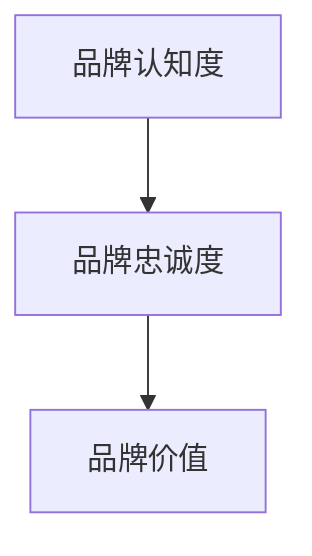
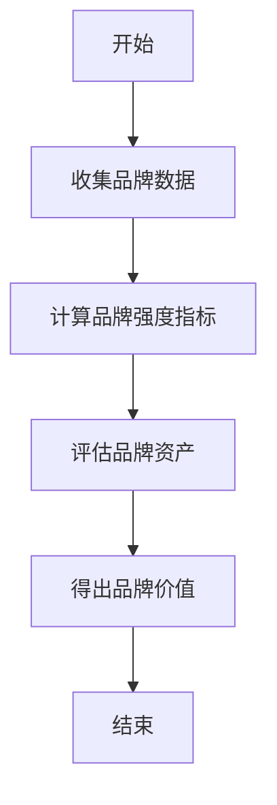
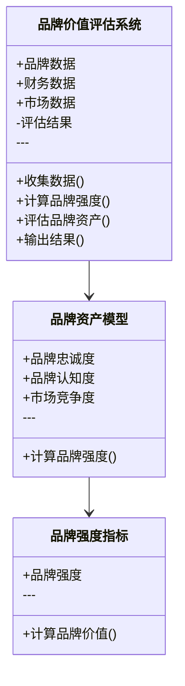
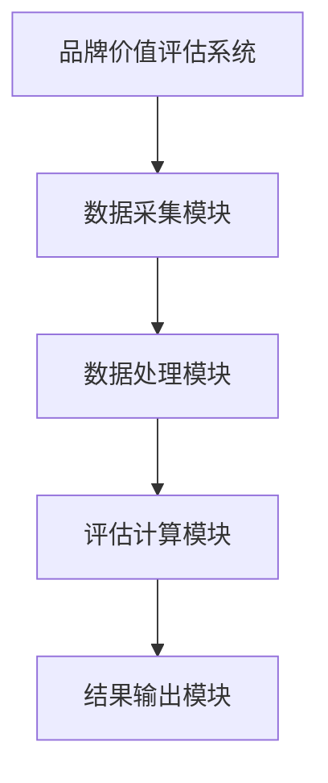
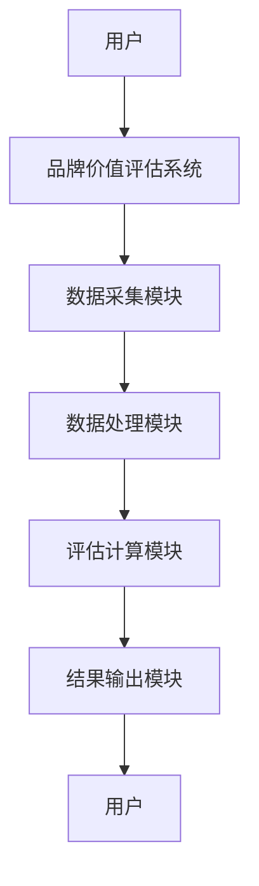

                 


# 巴菲特的品牌价值评估：无形资产的重要性

## 关键词：
品牌价值评估，无形资产，巴菲特，投资理念，企业价值，品牌资产，品牌强度，品牌忠诚度，品牌认知度

## 摘要：
本文探讨了巴菲特如何通过品牌价值评估来评估企业无形资产的重要性。从品牌价值的核心概念到具体的算法原理，再到系统设计和实际案例分析，深入剖析了无形资产对企业长期价值的影响。通过详细讲解品牌价值的构成要素、评估方法和系统架构，帮助读者理解如何在投资决策中有效评估品牌价值，从而做出更明智的投资选择。

---

## 第一部分：品牌价值评估的背景与重要性

### 第1章：品牌价值评估的背景与重要性

#### 1.1 品牌价值评估的背景

品牌价值评估在现代企业价值评估中占据着越来越重要的地位。巴菲特的投资理念强调长期价值，而品牌价值作为企业无形资产的重要组成部分，直接影响企业的市场竞争力和长期盈利能力。随着市场竞争的加剧，品牌价值的评估不仅是企业自身价值管理的关键，也是投资者评估企业潜在价值的重要指标。

#### 1.2 品牌价值评估的核心概念

##### 1.2.1 品牌价值的定义与构成要素

品牌价值是指消费者对企业品牌认知、情感和忠诚度的综合反映，通常表现为品牌在市场上的溢价能力。品牌价值的构成要素主要包括品牌认知度、品牌忠诚度和品牌声誉。

| 要素 | 定义 | 影响因素 |
|------|------|----------|
| 品牌认知度 | 消费者对品牌的识别和记忆程度 | 市场推广、广告投入、产品创新 |
| 品牌忠诚度 | 消费者对品牌的偏好和重复购买意愿 | 产品质量、服务体验、品牌文化 |
| 品牌声誉 | 品牌在市场上的信誉和形象 | 历史表现、媒体报道、社会责任 |

##### 1.2.2 无形资产的分类与特征

无形资产主要包括知识资本、组织资本和关系资本三类。

- 知识资本：企业内部知识储备和创新能力，包括专利、商标、专有技术等。
- 组织资本：企业的组织结构和管理能力，包括员工素质、团队协作、制度流程。
- 关系资本：企业与客户、供应商和其他利益相关者的关系网络。

##### 1.2.3 品牌价值与企业财务表现的关系

品牌价值与企业财务表现密切相关。一个强大的品牌可以带来更高的销售额、更高的定价能力和更强的市场抗风险能力。品牌价值通常通过品牌资产、客户忠诚度和市场影响力三个维度来衡量。

---

## 第二部分：品牌价值评估的核心概念与联系

### 第2章：品牌价值与无形资产的核心概念

#### 2.1 品牌价值的构成要素

品牌价值的构成要素包括品牌认知度、品牌忠诚度和品牌声誉。这三个要素相互关联，共同影响品牌的价值。

##### 品牌认知度与品牌忠诚度的关系

品牌认知度是品牌忠诚度的基础。消费者只有在了解品牌后，才可能产生购买行为并形成品牌忠诚度。以下是品牌认知度与品牌忠诚度的关系示意图：



#### 2.2 无形资产的分类与特征

##### 知识资本与组织资本的对比

知识资本和组织资本是无形资产的重要组成部分。以下是两者的对比：

| 要素 | 知识资本 | 组织资本 |
|------|----------|----------|
| 定义 | 企业的知识储备和创新能力 | 企业的组织结构和管理能力 |
| 形成 | 通过研发、培训等方式 | 通过优化流程、提升管理水平等方式 |
| 评估 | 专利数量、技术领先性 | 员工满意度、管理效率 |

#### 2.3 品牌价值与企业长期竞争优势的关系

品牌价值是企业长期竞争优势的重要来源。强大的品牌价值可以为企业带来更高的客户忠诚度和市场影响力，从而在竞争中占据优势地位。

---

## 第三部分：品牌价值评估的算法原理

### 第3章：品牌价值评估的算法原理

#### 3.1 品牌价值评估的主要方法

##### 品牌资产模型

品牌资产模型是评估品牌价值的重要方法之一。以下是品牌资产模型的流程图：



##### 品牌强度指标

品牌强度指标是品牌资产模型的核心部分，以下是品牌强度指标的公式：

$$ \text{品牌强度} = \frac{\text{品牌忠诚度} + \text{品牌认知度}}{\text{市场竞争度}} $$

##### 品牌价值指数

品牌价值指数是通过品牌强度指标和企业财务数据综合计算得出的：

$$ \text{品牌价值指数} = \text{品牌强度} \times \text{销售收入增长率} $$

#### 3.2 数学模型与公式

##### 品牌价值计算公式

品牌价值的计算公式如下：

$$ \text{品牌价值} = \text{品牌资产} \times \text{销售增长率} $$

##### 示例计算

假设某企业的品牌资产为100万元，销售增长率为20%，则品牌价值为：

$$ \text{品牌价值} = 100 \times 1.2 = 120 \text{万元} $$

---

## 第四部分：系统分析与架构设计

### 第4章：系统分析与架构设计

#### 4.1 问题场景介绍

本文将设计一个品牌价值评估系统，用于帮助企业评估品牌价值。系统将结合品牌资产模型和品牌强度指标，评估企业的品牌价值。

#### 4.2 系统功能设计

##### 领域模型类图

以下是系统功能的领域模型类图：



#### 4.3 系统架构设计

##### 系统架构图

以下是系统的架构图：



#### 4.4 系统接口设计

##### 系统接口设计

系统接口包括数据输入接口和结果输出接口。数据输入接口用于接收品牌数据和财务数据，结果输出接口用于输出评估结果。

#### 4.5 系统交互流程

##### 系统交互流程图

以下是系统的交互流程图：



---

## 第五部分：项目实战

### 第5章：项目实战

#### 5.1 环境配置

##### 安装必要的软件

- 安装Python编程语言
- 安装Pandas和NumPy库
- 安装Mermaid工具

#### 5.2 核心代码实现

##### 品牌价值评估代码

```python
import pandas as pd
import numpy as np

def calculate_brand_value(brand_assets, sales_growth):
    return brand_assets * (1 + sales_growth/100)

# 示例数据
brand_assets = 100  # 单位：万元
sales_growth = 20    # 单位：%

# 计算品牌价值
brand_value = calculate_brand_value(brand_assets, sales_growth)
print(f"品牌价值为：{brand_value}万元")
```

#### 5.3 代码应用解读与分析

##### 代码解读

上述代码定义了一个计算品牌价值的函数，输入品牌资产和销售增长率，输出品牌价值。示例数据中，品牌资产为100万元，销售增长率为20%，计算结果为120万元。

#### 5.4 实际案例分析

##### 案例分析

假设某企业品牌资产为80万元，销售增长率为15%，则品牌价值为：

$$ \text{品牌价值} = 80 \times 1.15 = 92 \text{万元} $$

#### 5.5 项目小结

通过实际案例分析，我们可以看到品牌价值评估的重要性和实用性。合理使用品牌价值评估方法，可以帮助企业更好地管理品牌资产，提升市场竞争力。

---

## 第六部分：最佳实践

### 第6章：最佳实践

#### 6.1 小结

本文详细讲解了巴菲特的品牌价值评估方法，分析了品牌价值与无形资产的关系，介绍了品牌价值评估的算法原理和系统设计，并通过实际案例分析了品牌价值评估的实践应用。

#### 6.2 注意事项

- 品牌价值评估需要结合企业的实际情况，不能一概而论。
- 在评估过程中，要注意数据的准确性和完整性。
- 品牌价值评估结果仅供参考，需结合其他因素综合分析。

#### 6.3 拓展阅读

- 《巴菲特投资策略》
- 《品牌管理》
- 《无形资产评估》

---

## 结语

通过本文的分析，我们可以看到品牌价值评估在企业价值管理中的重要性。巴菲特的投资理念强调长期价值，而品牌价值作为企业无形资产的重要组成部分，是企业长期竞争优势的重要来源。合理评估品牌价值，可以帮助投资者和企业管理者做出更明智的决策。

