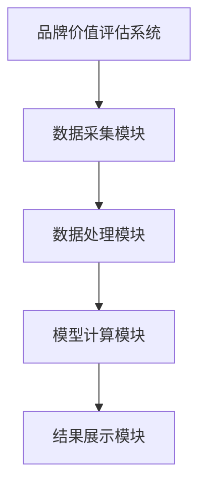
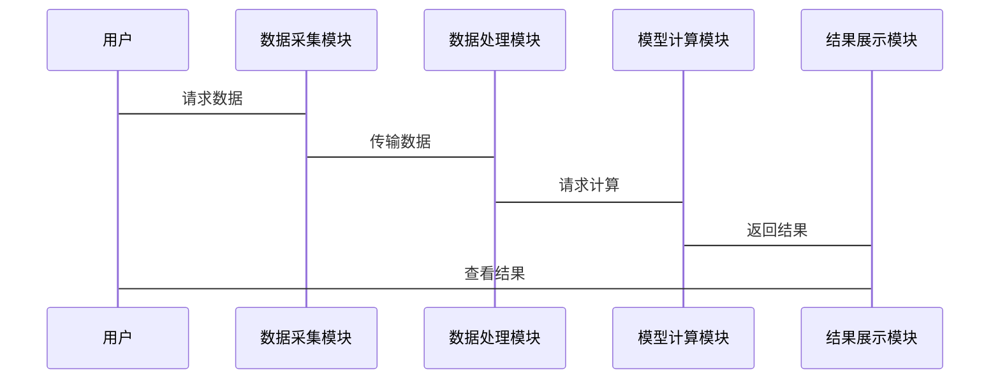

                 


# 巴菲特的品牌价值评估：社交媒体影响力的量化

> 关键词：品牌价值评估，社交媒体影响力，巴菲特，价值投资，影响力量化，品牌资产，社交媒体分析，品牌策略

> 摘要：本文探讨了如何将社交媒体影响力量化为品牌价值的重要组成部分，借鉴巴菲特的价值投资理念，提出了基于社交媒体数据的品牌价值评估模型。通过分析社交媒体的关键指标，构建了数学模型，并结合实际案例展示了如何通过社交媒体影响力来评估和优化品牌价值。

---

# 第1章 巴菲特的品牌价值评估概述

## 1.1 巴菲特的价值投资哲学

### 1.1.1 价值投资的核心理念
价值投资的核心理念是寻找市场低估的资产，通过深入分析企业的基本面，评估其内在价值。巴菲特的价值投资策略强调长期持有优质资产，关注企业的盈利能力、财务健康状况以及行业地位。

### 1.1.2 巴菲特的品牌价值评估方法
巴菲特在评估企业时，不仅关注财务数据，还非常重视品牌的市场地位和客户忠诚度。他认为品牌价值是企业长期盈利能力的重要组成部分，品牌影响力可以直接影响企业的市场表现。

### 1.1.3 社会媒体影响力与品牌价值的关系
随着社交媒体的兴起，品牌与消费者之间的互动变得更加频繁和紧密。社交媒体上的用户行为数据（如点赞、评论、分享）能够反映品牌的市场影响力，这些数据为品牌价值的量化提供了新的维度。

---

## 1.2 社会媒体的兴起与品牌价值评估

### 1.2.1 社会媒体的兴起及其对品牌的影响
社交媒体的兴起改变了企业和消费者之间的互动方式。通过社交媒体，企业可以实时了解消费者对品牌的看法，快速响应市场变化，并通过内容营销提升品牌影响力。

### 1.2.2 品牌价值评估的演变
传统的品牌价值评估主要依赖于企业的财务数据和市场地位。随着社交媒体的普及，品牌价值的评估逐渐引入了社交媒体数据，形成了更加全面的评估体系。

### 1.2.3 社会媒体影响力对品牌价值的贡献
社交媒体影响力可以直接反映品牌的市场关注度和用户参与度。通过分析社交媒体上的用户行为数据，可以量化品牌在市场中的影响力，并将其与品牌价值联系起来。

---

# 第2章 品牌价值与社交媒体影响力的核心概念

## 2.1 品牌价值的核心要素

### 2.1.1 品牌知名度
品牌知名度是品牌被消费者认知和记住的程度。高知名度的品牌更容易吸引消费者，从而提升市场占有率。

### 2.1.2 品牌忠诚度
品牌忠诚度反映了消费者对品牌的偏好程度。忠诚的消费者更愿意选择该品牌的产品或服务，从而为企业带来稳定的收入。

### 2.1.3 品牌形象与声誉
品牌形象是消费者对品牌的整体感知，包括品牌的核心价值、产品品质以及社会责任等方面。良好的品牌形象能够提升品牌价值。

---

## 2.2 社会媒体影响力的关键指标

### 2.2.1 粉丝数量与增长速度
粉丝数量是衡量品牌在社交媒体上影响力的重要指标。粉丝数量越多，品牌在社交媒体上的覆盖范围越广。

### 2.2.2 用户互动频率
用户互动频率包括点赞、评论、分享等行为。高互动频率表明品牌内容能够引起用户的共鸣，增强用户参与度。

### 2.2.3 内容传播广度
内容传播广度反映了品牌内容的扩散能力。广泛传播的内容能够快速提升品牌的市场影响力。

---

## 2.3 品牌价值与社交媒体影响力的关系

### 2.3.1 正向关系的验证
通过分析社交媒体数据，可以发现品牌影响力与品牌价值之间存在显著的正相关关系。社交媒体上的高影响力通常意味着品牌在市场上的认可度更高。

### 2.3.2 社会媒体影响力对品牌价值的量化影响
通过构建数学模型，可以将社交媒体影响力量化为具体的数值，并将其作为品牌价值评估的重要组成部分。

---

# 第3章 品牌价值评估的数学模型

## 3.1 品牌价值评估的指标体系

### 3.1.1 品牌价值的核心指标
品牌价值的核心指标包括品牌知名度、品牌忠诚度、品牌形象等。

### 3.1.2 社会媒体影响力的权重分配
在品牌价值评估中，社交媒体影响力的权重通常较高，因为社交媒体数据能够反映品牌的市场关注度和用户参与度。

---

## 3.2 社会媒体影响力量化模型

### 3.2.1 模型的构建与假设
通过分析社交媒体数据，构建一个能够量化社交媒体影响力的品牌价值评估模型。假设社交媒体影响力对品牌价值的影响是线性的。

### 3.2.2 模型的数学表达式
$$ V = \sum_{i=1}^{n} w_i \cdot S_i $$
其中，$V$ 表示品牌价值，$w_i$ 表示第 $i$ 个社交媒体指标的权重，$S_i$ 表示第 $i$ 个社交媒体指标的数值。

---

## 3.3 算法原理与流程

### 3.3.1 数据收集与预处理
通过社交媒体API获取品牌相关的数据，包括粉丝数量、互动频率、内容传播广度等。

### 3.3.2 指标权重的计算
根据品牌价值的核心指标，计算每个指标的权重。

### 3.3.3 品牌价值的计算
将社交媒体指标的数值乘以对应的权重，求和得到品牌价值。

---

# 第4章 品牌价值评估的系统架构设计

## 4.1 问题场景介绍
本文构建了一个基于社交媒体数据的品牌价值评估系统，用于帮助企业量化社交媒体影响力对品牌价值的贡献。

---

## 4.2 系统功能设计

### 4.2.1 数据采集模块
负责从社交媒体平台获取品牌相关的数据，包括粉丝数量、互动频率、内容传播广度等。

### 4.2.2 数据处理模块
对采集到的数据进行清洗和预处理，确保数据的准确性和完整性。

### 4.2.3 模型计算模块
根据预处理后的数据，计算品牌价值。

### 4.2.4 结果展示模块
将计算结果以可视化的方式展示，方便企业理解和应用。

---

## 4.3 系统架构设计

### 4.3.1 系统架构图
使用mermaid绘制系统架构图，展示系统的各个模块及其交互关系。



---

## 4.4 系统接口设计

### 4.4.1 API接口设计
通过API接口获取社交媒体数据，确保系统的可扩展性。

---

## 4.5 系统交互流程

### 4.5.1 交互流程图
使用mermaid绘制系统交互流程图，展示用户与系统的交互过程。



---

# 第5章 项目实战：基于社交媒体的品牌价值评估

## 5.1 项目背景

### 5.1.1 项目目标
通过分析社交媒体数据，量化社交媒体影响力对品牌价值的贡献。

### 5.1.2 项目范围
选择一家企业，分析其在社交媒体上的表现，计算其品牌价值。

---

## 5.2 项目实施

### 5.2.1 环境安装
安装必要的工具和库，包括Python、Pandas、NumPy等。

### 5.2.2 系统核心实现源代码

#### 1. 数据采集模块
```python
import requests
import json

def get_social_data(business_id):
    url = f"https://api.social-media.com/{business_id}"
    response = requests.get(url)
    return json.loads(response.text)
```

#### 2. 数据处理模块
```python
import pandas as pd

def preprocess_data(data):
    df = pd.DataFrame(data)
    df.dropna(inplace=True)
    return df
```

#### 3. 模型计算模块
```python
def calculate_brand_value(data):
    weights = [0.5, 0.3, 0.2]
    brand_value = 0
    for i in range(len(weights)):
        brand_value += weights[i] * data[i]
    return brand_value
```

---

## 5.3 实际案例分析

### 5.3.1 案例分析
以星巴克为例，分析其社交媒体数据，计算品牌价值。

### 5.3.2 数据分析与结果解读
通过分析星巴克在社交媒体上的表现，得出其品牌价值。

---

## 5.4 项目小结

### 5.4.1 项目成果
通过本项目，我们成功构建了一个基于社交媒体数据的品牌价值评估系统。

### 5.4.2 经验总结
社交媒体数据的获取和处理是关键，同时模型的权重分配也需要根据实际情况进行调整。

---

# 第6章 总结与展望

## 6.1 总结
本文通过分析社交媒体数据，构建了一个品牌价值评估模型，量化了社交媒体影响力对品牌价值的贡献。

## 6.2 最佳实践 tips
在实际应用中，建议企业结合自身的业务特点，调整模型的权重分配，以获得更准确的品牌价值评估结果。

## 6.3 注意事项
在数据采集和处理过程中，需要注意数据的准确性和完整性，避免因数据问题影响评估结果。

## 6.4 拓展阅读
推荐读者阅读相关书籍和文献，深入了解品牌价值评估的理论与实践。

---

# 结语
通过本文的分析，我们可以看到，社交媒体影响力在品牌价值评估中扮演着越来越重要的角色。结合巴菲特的价值投资理念，我们可以更加科学地量化品牌价值，为企业制定品牌策略提供有力支持。

