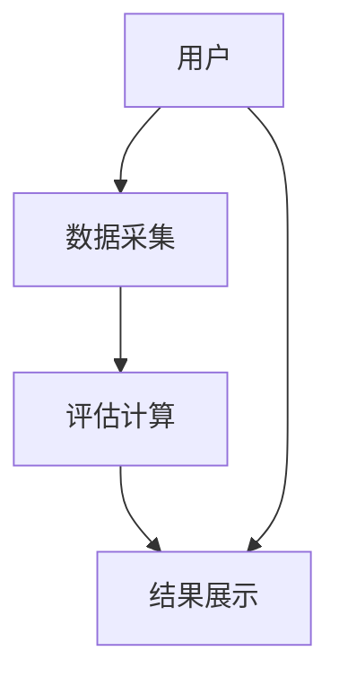

                 


# 巴菲特的品牌价值评估：虚拟影响力经济的量化

## 关键词：
- 巴菲特，品牌价值，虚拟经济，影响力经济，量化评估，影响力指数，投资评估

## 摘要：
本文探讨如何运用巴菲特的价值投资理念，量化评估品牌在虚拟影响力经济中的价值。通过定义虚拟影响力经济，分析其特征，建立数学模型，设计评估系统，并通过案例分析，总结评估方法与实践。

---

# 第1章：虚拟影响力经济的背景介绍

## 1.1 虚拟经济的兴起与现状

### 1.1.1 虚拟经济的定义与特征
虚拟经济是基于数字技术的经济形态，涉及虚拟货币、数字资产和虚拟商品。其特征包括去中心化、数字化、实时性和互动性。

### 1.1.2 虚拟经济的典型模式与案例
包括虚拟货币、NFT、虚拟商品和虚拟服务。例如，比特币、以太坊和Decentraland。

### 1.1.3 虚拟经济对传统经济的影响
改变商业模式，创造新价值，影响全球市场，但面临监管和安全挑战。

## 1.2 品牌价值的定义与评估

### 1.2.1 品牌价值的核心概念
品牌价值是品牌资产的市场价值，影响企业绩效和市场地位。

### 1.2.2 品牌价值的评估维度
包括品牌认知度、忠诚度、影响力和市场地位。

### 1.2.3 品牌价值与企业绩效的关系
品牌价值高的企业绩效通常更好，但需考虑行业差异。

## 1.3 巴菲特投资理念与品牌价值评估

### 1.3.1 巴菲特的价值投资理念
寻找具有持续盈利能力、良好治理和合理估值的企业。

### 1.3.2 品牌价值在巴菲特投资中的地位
品牌价值是企业长期竞争优势的重要体现，影响内在价值。

### 1.3.3 虚拟影响力经济与巴菲特理念的结合
虚拟品牌需具备实际价值和持久吸引力，才能符合巴菲特的投资标准。

---

# 第2章：虚拟影响力经济的核心概念与联系

## 2.1 虚拟影响力经济的原理

### 2.1.1 虚拟影响力经济的定义
基于数字平台的经济形态，参与者通过影响力创造价值。

### 2.1.2 虚拟影响力经济的核心要素
包括虚拟货币、数字资产和影响力评分系统。

### 2.1.3 虚拟影响力经济的运作机制
通过影响力评分系统，用户产生内容，平台分配收益。

## 2.2 虚拟影响力经济的特征对比

| 特征 | 虚拟经济 | 传统经济 |
|------|----------|----------|
| 价值基础 | 数字资产、虚拟货币 | 实体资产、货币 |
| 交易方式 | 数字化、在线 | 线下交易 |
| 参与方式 | 全球化、开放 | 地域限制 |

## 2.3 品牌影响力的评估维度

| 维度 | 描述 |
|------|------|
| 认知度 | 品牌知名度 |
| 忠诚度 | 消费者忠诚度 |
| 影响力指数 | 综合评估影响力 |
| 市场地位 | 市场份额和竞争对手 |

## 2.4 虚拟影响力经济的ER图

```mermaid
erDiagram
    actor 用户
    actor 平台
    actor 品牌
    actor 交易
    用户 --> 品牌: 关注
    用户 --> 交易: 参与
    品牌 --> 交易: 推广
    平台 --> 用户: 提供服务
    平台 --> 品牌: 提供服务
    平台 --> 交易: 记录
```

---

# 第3章：品牌价值量化评估的数学模型

## 3.1 品牌影响力指数模型

$$ 影响力指数 = \frac{关注数 \times 参与度 + 互动率}{平台用户数} $$

## 3.2 市场地位评分模型

$$ 市场地位 = \frac{市场份额 + 品牌认知度}{2} $$

## 3.3 综合评估模型

$$ 品牌价值 = 影响力指数 \times (市场地位 + 利润率) $$

---

# 第4章：系统分析与架构设计

## 4.1 系统功能设计

### 4.1.1 数据采集模块
收集关注数、参与度、互动率等数据。

### 4.1.2 评估计算模块
应用数学模型计算品牌价值。

### 4.1.3 结果展示模块
以图表形式展示评估结果。

## 4.2 系统架构设计



---

# 第5章：项目实战——虚拟品牌评估

## 5.1 环境安装

安装Python、Pandas和Matplotlib。

## 5.2 核心代码实现

```python
def calculate_influence_index(followers, participation, interaction, total_users):
    return (followers * participation + interaction) / total_users

def calculate_market_position(market_share, brand_recognition):
    return (market_share + brand_recognition) / 2

def calculate_brand_value(influence_index, market_position, profitability):
    return influence_index * (market_position + profitability)

# 示例数据
followers = 100000
participation = 0.8
interaction = 20000
total_users = 1000000
market_share = 0.25
brand_recognition = 0.7
profitability = 0.3

influence_index = calculate_influence_index(followers, participation, interaction, total_users)
market_position = calculate_market_position(market_share, brand_recognition)
brand_value = calculate_brand_value(influence_index, market_position, profitability)

print(f"品牌影响力指数: {influence_index}")
print(f"市场地位: {market_position}")
print(f"品牌价值: {brand_value}")
```

---

# 第6章：最佳实践与小结

## 6.1 最佳实践
- 定期更新数据，保持模型准确性。
- 结合行业特点，调整评估模型。

## 6.2 小结
虚拟影响力经济改变了品牌价值的评估方式，结合巴菲特的价值投资理念，可以更准确地量化品牌价值。

## 6.3 注意事项
- 数据来源的可靠性影响评估结果。
- 模型需根据实际情况调整参数。

## 6.4 拓展阅读
推荐阅读巴菲特的《 Intelligent Investor》和相关虚拟经济书籍。

---

通过以上步骤，我们可以系统地评估虚拟经济中的品牌价值，为投资者和企业提供有价值的参考。

