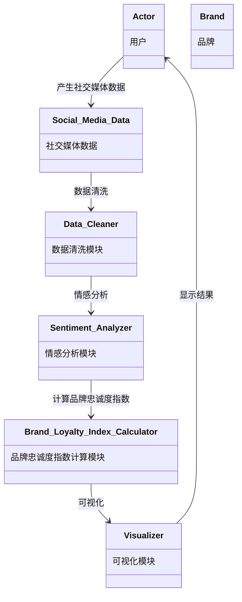

                 


# 巴菲特的品牌忠诚度分析：社交媒体时代的消费者行为

## 关键词
巴菲特，品牌忠诚度，社交媒体，消费者行为，投资策略，数据分析，情感分析

## 摘要
本文深入探讨了巴菲特的投资理念在社交媒体时代如何影响品牌忠诚度分析。通过结合品牌忠诚度指数的计算方法、社交媒体数据的应用以及情感分析技术，本文揭示了消费者行为在数字化环境下的新特征。文章从背景介绍、核心概念、算法原理、系统架构到项目实战，全面解析了品牌忠诚度在社交媒体环境下的变化及其对企业投资策略的影响。通过实际案例分析，本文为投资者和企业提供了如何在社交媒体时代维护和提升品牌忠诚度的实用建议。

---

## 目录

### 第一部分：品牌忠诚度与社交媒体的背景介绍

#### 第1章：品牌忠诚度的定义与背景

##### 1.1 品牌忠诚度的定义
- 1.1.1 品牌忠诚度的定义
- 1.1.2 品牌忠诚度的核心要素
- 1.1.3 品牌忠诚度与消费者行为的关系

##### 1.2 社交媒体时代的消费者行为
- 1.2.1 社交媒体对消费者行为的影响
- 1.2.2 社交媒体时代品牌忠诚度的新特征
- 1.2.3 社交媒体与品牌忠诚度的互动关系

##### 1.3 巴菲特投资理念与品牌忠诚度的关联
- 1.3.1 巴菲特的投资理念概述
- 1.3.2 巴菲特分析企业价值的方法
- 1.3.3 巴菲特理念与品牌忠诚度分析的结合点

#### 第2章：品牌忠诚度分析的核心概念与联系

##### 2.1 核心概念的原理
- 2.1.1 品牌忠诚度指数的计算方法
- 2.1.2 社交媒体数据在品牌忠诚度分析中的应用
- 2.1.3 巴菲特投资理念中的品牌忠诚度视角

##### 2.2 核心概念的属性特征对比
- 2.2.1 品牌忠诚度与品牌知名度的对比分析
- 2.2.2 不同社交媒体平台的品牌忠诚度影响因素对比
- 2.2.3 巴菲特分析方法与传统品牌忠诚度分析方法的对比

##### 2.3 ER实体关系图
```mermaid
er
  actor: 用户
  brand: 品牌
  social_media_data:

  user --> brand: 品牌偏好
  user --> social_media_data: 产生社交媒体数据
  brand --> social_media_data: 品牌相关社交媒体数据
  brand --> actor: 提供产品或服务
  social_media_data --> actor: 影响消费者行为
  social_media_data --> brand: 品牌监测和分析
```

---

### 第二部分：品牌忠诚度指数的算法原理

#### 第3章：算法原理讲解

##### 3.1 品牌忠诚度指数的计算方法
- 3.1.1 数据采集与预处理
  - 数据来源：社交媒体评论、用户评分、购买记录
  - 数据清洗：去除无效数据、处理缺失值
- 3.1.2 特征提取
  - 情感分析：使用自然语言处理技术提取文本情感
  - 用户行为分析：分析用户的购买频率和退货率
- 3.1.3 品牌忠诚度指数的计算
  $$ \text{品牌忠诚度指数} = \frac{\text{情感得分} + \text{行为得分}}{2} $$

##### 3.2 品牌忠诚度指数算法实现
```python
import pandas as pd
from textblob import TextBlob

def calculate_sentiment(text):
    return TextBlob(text).polarity

def brandloyalty_index(brand_name):
    # 数据加载
    data = pd.read_csv(f'{brand_name}_data.csv')
    
    # 数据清洗
    data.dropna(inplace=True)
    
    # 情感分析
    data['sentiment'] = data['comment'].apply(lambda x: calculate_sentiment(x))
    
    # 行为分析
    data['purchase_frequency'] = data.groupby('user')['purchase'].transform('count')
    
    # 品牌忠诚度指数计算
    data['brand_loyalty_index'] = (data['sentiment'] + data['purchase_frequency']) / 2
    
    return data[['user', 'brand_loyalty_index']]

# 示例
brandloyalty_index('Apple')
```

##### 3.3 算法优化与测试
- 3.3.1 算法优化：引入用户画像和产品属性
- 3.3.2 测试与验证：对比传统品牌忠诚度分析方法的准确性

---

### 第三部分：系统分析与架构设计方案

#### 第4章：系统分析与架构设计

##### 4.1 问题场景介绍
- 数据采集：从社交媒体平台获取品牌相关数据
- 数据分析：计算品牌忠诚度指数
- 结果展示：可视化品牌忠诚度趋势

##### 4.2 系统功能设计


##### 4.3 系统架构设计


##### 4.4 接口设计与交互
- API接口设计：RESTful API实现数据获取和结果返回
- 交互流程：用户请求分析，系统返回品牌忠诚度指数

---

### 第四部分：项目实战

#### 第5章：项目实战

##### 5.1 环境安装
- 安装Python、Pandas、TextBlob等依赖库
- 设置开发环境（如Jupyter Notebook）

##### 5.2 核心代码实现
```python
import requests
from bs4 import BeautifulSoup
import pandas as pd
from textblob import TextBlob

def scrape_social_media(brand_name):
    # 示例：从Twitter获取数据
    url = f'https://twitter.com/search?q={brand_name}'
    response = requests.get(url)
    soup = BeautifulSoup(response.text, 'html.parser')
    comments = soup.find_all('div', {'class': 'tweet'})
    return [comment.text for comment in comments]

def preprocess_data(comments):
    data = pd.DataFrame({'comment': comments})
    data['sentiment'] = data['comment'].apply(lambda x: TextBlob(x).polarity)
    return data

# 示例
comments = scrape_social_media('Nike')
data = preprocess_data(comments)
print(data.head())
```

##### 5.3 代码解读与分析
- 数据爬取：从社交媒体平台获取品牌相关评论
- 数据预处理：清洗和转换数据格式
- 情感分析：计算评论的情感得分
- 品牌忠诚度指数计算：结合情感得分和用户行为数据

##### 5.4 案例分析
- 以耐克为例，分析其品牌忠诚度指数的变化
- 对比不同社交媒体平台的品牌忠诚度表现

##### 5.5 项目小结
- 项目总结：品牌忠诚度分析的实现步骤和关键点
- 项目成果：可视化品牌忠诚度指数的趋势图

---

### 第五部分：最佳实践与小结

#### 第6章：最佳实践

##### 6.1 最佳实践 tips
- 数据来源的多样性：结合社交媒体、用户调查等多种数据源
- 情感分析的准确性：选择合适的NLP模型提高分析精度
- 用户隐私保护：遵守数据隐私法规，确保用户数据安全

##### 6.2 小结
- 本文通过结合巴菲特的投资理念和社交媒体数据分析，提出了品牌忠诚度指数的计算方法
- 该方法能够帮助企业更好地理解消费者行为，制定有效的品牌管理策略

##### 6.3 注意事项
- 数据采集的合法性和合规性
- 模型的可解释性和可扩展性
- 结果的应用场景和限制

##### 6.4 拓展阅读
- 推荐阅读巴菲特的《聪明的投资者》
- 推荐学习自然语言处理和情感分析的最新技术

---

通过以上步骤，本文系统地分析了品牌忠诚度在社交媒体时代的消费者行为，结合巴菲特的投资理念，提出了创新的分析方法和实践方案。

