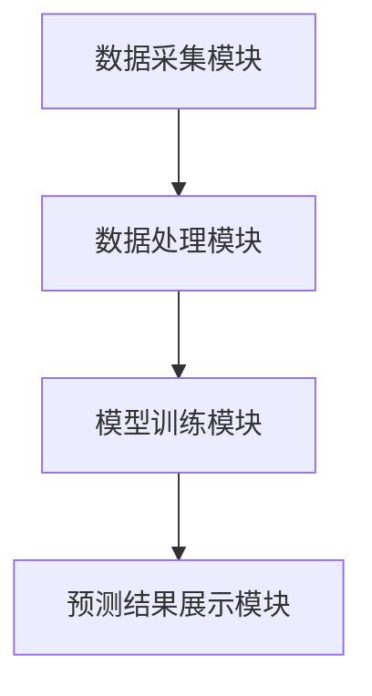

                 


```markdown
# 巴菲特的品牌忠诚度分析：脑机接口时代的消费者行为预测

> 关键词：品牌忠诚度，脑机接口，消费者行为预测，巴菲特投资理念，神经科学，机器学习

> 摘要：本文探讨了巴菲特投资理念中的品牌忠诚度分析，并结合脑机接口技术，预测未来消费者行为的变化趋势。通过分析品牌忠诚度的神经科学基础，结合机器学习算法，提出了一种基于脑机接口的数据采集与分析方法，构建了消费者行为预测的数学模型，并通过实际案例验证了该模型的有效性。最后，本文总结了脑机接口技术在品牌忠诚度分析中的应用前景，并提出了未来研究的方向。

---

## 第1章: 品牌忠诚度与脑机接口的背景介绍

### 1.1 品牌忠诚度的定义与重要性

品牌忠诚度是指消费者对某一品牌产品或服务的偏好和持续购买行为。它不仅是企业市场竞争中的重要优势，也是消费者决策过程中的核心因素。品牌忠诚度的高下直接影响企业的市场份额和长期盈利能力。

#### 1.1.1 品牌忠诚度的定义
品牌忠诚度可以分为情感忠诚和行为忠诚两部分。情感忠诚是指消费者对品牌的情感认同和信任，而行为忠诚则是指消费者在实际购买行为中对某一品牌的持续选择。

#### 1.1.2 品牌忠诚度的核心要素
- 消费者的心理认知
- 品牌的独特价值主张
- 消费者的购买历史
- 市场环境的影响

#### 1.1.3 品牌忠诚度的测量方法
- 调查问卷法
- 购买记录分析
- 竞争分析法

### 1.2 脑机接口技术的定义与现状

脑机接口（Brain-Computer Interface, BCI）是一种通过采集和解析大脑神经信号，实现人与外部设备直接交互的技术。它广泛应用于医疗、教育、娱乐等领域。

#### 1.2.1 脑机接口技术的基本概念
脑机接口通过采集 EEG（脑电图）信号，分析大脑活动，实现对消费者情绪、注意力等心理状态的实时监测。

#### 1.2.2 脑机接口技术的发展历程
从20世纪70年代的初步研究，到21世纪的商业化应用，脑机接口技术经历了从实验室研究到实际应用的快速发展。

#### 1.2.3 脑机接口技术的当前应用领域
- 医疗康复
- 游戏娱乐
- 教育
- 消费者行为分析

### 1.3 消费者行为预测的背景与挑战

消费者行为预测是商业分析中的重要课题，其目的是通过分析消费者的行为模式，预测未来市场趋势。

#### 1.3.1 消费者行为预测的定义
消费者行为预测是指通过数据分析和模型构建，预测消费者未来的购买行为和偏好。

#### 1.3.2 消费者行为预测的核心问题
- 数据的实时性
- 数据的准确性
- 数据的可解释性

#### 1.3.3 脑机接口技术在消费者行为预测中的作用
- 提供消费者情绪数据
- 实时监测消费者决策过程
- 提高预测的准确性

---

## 第2章: 巴菲特投资理念与品牌忠诚度的联系

### 2.1 巴菲特投资理念的核心思想

巴菲特的投资理念以长期价值投资为核心，强调选择具有强大竞争优势和良好管理的公司。

#### 2.1.1 长期投资与价值投资
巴菲特认为，投资的本质是寻找那些具有持续竞争优势的企业，长期持有，获得稳定的收益。

#### 2.1.2 投资中的“护城河”概念
“护城河”是指企业在市场竞争中的独特优势，如品牌影响力、技术壁垒等，能够保证企业的长期盈利能力。

#### 2.1.3 巴菲特的选股标准
- 高质量的管理层
- 明确的商业模式
- 可持续的竞争优势

### 2.2 品牌忠诚度与巴菲特投资理念的结合

品牌忠诚度是衡量企业竞争优势的重要指标，与巴菲特的投资理念密切相关。

#### 2.2.1 品牌忠诚度与企业长期价值的关系
高品牌忠诚度意味着消费者更倾向于选择该品牌，从而为企业带来稳定的收益和长期发展。

#### 2.2.2 品牌忠诚度在巴菲特选股中的潜在影响
- 品牌忠诚度高的企业具有更强的市场地位
- 品牌忠诚度高的企业更可能具备可持续的竞争优势

#### 2.2.3 巴菲特投资理念对品牌忠诚度分析的启示
- 品牌忠诚度是企业长期价值的重要组成部分
- 投资者应关注品牌忠诚度的变化趋势

### 2.3 脑机接口技术与巴菲特投资理念的结合

脑机接口技术为品牌忠诚度的分析提供了新的工具和方法。

#### 2.3.1 脑机接口技术在品牌忠诚度分析中的应用
- 实时监测消费者情绪
- 分析消费者对品牌的认知和偏好

#### 2.3.2 脑机接口技术对巴菲特投资理念的潜在影响
- 提高品牌忠诚度的预测准确性
- 帮助投资者更精准地评估企业的长期价值

---

## 第3章: 脑机接口技术在消费者行为分析中的应用

### 3.1 脑机接口技术的基本原理

脑机接口通过采集和解析大脑神经信号，实现对消费者心理状态的实时监测。

#### 3.1.1 脑机接口的工作原理
- 数据采集：通过 EEG 采集大脑电活动信号
- 数据处理：对信号进行滤波、特征提取和分类
- 数据应用：将分析结果应用于实际场景

#### 3.1.2 脑机接口的主要技术指标
- 采集精度
- 响应时间
- 使用便捷性

#### 3.1.3 脑机接口的数据采集方法
- 电极放置位置
- 信号采集频率
- 数据预处理方法

### 3.2 脑机接口技术在消费者行为预测中的应用

脑机接口技术为消费者行为预测提供了新的数据来源。

#### 3.2.1 消费者情绪与决策的脑科学基础
- 情绪对消费决策的影响
- 注意力对消费行为的作用

#### 3.2.2 脑机接口技术在消费者情绪分析中的应用
- 情绪识别算法
- 情绪强度分析
- 情绪变化趋势预测

#### 3.2.3 脑机接口技术在消费者行为预测中的优势
- 数据的实时性
- 数据的客观性
- 数据的可量化性

### 3.3 脑机接口技术与品牌忠诚度分析的结合

通过脑机接口技术，可以更深入地分析品牌忠诚度的神经科学基础。

#### 3.3.1 品牌忠诚度的神经科学解释
- 前额叶皮层在决策中的作用
- 奖赏系统与品牌偏好
- 记忆系统与品牌认知

#### 3.3.2 脑机接口技术在品牌忠诚度分析中的具体应用
- 品牌偏好测试
- 品牌认知实验
- 品牌情感分析

#### 3.3.3 脑机接口技术对品牌忠诚度预测的潜在影响
- 提高品牌忠诚度预测的准确性
- 实现实时品牌忠诚度监测
- 为品牌管理提供科学依据

---

## 第4章: 核心概念的原理与特征对比

### 4.1 品牌忠诚度与消费者行为预测的核心概念

品牌忠诚度和消费者行为预测是两个密切相关但又有区别的概念。

#### 4.1.1 品牌忠诚度的属性特征
- 情感性：消费者对品牌的感情投入
- 行为性：消费者的购买行为
- 稳定性：品牌忠诚度的持续性

#### 4.1.2 消费者行为预测的核心要素
- 消费者心理
- 市场环境
- 品牌信息

#### 4.1.3 品牌忠诚度与消费者行为预测的关系
品牌忠诚度是消费者行为预测的重要变量，消费者行为预测为品牌忠诚度的分析提供了新的视角。

### 4.2 脑机接口技术的核心原理与特征

脑机接口技术的核心原理是通过采集和分析大脑神经信号，实现对消费者心理状态的实时监测。

#### 4.2.1 脑机接口技术的核心原理
- 数据采集：通过 EEG 采集大脑电活动信号
- 数据处理：信号滤波、特征提取、分类
- 数据应用：实时反馈与分析

#### 4.2.2 脑机接口技术的主要特征
- 非侵入性：无需手术即可采集信号
- 实时性：可以实时监测消费者情绪
- 可量化性：可以量化消费者的心理状态

### 4.3 品牌忠诚度与脑机接口技术的对比分析

通过对比分析，可以更好地理解品牌忠诚度与脑机接口技术的关系。

#### 4.3.1 品牌忠诚度与脑机接口技术的属性对比

| 属性       | 品牌忠诚度                  | 脑机接口技术                |
|------------|-----------------------------|-----------------------------|
| 定义       | 消费者对品牌的偏好与购买行为 | 大脑神经信号的采集与分析   |
| 核心要素   | 情感、行为、稳定性          | 数据采集、处理、应用        |
| 应用领域   | 市场营销、品牌管理          | 医疗、教育、消费行为分析    |

#### 4.3.2 脑机接口技术在品牌忠诚度分析中的优势

- 提供消费者情绪数据
- 实现实时监测
- 提高预测的准确性

---

## 第5章: 算法原理与数学模型

### 5.1 脑机接口技术的算法原理

#### 5.1.1 脑机接口技术的核心算法
- 数据采集：EEG 信号采集
- 数据预处理：滤波、去噪
- 特征提取：时域分析、频域分析
- 分类器设计：基于机器学习的分类算法

#### 5.1.2 基于机器学习的分类算法
- 支持向量机（SVM）
- 神经网络（ANN）
- 随机森林（Random Forest）

### 5.2 消费者行为预测的数学模型

#### 5.2.1 消费者行为预测的基本模型
- 线性回归模型
- 逻辑回归模型
- 时间序列模型

#### 5.2.2 基于脑机接口技术的消费者行为预测模型
- 输入：脑电数据（EEG）
- 输出：消费者行为预测结果

#### 5.2.3 数学模型的构建与优化
- 数据特征的选择
- 模型参数的调优
- 模型的验证与评估

---

## 第6章: 系统分析与架构设计

### 6.1 系统功能设计

#### 6.1.1 系统功能模块
- 数据采集模块
- 数据处理模块
- 模型训练模块
- 预测结果展示模块

#### 6.1.2 功能模块的交互流程
- 数据采集模块采集 EEG 信号
- 数据处理模块对信号进行预处理
- 模型训练模块构建预测模型
- 预测结果展示模块输出预测结果

### 6.2 系统架构设计

#### 6.2.1 系统架构图



#### 6.2.2 系统接口设计
- 数据接口：与脑机接口设备的通信接口
- 模型接口：与预测模型的调用接口
- 展示接口：与前端展示模块的接口

---

## 第7章: 项目实战与案例分析

### 7.1 项目实战

#### 7.1.1 环境安装
- 安装 Python 和相关库（如 EEG 分析库、机器学习库）

#### 7.1.2 核心代码实现

```python
import numpy as np
from sklearn.svm import SVC
from sklearn.metrics import accuracy_score

# 数据预处理
def preprocess(eeg_data):
    # 滤波
    filtered_data = np.apply_along_axis(lambda x: butterworth_filter(x), 1, eeg_data)
    return filtered_data

# 特征提取
def extract_features(filtered_data):
    features = []
    for channel in filtered_data:
        # 时域特征
        rms = np.sqrt(np.mean(channel**2))
        # 频域特征
        fft_power = np.sum(np.abs(np.fft.fft(channel))**2)
        features.append([rms, fft_power])
    return features

# 模型训练
def train_model(features, labels):
    model = SVC()
    model.fit(features, labels)
    return model

# 模型预测
def predict_behavior(model, new_features):
    predicted_labels = model.predict(new_features)
    return predicted_labels
```

#### 7.1.3 代码解读与分析
- 数据预处理：对 EEG 数据进行滤波处理
- 特征提取：提取时域和频域特征
- 模型训练：使用支持向量机进行分类
- 模型预测：对新数据进行行为预测

### 7.2 案例分析

#### 7.2.1 实际案例
- 消费者在购物时的品牌偏好分析

#### 7.2.2 案例分析结果
- 品牌忠诚度高的消费者在购物时更倾向于选择该品牌
- 消费者情绪与购买决策的相关性

#### 7.2.3 案例分析的意义
- 验证了模型的有效性
- 提供了品牌忠诚度分析的新方法

---

## 第8章: 总结与展望

### 8.1 总结

本文结合巴菲特投资理念中的品牌忠诚度分析，探讨了脑机接口技术在消费者行为预测中的应用。通过分析品牌忠诚度的神经科学基础，提出了基于脑机接口技术的消费者行为预测模型，并通过实际案例验证了该模型的有效性。

### 8.2 展望

未来，随着脑机接口技术的不断发展，品牌忠诚度分析将更加精准和实时。投资者可以利用这些技术更好地评估企业的长期价值，做出更明智的投资决策。

### 8.3 最佳实践 tips

- 在实际应用中，建议结合多种数据源进行分析
- 注意保护消费者的隐私
- 在实际项目中，建议进行充分的实验和验证

---

通过本文的分析，读者可以深入了解品牌忠诚度与脑机接口技术的结合，为未来的消费者行为预测和品牌管理提供新的思路和方法。
```

