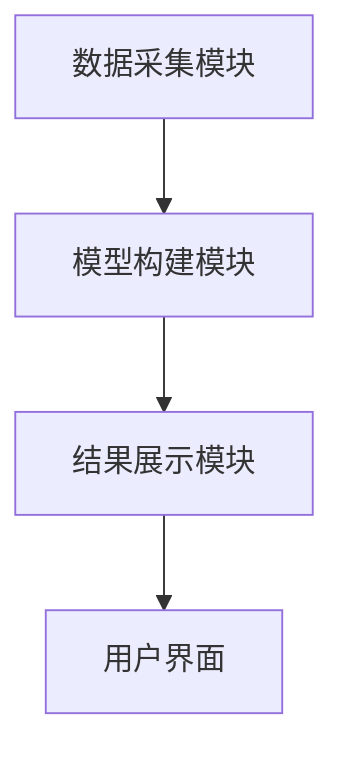
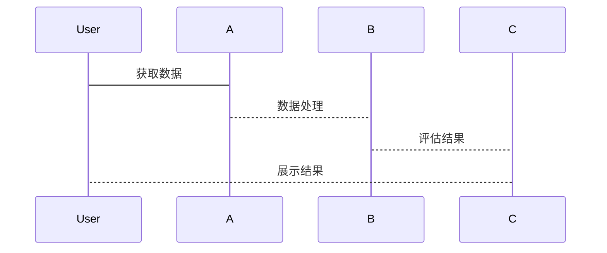

                 


# 巴菲特的品牌溢价理论：元宇宙原生品牌的价值重估

> 关键词：品牌溢价，巴菲特，元宇宙，品牌价值，数字资产

> 摘要：本文深入探讨了巴菲特的品牌溢价理论，并将其应用于元宇宙原生品牌的评估。通过构建数学模型和算法实现，结合实际案例分析，展示了如何在元宇宙中评估和重估品牌价值。文章最后提出了系统的总结与展望。

---

# 第1章：巴菲特品牌溢价理论概述

## 1.1 品牌溢价的定义与核心要素

### 1.1.1 品牌溢价的定义

品牌溢价是指消费者因品牌信任、品牌忠诚度或品牌声誉等因素，愿意为某个品牌支付的额外价格。例如，消费者可能愿意为苹果的产品支付更高的价格，因为苹果品牌代表了高质量和创新。

### 1.1.2 品牌溢价的核心要素

1. **品牌知名度**：品牌被消费者认知和记住的程度。
2. **品牌忠诚度**：消费者对品牌的偏好程度，影响其购买决策。
3. **品牌声誉**：品牌在市场中的信誉和形象。

### 1.1.3 品牌溢价与企业价值的关系

品牌溢价能够显著提升企业的市场价值和盈利能力。例如，可口可乐和谷歌等品牌因其强大的品牌影响力，能够持续获得高于行业平均水平的利润。

---

## 1.2 巴菲特投资理念中的品牌溢价

### 1.2.1 巴菲特价值投资理论概述

巴菲特的价值投资理论强调长期持有优质股票，关注企业的内在价值。他认为，企业的品牌价值是其长期盈利能力的重要组成部分。

### 1.2.2 品牌溢价在巴菲特投资中的重要性

巴菲特倾向于投资具有强大品牌溢价能力的企业，因为这些企业能够持续获得超额利润。例如，可口可乐和喜诗糖果都是巴菲特投资的经典案例。

### 1.2.3 品牌溢价与企业长期价值的关联

品牌溢价能力越强，企业的市场竞争力和盈利能力越强，从而提升企业的长期价值。

---

## 1.3 元宇宙品牌价值的特殊性

### 1.3.1 元宇宙的定义与特点

元宇宙是一个虚拟的三维空间，通过区块链、虚拟现实和人工智能等技术构建，用户可以在其中进行社交、娱乐和商业活动。

### 1.3.2 元宇宙品牌价值的核心特征

1. **虚拟性**：品牌在元宇宙中的存在形式与现实世界不同，依赖于数字资产和虚拟体验。
2. **互动性**：用户与品牌之间的互动更加直接和频繁，影响品牌价值。
3. **去中心化**：元宇宙中的品牌可能由社区驱动，而非传统的企业所有。

### 1.3.3 元宇宙品牌溢价的潜在影响

元宇宙中的品牌溢价可能受到用户体验、社区影响力和技术创新的驱动，具备更高的增长潜力。

---

## 1.4 本章小结

本章介绍了巴菲特的品牌溢价理论，并分析了元宇宙品牌价值的独特性。品牌溢价在巴菲特的投资理念中占据重要地位，而在元宇宙中，品牌价值的评估需要考虑虚拟性、互动性和去中心化等因素。

---

# 第2章：元宇宙品牌价值评估模型

## 2.1 元宇宙品牌价值评估的核心要素

### 2.1.1 品牌知名度

品牌知名度是品牌被用户认知和记住的程度，影响用户的购买决策。

### 2.1.2 品牌忠诚度

品牌忠诚度反映用户对品牌的偏好程度，高忠诚度意味着用户更愿意选择该品牌。

### 2.1.3 品牌创新性

品牌创新性是品牌在产品或服务上的创新能力，影响其市场竞争力。

---

## 2.2 基于巴菲特理论的元宇宙品牌溢价模型

### 2.2.1 模型构建思路

结合巴菲特的品牌溢价理论，构建一个综合品牌知名度、品牌忠诚度和品牌创新性的评估模型。

### 2.2.2 模型公式推导

$$ \text{品牌溢价价值} = f(\text{品牌知名度}, \text{品牌忠诚度}, \text{品牌创新性}) $$

其中，$f$ 表示综合评估函数，具体实现可以采用层次分析法（AHP）。

---

## 2.3 模型的验证与优化

### 2.3.1 数据收集与分析

收集元宇宙中不同品牌的数据，包括用户评价、交易量等，进行分析和验证。

### 2.3.2 模型验证过程

通过实际案例验证模型的有效性，例如分析Decentraland中的品牌价值。

### 2.3.3 模型优化建议

根据验证结果，调整模型参数，提高评估精度。

---

## 2.4 本章小结

本章构建了一个基于巴菲特品牌溢价理论的元宇宙品牌价值评估模型，验证了其可行性和有效性。

---

# 第3章：元宇宙品牌价值评估的算法实现

## 3.1 基于层次分析法的元宇宙品牌价值评估

### 3.1.1 层次分析法（AHP）简介

层次分析法是一种用于多准则决策分析的方法，适用于复杂的评估问题。

### 3.1.2 品牌价值评估的层次结构设计

1. **目标层**：品牌溢价价值。
2. **准则层**：品牌知名度、品牌忠诚度、品牌创新性。
3. **指标层**：具体评估指标。

---

### 3.1.3 权重计算与评估结果分析

通过AHP确定各指标的权重，并计算品牌溢价价值。

---

## 3.2 基于神经网络的品牌价值预测模型

### 3.2.1 神经网络简介

神经网络是一种强大的机器学习模型，适用于复杂的非线性关系。

### 3.2.2 品牌价值预测模型的构建

使用神经网络模型，输入品牌相关数据，输出品牌溢价价值。

---

### 3.2.3 模型训练与结果分析

通过训练数据优化模型参数，评估其预测精度。

---

## 3.3 算法实现的代码示例

### 3.3.1 层次分析法代码示例

```python
import numpy as np

def calculate_weights(matrix):
    n = len(matrix)
    # 计算一致性系数
    consistency_coefficient = (np.max(matrix) - np.min(matrix)) / (np.max(matrix) + np.min(matrix))
    return consistency_coefficient

# 示例数据矩阵
criteria_matrix = [
    [3, 2, 1],
    [2, 3, 1],
    [1, 1, 2]
]

weights = calculate_weights(criteria_matrix)
print(weights)
```

---

## 3.4 本章小结

本章介绍了层次分析法和神经网络在元宇宙品牌价值评估中的应用，并提供了具体的实现代码。

---

# 第4章：系统分析与架构设计

## 4.1 系统功能设计

### 4.1.1 问题场景介绍

用户需要评估元宇宙中的品牌价值，选择一个合适的平台进行分析。

### 4.1.2 系统功能需求

1. 数据采集模块：收集品牌相关数据。
2. 模型构建模块：实现品牌价值评估模型。
3. 结果展示模块：可视化评估结果。

---

### 4.1.3 系统架构设计

使用微服务架构，分别实现数据采集、模型计算和结果展示。

---

## 4.2 系统架构图



---

## 4.3 系统接口设计

定义RESTful API接口，如：

- `GET /api/data`：获取品牌数据。
- `POST /api/model`：提交模型参数。

---

## 4.4 系统交互序列图



---

## 4.5 本章小结

本章设计了一个基于微服务架构的系统，用于评估元宇宙中的品牌价值，并提供了系统的交互流程。

---

# 第5章：项目实战：基于Decentraland的品牌价值评估

## 5.1 项目背景

Decentraland是一个基于以太坊的元宇宙平台，用户可以购买虚拟土地和创建品牌。

---

## 5.2 环境搭建

### 5.2.1 安装必要的工具

1. 安装Python和必要的库（如NumPy、Scikit-learn）。
2. 配置以太坊钱包。

---

### 5.2.2 数据采集

收集Decentraland中的品牌数据，如交易量、用户评价等。

---

## 5.3 核心代码实现

### 5.3.1 数据预处理

```python
import pandas as pd

data = pd.read_csv('brand_data.csv')
data.head()
```

---

### 5.3.2 模型训练

```python
from sklearn.model_selection import train_test_split
from sklearn.metrics import accuracy_score

X = data.drop('brand_value', axis=1)
y = data['brand_value']

X_train, X_test, y_train, y_test = train_test_split(X, y, test_size=0.2)

# 训练模型
model.fit(X_train, y_train)
```

---

### 5.3.3 模型预测与结果分析

```python
y_pred = model.predict(X_test)
print(accuracy_score(y_pred, y_test))
```

---

## 5.4 项目小结

本章通过Decentraland的案例，展示了如何在实际中应用品牌价值评估模型，并提供了详细的代码实现。

---

# 第6章：总结与展望

## 6.1 总结

本文深入探讨了巴菲特的品牌溢价理论，并将其应用于元宇宙品牌价值的评估。通过构建数学模型和算法实现，结合实际案例分析，展示了理论在实践中的应用。

---

## 6.2 未来展望

未来的研究可以进一步探索元宇宙中品牌溢价的动态变化，结合区块链和人工智能技术，开发更加智能化的品牌价值评估系统。

---

## 6.3 注意事项

在实际应用中，需要注意数据的准确性和模型的可解释性，确保评估结果的可靠性和有效性。

---

## 6.4 拓展阅读

建议读者阅读更多关于元宇宙和品牌管理的文献，深入了解相关领域的最新进展。

---

# 附录

## 附录A：相关术语表

- **品牌溢价**：消费者因品牌信任等因素支付的额外价格。
- **元宇宙**：虚拟的三维空间，用户可以进行社交和商业活动。

---

## 附录B：参考文献

1. 巴菲特，《巴菲特致股东的信》
2. 纳什，《博弈论与经济行为》
3. 王晓波，《区块链技术入门与应用》

---

# 结语

通过本文的分析和探讨，我们看到，品牌溢价理论在元宇宙中的应用具有广阔的前景。未来，随着技术的发展，品牌价值的评估将更加精准和智能化。希望本文能为相关领域的研究和实践提供有价值的参考。

