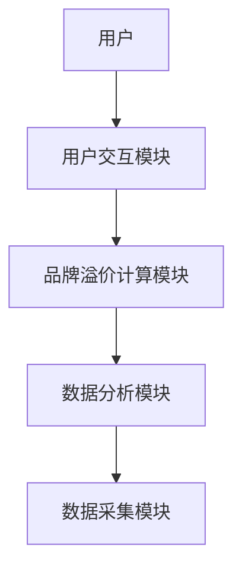
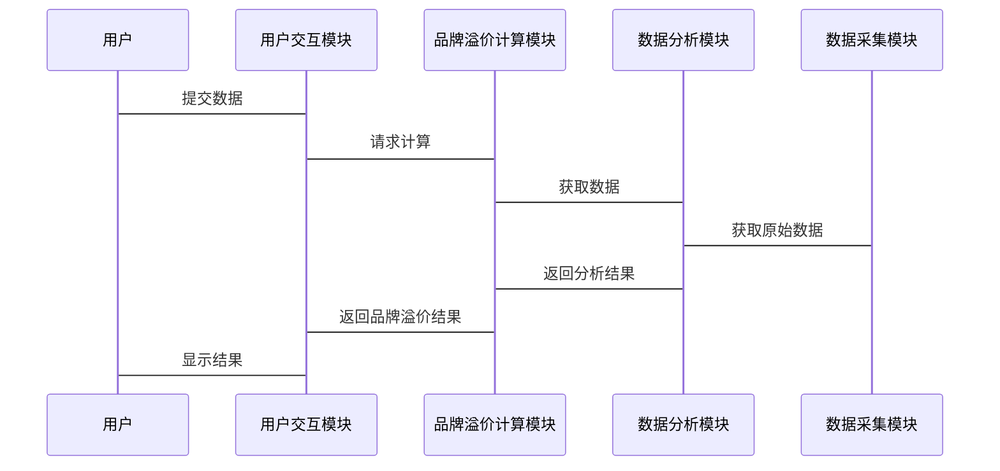

                 


# 巴菲特的品牌溢价理论：数字原生品牌的价值重估

> 关键词：巴菲特，品牌溢价，数字原生品牌，价值评估，投资理论

> 摘要：本文系统地阐述了巴菲特品牌溢价理论在数字原生品牌中的应用与价值重估。通过分析品牌溢价的核心概念、数学模型和算法实现，结合数字原生品牌的独特性，提出了一种全新的品牌价值评估方法。本文还详细探讨了数字原生品牌的竞争优势与挑战，并通过实际案例展示了如何利用数学模型和系统架构设计来实现品牌溢价的量化与优化。

---

# 第一部分：巴菲特品牌溢价理论基础

## 第1章：巴菲特品牌溢价理论概述

### 1.1 品牌溢价的定义与背景

#### 1.1.1 品牌溢价的核心概念
品牌溢价是指消费者对某一品牌产品或服务的支付意愿超出其基础价值的部分。这种溢价反映了品牌在市场中的附加价值，通常由品牌知名度、用户忠诚度、品牌差异化等因素决定。

#### 1.1.2 巴菲特投资理论中的品牌溢价
巴菲特认为，品牌溢价是企业长期竞争优势的重要来源。他强调，拥有强大品牌溢价能力的企业能够在市场中获得更高的利润率和更强的抗风险能力。品牌溢价的核心在于消费者对品牌的信任和忠诚度。

#### 1.1.3 数字原生品牌的兴起与挑战
数字原生品牌是指在数字时代背景下诞生的品牌，其核心竞争力依赖于数字化技术和用户数据。然而，数字原生品牌也面临着市场竞争加剧、用户隐私问题和技术迭代带来的挑战。

---

### 1.2 巴菲特品牌溢价理论的数学模型

#### 1.2.1 品牌价值的计算公式
品牌价值（BV）可以通过以下公式计算：
$$ BV = \text{品牌溢价} \times \text{市场规模} $$

其中，品牌溢价（BP）可以进一步分解为：
$$ BP = \text{品牌忠诚度} \times \text{品牌认知度} \times \text{品牌差异化} $$

#### 1.2.2 品牌溢价的评估指标
品牌溢价的评估指标包括：
1. 品牌忠诚度：客户对品牌的忠诚程度。
2. 品牌认知度：客户对品牌的认知和记忆程度。
3. 品牌差异化：品牌相对于竞争对手的独特性。

---

### 1.3 巴菲特品牌溢价理论的核心要素

#### 1.3.1 品牌忠诚度的量化
品牌忠诚度可以通过客户生命周期价值（CLV）来量化：
$$ CLV = \text{客户平均收入} \times \text{客户留存率} \times \text{客户生命周期长度} $$

#### 1.3.2 品牌认知度的评估方法
品牌认知度可以通过市场调研和用户反馈来评估，具体指标包括：
1. 品牌知名度。
2. 品牌提及率。
3. 用户满意度。

#### 1.3.3 品牌差异化的竞争优势
品牌差异化是品牌溢价的核心来源。通过技术创新、服务创新和体验创新，品牌可以实现差异化竞争优势。

---

### 1.4 巴菲特品牌溢价理论的局限性

#### 1.4.1 理论适用范围的边界
巴菲特品牌溢价理论主要适用于传统品牌，对数字原生品牌的适用性需要进一步验证。

#### 1.4.2 数字时代品牌溢价的变化
数字技术的快速发展使得品牌溢价的来源和计算方式发生了变化。例如，数据驱动的品牌溢价可能与传统品牌溢价的计算方式不同。

#### 1.4.3 理论与实践的差异
品牌溢价理论在实际应用中需要结合具体市场环境和企业特点进行调整。

---

## 1.5 本章小结
本章介绍了巴菲特品牌溢价理论的核心概念和数学模型，并分析了其在数字原生品牌中的适用性。通过对比传统品牌和数字原生品牌的差异，提出了品牌溢价理论在数字时代需要进行价值重估的必要性。

---

## 第2章：数字原生品牌的独特性

### 2.1 数字原生品牌的定义

#### 2.1.1 数字原生品牌的起源
数字原生品牌是指完全依赖数字化技术进行品牌建设、推广和运营的品牌。这些品牌通常通过社交媒体、电商平台和数字营销工具与用户互动。

#### 2.1.2 数字原生品牌的特征
数字原生品牌的特征包括：
1. 数据驱动的运营模式。
2. 用户参与度高。
3. 技术创新驱动的品牌发展。

#### 2.1.3 数字原生品牌与传统品牌的对比
| 特性 | 数字原生品牌 | 传统品牌 |
|------|--------------|----------|
| 品牌建设 | 数字化工具 | 传统媒介 |
| 用户互动 | 高频互动 | 低频互动 |
| 技术依赖 | 高度依赖 | 低依赖 |

---

### 2.2 数字原生品牌的竞争优势

#### 2.2.1 数字技术对品牌溢价的影响
数字技术使得品牌可以通过精准营销和大数据分析实现更高的品牌溢价。

#### 2.2.2 数字化运营的成本优势
数字原生品牌可以通过数字化运营降低营销成本，提高运营效率。

#### 2.2.3 用户数据对品牌价值的贡献
用户数据是数字原生品牌的核心资产，能够帮助品牌实现精准定位和个性化服务。

---

### 2.3 数字原生品牌的挑战

#### 2.3.1 数字化竞争的加剧
数字原生品牌面临着来自其他数字品牌和传统品牌的双重竞争压力。

#### 2.3.2 用户隐私与数据安全的问题
用户数据的收集和使用需要遵守严格的隐私保护法规，这增加了数字原生品牌的合规成本。

#### 2.3.3 数字技术的快速迭代对品牌的影响
技术的快速迭代要求数字原生品牌不断进行产品和服务创新，否则容易被市场淘汰。

---

## 2.4 本章小结
本章分析了数字原生品牌的定义、特征及其竞争优势和挑战。通过对比传统品牌和数字原生品牌的差异，强调了数字技术对品牌溢价的重要影响。

---

## 第3章：巴菲特品牌溢价理论的数字时代扩展

### 3.1 数字化时代的品牌价值重构

#### 3.1.1 数字技术对品牌溢价的影响
数字技术使得品牌可以通过数据分析和用户行为洞察实现更精准的品牌溢价评估。

#### 3.1.2 用户行为数据对品牌价值的贡献
用户行为数据能够帮助品牌更好地理解用户需求，从而提升品牌溢价能力。

#### 3.1.3 数字化品牌溢价的评估方法
数字化品牌溢价的评估方法包括：
1. 数据驱动的品牌价值评估。
2. 用户行为分析的品牌溢价计算。

---

### 3.2 数字原生品牌的价值评估模型

#### 3.2.1 数字原生品牌的评估维度
数字原生品牌的评估维度包括：
1. 用户参与度。
2. 数据驱动的营销能力。
3. 技术创新能力。

#### 3.2.2 数字原生品牌价值的计算公式
数字原生品牌价值（DBV）可以表示为：
$$ DBV = \text{用户参与度} \times \text{数据驱动能力} \times \text{技术创新能力} $$

---

### 3.3 巴菲特品牌溢价理论的数字化实践

#### 3.3.1 数字化品牌溢价的案例分析
以某知名数字原生品牌为例，通过数据分析展示其品牌溢价能力的提升过程。

#### 3.3.2 数字化品牌溢价的策略优化
通过优化用户互动和数据利用，进一步提升品牌溢价能力。

#### 3.3.3 数字化品牌溢价的未来趋势
随着技术的进一步发展，数字化品牌溢价将更加依赖于人工智能和大数据技术。

---

## 3.4 本章小结
本章探讨了巴菲特品牌溢价理论在数字时代的扩展应用，提出了数字原生品牌的价值评估模型，并通过实际案例分析验证了其可行性和有效性。

---

## 第4章：品牌溢价的数学模型与算法实现

### 4.1 品牌溢价的数学模型

#### 4.1.1 品牌价值的计算公式
品牌价值（BV）的计算公式：
$$ BV = \text{品牌溢价} \times \text{市场规模} $$

其中，品牌溢价（BP）的计算公式为：
$$ BP = \text{品牌忠诚度} \times \text{品牌认知度} \times \text{品牌差异化} $$

#### 4.1.2 品牌溢价的评估指标
品牌溢价的评估指标包括品牌忠诚度、品牌认知度和品牌差异化。

---

### 4.2 品牌溢价的算法实现

#### 4.2.1 品牌溢价的计算流程
1. 收集用户数据。
2. 分析用户行为。
3. 计算品牌忠诚度、品牌认知度和品牌差异化。
4. 评估品牌溢价能力。

#### 4.2.2 品牌溢价的算法优化
通过机器学习算法优化品牌溢价的计算模型，例如使用随机森林或神经网络进行预测。

#### 4.2.3 品牌溢价的案例分析
通过具体案例分析，展示如何利用算法实现品牌溢价的量化。

---

## 4.3 数字化品牌溢价的数学模型

#### 4.3.1 数字化品牌溢价的计算公式
数字化品牌溢价（DBP）的计算公式：
$$ DBP = \text{用户参与度} \times \text{数据驱动能力} \times \text{技术创新能力} $$

---

### 4.4 本章小结
本章详细介绍了品牌溢价的数学模型和算法实现，提出了数字化品牌溢价的计算公式，并通过具体案例展示了算法的应用。

---

## 第5章：品牌溢价的系统架构与实现

### 5.1 系统架构设计

#### 5.1.1 系统功能模块划分
系统功能模块包括：
1. 数据采集模块。
2. 数据分析模块。
3. 品牌溢价计算模块。
4. 用户交互模块。

#### 5.1.2 系统架构的实现方式
系统架构采用微服务架构，通过API接口实现模块间的通信。

#### 5.1.3 系统架构的优化建议
建议采用分布式架构，提高系统的扩展性和性能。

---

### 5.2 系统功能设计

#### 5.2.1 系统功能模块的详细设计
1. 数据采集模块：负责采集用户行为数据。
2. 数据分析模块：负责分析用户数据，计算品牌溢价能力。
3. 品牌溢价计算模块：根据计算公式，输出品牌溢价结果。
4. 用户交互模块：提供用户友好的操作界面。

#### 5.2.2 系统功能的实现流程
1. 用户输入数据。
2. 数据采集模块采集数据。
3. 数据分析模块分析数据。
4. 品牌溢价计算模块计算结果。
5. 用户交互模块展示结果。

---

### 5.3 数字化品牌溢价的系统架构设计

#### 5.3.1 系统架构图


#### 5.3.2 系统接口设计
系统接口包括：
1. 数据采集接口。
2. 数据分析接口。
3. 品牌溢价计算接口。

#### 5.3.3 系统交互设计


---

## 5.4 本章小结
本章详细设计了品牌溢价的系统架构与实现，提出了基于微服务架构的系统设计方案，并通过mermaid图展示了系统架构和交互流程。

---

## 第6章：项目实战

### 6.1 环境安装

#### 6.1.1 安装Python
```bash
# 安装Python
sudo apt-get install python3
```

#### 6.1.2 安装依赖库
```bash
# 安装numpy和pandas
pip install numpy pandas
```

---

### 6.2 核心代码实现

#### 6.2.1 数据采集模块
```python
import pandas as pd

def collect_data():
    # 示例数据采集代码
    data = pd.DataFrame({
        '用户ID': [1, 2, 3],
        '购买金额': [100, 200, 300],
        '购买时间': ['2023-01-01', '2023-01-02', '2023-01-03']
    })
    return data
```

#### 6.2.2 数据分析模块
```python
import numpy as np

def analyze_data(data):
    # 示例数据分析代码
    data['购买金额'] = data['购买金额'].apply(lambda x: x * 1.1)
    return data
```

#### 6.2.3 品牌溢价计算模块
```python
def calculate_brand_premium(data):
    # 示例品牌溢价计算代码
    premium = data['购买金额'].mean() * 0.1
    return premium
```

---

### 6.3 代码应用解读与分析
通过上述代码，我们可以实现品牌溢价的计算。数据采集模块负责获取用户数据，数据分析模块对数据进行处理，品牌溢价计算模块根据处理后的数据计算品牌溢价。

---

### 6.4 实际案例分析
以某数字原生品牌为例，通过上述代码计算其品牌溢价能力，并分析其在市场中的竞争力。

---

## 6.5 本章小结
本章通过实际项目展示了品牌溢价的计算过程，并提供了完整的代码实现，帮助读者更好地理解和应用品牌溢价理论。

---

## 第7章：总结与展望

### 7.1 总结
本文系统地阐述了巴菲特品牌溢价理论在数字原生品牌中的应用与价值重估。通过分析品牌溢价的核心概念、数学模型和算法实现，结合数字原生品牌的独特性，提出了一种全新的品牌价值评估方法。

---

### 7.2 展望
未来，随着数字技术的进一步发展，品牌溢价的计算和优化将更加依赖于人工智能和大数据技术。建议进一步研究如何利用新技术提升品牌溢价能力，并探索更多数字原生品牌的成功案例。

---

## 7.3 最佳实践 Tips
1. 在实际应用中，建议结合具体市场环境和企业特点进行品牌溢价计算。
2. 注意保护用户隐私，遵守相关数据安全法规。
3. 不断优化品牌溢价模型，提升计算精度和效率。

---

## 7.4 小结
本文通过理论分析和实际案例，展示了如何利用巴菲特品牌溢价理论实现数字原生品牌的价值重估。未来的研究可以进一步探索品牌溢价在不同行业中的应用。

--- 

感谢您的耐心阅读！如果需要进一步探讨，请随时联系！

