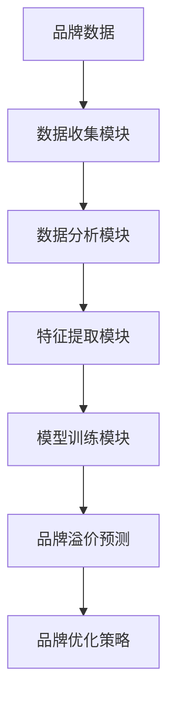
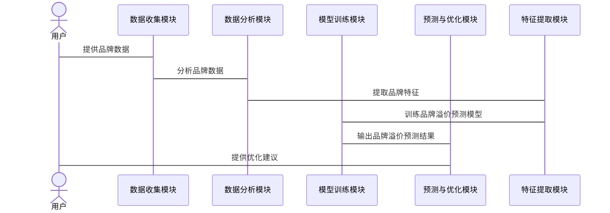

                 


# 巴菲特的品牌溢价理论：数字营销时代的品牌价值

## 关键词：品牌溢价、巴菲特、数字营销、品牌价值、企业估值、市场分析、投资策略

## 摘要：本文深入探讨了巴菲特的品牌溢价理论在数字营销时代的应用，分析了品牌溢价的核心概念、数学模型、算法实现以及系统架构设计。通过实际案例和Python代码实现，展示了如何在数字营销中评估和提升品牌溢价，为企业价值最大化提供科学依据。

---

# 第一部分：引言

## 第1章：品牌溢价的定义与重要性

### 1.1 品牌溢价的定义
品牌溢价是指消费者在购买某一品牌产品时，愿意支付的价格超过该产品基本成本的差额。简单来说，品牌溢价是品牌价值的量化表现，反映了品牌在市场中的独特地位和附加价值。

### 1.2 数字营销时代的品牌溢价
在数字营销时代，品牌溢价的重要性更加凸显。随着互联网和社交媒体的普及，品牌可以通过数据分析和精准营销，直接影响消费者的认知和购买决策，从而影响品牌溢价的计算。

### 1.3 品牌溢价与企业价值的关系
品牌溢价是企业价值的重要组成部分。高品牌溢价意味着企业在市场中具有更强的竞争力和议价能力，从而为企业带来更高的利润和市场地位。

---

# 第二部分：核心概念与联系

## 第2章：品牌溢价的核心要素

### 2.1 品牌认知度
品牌认知度是品牌溢价的基础。消费者对品牌的熟悉程度直接影响其愿意支付的价格。例如，知名品牌的产品通常能够卖出更高的价格，因为消费者信任该品牌。

### 2.2 品牌忠诚度
品牌忠诚度是品牌溢价的关键因素。忠诚的消费者更愿意为品牌支付溢价，因为他们对品牌有情感依赖和信任。

### 2.3 品牌影响力
品牌影响力决定了品牌在市场中的地位和影响力。具有强大影响力的ブランドは、消费者に高いブランドPremiumを達成することができる。

## 第3章：品牌溢价与相关概念的对比

### 3.1 品牌价值与品牌溢价的区别
品牌价值是品牌在市场中的整体价值，包括品牌知名度、忠诚度和影响力等因素。品牌溢价是品牌价值的具体体现，反映了消费者为品牌支付的额外价格。

### 3.2 品牌忠诚度与品牌溢价的关系
品牌忠诚度越高，品牌溢价的可能性越大。忠诚的消费者更愿意为品牌支付更高的价格，因为他们信任该品牌。

### 3.3 品牌影响力与品牌溢价的关系
品牌影响力是品牌溢价的重要因素。具有强大影响力的ブランドは、消费者に高いブランドPremiumを達成することができる。

---

# 第三部分：算法原理与数学模型

## 第4章：品牌溢价的数学模型

### 4.1 品牌溢价的计算公式
$$ 品牌溢价 = 品牌价值 - 成本价值 $$

### 4.2 品牌溢价的动态评估模型
$$ DP(t) = f(CV(t), LV(t), KPI(t)) $$

## 第5章：品牌溢价的算法实现

### 5.1 数据收集与特征提取
- 数据收集：收集品牌相关数据，包括销售数据、消费者反馈、社交媒体互动等。
- 特征提取：提取品牌相关特征，如品牌知名度、忠诚度、影响力等。

### 5.2 品牌溢价预测模型
- 使用机器学习算法（如随机森林、支持向量机等）进行品牌溢价预测。
- 通过自然语言处理技术分析消费者评论，提取情感特征，进一步影响品牌溢价计算。

### 5.3 Python代码实现
```python
import pandas as pd
from sklearn.ensemble import RandomForestRegressor

# 数据加载
data = pd.read_csv('brand_data.csv')

# 特征提取
features = data[['brand_recognition', 'loyalty', 'influence']]
target = data['brand_premium']

# 模型训练
model = RandomForestRegressor()
model.fit(features, target)

# 预测品牌溢价
predicted_premium = model.predict(features)
```

---

# 第四部分：系统架构设计

## 第6章：数字营销中的品牌价值评估系统

### 6.1 系统功能设计
- 数据收集模块：收集品牌相关数据，包括销售数据、消费者反馈、社交媒体互动等。
- 数据分析模块：对收集到的数据进行分析，提取品牌相关特征，如品牌知名度、忠诚度、影响力等。
- 模型训练模块：使用机器学习算法训练品牌溢价预测模型。
- 预测与优化模块：根据模型预测结果，优化品牌策略，提升品牌溢价。

### 6.2 系统架构图


### 6.3 系统接口设计
- 数据接口：与各种数据源（如销售数据、社交媒体数据）对接。
- 用户接口：提供品牌溢价预测结果和优化建议。

### 6.4 系统交互流程


---

# 第五部分：项目实战

## 第7章：基于巴菲特品牌溢价理论的数字营销策略

### 7.1 案例分析
假设某品牌A和品牌B，品牌A具有较高的品牌认知度和忠诚度，而品牌B在品牌影响力方面较弱。通过巴菲特的品牌溢价理论，我们可以预测品牌A的品牌溢价高于品牌B。

### 7.2 品牌溢价预测与优化
通过Python代码实现品牌溢价预测，并根据预测结果优化品牌策略，如提升品牌影响力、增加品牌忠诚度等。

### 7.3 Python代码实现
```python
import pandas as pd
from sklearn.ensemble import RandomForestRegressor

# 数据加载
data = pd.read_csv('brand_data.csv')

# 特征提取
features = data[['brand_recognition', 'loyalty', 'influence']]
target = data['brand_premium']

# 模型训练
model = RandomForestRegressor()
model.fit(features, target)

# 预测品牌溢价
predicted_premium = model.predict(features)

# 输出结果
print('预测的品牌溢价为：', predicted_premium)
```

---

# 第六部分：总结与展望

## 第8章：总结与注意事项

### 8.1 总结
本文深入探讨了巴菲特的品牌溢价理论在数字营销时代的应用，分析了品牌溢价的核心概念、数学模型、算法实现以及系统架构设计。通过实际案例和Python代码实现，展示了如何在数字营销中评估和提升品牌溢价，为企业价值最大化提供科学依据。

### 8.2 注意事项
在实际应用中，需要注意数据的准确性和完整性，选择合适的算法和模型，以及合理优化品牌策略。

## 第9章：最佳实践与未来研究方向

### 9.1 最佳实践
- 定期评估品牌溢价，根据市场变化调整品牌策略。
- 利用大数据和人工智能技术，提高品牌溢价预测的准确性和实时性。

### 9.2 未来研究方向
- 研究品牌溢价在不同行业中的差异和影响因素。
- 探索品牌溢价与企业社会责任（CSR）之间的关系。

---

通过本文的分析，我们可以看到，巴菲特的品牌溢价理论在数字营销时代具有重要的应用价值。随着技术的不断发展，品牌溢价的评估和优化将更加精准和高效，为企业创造更大的价值。

