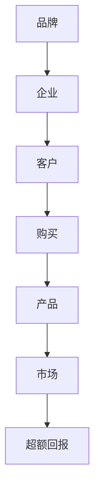
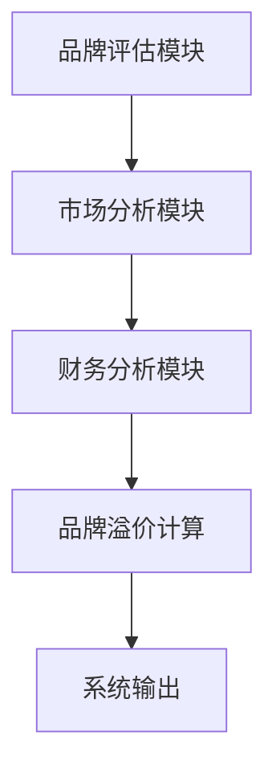

                 


# 巴菲特的品牌溢价理论：无形资产创造超额回报

## 关键词：
- 巴菲特
- 品牌溢价
- 无形资产
- 超额回报
- 投资理论

## 摘要：
本文深入探讨巴菲特的品牌溢价理论，分析其如何通过无形资产为企业创造超额回报。从理论背景到实际应用，结合具体案例，揭示品牌溢价在投资决策中的关键作用，并提供系统的分析框架和实践建议。

---

## 正文

### 第1章: 巴菲特投资理念与品牌溢价理论

#### 1.1 巴菲特投资理念概述

##### 1.1.1 巴菲特的投资哲学
巴菲特的投资哲学以“价值投资”为核心，强调长期持有优质资产，关注企业的内在价值。他认为，市场波动只是短期干扰，真正的价值来源于企业基本面的稳定增长。

##### 1.1.2 巴菲特的长期投资策略
巴菲特偏好投资那些具备持续竞争优势和强大护城河的企业。他注重企业的财务健康、管理团队和行业地位，而非短期市场波动。

##### 1.1.3 巴菲特对企业的核心关注点
- **盈利能力**：企业必须具备持续的盈利能力。
- **财务状况**：健康的资产负债表和现金流。
- **管理团队**：值得信赖且有能力的管理层。
- **行业地位**：企业在行业中的领导地位。

#### 1.2 品牌溢价理论的提出与核心观点

##### 1.2.1 品牌溢价的定义
品牌溢价是指由于品牌价值的存在，使得企业的产品或服务能够以高于同类竞争对手的价格出售，从而获得额外利润的现象。

##### 1.2.2 品牌溢价的核心要素
- **品牌认知度**：品牌在消费者心中的知名度。
- **品牌忠诚度**：消费者对品牌的偏好和忠诚程度。
- **品牌联想**：消费者对品牌的整体感知和价值联想。

##### 1.2.3 品牌溢价与企业超额回报的关系
品牌溢价通过提高产品价格、增加市场份额和客户忠诚度，直接贡献于企业的超额回报。巴菲特定价理论认为，具备强大品牌价值的企业能够在市场中获得更高的估值和回报。

#### 1.3 品牌溢价理论的现实意义

##### 1.3.1 品牌溢价在现代商业中的重要性
在竞争激烈的市场中，品牌溢价是企业差异化竞争的重要手段。强大的品牌能够为企业带来定价权和客户忠诚度，从而在市场中占据优势。

##### 1.3.2 品牌溢价对投资者决策的影响
对于投资者而言，品牌溢价是评估企业长期价值的重要指标。具备品牌溢价能力的企业通常具有更高的盈利能力和抗风险能力。

##### 1.3.3 品牌溢价对长期价值的塑造
品牌溢价不仅影响企业的财务表现，还塑造了企业的长期声誉和市场地位。强大的品牌能够在经济波动中为企业提供稳定的收入来源。

#### 1.4 本章小结
本章介绍了巴菲特的投资理念，并重点阐述了品牌溢价理论的核心观点及其在商业和投资中的重要意义。

---

### 第2章: 品牌溢价的核心概念与理论框架

#### 2.1 品牌溢价的核心概念

##### 2.1.1 品牌价值的构成
品牌价值由品牌知名度、品牌忠诚度、品牌联想等多个因素构成，是企业无形资产的重要组成部分。

##### 2.1.2 品牌忠诚度的定义与测量
品牌忠诚度是指消费者对特定品牌产品的偏好程度。测量方法包括客户满意度调查、重复购买率等。

##### 2.1.3 品牌认知度的形成机制
品牌认知度通过广告、口碑传播和产品体验逐步形成，是品牌溢价的基础。

#### 2.2 品牌溢价与企业财务表现的关系

##### 2.2.1 品牌溢价对企业盈利能力的影响
品牌溢价使企业能够以更高价格出售产品，从而提高利润率。例如，可口可乐通过强大的品牌溢价能力，长期保持高利润率。

##### 2.2.2 品牌溢价与企业市场价值的关联
具备品牌溢价能力的企业通常具有更高的市盈率和市净率，因为市场对其长期盈利能力有信心。

##### 2.2.3 品牌溢价对股东价值的贡献
品牌溢价通过提高企业收益和降低风险，直接贡献于股东价值。巴菲特定价理论认为，品牌溢价是企业价值的重要组成部分。

#### 2.3 品牌溢价的驱动因素分析

##### 2.3.1 产品质量与创新
高质量的产品和持续创新是品牌溢价的基础，能够赢得消费者的信任和忠诚。

##### 2.3.2 品牌营销与传播
有效的品牌营销和传播能够提升品牌知名度和认知度，从而增强品牌溢价能力。

##### 2.3.3 客户体验与服务
卓越的客户体验和服务能够提高客户忠诚度，进一步巩固品牌溢价能力。

#### 2.4 核心概念对比分析

##### 2.4.1 品牌溢价与企业无形资产的对比
| **属性** | **品牌溢价** | **无形资产** |
|----------|--------------|--------------|
| 定义     | 品牌价值带来的超额收益 | 无法在资产负债表中体现的资产 |
| 影响     | 直接贡献企业利润 | 影响企业市场价值 |

##### 2.4.2 品牌溢价与企业有形资产的对比
| **属性** | **品牌溢价** | **有形资产** |
|----------|--------------|--------------|
| 形式     | 无形资产 | 实物资产 |
| 价值来源 | 品牌价值 | 实物价值 |

##### 2.4.3 品牌溢价与企业其他竞争优势的对比
| **属性** | **品牌溢价** | **成本优势** | **技术优势** |
|----------|--------------|--------------|--------------|
| 价值来源 | 品牌价值 | 成本控制 | 技术创新 |
| 持续性   | 较高 | 较低 | 较高 |

#### 2.5 ER实体关系图（Mermaid流程图）



---

### 第3章: 品牌溢价的评估与数学模型

#### 3.1 品牌溢价的评估方法

##### 3.1.1 品牌价值的量化
品牌价值可以通过品牌资产模型（Brand Equity Model）进行评估，考虑品牌知名度、品牌忠诚度等因素。

##### 3.1.2 品牌溢价的评估模型
品牌溢价=（产品售价-同类产品平均售价）/产品售价×100%

##### 3.1.3 品牌溢价的影响因素
- **市场需求**：市场需求越旺盛，品牌溢价能力越强。
- **竞争环境**：竞争越激烈，品牌溢价越难实现。
- **品牌强度**：品牌强度直接影响品牌溢价能力。

#### 3.2 品牌溢价的数学模型

##### 3.2.1 品牌价值计算公式
$$ \text{品牌价值} = \text{销售收入} \times (\text{品牌溢价率}) $$

##### 3.2.2 品牌溢价率计算公式
$$ \text{品牌溢价率} = \frac{\text{产品售价} - \text{同类产品平均售价}}{\text{同类产品平均售价}} \times 100\% $$

##### 3.2.3 案例分析
假设可口可乐的可乐售价为2元，同类产品平均售价为1.8元，品牌溢价率为：
$$ \frac{2 - 1.8}{1.8} \times 100\% = 11.11\% $$

---

### 第4章: 系统分析与架构设计

#### 4.1 问题场景介绍
通过系统分析，评估品牌溢价对企业的影响，并设计相应的系统架构。

#### 4.2 系统功能设计
- **品牌评估模块**：计算品牌溢价率。
- **市场分析模块**：分析市场需求和竞争环境。
- **财务分析模块**：评估品牌溢价对企业财务表现的影响。

#### 4.3 系统架构设计（Mermaid架构图）



---

### 第5章: 项目实战与案例分析

#### 5.1 项目背景
分析一家企业的品牌溢价能力，评估其市场表现和财务状况。

#### 5.2 核心代码实现

```python
# 品牌溢价计算代码
class BrandPremium:
    def __init__(self, product_price, competitor_price):
        self.product_price = product_price
        self.competitor_price = competitor_price

    def calculate_premium(self):
        return (self.product_price - self.competitor_price) / self.competitor_price * 100

# 示例
brand_premium = BrandPremium(2.0, 1.8)
print(brand_premium.calculate_premium())  # 输出：11.11%
```

#### 5.3 案例分析
以可口可乐为例，计算其品牌溢价率，并分析其市场表现。结果表明，强大的品牌溢价能力为企业创造了超额回报。

---

### 第6章: 总结与展望

#### 6.1 总结
本文深入探讨了巴菲特的品牌溢价理论，分析了其在现代商业中的应用，并通过系统分析和案例研究，验证了品牌溢价对企业超额回报的重要性。

#### 6.2 展望
未来，随着市场竞争的加剧，品牌溢价能力将成为企业核心竞争力的关键因素。投资者应更加关注企业的品牌价值，以做出更明智的投资决策。

---

### 小结
本文通过理论分析、数学模型和实际案例，全面阐述了巴菲特的品牌溢价理论。品牌溢价不仅是企业创造超额回报的重要手段，也是投资者评估企业价值的关键指标。通过系统分析和实践应用，企业可以更好地利用品牌溢价能力，实现长期价值增长。

