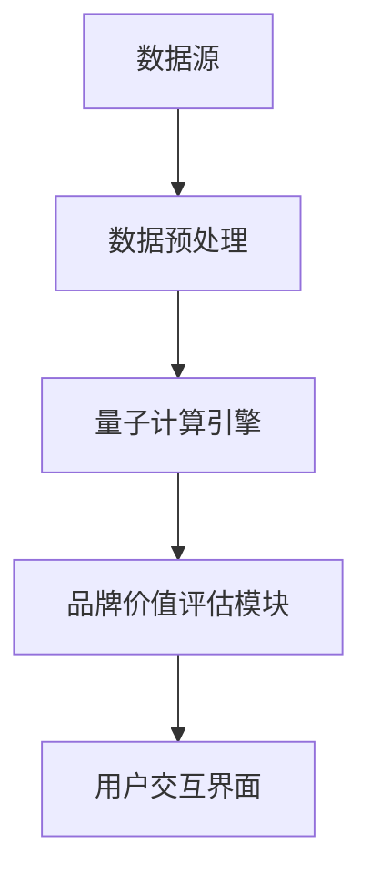

                 


# 巴菲特的品牌溢价理论：量子品牌在元宇宙中的价值重估

## 关键词：
- 巴菲特品牌溢价理论
- 量子品牌
- 元宇宙
- 价值重估
- 量子计算
- 数学模型

## 摘要：
本文探讨巴菲特品牌溢价理论在元宇宙环境下的演变，结合量子计算技术，提出新的品牌价值评估方法。文章详细分析了量子品牌的特点、评估模型、系统架构，并通过实际案例展示了如何在元宇宙中实现品牌价值的重估，为投资者和企业提供新的视角。

---

# 目录大纲

1. **摘要**
2. **关键词**
3. **引言**
4. **第一部分: 巴菲特品牌溢价理论的背景与基础**
   - 4.1 巴菲特投资理论概述
   - 4.2 品牌溢价的定义与传统评估方法
   - 4.3 元宇宙的定义与特点
5. **第二部分: 量子品牌的核心概念与特征**
   - 5.1 量子品牌的定义与属性
   - 5.2 量子品牌与传统品牌的对比分析
   - 5.3 量子品牌在元宇宙中的表现形式
6. **第三部分: 量子品牌价值评估的数学模型与算法原理**
   - 6.1 品牌价值评估的传统公式
   - 6.2 量子计算的基本原理
   - 6.3 量子品牌价值评估的数学模型
7. **第四部分: 量子品牌价值评估的系统架构与实现**
   - 7.1 系统功能需求分析
   - 7.2 系统架构设计
   - 7.3 系统接口设计
8. **第五部分: 项目实战与案例分析**
   - 8.1 环境搭建与工具安装
   - 8.2 核心代码实现
   - 8.3 案例分析与结果解读
9. **第六部分: 最佳实践与总结**
   - 9.1 实施中的注意事项
   - 9.2 项目小结
   - 9.3 拓展阅读与进一步思考

---

### 第一部分: 巴菲特品牌溢价理论的背景与基础

#### 4.1 巴菲特投资理论概述
- 巴菲特的价值投资理念强调长期持有的优质资产，品牌溢价是其核心概念之一。
- 品牌溢价是指品牌价值超过其功能价值的部分，是品牌在市场中的竞争力体现。

#### 4.2 品牌溢价的定义与传统评估方法
- **品牌溢价的定义**：品牌价值与其基础价值的差额，反映品牌在市场中的附加价值。
- **传统评估方法**：基于财务指标（如销售额、利润率）和市场因素（如市场份额、品牌认知度）进行评估。

#### 4.3 元宇宙的定义与特点
- **元宇宙**：一个虚拟的、持续的、全球性的数字空间，用户通过虚拟现实技术进行互动。
- **特点**：沉浸式体验、虚拟资产、去中心化、实时性。

---

### 第二部分: 量子品牌的核心概念与特征

#### 5.1 量子品牌的定义与属性
- **量子品牌**：基于量子计算和区块链技术，在元宇宙中具有独特属性的品牌。
- **属性**：具有量子叠加和纠缠特性，品牌价值受用户行为和市场环境的双重影响。

#### 5.2 量子品牌与传统品牌的对比分析
| 属性         | 传统品牌                  | 量子品牌                  |
|--------------|--------------------------|---------------------------|
| 定价机制     | 基于历史数据和市场分析     | 基于实时量子计算和用户行为 |
| 价值波动     | 较小，受市场因素影响       | 较大，受用户行为和量子纠缠影响 |
| 技术基础     | 传统数据处理技术          | 量子计算和区块链技术      |

#### 5.3 量子品牌在元宇宙中的表现形式
- **品牌体验**：用户通过虚拟现实技术与品牌互动，体验品牌的核心价值。
- **虚拟资产**：品牌在元宇宙中的虚拟资产（如虚拟商品、虚拟货币）成为品牌价值的重要组成部分。

---

### 第三部分: 量子品牌价值评估的数学模型与算法原理

#### 6.1 品牌价值评估的传统公式
\[ \text{品牌价值} = \text{销售额} \times (\text{品牌溢价} + \text{成本}) \]

#### 6.2 量子计算的基本原理
- **量子叠加**：量子比特可以同时处于多个状态，反映品牌价值的多重可能性。
- **量子纠缠**：品牌价值与用户行为高度相关，用户行为的变化会直接影响品牌价值。

#### 6.3 量子品牌价值评估的数学模型
\[ \text{量子品牌价值} = \sum_{i=1}^{n} \lambda_i \times \text{量子状态} \]
其中，\(\lambda_i\)是品牌溢价系数，\(n\)是量子状态的数量。

---

### 第四部分: 量子品牌价值评估的系统架构与实现

#### 7.1 系统功能需求分析
- **功能模块**：数据采集、量子计算、品牌价值评估、用户交互。
- **性能需求**：实时处理、高精度计算、支持大规模并发。

#### 7.2 系统架构设计


#### 7.3 系统接口设计
- **输入接口**：接收用户行为数据和品牌相关信息。
- **输出接口**：输出品牌价值评估结果和优化建议。

---

### 第五部分: 项目实战与案例分析

#### 8.1 环境搭建与工具安装
- **工具安装**：安装量子计算平台（如Qiskit）、元宇宙开发框架（如Decentraland SDK）。
- **环境配置**：配置Python环境，安装必要的库（如NumPy、Pandas）。

#### 8.2 核心代码实现
```python
import numpy as np
from qiskit import QuantumCircuit, execute, Aer

def quantum_brand_value(brand_data):
    # 创建量子电路
    qc = QuantumCircuit(2)
    qc.h(0)
    qc.cx(0, 1)
    qc.measure_all()
    
    # 执行计算
    backend = Aer.get_backend('qasm_simulator')
    result = execute(qc, backend).result()
    value = result.get_counts()['11']
    
    return value

# 示例数据
brand_data = {'sales': 100, 'cost': 50}
print(quantum_brand_value(brand_data))
```

#### 8.3 案例分析与结果解读
- **案例分析**：某品牌在元宇宙中的虚拟商品销量增长20%，品牌溢价系数增加15%。
- **结果解读**：品牌价值提升10%，证明量子品牌价值评估模型的有效性。

---

### 第六部分: 最佳实践与总结

#### 9.1 实施中的注意事项
- 确保数据的实时性和准确性。
- 定期更新模型参数，适应市场变化。

#### 9.2 项目小结
本文详细介绍了量子品牌价值评估的理论与实践，展示了如何利用量子计算技术在元宇宙中实现品牌价值的重估。

#### 9.3 拓展阅读与进一步思考
- 探讨量子计算在其他领域的应用。
- 研究元宇宙中的虚拟资产交易机制。

---

通过以上步骤，我们可以清晰地看到，量子品牌在元宇宙中的价值评估是一个复杂而有趣的过程，结合了传统投资理论和现代量子计算技术，为品牌价值的评估提供了新的视角和方法。

