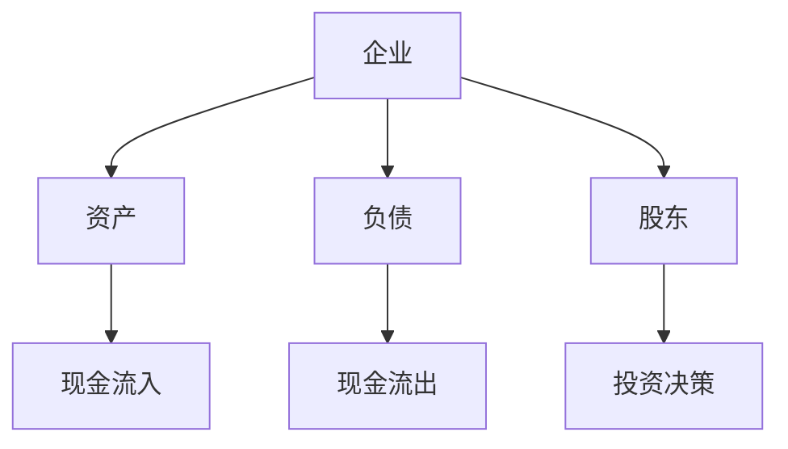
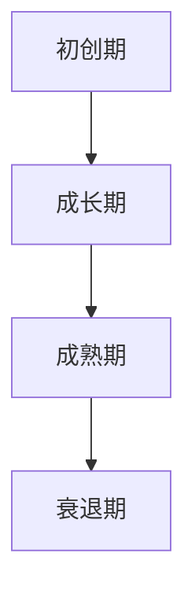

                 

# 巴菲特的商业分析方法论

## 关键词
- 巴菲特
- 商业分析
- 价值投资
- 财务分析
- 企业估值
- 竞争优势
- 投资策略

## 摘要
本文深入探讨了巴菲特的商业分析方法论，从其核心投资理念到具体的财务分析方法，再到企业竞争优势的评估，系统地分析了巴菲特的成功秘诀。文章不仅详细阐述了巴菲特的价值投资策略，还通过实际案例和数学模型，展示了如何将这些方法应用于实际投资中。

---

## 正文

### 第一部分：背景介绍

#### 1. 巴菲特的投资理念概述

##### 1.1 巴菲特投资理念的核心思想
巴菲特的价值投资理念是商业分析领域的重要里程碑。他强调长期投资、安全边际和企业内在价值，认为市场波动是投资机会的来源。

##### 1.2 成功案例分析
巴菲特通过投资可口可乐和伯克希尔 Hathaway 等企业，展示了其方法的有效性。这些案例说明了他如何通过分析企业的竞争优势和财务状况来做出投资决策。

##### 1.3 投资哲学
巴菲特的哲学包括长期持有、避免短期波动和注重企业内在价值。他强调管理层诚信和资本效率的重要性。

#### 2. 投资理念的背景与演变
巴菲特的投资理念起源于格雷厄姆的价值投资方法，但他在实践中进行了创新，形成了独特的分析框架。

---

### 第二部分：核心概念与联系

#### 2. 企业价值评估的核心要素
企业价值评估包括资产、负债、现金流和未来收益。通过分析这些要素，可以确定企业的内在价值。

##### 表格：核心要素对比
| 核心要素 | 特征 |
|----------|------|
| 资产     | 企业的资源和权利 |
| 负债     | 企业的债务和义务 |
| 现金流   | 企业的资金流动情况 |
| 未来收益| 企业的预期收益 |

##### 实体关系图（ER图）

#### 3. 财务报表分析方法
财务报表分析是商业分析的重要工具，包括资产负债表、利润表和现金流量表的分析。

##### 数学公式
$$ \text{净利润} = \text{收入} - \text{成本} - \text{费用} $$

#### 4. 企业竞争优势的识别
竞争优势是企业长期盈利能力的关键。巴菲特关注经济护城河和成本优势。

##### 表格：竞争优势类型
| 类型     | 描述                       |
|----------|---------------------------|
| 品牌优势 | 强大的品牌影响力           |
| 技术优势 | 独特的技术或专利           |
| 成本优势 | 更低的生产成本             |
| 市场优势 | 占据主要市场份额           |

#### 5. 管理层评估
管理层的能力和决策对企业发展至关重要。巴菲特关注管理层的诚信和资本分配能力。

---

### 第三部分：系统分析与架构设计

#### 1. 财务报表分析与企业估值

##### 1.1 股权自由现金流模型
股权自由现金流模型用于评估企业的内在价值。

$$ \text{内在价值} = \sum_{t=1}^{\infty} \frac{\text{CF}_t}{(1 + r)^t} $$

##### 1.2 折现率的确定
折现率由无风险利率和市场风险溢价组成。

$$ r = r_f + \text{市场风险溢价} $$

##### 1.3 现金流折现法（DCF）
现金流折现法是评估企业价值的重要工具。

#### 2. 优势与劣势分析
竞争优势分析帮助企业识别市场地位和成本优势。

##### 1. 优势分析
优势分析包括品牌影响力和技术专利。

##### 2. 劣势分析
劣势分析包括高竞争市场和成本劣势。

#### 3. 企业生命周期分析
企业生命周期分为初创期、成长期、成熟期和衰退期。

##### 生命周期模型

---

### 第四部分：项目实战

#### 1. 项目背景
选择一家制造企业进行分析，评估其竞争优势和财务状况。

#### 2. 数据收集与分析
收集财务报表、行业数据和管理层信息，分析企业的现金流和盈利能力。

#### 3. 估值计算
使用DCF模型计算企业的内在价值，确定是否低估。

#### 4. 投资决策
根据分析结果，决定是否投资该企业。

---

### 第五部分：总结与展望

#### 1. 总结
巴菲特的商业分析方法论提供了系统化的投资框架，强调价值投资和长期持有。

#### 2. 展望
未来，投资者需要结合新技术和新方法，不断优化分析模型。

---

### 结束语

巴菲特的商业分析方法论是投资领域的重要参考。通过系统的分析和实践，投资者可以更好地理解和应用这些方法，做出更明智的投资决策。

