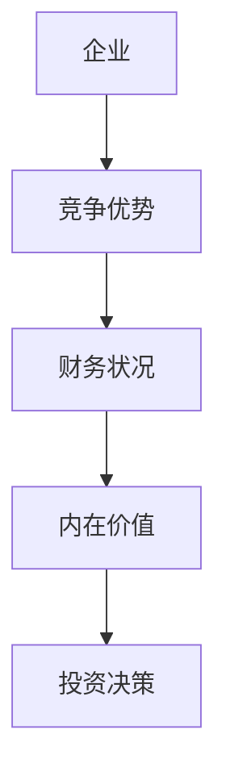
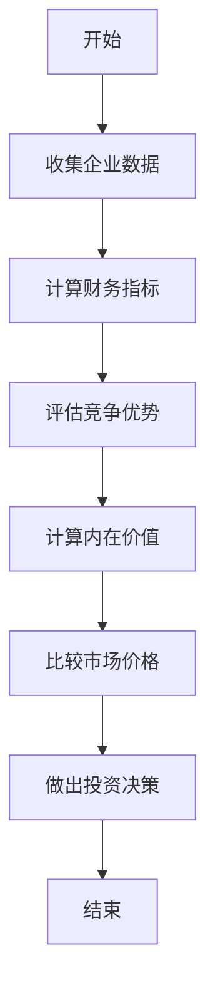
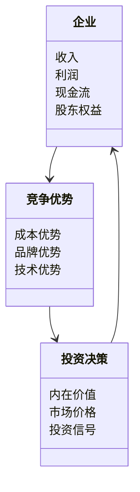
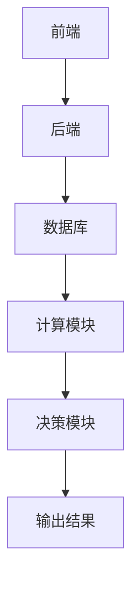

                 


# 巴菲特的商业模式分析

## 关键词：
- 巴菲特
- 投资策略
- 价值投资
- 财务分析
- 长期持有
- 竞争优势

## 摘要：
本文深入分析了巴菲特的商业模式，探讨了其投资哲学、选股标准、行业分析、长期投资策略以及风险管理方法。通过系统化的分析和实际案例，揭示了巴菲特商业模式的核心要素及其成功的关键因素，为投资者提供了实用的指导和启示。

---

# 第一部分: 巴菲特商业模式的背景与概述

## 第1章: 巴菲特商业模式的核心概念

### 1.1 巴菲特商业模式的背景介绍

#### 1.1.1 投资领域的核心问题
投资的核心问题在于如何在不确定性中实现价值的最大化。投资者需要在有限的信息和资源下，做出最优的决策。巴菲特的商业模式提供了一种基于基本面分析和长期持有策略的方法，旨在通过深入研究企业内在价值来实现稳定的投资回报。

#### 1.1.2 巴菲特商业模式的定义与外延
巴菲特的商业模式是一种以价值投资为核心，结合对企业基本面分析和长期持有的投资策略。其核心在于通过对企业内在价值的评估，寻找那些具有持续竞争优势和良好财务状况的企业进行投资。

#### 1.1.3 模型的核心要素与概念结构
- **企业内在价值**：企业未来现金流的现值，是巴菲特选股的核心依据。
- **竞争优势**：企业相对于竞争对手的独特优势，如成本优势、品牌优势等。
- **财务健康状况**：企业的财务报表分析，包括盈利能力、偿债能力等。
- **长期持有**：投资后长期持有，避免频繁交易以减少成本和税负。

---

### 1.2 巴菲特商业模式的核心概念与联系

#### 1.2.1 核心概念原理
巴菲特的商业模式基于以下核心原理：
1. **价值投资**：寻找市场价格低于内在价值的企业。
2. **长期持有**：通过长期持有优质企业，分享其成长带来的收益。
3. **竞争优势**：投资那些具有可持续竞争优势的企业。

#### 1.2.2 核心概念对比表格
以下是巴菲特模式与其他投资模式的对比：

| 对比维度 | 巴菲特模式 | 趋势投资模式 | 技术分析模式 |
|----------|------------|--------------|--------------|
| 投资依据 | 企业内在价值 | 市场趋势 | 技术指标 |
| 分析方法 | 基本面分析 | 市场情绪分析 | 图表分析 |
| 投资期限 | 长期持有 | 短期交易 | 短期交易 |

#### 1.2.3 ER实体关系图架构（Mermaid流程图）



---

## 第2章: 巴菲特商业模式的分析框架

### 2.1 巴菲特投资哲学与分析方法

#### 2.1.1 投资哲学的核心思想
巴菲特的投资哲学强调以下几点：
1. **安全边际**：买入价格低于内在价值，以确保安全边际。
2. **长期视角**：投资不是短期交易，而是长期持有优质企业。
3. **简单与可预测性**：选择那些业务简单、容易预测的企业。

#### 2.1.2 价值投资的定义与特征
价值投资是一种通过分析企业内在价值，寻找市场价格低于内在价值的投资方法。其特征包括：
- 以基本面分析为基础。
- 寻找被市场低估的企业。
- 长期持有，避免短期波动的影响。

#### 2.1.3 巴菲特的分析框架
巴菲特的分析框架包括以下步骤：
1. **行业分析**：选择具有稳定增长潜力的行业。
2. **企业分析**：评估企业的竞争优势、财务状况和管理团队。
3. **估值分析**：计算企业的内在价值，确定买入价格。

---

### 2.2 巴菲特的选股标准与流程

#### 2.2.1 企业基本面分析
基本面分析包括以下关键指标：
1. **盈利能力**：净利润率、ROE（股东权益收益率）。
2. **财务健康状况**：资产负债率、现金流情况。
3. **成长能力**：收入增长率、净利润增长率。

#### 2.2.2 企业竞争优势分析
竞争优势是巴菲特选股的重要标准，包括：
1. **成本优势**：企业是否具有更低的生产成本。
2. **品牌优势**：品牌是否具有强大的市场影响力。
3. **技术优势**：企业是否拥有独特的技术或专利。

#### 2.2.3 财务指标评估
以下是常用的财务指标及其计算公式：

- **ROE（股东权益收益率）**：
  $$ROE = \frac{\text{净利润}}{\text{股东权益}}$$
  
- **ROA（资产净利率）**：
  $$ROA = \frac{\text{净利润}}{\text{总资产}}$$

- **净利率**：
  $$\text{净利率} = \frac{\text{净利润}}{\text{营业收入}}$$

---

## 第3章: 巴菲特商业模式与传统投资模式的对比

### 3.1 巴菲特模式的独特性

#### 3.1.1 价值投资与趋势投资的区别
- **价值投资**：基于企业内在价值，寻找低估企业。
- **趋势投资**：基于市场趋势，跟随市场热点。

#### 3.1.2 长期持有与短期交易的对比
- **长期持有**：避免频繁交易，降低交易成本。
- **短期交易**：依赖市场波动，风险较高。

#### 3.1.3 投资者心态与行为模式
巴菲特强调长期投资和价值投资，而趋势投资则更依赖市场情绪和短期波动。

---

### 3.2 巴菲特模式的优劣势分析

#### 3.2.1 优势分析
1. **稳定性**：长期持有策略降低了市场波动的影响。
2. **安全性**：安全边际的设置降低了投资风险。
3. **可持续性**：选择具有竞争优势的企业，确保长期收益。

#### 3.2.2 劣势分析
1. **灵活性差**：长期持有策略在市场剧烈波动时可能表现不佳。
2. **信息依赖**：需要大量的企业信息和分析能力。

#### 3.2.3 适用场景与限制
巴菲特模式适用于那些具有稳定增长潜力的行业和企业，但在市场波动剧烈或经济衰退时期可能表现不佳。

---

# 第二部分: 巴菲特商业模式的系统化分析

## 第4章: 巴菲特商业模式的数学模型与算法原理

### 4.1 巴菲特投资模型的数学公式

#### 4.1.1 股票内在价值的计算公式
股票的内在价值可以通过未来现金流的现值计算：

$$\text{内在价值} = \sum_{t=1}^{n} \frac{\text{CF}_t}{(1 + r)^t}$$

其中，CFₜ为第t年的现金流，r为折现率。

#### 4.1.2 股东权益收益率（ROE）的计算
$$ROE = \frac{\text{净利润}}{\text{股东权益}}$$

#### 4.1.3 其他关键指标的数学表达
- **净现值（NPV）**：
  $$\text{NPV} = \sum_{t=1}^{n} \frac{\text{CF}_t}{(1 + r)^t} - \text{初始投资}$$

---

### 4.2 巴菲特分析模型的算法原理

#### 4.2.1 算法步骤
1. **收集企业财务数据**：包括收入、利润、现金流等。
2. **计算关键财务指标**：ROE、ROA、净利率等。
3. **评估竞争优势**：分析企业的成本优势、品牌优势等。
4. **计算内在价值**：使用现金流折现法计算内在价值。
5. **比较市场价格与内在价值**：如果市场价格低于内在价值，考虑买入。

#### 4.2.2 算法流程图（Mermaid流程图）



---

## 第5章: 巴菲特商业模式的系统化应用

### 5.1 巴菲特模式的系统架构设计

#### 5.1.1 系统功能设计（领域模型）
以下是企业的信息管理系统架构：



#### 5.1.2 系统架构设计（Mermaid架构图）



---

### 5.2 巴菲特模式的项目实战

#### 5.2.1 项目环境安装
需要安装以下工具：
- Python编程语言
- 数据分析库（Pandas、NumPy）
- 图形库（Matplotlib、Seaborn）

#### 5.2.2 核心代码实现

以下是计算ROE和ROA的Python代码示例：

```python
import pandas as pd

# 假设财务数据存储在Excel文件中
df = pd.read_excel('financial_data.xlsx')

# 计算ROE和ROA
roe = df['净利润'] / df['股东权益']
roa = df['净利润'] / df['总资产']

# 输出结果
print("ROE:", roe)
print("ROA:", roa)
```

#### 5.2.3 代码应用解读与分析
通过上述代码，我们可以计算企业的ROE和ROA，进而评估企业的盈利能力。如果ROE和ROA均高于行业平均水平，则该企业具有较高的投资价值。

---

## 第6章: 巴菲特商业模式的启示与最佳实践

### 6.1 巴菲特商业模式的启示

#### 6.1.1 长期投资的重要性
长期持有优质企业可以避免短期波动的影响，分享企业的长期增长。

#### 6.1.2 价值投资的核心
寻找市场价格低于内在价值的企业，确保安全边际。

#### 6.1.3 竞争优势的决定作用
企业的竞争优势是其长期盈利能力的关键因素。

---

### 6.2 巴菲特商业模式的最佳实践

#### 6.2.1 投资策略的制定
- 确定投资目标和风险承受能力。
- 选择具有竞争优势和财务健康的企业。
- 设定合理的买入和卖出价格。

#### 6.2.2 风险管理的必要性
- 分散投资，避免过度集中。
- 定期评估投资组合，调整持仓。

#### 6.2.3 持续学习与改进
- 关注企业动态和市场变化。
- 不断优化分析模型和投资策略。

---

## 第7章: 总结与展望

### 7.1 总结
巴菲特的商业模式是一种以价值投资为核心，结合对企业基本面分析和长期持有的投资策略。通过深入分析企业的内在价值和竞争优势，巴菲特成功地实现了一致性的投资回报。

### 7.2 展望
随着市场的变化和企业环境的复杂化，巴菲特的商业模式需要不断适应新的挑战。未来，投资者需要更加注重企业的可持续发展能力和风险管理，以确保投资的稳健回报。

---

## 关键词索引
- 巴菲特
- 价值投资
- 长期持有
- 竞争优势
- 财务分析
- 投资策略

---

## 参考文献
1. 巴菲特《巴菲特写给股东的信》
2. 《价值投资实战》
3. 《投资学原理》

---

通过以上内容，我们系统地分析了巴菲特的商业模式，从理论到实践，从分析到应用，为投资者提供了全面的指导和启示。希望本文能帮助读者更好地理解和应用巴菲特的商业模式，实现稳健的投资回报。

