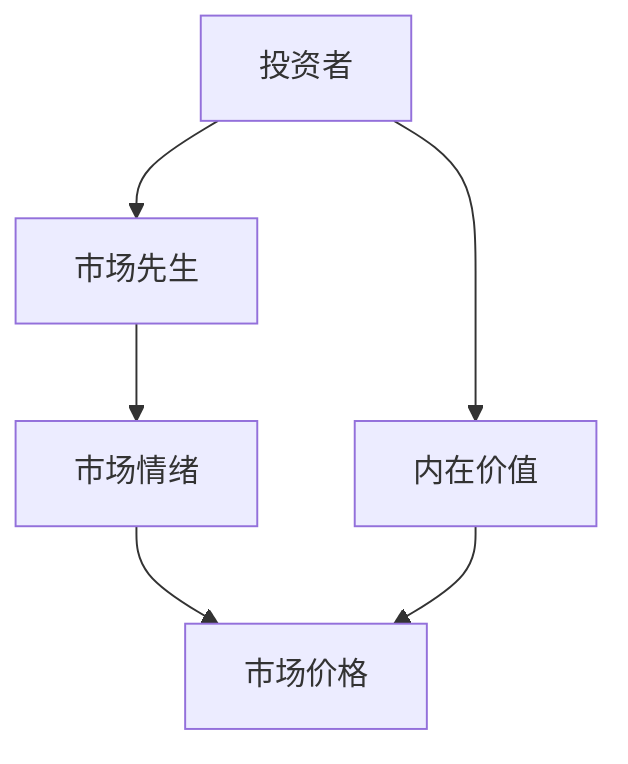
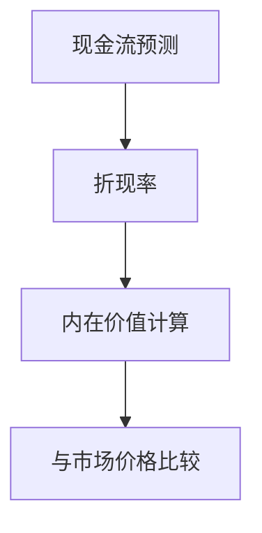

                 

# 巴菲特的四大投资准则：选择优质股票的关键

> 关键词：巴菲特、投资准则、价值投资、安全边际、内在价值、市场先生

> 摘要：本文系统地探讨了巴菲特的四大投资准则，包括价值投资、安全边际、内在价值和市场先生的概念、算法原理及其相互关系。通过详细分析每个准则的核心概念和实际应用，本文旨在帮助投资者理解如何通过这些准则选择优质股票，构建稳健的投资组合。

---

## 第一部分: 巴菲特投资准则的背景与核心概念

### 第一章: 投资准则的演变与核心理念

#### 1.1 投资准则的演变历程

##### 1.1.1 传统投资理论的局限性
传统投资理论，如技术分析和市场择时，依赖于价格波动和市场情绪的预测。然而，这些方法在市场波动剧烈时往往表现不佳，尤其是在2008年金融危机期间，许多投资者发现仅依靠技术分析无法有效规避风险。

##### 1.1.2 巴菲特投资理念的形成
巴菲特的投资理念深受本杰明·格雷厄姆的影响，格雷厄姆的“价值投资”方法强调购买低于其内在价值的股票。巴菲特在此基础上进一步发展了这一理念，提出了安全边际、市场先生等概念，使其更具操作性。

##### 1.1.3 当代投资准则的发展与变革
随着金融市场的复杂化和全球化，巴菲特的投资准则不断被重新诠释和扩展，但其核心理念——寻找具有持续竞争优势、良好管理和稳定现金流的公司——依然适用。

#### 1.2 巴菲特投资准则的核心理念

##### 1.2.1 价值投资的定义与特征
价值投资是一种投资策略，强调以低于内在价值的价格买入优质资产。其核心特征包括：
1. **长期视角**：关注公司的长期价值，而非短期价格波动。
2. **基本面分析**：通过分析公司的财务报表、行业地位和竞争优势来评估其内在价值。
3. **逆向思维**：在市场恐慌时寻找被低估的投资标的。

##### 1.2.2 安全边际的概念与作用
安全边际是指买入价格与内在价值之间的差距，用以缓冲潜在的市场风险和不确定性。例如，如果一只股票的内在价值为100元，但当前价格为80元，那么20元的差距就是安全边际。安全边际的存在可以降低投资损失的风险。

##### 1.2.3 内在价值与市场价值的对比
内在价值是基于公司未来现金流的现值，而市场价值是市场参与者情绪的反映。当市场价值低于内在价值时，投资机会出现。

##### 1.2.4 市场先生的角色与影响
市场先生是一个拟人化的概念，代表市场的波动性和不确定性。投资者应避免被市场先生的情绪左右，而应基于理性分析做出投资决策。

### 第二章: 巴菲特四大投资准则的核心概念与联系

#### 2.1 核心概念原理

##### 2.1.1 价值投资的数学模型
价值投资的核心是通过分析公司的财务数据，计算其内在价值。常见的模型包括：

1. **股利折现模型（DDM）**：
   $$ V = \frac{D}{k - g} $$
   其中，$V$ 是股票的内在价值，$D$ 是预期股利，$k$ 是折现率，$g$ 是股利增长率。

2. **自由现金流模型（DCF）**：
   $$ V = \sum_{t=1}^{n} \frac{CF_t}{(1+r)^t} $$
   其中，$CF_t$ 是第$t$年的自由现金流，$r$ 是折现率。

##### 2.1.2 安全边际的计算方法
安全边际的计算公式为：
$$ \text{安全边际} = \text{内在价值} - \text{市场价格} $$

##### 2.1.3 内在价值的评估公式
内在价值的计算可以简化为：
$$ \text{内在价值} = \frac{\text{净利润} \times (1 + g)}{k - g} $$
其中，$g$ 是净利润增长率，$k$ 是贴现率。

##### 2.1.4 市场先生的行为特征
市场先生的行为可以用以下模型描述：
$$ P = V + E $$
其中，$P$ 是市场价格，$V$ 是内在价值，$E$ 是情绪溢价。

#### 2.2 概念属性特征对比表格
以下表格对比了巴菲特四大投资准则的核心概念：

| 概念       | 属性       | 特征描述                                                                 |
|------------|------------|--------------------------------------------------------------------------|
| 价值投资   | 核心理念   | 以低于内在价值的价格买入优质资产                                           |
| 安全边际   | 风险控制   | 确保买入价格远低于内在价值，以降低投资风险                                   |
| 内在价值   | 计量标准   | 资产在未来现金流的现值，基于基本面分析                                       |
| 市场先生    | 行为特征   | 市场情绪波动，投资者应独立于市场做出理性决策                                   |

#### 2.3 ER实体关系图（Mermaid流程图）

### 第三章: 巴菲特投资准则的算法原理

#### 3.1 内在价值评估算法（Mermaid流程图）

#### 3.2 内在价值计算公式（LaTeX）

$$
\text{内在价值} = \sum_{t=1}^{n} \frac{CF_t}{(1 + r)^t}
$$

其中：
- $CF_t$ 表示第$t$年的现金流
- $r$ 是折现率
- $n$ 是预测的年数

#### 3.3 实际案例分析

假设某公司未来5年的现金流预测如下：

| 年份 | 现金流（万元） |
|------|----------------|
| 2024 | 100            |
| 2025 | 120            |
| 2026 | 150            |
| 2027 | 180            |
| 2028 | 200            |

假设折现率为10%（即$r=0.10$），计算内在价值：

$$
\text{内在价值} = \frac{100}{1.10^1} + \frac{120}{1.10^2} + \frac{150}{1.10^3} + \frac{180}{1.10^4} + \frac{200}{1.10^5}
$$

计算结果为约447.21万元。

---

通过以上分析，我们可以看到，巴菲特的投资准则并非一成不变的公式，而是需要结合市场实际情况进行灵活运用。接下来，我们将深入探讨这些准则在实际投资中的系统架构设计和项目实战。

