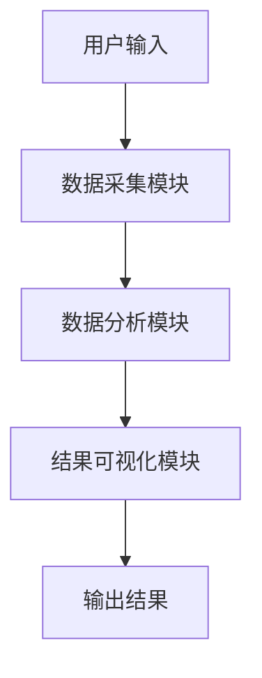
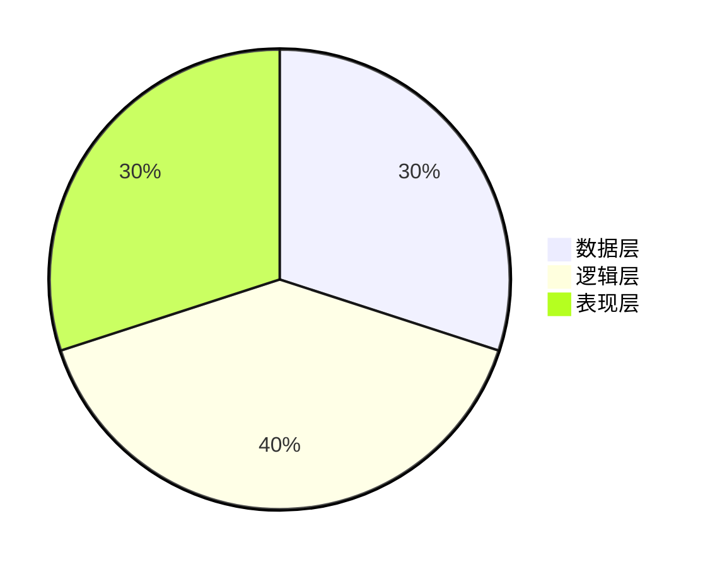

                 


# 巴菲特的圈子理论

## 关键词：巴菲特、圈子理论、社会网络分析、图论、投资策略

## 摘要：本文深入探讨了巴菲特的圈子理论，结合计算机科学中的图论和社会网络分析，剖析其如何通过构建高效的人际网络做出投资决策。文章详细介绍了圈子理论的核心概念、算法实现、系统架构设计以及实际案例分析，为读者提供了一个从理论到实践的完整框架。

---

## 第一部分：背景介绍

### 第1章：巴菲特的生平与投资理念

#### 1.1 巴菲特的早年经历
- **1.1.1 巴菲特的早年经历**
  - 巴菲特出生于1934年，早年表现出色，10岁开始投资股票。
  - 在哥伦比亚大学获得经济学学位，师从本·格雷厄姆。
  - 创办巴菲特合伙公司，积累了早期的投资经验。

- **1.1.2 巴菲特的投资理念**
  - 坚持价值投资，寻找具有持续竞争优势的企业。
  - 重视企业的财务健康和管理层素质。
  - 长期持有优质股票，避免频繁交易。

- **1.1.3 巴菲特的哲学思想**
  - 强调安全边际，避免高风险投资。
  - 重视企业护城河，确保竞争优势的持久性。

#### 1.2 巴菲特的圈子理论背景
- **1.2.1 投资界的圈子现象**
  - 投资领域中，人际关系和网络的重要性逐渐显现。
  - 社会网络分析成为理解投资决策的重要工具。

- **1.2.2 巴菲特圈子理论的提出**
  - 巴菲特通过构建高效的人际网络，获取优质投资机会。
  - 圈子理论强调人际网络在投资决策中的作用。

- **1.2.3 圈子理论的应用范围**
  - 不仅适用于个人投资，也可用于企业战略分析。
  - 为技术领域中的社交网络分析提供理论支持。

---

## 第二部分：圈子理论的核心概念

### 第2章：圈子理论的定义与特点

#### 2.1 圈子理论的定义
- 圈子理论将人际网络视为一种资源，用于支持投资决策。
- 通过分析网络结构，识别关键人物和潜在机会。

#### 2.2 圈子理论的核心特点
- **节点化**：每个人被视为网络中的一个节点。
- **关系化**：节点之间的关系强度决定网络的连通性。
- **层次化**：网络结构具有层次，中心节点具有更高的影响力。

#### 2.3 圈子理论与传统投资理论的区别
| 特性       | 圈子理论                          | 传统投资理论                        |
|------------|-----------------------------------|-------------------------------------|
| 核心要素   | 人际网络、关系强度                | 财务指标、市场趋势                   |
| 分析方法   | 图论、社会网络分析                | 财务分析、技术分析                   |
| 应用范围   | 人际网络驱动投资决策              | 市场分析驱动投资决策                 |

---

### 第3章：圈子理论的数学模型

#### 3.1 圈子理论的图论模型
- **节点与边**：节点代表人物，边代表关系。
- **网络密度**：边的数量与节点数量的比值，反映网络的紧密程度。
- **中心性分析**：通过计算节点的度数和介数，识别关键人物。

#### 3.2 圈子理论的数学表达式
- **度数公式**：$$degree(i) = \sum_{j} a_{ij}$$，其中$a_{ij}$表示节点$i$与$j$之间的关系强度。
- **介数公式**：$$betweenness(i) = \sum_{j < k} \frac{\sigma(j,k|i)}{\sigma(j,k)}$$，其中$\sigma(j,k|i)$表示在移除$i$后$j$到$k$的最短路径数量，$\sigma(j,k)$表示原始最短路径数量。

---

## 第三部分：圈子理论的系统架构设计

### 第4章：系统功能设计

#### 4.1 系统输入与输出
- **输入**：社交网络数据，包括节点和边。
- **输出**：网络分析结果，包括中心节点和社区划分。

#### 4.2 系统功能模块
- 数据采集模块：收集社交网络数据。
- 数据分析模块：计算度数和介数。
- 结果可视化模块：生成网络图和社区划分图。

#### 4.3 系统功能流程图


---

### 第5章：系统架构设计

#### 5.1 系统架构分层
- **数据层**：存储社交网络数据。
- **逻辑层**：实现数据分析算法。
- **表现层**：展示分析结果。

#### 5.2 系统架构图


---

## 第四部分：项目实战

### 第6章：项目实战分析

#### 6.1 分析巴菲特的核心圈子
- 使用Python代码分析巴菲特的核心圈子结构。
- 代码示例：
```python
import networkx as nx

# 创建图
G = nx.Graph()

# 添加节点
G.add_nodes_from(["巴菲特", "芒格", "甲骨文", "苹果"])

# 添加边
G.add_edges_from([("巴菲特", "芒格"), ("芒格", "甲骨文"), ("巴菲特", "苹果")])

# 计算中心性
centrality = nx.betweenness_centrality(G)

# 打印结果
print(centrality)
```

#### 6.2 结果解读
- 巴菲特的中心性最高，是网络的核心节点。
- 芒格和甲骨文位于中间层，是关键的桥梁节点。
- 苹果是巴菲特的重点投资对象，连接了核心网络。

---

## 第五部分：最佳实践

### 第7章：总结与展望

#### 7.1 小结
- 圈子理论为投资决策提供了新的视角。
- 社交网络分析是理解投资网络的重要工具。

#### 7.2 注意事项
- 数据质量影响分析结果。
- 算法选择需根据具体场景调整。

#### 7.3 拓展阅读
- 推荐书籍：《社交网络分析》、《网络科学导论》。
- 推荐工具：NetworkX、Gephi。

---

通过以上结构，文章系统地介绍了巴菲特的圈子理论，并结合技术领域中的图论和社会网络分析，展示了其在投资决策中的应用。希望读者能够通过本文，深入理解圈子理论的核心思想，并在实际中灵活应用。

