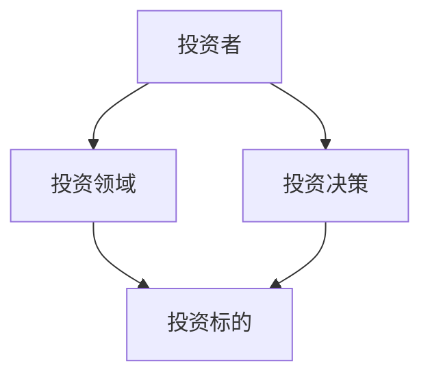
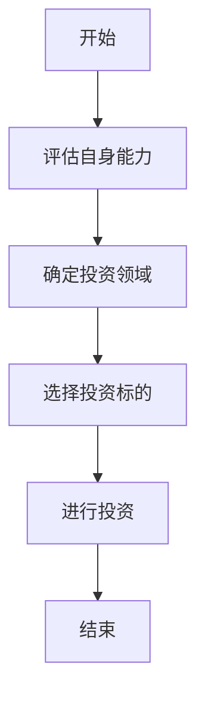
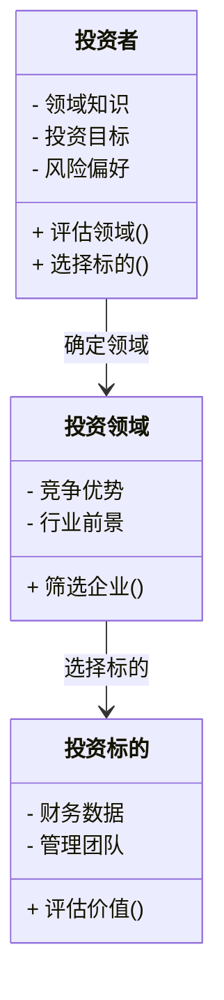
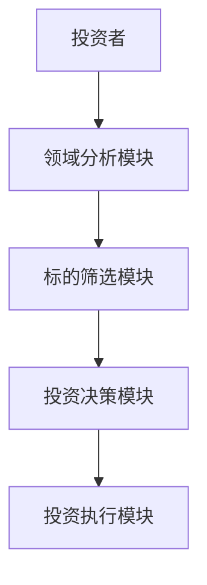

                 


# 巴菲特的圈子理论：投资你懂的领域

## 关键词：巴菲特，投资理论，价值投资，圈子理论，投资决策，内在价值

## 摘要：本文深入分析了巴菲特的圈子理论，探讨了如何通过专注于熟悉的投资领域来做出明智的投资决策。文章从背景介绍、核心概念、算法原理、数学模型、系统架构、项目实战等多方面展开，结合实际案例和详细的技术分析，帮助读者理解并应用这一理论。

---

## 第一部分: 巴菲特的圈子理论概述

### 第1章: 巴菲特的生平与投资理念

#### 1.1 巴菲特的早年经历
沃伦·巴菲特，1934年出生于美国奥马哈市，早年展现出非凡的商业头脑。他在高中时期便开始研究股票市场，并在大学期间完成了价值投资的早期学习。巴菲特的投资理念深受本杰明·格雷厄姆的影响，后者是他的导师，也是价值投资的奠基人。

#### 1.2 巴菲特的伯克希尔哈撒韦公司
巴菲特于1956年创立了合伙企业，后来发展成为伯克希尔哈撒韦公司。这家公司以投资和收购优质企业闻名，巴菲特的投资策略也逐渐成为全球投资者的典范。

#### 1.3 巴菲特的投资哲学
巴菲特的投资哲学可以概括为“价值投资”，即寻找那些具有持续竞争优势、良好管理和稳固财务状况的公司。他强调长期投资和分散风险，但更注重集中投资于少数优质企业。

---

### 第2章: 巴菲特的圈子理论

#### 2.1 圈子理论的定义
巴菲特的圈子理论是指投资者应专注于自己熟悉的投资领域，选择自己能够深入理解和评估的公司进行投资。这种策略基于投资者的知识边界和能力圈，避免涉足不熟悉的领域，从而降低投资风险。

#### 2.2 圈子理论的核心要素
- **知识边界**：投资者只能在自己具备深入知识和经验的领域进行投资。
- **竞争优势**：选择具有持续竞争优势的企业，确保长期收益。
- **长期持有**：集中投资于优质企业，长期持有以获得复利效应。

#### 2.3 圈子理论的应用范围
圈子理论不仅适用于个人投资者，也适用于机构投资者和投资组合管理。通过专注于特定行业或领域，投资者可以更好地控制风险并提高投资回报率。

---

### 第3章: 巴菲特圈子理论的背景与问题背景

#### 3.1 投资领域的复杂性
现代金融市场复杂多变，涉及众多行业和领域。投资者在面对众多选择时，往往难以全面评估所有投资标的的优劣。

#### 3.2 投资者的认知局限
每个投资者都有自己的知识边界，无法对所有领域都具备深入的了解。超出能力范围的投资容易导致错误决策。

#### 3.3 圈子理论的提出背景
巴菲特提出圈子理论是为了帮助投资者在复杂多变的市场中找到适合自己的投资领域，避免盲目投资和过度分散风险。

---

### 第4章: 巴菲特圈子理论的核心概念与联系

#### 4.1 核心概念的定义与特点
- **投资领域**：投资者熟悉的行业或领域，具备深入的知识和经验。
- **投资标的**：在特定领域内具有竞争优势和良好前景的公司。
- **投资决策**：基于对投资领域的深入了解，选择合适的投资标的进行投资。

#### 4.2 核心概念的属性对比表格

| 属性       | 投资领域       | 投资标的       | 投资决策       |
|------------|---------------|---------------|---------------|
| 知识要求    | 高            | 高            | 中            |
| 风险水平    | 中            | 高            | 中            |
| 收益潜力    | 中            | 高            | 高            |

#### 4.3 ER实体关系图



---

### 第5章: 巴菲特圈子理论的算法原理

#### 5.1 算法原理概述
巴菲特的圈子理论可以通过以下步骤转化为算法：

1. **评估自身能力**：确定自己熟悉的投资领域。
2. **确定投资领域**：选择具有竞争优势和良好前景的行业。
3. **选择投资标的**：在选定的领域内筛选出优质企业。
4. **进行投资**：集中投资于选定的标的，并长期持有。

#### 5.2 算法流程图



#### 5.3 代码示例

```python
def巴菲特投资算法():
    # 评估自身能力
    领域 = "消费领域"  # 例如：可口可乐所在的消费领域
    # 确定投资领域
    投资领域 = 领域
    # 选择投资标的
    投资标的 = ["可口可乐", "吉列"]  # 假设这些都是优质企业
    # 进行投资
    投资组合 = []
    for 标的 in 投资标的:
        投资组合.append(标的)
    return 投资组合

投资组合 = 巴菲特投资算法()
print("投资组合:", 投资组合)
```

---

### 第6章: 巴菲特圈子理论的数学模型与公式

#### 6.1 内在价值计算公式

$$
\text{内在价值} = \frac{\text{净利润} \times (1 + g)}{r - g}
$$

其中：
- $g$ 是净利润增长率
- $r$ 是期望的回报率

#### 6.2 投资回报率计算公式

$$
\text{投资回报率} = \frac{\text{资本利得} + \text{股息收益}}{\text{初始投资}}
$$

---

### 第7章: 巴菲特圈子理论的系统架构

#### 7.1 系统功能设计



#### 7.2 系统架构图



---

### 第8章: 项目实战

#### 8.1 实际案例分析
**案例：巴菲特投资可口可乐**

1. **领域分析**：巴菲特对消费领域有深入了解，可口可乐是全球知名的饮料公司。
2. **标的筛选**：可口可乐具备强大的品牌优势和稳定的现金流。
3. **投资决策**：基于对其商业模式和财务状况的分析，巴菲特决定投资可口可乐。

#### 8.2 投资结果
通过长期持有可口可乐股票，巴菲特获得了稳定的股息收入和资本增值，体现了圈子理论的有效性。

---

### 第9章: 总结与最佳实践

#### 9.1 小结
巴菲特的圈子理论强调专注于熟悉的投资领域，避免盲目投资，从而提高投资成功率。通过长期持有优质企业，投资者可以实现财富的稳步增长。

#### 9.2 最佳实践 tips
- **专注领域**：投资者应选择自己熟悉且具备竞争优势的领域进行投资。
- **长期持有**：避免频繁交易，长期持有优质企业以获得复利效应。
- **定期评估**：定期审视投资组合，确保投资标的仍符合初始选择的标准。

#### 9.3 注意事项
- **市场变化**：即使在熟悉的领域，也需要关注市场变化和企业基本面。
- **经济周期**：在经济周期波动中，投资策略应适当调整。

#### 9.4 拓展阅读
- 《巴菲特传》：了解巴菲特的投资理念和成功故事。
- 《价值投资：大道至简》：深入探讨价值投资的理论和实践。

---

通过以上步骤，我们可以清晰地看到，巴菲特的圈子理论不仅是一种投资策略，更是一种智慧的投资哲学。它帮助投资者在复杂多变的市场中找到自己的位置，做出明智的投资决策。希望本文能为您提供有价值的见解和启发。

