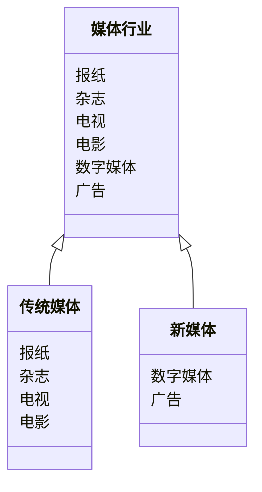
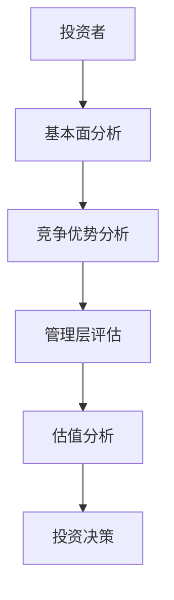
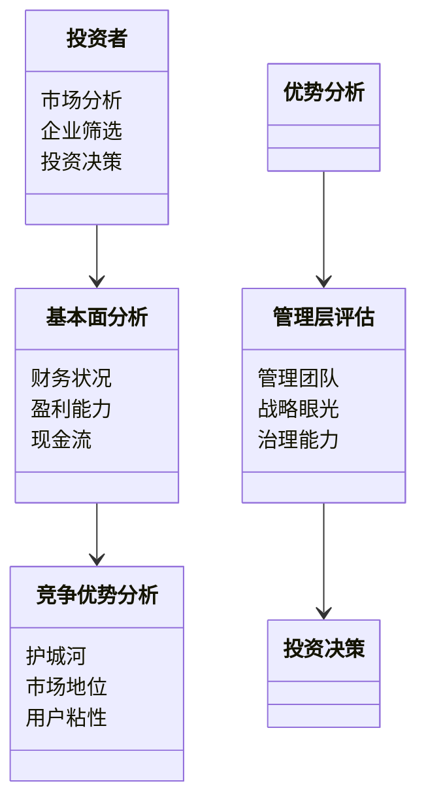

                 

# 巴菲特的媒体行业投资：内容为王的时代

---

## 关键词

- 巴菲特
- 媒体行业
- 投资
- 内容为王
- 价值投资
- 媒体策略

---

## 摘要

本文深入分析了巴菲特在媒体行业投资的核心策略，结合“内容为王”的时代背景，探讨了巴菲特的投资哲学、媒体行业的特点、投资策略的具体实施以及成功的案例分析。文章通过系统性的分析和数学模型的构建，揭示了巴菲特如何通过价值投资原则在媒体行业获得长期稳定的收益，并为投资者提供了实用的建议和启示。

---

## 第一部分: 巴菲特的投资哲学与媒体行业的结合

### 第1章: 巴菲特的投资哲学概述

#### 1.1 巴菲特的投资理念

##### 1.1.1 巴菲特的背景与投资风格

沃伦·巴菲特（Warren Buffett）是世界上最著名的投资者之一，他的投资哲学以“价值投资”为核心。巴菲特的价值投资理念强调长期投资、注重基本面分析以及寻找具有持续竞争优势的企业。他的投资风格以稳健、保守著称，注重企业的内在价值而非短期市场波动。

**关键公式：**

- **内在价值公式**：$ \text{内在价值} = \sum_{t=1}^{\infty} \frac{\text{现金流}_t}{(1 + r)^t} $

其中，$ r $ 是折现率，$\text{现金流}_t$ 是第 $ t $ 年的现金流。

##### 1.1.2 价值投资的核心理念

价值投资的核心理念是寻找市场价低于内在价值的企业。巴菲特强调，投资者应关注企业的长期盈利能力、财务状况以及管理团队的质量。他倾向于投资那些具有强大护城河（competitive moat）的企业，这些企业能够在长期的竞争中保持优势。

**关键概念：**

- **护城河**：企业竞争优势的来源，包括品牌、专利、成本优势等。
- **内在价值**：企业未来现金流的现值，是其真正的价值所在。

##### 1.1.3 巴菲特对媒体行业的独特见解

巴菲特对媒体行业的看法与传统制造业或科技行业有所不同。他认为，媒体行业具有较强的防御性，能够在经济低迷时期依然保持稳定的收入流。此外，媒体行业具有较高的进入壁垒，优质的内容和品牌忠诚度是企业长期竞争优势的关键。

**问题场景：**

在媒体行业，巴菲特关注企业的内容生产能力、品牌影响力以及用户粘性。他认为，内容为王的时代，优质内容是企业的核心竞争力。

---

#### 1.2 媒体行业的特点与投资机会

##### 1.2.1 媒体行业的定义与分类

媒体行业包括报纸、杂志、电视、电影、互联网、广告等多个子行业。随着技术的发展，媒体行业逐渐从传统媒体向新媒体转型，数字媒体和在线内容成为新的增长点。

**领域模型（mermaid）：**

##### 1.2.2 媒体行业的商业模式与盈利模式

传统媒体的商业模式主要依赖广告收入和订阅收入，而新媒体则通过数字订阅、视频订阅、广告投放等方式盈利。随着技术的进步，媒体行业正在向数字化转型，线上内容付费、会员订阅等模式逐渐成为主流。

**关键公式：**

- **广告收入公式**：$ \text{广告收入} = \text{用户数量} \times \text{广告单价} \times \text{点击率} $

- **订阅收入公式**：$ \text{订阅收入} = \text{订阅用户数量} \times \text{订阅价格} \times \text{订阅时长} $

##### 1.2.3 媒体行业的竞争格局与发展趋势

媒体行业竞争格局复杂，传统媒体与新媒体之间的竞争日益激烈。数字化转型是媒体行业发展的主要趋势，企业需要通过技术创新、内容创新以及商业模式创新来保持竞争优势。

**关键概念：**

- **数字化转型**：媒体行业从传统线下模式向线上数字化模式的转变。
- **内容创新**：通过优质内容吸引用户，提高用户粘性和忠诚度。

---

### 第2章: 内容为王的时代

#### 2.1 内容为王的内涵与外延

##### 2.1.1 内容为王的核心概念

“内容为王”是指在媒体行业中，内容的质量和创新能力是企业的核心竞争力。优质的内容能够吸引用户，提高用户粘性，从而为企业带来稳定的收入流。

**关键公式：**

- **用户粘性公式**：$ \text{用户粘性} = \frac{\text{回头用户数量}}{\text{总用户数量}} \times 100\% $

##### 2.1.2 内容为王与媒体行业的关系

内容为王是媒体行业发展的核心驱动力。在传统媒体时代，优质的内容是企业成功的关键；在新媒体时代，内容的传播速度和影响力更是决定了企业的市场地位。

##### 2.1.3 内容为王时代的媒体行业特点

在内容为王的时代，媒体行业呈现出以下特点：

1. **内容生产工业化**：从创意到制作，内容生产过程更加专业化和系统化。
2. **用户参与度高**：新媒体时代，用户不再是被动的接收者，而是可以参与内容的创作和传播。
3. **数据驱动**：通过数据分析，企业可以更精准地定位用户需求，优化内容策略。

---

#### 2.2 巴菲特与内容为王

##### 2.2.1 巴菲特对内容为王的理解

巴菲特认为，内容为王是媒体行业成功的关键。他倾向于投资那些能够持续生产优质内容的企业，这些企业具有较强的用户粘性和市场影响力。

**关键概念：**

- **用户粘性**：用户对媒体内容的依赖程度，是衡量内容质量的重要指标。
- **市场影响力**：企业在市场中的地位和话语权。

##### 2.2.2 巴菲特在媒体行业中的内容为王实践

巴菲特通过投资具有强大内容生产能力的企业，如《华盛顿邮报》，展现了他对内容为王的理解。他认为，优质的内容能够为企业的长期发展提供强大的支持。

**案例分析：**

**《华盛顿邮报》的收购**

2014年，巴菲特通过伯克希尔哈撒韦公司（Berkshire Hathaway）收购了《华盛顿邮报》，这是他布局媒体行业的关键一步。《华盛顿邮报》作为一家具有百年历史的媒体企业，拥有强大的内容生产能力和品牌影响力。

**关键公式：**

- **收购价值公式**：$ \text{收购价值} = \text{企业内在价值} \times \text{收购溢价} $

##### 2.2.3 内容为王对媒体行业投资的影响

内容为王的时代，投资者需要更加关注企业的内容生产能力、用户粘性以及市场影响力。优质内容能够为企业带来持续的收入流，是投资的核心考量因素。

---

## 第二部分: 巴菲特的媒体行业投资策略

### 第3章: 巴菲特的媒体行业投资策略

#### 3.1 巴菲特的媒体行业投资策略概述

##### 3.1.1 巴菲特的媒体行业投资策略的核心要素

巴菲特的媒体行业投资策略以价值投资为核心，注重企业的长期盈利能力、财务状况以及管理团队的质量。他倾向于投资那些具有强大护城河的企业，能够在长期的竞争中保持优势。

**关键概念：**

- **护城河**：企业竞争优势的来源，包括品牌、专利、成本优势等。
- **长期盈利能力**：企业在未来 years 中的盈利能力预测。

##### 3.1.2 巴菲特的媒体行业投资策略的实施步骤

1. **基本面分析**：分析企业的财务状况、盈利能力、现金流等基本面指标。
2. **竞争优势分析**：评估企业的竞争优势，如护城河、市场地位等。
3. **管理层评估**：考察企业的管理团队，确保其具有良好的治理能力和战略眼光。
4. **估值分析**：通过内在价值评估，确定企业的合理估值。

**系统架构设计（mermaid）：**

##### 3.1.3 巴菲特的媒体行业投资策略的成功案例

**案例分析：**

**《华盛顿邮报》的投资**

巴菲特通过收购《华盛顿邮报》，成功地将内容为王的理念融入投资策略中。《华盛顿邮报》作为一家具有强大品牌影响力和内容生产能力的企业，符合巴菲特的价值投资标准。

**关键公式：**

- **内在价值评估公式**：$ \text{内在价值} = \sum_{t=1}^{\infty} \frac{\text{现金流}_t}{(1 + r)^t} $

---

#### 3.2 巴菲特的媒体行业投资策略的具体实施

##### 3.2.1 巴菲特的媒体行业投资策略的实施步骤

1. **市场分析**：研究媒体行业的整体发展趋势，寻找具有增长潜力的子行业。
2. **企业筛选**：通过基本面分析和竞争优势分析，筛选出具有长期盈利能力的企业。
3. **投资决策**：基于估值分析和内在价值评估，做出最终的投资决策。

##### 3.2.2 巴菲特的媒体行业投资策略的具体操作

**具体操作步骤：**

1. **数据收集**：收集目标企业的财务数据、行业数据等。
2. **数据分析**：通过数据分析工具，进行基本面分析和竞争优势分析。
3. **决策制定**：根据分析结果，制定投资策略。

**关键公式：**

- **市盈率公式**：$ \text{市盈率} = \frac{\text{股价}}{\text{每股收益}} $

---

#### 3.3 巴菲特的媒体行业投资策略的数学模型与公式

##### 3.3.1 巴菲特的媒体行业投资策略的数学模型

**模型概述：**

巴菲特的媒体行业投资策略可以通过以下数学模型进行描述：

$$
\text{投资价值} = \text{内在价值} - \text{市场价}
$$

其中，内在价值是企业的真正价值，市场价是当前市场价格。

##### 3.3.2 巴菲特的媒体行业投资策略的公式推导

**公式推导过程：**

1. **确定企业现金流**：预测企业的未来现金流。
2. **计算内在价值**：使用折现率 $ r $ 对现金流进行折现，得到内在价值。
3. **比较市场价与内在价值**：如果市场价低于内在价值，企业具有投资价值。

---

### 第4章: 巴菲特的媒体行业投资策略的系统分析与架构设计方案

#### 4.1 巴菲特的媒体行业投资策略的系统分析

##### 4.1.1 巴菲特的媒体行业投资策略的系统分析概述

**系统架构设计（mermaid）：**

---

#### 4.2 巴菲特的媒体行业投资策略的架构

##### 4.2.1 巴菲特的媒体行业投资策略的架构设计

**架构设计（mermaid）：**

---

## 第三部分: 巴菲特的媒体行业投资策略的数学模型与公式

### 第5章: 巴菲特的媒体行业投资策略的数学模型与公式

#### 5.1 巴菲特的媒体行业投资策略的数学模型

##### 5.1.1 巴菲特的媒体行业投资策略的数学模型概述

**模型公式：**

$$
\text{投资价值} = \text{内在价值} - \text{市场价}
$$

其中，内在价值是企业的真正价值，市场价是当前市场价格。

##### 5.1.2 巴菲特的媒体行业投资策略的数学模型的具体公式

**公式推导：**

1. **确定企业现金流**：预测企业的未来现金流。
2. **计算内在价值**：使用折现率 $ r $ 对现金流进行折现，得到内在价值。
3. **比较市场价与内在价值**：如果市场价低于内在价值，企业具有投资价值。

---

## 第四部分: 结论与展望

### 第6章: 巴菲特的投资智慧与对投资者的启示

#### 6.1 巴菲特的投资智慧总结

巴菲特的投资哲学和媒体行业投资策略为投资者提供了宝贵的启示：

1. **长期投资**：注重企业的长期盈利能力，而非短期市场波动。
2. **价值投资**：寻找具有强大护城河和竞争优势的企业。
3. **内容为王**：在媒体行业，优质内容是企业的核心竞争力。

#### 6.2 对投资者的启示与建议

1. **深入研究**：投资者需要深入研究企业的基本面，了解企业的竞争优势和市场地位。
2. **长期持有**：价值投资需要耐心，长期持有优质企业才能获得稳定的收益。
3. **关注内容**：在媒体行业，优质内容是企业的核心竞争力，投资者需要关注企业的内容生产能力。

---

## 附录: 巴菲特的媒体行业投资案例分析

### 附录A: 《华盛顿邮报》的收购

**案例背景：**

2014年，巴菲特通过伯克希尔哈撒韦公司收购了《华盛顿邮报》，这是他布局媒体行业的关键一步。

**分析：**

1. **企业基本面**：《华盛顿邮报》具有强大的品牌影响力和内容生产能力。
2. **竞争优势**：作为一家百年老企业，具有较高的市场地位和用户粘性。
3. **投资价值**：收购价格低于企业的内在价值，具有长期的盈利能力。

---

## 结语

巴菲特的媒体行业投资策略以价值投资为核心，注重企业的长期盈利能力、竞争优势和管理层质量。内容为王的时代，优质内容是企业的核心竞争力，巴菲特通过投资具有强大内容生产能力的企业，成功地在媒体行业实现了长期稳定的收益。对于投资者来说，巴菲特的投资智慧为我们提供了宝贵的启示，值得我们深入研究和借鉴。

