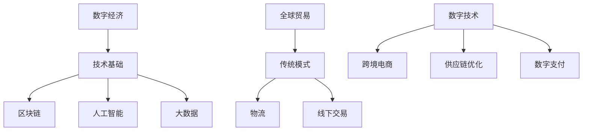
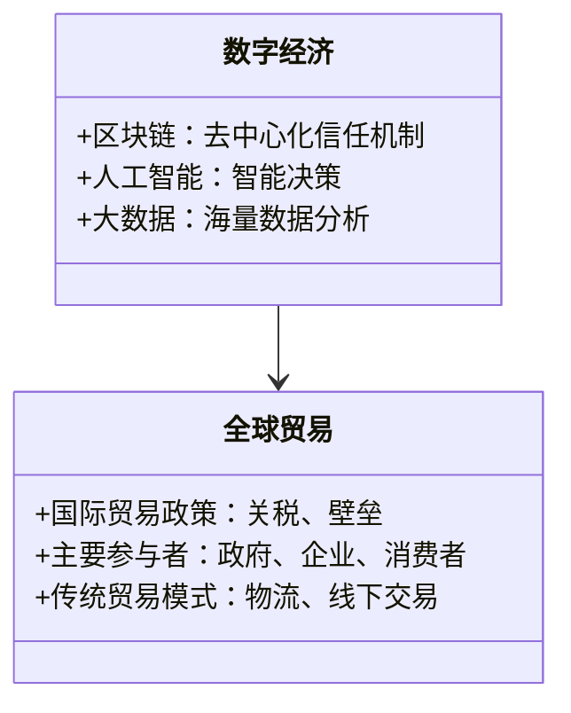

                 


# 巴菲特的宏观经济视角：数字经济对全球贸易格局的影响

> 关键词：巴菲特，数字经济，全球贸易，宏观经济，贸易格局

> 摘要：本文从巴菲特的宏观经济视角出发，探讨数字经济对全球贸易格局的影响。通过分析数字经济的核心技术基础、全球贸易的基本框架以及巴菲特的经济分析方法，本文揭示了数字技术如何改变传统的贸易模式、跨境支付和供应链管理，进而影响全球贸易的未来发展。文章结合实际案例和系统架构设计，提供了一系列深入的分析和见解。

---

## 第一部分：背景介绍

### 第1章：数字经济与全球贸易概述

#### 1.1 数字经济的定义与技术基础

数字经济是指以数字技术为核心驱动力，通过数据的产生、传输、处理和应用，形成新的生产方式、商业模式和经济形态。其核心技术基础包括：

- **区块链**：提供去中心化信任机制，确保数据的安全性和不可篡改性。
- **人工智能**：通过机器学习算法优化决策过程，提高效率。
- **大数据**：利用海量数据进行分析，提取有价值的信息。

与传统经济相比，数字经济更加依赖数据和技术创新，具有高效、透明和可扩展的特点。

#### 1.2 全球贸易的基本框架

全球贸易是指跨国界的商品、服务和资源交换，其基本框架包括：

- **国际贸易政策**：各国的关税、贸易壁垒和自由贸易协定。
- **主要参与者**：政府、企业和消费者。
- **传统贸易模式**：基于物流和线下交易的模式。

数字经济的兴起正在颠覆传统的贸易模式，推动全球贸易向数字化、智能化方向发展。

---

## 第二部分：巴菲特的宏观经济视角

### 第2章：巴菲特的宏观经济分析方法

#### 2.1 巴菲特的投资理念与宏观经济分析

巴菲特的价值投资理论强调长期稳健的投资，关注企业的内在价值和竞争优势。他认为，宏观经济的趋势和行业状况是投资决策的重要依据。

- **经济指标分析**：巴菲特关注GDP增长、通货膨胀率和失业率等指标，以判断经济的整体走势。
- **行业分析与竞争优势**：他注重企业的行业地位和竞争优势，选择那些在行业中具备长期发展潜力的企业。

#### 2.2 巴菲特的经济分析工具

巴菲特的经济分析工具包括：

- **财务报表分析**：通过利润表、资产负债表和现金流量表评估企业的财务健康状况。
- **行业分析**：分析行业周期和竞争格局，判断企业的市场地位。

---

## 第三部分：数字经济对全球贸易的影响

### 第3章：数字经济对全球贸易模式的影响

#### 3.1 数字技术对贸易模式的改变

数字技术正在重塑全球贸易模式，主要体现在以下几个方面：

1. **跨境电商的兴起**：数字技术使得小企业能够直接参与全球贸易，降低了进入国际市场的门槛。
2. **供应链管理的优化**：通过大数据和人工智能技术，企业可以实时监控和优化供应链，提高效率并降低成本。
3. **支付方式的革新**：数字支付技术（如区块链支付）使得跨境支付更加便捷和高效。

#### 3.2 数字经济对全球贸易格局的具体影响

1. **区域经济的变化**：数字经济促进了新兴市场的崛起，改变了传统的全球经济格局。
2. **跨国公司的转型**：企业需要适应数字化趋势，进行组织架构和业务模式的调整。
3. **中小企业的机会**：数字技术为中小企业提供了与大型企业竞争的机会。

---

## 第四部分：系统分析与架构设计

### 第4章：数字经济对全球贸易的影响系统分析

#### 4.1 系统架构设计

以下是数字经济对全球贸易影响的系统架构图：



#### 4.2 系统功能设计

1. **领域模型类图**：



2. **系统架构图**：

```mermaid
container 数字经济系统 {
    service 区块链服务 {
        operation 确认交易
        operation 查询记录
    }
    service 人工智能服务 {
        operation 数据分析
        operation 智能决策
    }
    service 大数据服务 {
        operation 数据采集
        operation 数据存储
    }
}
```

---

## 第五部分：项目实战

### 第5章：数字经济对全球贸易影响的项目实战

#### 5.1 环境安装

- **工具安装**：安装Python、Jupyter Notebook、区块链开发框架（如Ethereum）和人工智能库（如TensorFlow）。
- **数据获取**：收集全球贸易数据和数字经济相关的数据。

#### 5.2 核心代码实现

以下是使用Python实现的数字经济对全球贸易影响的简单模型：

```python
# 示例代码：计算数字经济对贸易的影响
import pandas as pd
import numpy as np

# 数据准备
data = pd.DataFrame({
    '国家': ['A', 'B', 'C'],
    '数字经济指数': [0.8, 0.6, 0.7],
    '贸易额': [100, 80, 90]
})

# 数据分析
correlation = data['数字经济指数'].corr(data['贸易额'])
print(f"数字经济指数与贸易额的相关系数为：{correlation}")
```

#### 5.3 案例分析

以跨境电商为例，分析数字技术如何影响贸易模式：

1. **案例背景**：某中小型企业通过电商平台直接向海外消费者销售产品。
2. **数据分析**：使用大数据分析消费者行为，优化产品推荐和营销策略。
3. **技术实现**：利用区块链技术确保交易的安全性和透明性。

---

## 第六部分：总结与展望

### 第6章：总结与展望

#### 6.1 最佳实践 tips

- **持续学习**：关注数字经济和全球贸易的最新动态和技术发展。
- **技术应用**：将数字技术应用于实际的贸易场景中，提升效率和竞争力。

#### 6.2 小结

数字经济正在深刻影响全球贸易格局，推动贸易模式的数字化和智能化。通过分析巴菲特的宏观经济视角，我们可以更好地理解数字经济对全球经济的深远影响。

#### 6.3 注意事项

- **数据隐私**：在数字经济中，数据隐私和安全是需要重点关注的问题。
- **技术风险**：在应用新技术时，需要充分评估技术风险和不确定性。

#### 6.4 拓展阅读

- 《巴菲特的投资哲学》
- 《数字经济：重构全球贸易》

---

通过以上分析，我们可以看到数字经济对全球贸易的影响是深远而复杂的。巴菲特的宏观经济视角为我们提供了一个独特的分析框架，帮助我们更好地理解这一变化。未来，随着技术的进一步发展，数字经济将继续重塑全球贸易格局。

