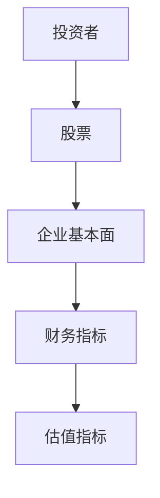
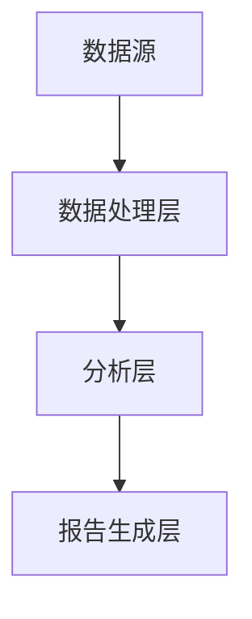

                 


# 巴菲特的市值选股法：聚焦大型优质公司

> 关键词：巴菲特，市值选股法，价值投资，大型优质公司，投资策略，企业基本面分析

> 摘要：本文深入探讨巴菲特的市值选股法，从其投资哲学到具体操作方法，分析如何通过聚焦大型优质公司实现长期稳健的投资收益。通过系统化的分析和实例，揭示巴菲特选股法的核心逻辑和实际应用。

---

## 第一部分：巴菲特的投资哲学与价值投资

### 第1章：巴菲特的投资理念

#### 1.1 价值投资的定义与核心思想
- 1.1.1 价值投资的核心理念：寻找被市场低估的优质企业
- 1.1.2 巴菲特的价值投资哲学：安全边际与长期价值
- 1.1.3 价值投资与短期交易的对比

#### 1.2 巴菲特的投资策略与选股标准
- 1.2.1 巴菲特的投资策略：聚焦于大型优质公司
- 1.2.2 选股标准：企业护城河、管理层能力和财务健康
- 1.2.3 巴菲特的长期视角：时间是伟大企业的朋友

---

## 第二部分：市值选股法的核心概念与原理

### 第2章：市值选股法的背景与定义

#### 2.1 市值选股法的定义与特点
- 2.1.1 市值选股法的核心定义：基于企业市值与内在价值的对比
- 2.1.2 市值选股法的特点：注重长期价值，避免短期波动
- 2.1.3 市值选股法与其它选股方法的对比

#### 2.2 巴菲特市值选股法的理论基础
- 2.2.1 股票定价与市场价值的关系
- 2.2.2 巴菲特对市场波动的长期视角
- 2.2.3 市值选股法的优缺点

---

## 第三部分：市值选股法的算法与系统设计

### 第3章：市值选股法的算法原理

#### 3.1 核心概念原理
- 3.1.1 市值选股法的基本原理：通过估值指标筛选优质企业
- 3.1.2 企业价值与市场价值的动态平衡
- 3.1.3 巴菲特对“安全边际”的强调

#### 3.2 核心概念属性特征对比
- 3.2.1 估值指标对比表（市盈率、市净率、股息率等）
- 3.2.2 不同选股方法的优劣势对比
- 3.2.3 市值选股法与其他投资策略的联系

#### 3.3 ER实体关系图


---

## 第四部分：市值选股法的系统分析与架构设计

### 第4章：系统分析与架构设计

#### 4.1 问题场景介绍
- 4.1.1 投资者面临的选股挑战
- 4.1.2 市值选股法的应用场景
- 4.1.3 系统设计的目标与范围

#### 4.2 系统功能设计
- 4.2.1 数据采集模块：获取企业基本面数据
- 4.2.2 筛选模块：基于估值指标筛选优质企业
- 4.2.3 分析模块：对企业进行深度分析与评估
- 4.2.4 报告生成模块：输出投资建议

#### 4.3 系统架构设计


---

## 第五部分：市值选股法的项目实战

### 第5章：项目实战与案例分析

#### 5.1 环境安装与数据准备
- 5.1.1 安装Python与相关库（Pandas、NumPy等）
- 5.1.2 数据源获取：股票数据与财务指标

#### 5.2 系统核心实现
- 5.2.1 基于市值选股法的筛选模型代码
```python
import pandas as pd

# 假设df为股票数据，包含'PE'（市盈率）、'PB'（市净率）、'ROE'（净资产收益率）等指标
def screen_stocks(df):
    # 筛选条件：市盈率 < 15，市净率 < 2，净资产收益率 > 10%
    selected = df[(df['PE'] < 15) & (df['PB'] < 2) & (df['ROE'] > 0.1)]
    return selected
```

#### 5.3 实际案例分析
- 5.3.1 案例一：苹果公司（AAPL）
- 5.3.2 案例二：谷歌母公司（GOOGL）
- 5.3.3 案例三：可口可乐（KO）

#### 5.4 项目小结
- 5.4.1 项目总结
- 5.4.2 实践中的注意事项

---

## 第六部分：最佳实践与总结

### 第6章：最佳实践与小结

#### 6.1 小结
- 6.1.1 巴菲特市值选股法的核心思想
- 6.1.2 实际应用中的关键点

#### 6.2 注意事项
- 6.2.1 数据来源的可靠性
- 6.2.2 市场波动的影响
- 6.2.3 长期投资的纪律性

#### 6.3 拓展阅读
- 6.3.1 推荐书籍：《巴菲特的选股艺术》
- 6.3.2 推荐文章：《价值投资的未来之路》

---

## 附录：数学公式与估值指标

### 附录A：估值指标公式

#### 1. 市盈率（P/E）
$$ P/E = \frac{股价}{每股收益} $$

#### 2. 市净率（P/B）
$$ P/B = \frac{股价}{每股净资产} $$

#### 3. 股息率
$$ 股息率 = \frac{每股股息}{股价} \times 100\% $$

#### 4. 净资产收益率（ROE）
$$ ROE = \frac{净利润}{净资产} \times 100\% $$

---

通过以上结构和内容，您可以逐步展开文章的详细写作，每部分内容都以清晰的逻辑和专业的技术语言进行阐述，确保文章的深度、广度和可读性。

