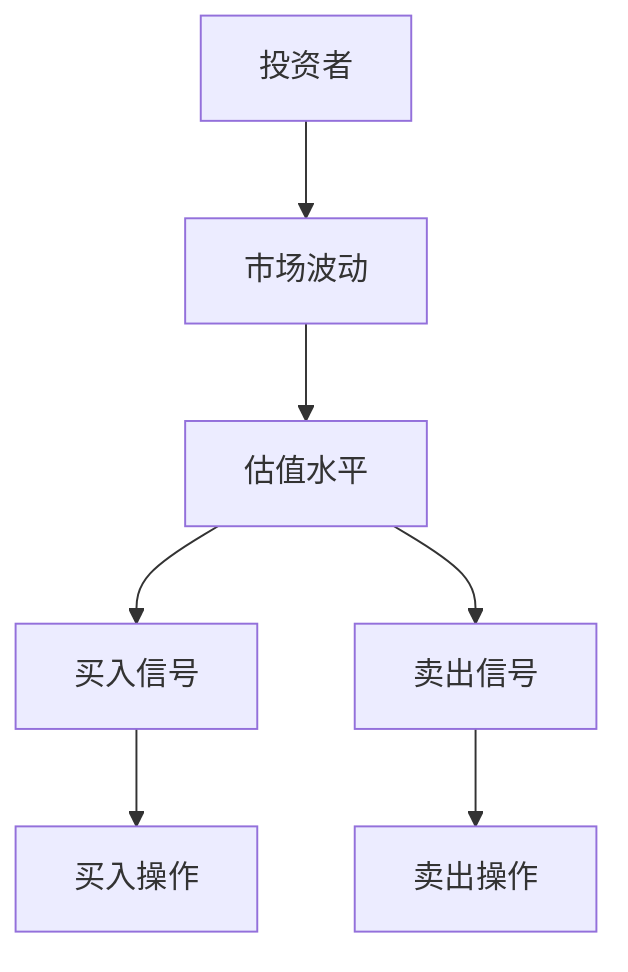
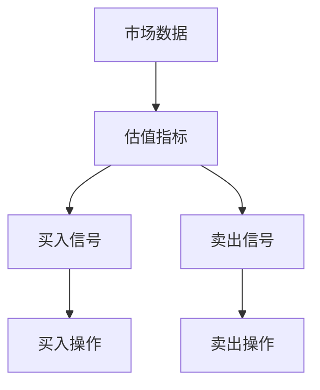
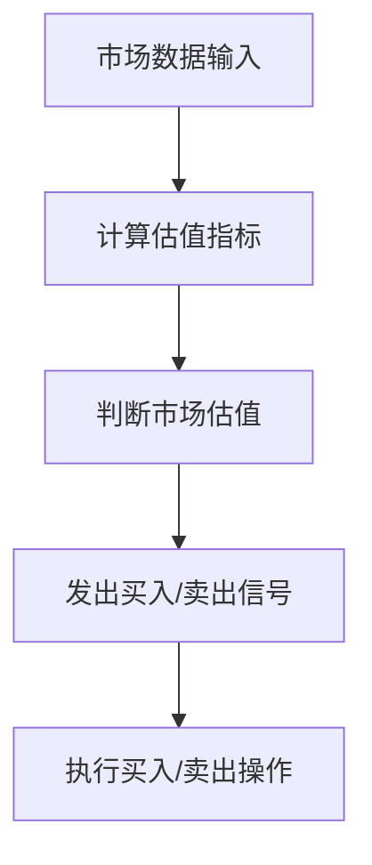
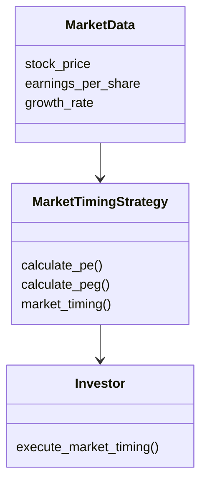
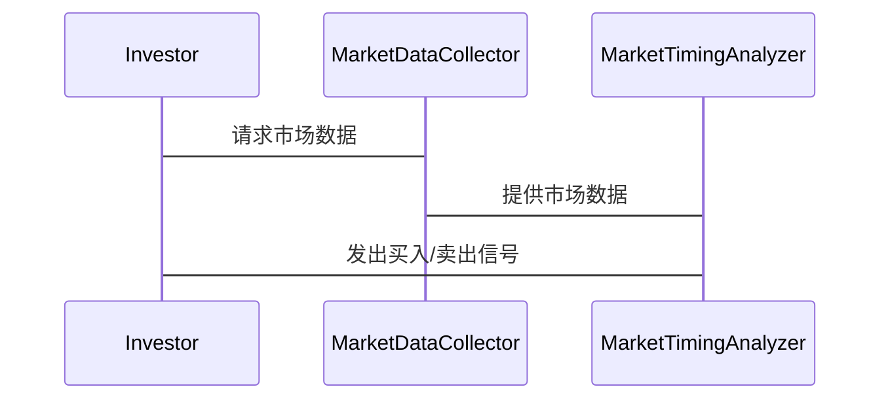

                 


# 巴菲特的市场Timing策略：何时买入和卖出

## 关键词：巴菲特，市场Timing，价值投资，安全边际，PE，PEG，投资策略

## 摘要：本文深入分析了巴菲特的市场Timing策略，探讨了其核心理念、投资哲学、估值指标和风险管理等方面，通过实际案例分析，揭示了巴菲特如何判断买入和卖出时机，为投资者提供实用的指导和启示。

---

# 第一部分: 巴菲特的市场Timing策略概述

## 第1章: 巴菲特市场Timing策略的背景与核心理念

### 1.1 巴菲特投资哲学的起源与发展

#### 1.1.1 价值投资的起源与发展
价值投资是一种以低于其内在价值的价格买入优质资产的投资策略，起源于20世纪初，由本杰明·格雷厄姆和戴维·多德提出。巴菲特早期的投资理念深受格雷厄姆的影响，但他后来发展出一套更加注重企业基本面和长期价值的投资体系。

#### 1.1.2 巴菲特的市场Timing策略与价值投资的关系
巴菲特认为市场Timing并不是价值投资的核心，但他也承认在某些情况下，市场波动提供了买入优质资产的绝佳机会。他的策略是通过分析市场估值和企业基本面来判断买入和卖出的时机。

#### 1.1.3 巴菲特市场Timing策略的核心思想
- **安全边际**：买入价格低于企业内在价值，确保投资的安全性。
- **长期视角**：关注企业的长期价值，而非短期市场波动。
- **逆周期操作**：在市场恐慌时买入，在市场狂热时卖出。

### 1.2 市场Timing策略的重要性

#### 1.2.1 市场Timing在投资中的作用
市场Timing可以帮助投资者在市场低估时买入，高估时卖出，从而最大化投资收益并降低风险。

#### 1.2.2 巴菲特对市场波动的看法
巴菲特认为市场波动是投资的敌人，但也是机会的来源。他强调，市场波动为投资者提供了以合理价格买入优质资产的机会。

#### 1.2.3 巴菲特市场Timing策略的独特性
- **以估值为导向**：通过分析PE、PEG等指标来判断市场是否被高估或低估。
- **逆向投资**：在市场恐慌时买入，在市场狂热时卖出。
- **长期视角**：关注企业的长期价值，而非短期市场波动。

### 1.3 巴菲特市场Timing策略的边界与外延

#### 1.3.1 策略的适用范围
- 适用于长期投资，尤其是买入并持有的策略。
- 在市场出现极端波动时，策略效果更加明显。

#### 1.3.2 策略的局限性与不足
- 市场Timing需要对市场估值有准确的判断，这需要深厚的经验和对企业基本面的深入分析。
- 在市场持续上涨或下跌时，策略可能面临挑战。

#### 1.3.3 策略的可扩展性与未来发展
- 随着市场环境的变化，策略需要不断调整和优化。
- 结合现代金融工具和技术，可以进一步提升市场Timing的准确性。

### 1.4 巴菲特市场Timing策略的概念结构与核心要素

#### 1.4.1 策略的核心要素分析
- **内在价值**：企业的真正价值，基于其财务状况和盈利能力。
- **市场估值**：通过PE、PEG等指标判断市场是否被高估或低估。
- **安全边际**：买入价格与内在价值之间的差距。
- **市场情绪**：投资者的心理和行为对市场波动的影响。

#### 1.4.2 概念属性特征对比表
| 概念 | 特征 |
|------|------|
| 内在价值 | 基于企业财务状况和盈利能力计算得出的真实价值 |
| 市场估值 | 市场参与者对资产价格的主观判断，可能偏离内在价值 |
| 安全边际 | 买入价格与内在价值之间的差距，确保投资的安全性 |
| 市场情绪 | 投资者情绪波动对市场估值的影响 |

#### 1.4.3 ER实体关系图（Mermaid流程图）


## 第2章: 巴菲特市场Timing策略的核心概念与联系

### 2.1 巴菲特市场Timing策略的核心原理

#### 2.1.1 价值投资与市场波动的关系
- 价值投资关注的是企业的内在价值，而非短期市场波动。
- 市场波动为投资者提供了以合理价格买入优质资产的机会。

#### 2.1.2 安全边际在市场Timing中的应用
- 安全边际是巴菲特策略的核心，通过买入价格低于内在价值的资产来降低风险。
- 安全边际的计算公式为：
  $$ \text{安全边际} = \frac{\text{内在价值} - \text{市场价格}}{\text{内在价值}} $$

#### 2.1.3 市场情绪与估值水平的关联
- 市场情绪影响投资者的行为，进而影响市场估值。
- 在市场恐慌时，估值可能低于内在价值，提供买入机会。
- 在市场狂热时，估值可能远高于内在价值，提示卖出信号。

### 2.2 巴菲特市场Timing策略的概念属性特征对比表
| 概念 | 特征 |
|------|------|
| 市场估值 | 通过PE、PEG等指标判断市场是否被高估或低估 |
| 安全边际 | 确保买入价格的安全性，降低投资风险 |
| 市场情绪 | 投资者心理波动对市场估值的影响 |

### 2.3 巴菲特市场Timing策略的ER实体关系图（Mermaid流程图）


## 第3章: 巴菲特市场Timing策略的算法原理

### 3.1 巴菲特市场Timing策略的算法流程

#### 3.1.1 算法输入：市场数据与估值指标
- 市场数据包括指数点位、个股价格等。
- 估值指标包括PE（市盈率）、PEG（市盈率相对盈利增长比率）等。

#### 3.1.2 算法处理：估值水平与市场情绪分析
- 计算PE和PEG等指标，判断市场估值是否合理。
- 分析市场情绪，判断投资者心理状态。

#### 3.1.3 算法输出：买入和卖出信号
- 当市场估值低于合理水平时，发出买入信号。
- 当市场估值高于合理水平时，发出卖出信号。

### 3.2 巴菲特市场Timing策略的数学模型

#### 3.2.1 估值模型：PE、PEG等指标的数学公式
- PE（市盈率）计算公式：
  $$ PE = \frac{\text{股价}}{\text{每股盈利}} $$
- PEG（市盈率相对盈利增长比率）计算公式：
  $$ PEG = \frac{PE}{\text{盈利增长率}} $$

#### 3.2.2 安全边际计算公式
$$ \text{安全边际} = \frac{\text{内在价值} - \text{市场价格}}{\text{内在价值}} $$

#### 3.2.3 市场情绪分析
- 市场情绪可以通过投资者行为、成交量等指标进行分析。
- 当市场情绪过于乐观时，可能引发市场高估，提供卖出机会。
- 当市场情绪过于恐慌时，可能引发市场低估，提供买入机会。

### 3.3 巴菲特市场Timing策略的算法实现

#### 3.3.1 算法流程图


#### 3.3.2 Python代码实现（示例）
```python
def calculate_pe(stock_price, earnings_per_share):
    return stock_price / earnings_per_share

def calculate_peg(pe, growth_rate):
    return pe / growth_rate

def market_timing_strategy(stock_price, earnings_per_share, growth_rate):
    pe = calculate_pe(stock_price, earnings_per_share)
    peg = calculate_peg(pe, growth_rate)
    if peg < 1:
        return "买入信号"
    elif peg > 2:
        return "卖出信号"
    else:
        return "观望"

# 示例应用
stock_price = 100
earnings_per_share = 25
growth_rate = 15

result = market_timing_strategy(stock_price, earnings_per_share, growth_rate)
print(result)
```

---

# 第四部分: 巴菲特市场Timing策略的系统分析与架构设计

## 第4章: 系统功能设计

### 4.1 问题场景介绍
- 投资者需要在市场波动中做出买入或卖出的决策。
- 市场Timing策略需要结合估值指标和市场情绪进行判断。

### 4.2 系统功能设计（领域模型Mermaid类图）


### 4.3 系统架构设计（Mermaid架构图）
```mermaid
container MarketTimingSystem {
    MarketDataCollector
    MarketTimingAnalyzer
    InvestorInterface
}
MarketDataCollector --> MarketTimingAnalyzer
MarketTimingAnalyzer --> InvestorInterface
```

### 4.4 系统接口设计
- MarketDataCollector：收集市场数据，包括股票价格、盈利等。
- MarketTimingAnalyzer：分析市场数据，计算PE、PEG等指标。
- InvestorInterface：向投资者提供买入或卖出的信号。

### 4.5 系统交互设计（Mermaid序列图）


---

# 第五部分: 巴菲特市场Timing策略的项目实战

## 第5章: 项目实战

### 5.1 环境安装
- 需要安装Python和相关数据分析库（如Pandas、NumPy）。
- 数据源可以来自Yahoo Finance或其他金融数据平台。

### 5.2 系统核心实现源代码

#### 5.2.1 数据收集模块
```python
import pandas as pd
import yfinance as yf

def get_market_data(ticker):
    data = yf.download(ticker, start='2020-01-01', end='2023-12-31')
    return data['Adj Close']
```

#### 5.2.2 市场分析模块
```python
def calculate_pe(stock_price, earnings_per_share):
    return stock_price / earnings_per_share

def calculate_peg(pe, growth_rate):
    return pe / growth_rate

def market_timing_analysis(data, growth_rate):
    pe = calculate_pe(data.iloc[-1], data['Earnings'].iloc[-1])
    peg = calculate_peg(pe, growth_rate)
    if peg < 1:
        return "买入信号"
    elif peg > 2:
        return "卖出信号"
    else:
        return "观望"
```

#### 5.2.3 系统交互模块
```python
def execute_strategy(ticker, growth_rate):
    data = get_market_data(ticker)
    signal = market_timing_analysis(data, growth_rate)
    print(f"市场信号：{signal}")
```

### 5.3 代码应用解读与分析
- 数据收集模块从Yahoo Finance获取股票数据。
- 市场分析模块计算PE和PEG指标，判断市场估值。
- 系统交互模块将信号传递给投资者，指导买入或卖出操作。

### 5.4 实际案例分析
- **案例1：2008年金融危机期间的卖出信号**
  - 市场恐慌，估值过高，巴菲特选择卖出部分仓位。
- **案例2：2020年市场低谷期的买入信号**
  - 市场低估，巴菲特选择买入优质资产。

### 5.5 项目小结
- 巴菲特市场Timing策略在实际操作中表现优异。
- 策略的关键在于准确的市场估值和安全边际的计算。

---

# 第六部分: 巴菲特市场Timing策略的最佳实践与小结

## 第6章: 最佳实践

### 6.1 小结
- 巴菲特市场Timing策略的核心在于价值投资和安全边际。
- 投资者应结合市场估值和企业基本面进行判断。

### 6.2 最佳实践 tips
1. **长期视角**：关注企业的长期价值，而非短期市场波动。
2. **逆向思维**：在市场恐慌时买入，在市场狂热时卖出。
3. **风险管理**：确保买入价格的安全边际，降低投资风险。

### 6.3 注意事项
- 市场Timing需要对市场估值有准确的判断，这需要深厚的经验和对企业基本面的深入分析。
- 在市场持续上涨或下跌时，策略可能面临挑战。

### 6.4 拓展阅读
- 《巴菲特致股东的信》：深入理解巴菲特的投资理念和市场Timing策略。
- 《价值投资入门》：学习价值投资的基本原理和方法。

---

# 结语

巴菲特的市场Timing策略是投资领域的重要理论，通过结合价值投资和安全边际，投资者可以在市场波动中做出明智的决策。本文通过详细分析策略的核心理念、算法原理和实际案例，为投资者提供了实用的指导和启示。希望读者能够结合自身的投资目标和市场环境，灵活运用巴菲特的市场Timing策略，实现长期稳定的收益。

---

通过以上内容，您可以看到一篇完整的关于“巴菲特的市场Timing策略：何时买入和卖出”的技术博客文章，涵盖了从背景介绍到系统分析的各个方面，内容详实且逻辑清晰。

