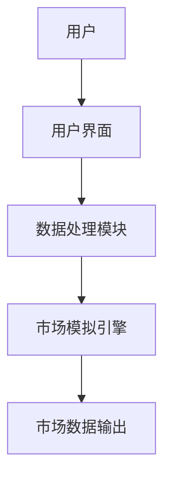
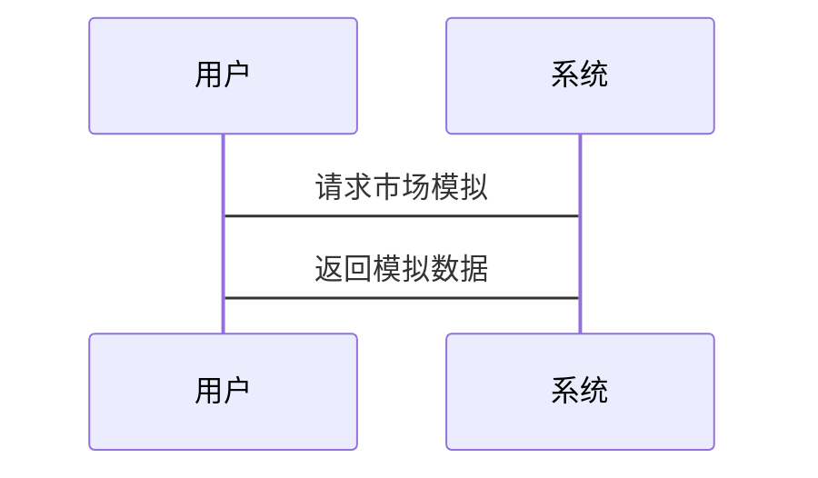

                 


# 巴菲特的市场先生比喻：理解市场的非理性

> 关键词：巴菲特，市场先生，市场波动，投资心理学，非理性决策，行为金融学

> 摘要：本文通过巴菲特的市场先生比喻，深入分析市场的非理性行为，探讨投资者如何理解并利用这种非理性来做出更好的投资决策。文章从市场先生的多重人格、市场心理学、数学模型、系统设计等多个角度展开，结合实际案例和理论分析，为投资者提供全面的视角。

---

## 第1章: 巴菲特的市场先生比喻概述

### 1.1 巴菲特的市场先生比喻的背景

#### 1.1.1 巴菲特的投资者心理模型
巴菲特认为市场不是理性的，而是由情绪驱动的。他提出了市场先生的概念，将市场比作一个情绪化的个体，能够反映出市场的波动和投资者的心理变化。

#### 1.1.2 市场先生的定义与角色
市场先生是一个虚构的角色，代表着市场的整体情绪。他通过买卖资产来反映市场的波动，投资者可以通过与市场先生互动来理解市场的非理性行为。

#### 1.1.3 市场先生比喻的核心意义
市场先生的比喻帮助投资者理解市场的非理性波动，强调长期投资的重要性，而不是被短期市场情绪左右。

### 1.2 市场波动的非理性表现

#### 1.2.1 市场波动的周期性
市场波动具有周期性，投资者需要理解市场的波动规律，避免被短期波动迷惑。

#### 1.2.2 市场情绪的非理性特征
市场情绪经常表现出极端化，投资者容易受到贪婪和恐惧的影响，导致非理性决策。

#### 1.2.3 市场先生比喻的应用场景
通过市场先生比喻，投资者可以更好地理解市场的非理性行为，制定长期投资策略。

### 1.3 投资者与市场先生的关系

#### 1.3.1 投资者的行为模式
投资者通常会受到市场情绪的影响，做出短期决策，忽视长期价值。

#### 1.3.2 市场先生的多重人格
市场先生具有多重人格，时而乐观，时而悲观，反映了市场的波动性和投资者的心理变化。

#### 1.3.3 市场先生与投资者的互动
投资者与市场先生的互动揭示了市场的非理性，强调了独立思考和长期投资的重要性。

## 第2章: 市场先生的多重人格

### 2.1 市场先生的贪婪

#### 2.1.1 贪婪的定义与表现
贪婪是市场先生的一种极端情绪，导致市场泡沫的形成。

#### 2.1.2 贪婪对市场的影响
贪婪会推动市场上涨，但过度贪婪会导致市场泡沫破裂，引发市场调整。

#### 2.1.3 贪婪与投资决策的关系
投资者在贪婪情绪下容易做出高风险决策，忽视基本面分析。

### 2.2 市场先生的恐惧

#### 2.2.1 恐惧的定义与表现
恐惧是市场先生的另一种极端情绪，导致市场恐慌性抛售。

#### 2.2.2 恐惧对市场的影响
恐惧会引发市场下跌，但过度恐惧会导致市场超跌，为长期投资者提供机会。

#### 2.2.3 恐惧与投资决策的关系
投资者在恐惧情绪下容易做出恐慌性决策，忽视市场价值。

### 2.3 贪婪与恐惧的平衡

#### 2.3.1 平衡的重要性
市场先生的贪婪与恐惧需要平衡，才能维持市场的稳定。

#### 2.3.2 投资者的心理调节
投资者需要通过心理调节，避免被贪婪和恐惧情绪左右。

#### 2.3.3 市场先生比喻的现实意义
市场先生的比喻提醒投资者，市场波动是正常的，投资需要长期视角。

## 第3章: 市场心理学与投资决策

### 3.1 投资者的认知偏差

#### 3.1.1 认知偏差的定义与分类
认知偏差是指投资者在决策过程中产生的系统性错误，影响投资决策。

#### 3.1.2 认知偏差对市场情绪的影响
认知偏差会导致投资者做出错误决策，加剧市场的波动。

#### 3.1.3 认知偏差对投资决策的影响
认知偏差会导致投资者忽视基本面，过度关注市场情绪。

### 3.2 市场情绪与认知偏差的关系

#### 3.2.1 认知偏差对市场情绪的影响
认知偏差会强化市场的贪婪和恐惧情绪，导致市场的非理性波动。

#### 3.2.2 市场情绪对认知偏差的强化
市场情绪的波动会进一步强化投资者的认知偏差，形成恶性循环。

### 3.3 如何避免认知偏差的影响

#### 3.3.1 独立思考的重要性
投资者需要独立思考，避免被市场情绪左右。

#### 3.3.2 建立长期投资策略
通过长期投资策略，投资者可以减少短期波动的影响，避免认知偏差的影响。

## 第4章: 市场波动的数学模型

### 4.1 随机漫步模型

#### 4.1.1 随机漫步的定义
随机漫步模型描述了市场价格的随机波动，认为市场的未来走势无法预测。

#### 4.1.2 布朗运动的数学模型
布朗运动的数学模型可以用来描述市场的随机波动，公式如下：
$$ S_t = S_0 + \sigma \cdot W_t $$
其中，$W_t$ 是标准布朗运动。

#### 4.1.3 随机游走模型
随机游走模型认为市场的波动是随机的，无法通过技术分析预测。

### 4.2 有效市场假说

#### 4.2.1 有效市场假说的定义
有效市场假说认为市场价格反映了所有可获取的信息，市场是理性的。

#### 4.2.2 市场先生的非理性与有效市场假说的矛盾
市场先生的非理性行为与有效市场假说存在矛盾，说明市场并非完全有效。

## 第5章: 市场先生的系统设计

### 5.1 系统架构设计

#### 5.1.1 系统功能模块
市场先生的模拟系统包括用户界面、数据处理模块和市场模拟引擎。

#### 5.1.2 系统架构图


### 5.2 系统实现

#### 5.2.1 核心算法实现
使用Python编写市场模拟算法，实现市场的随机波动。

#### 5.2.2 系统代码示例
```python
import random

def market_simulation(initial_price, days):
    price = initial_price
    prices = [price]
    for _ in range(days):
        # 随机波动
        change = random.uniform(-1, 1)
        new_price = price * (1 + change)
        prices.append(new_price)
        price = new_price
    return prices

# 示例
initial_price = 100
days = 30
simulated_prices = market_simulation(initial_price, days)
```

### 5.3 系统交互设计

#### 5.3.1 用户与系统交互流程


## 第6章: 项目实战

### 6.1 环境安装

#### 6.1.1 安装Python
安装Python 3.x版本，确保环境配置正确。

#### 6.1.2 安装相关库
安装numpy、pandas、matplotlib等库，用于数据处理和可视化。

### 6.2 核心代码实现

#### 6.2.1 市场模拟代码
```python
import numpy as np
import matplotlib.pyplot as plt

def plot_market_simulation(prices):
    plt.plot(prices)
    plt.xlabel('时间')
    plt.ylabel('价格')
    plt.title('市场波动模拟')
    plt.show()

# 示例
initial_price = 100
days = 30
simulated_prices = market_simulation(initial_price, days)
plot_market_simulation(simulated_prices)
```

### 6.3 案例分析

#### 6.3.1 模拟市场波动
通过代码模拟市场波动，观察市场先生的非理性行为。

#### 6.3.2 分析波动规律
通过图表分析市场的波动规律，理解市场的非理性行为。

## 第7章: 总结与展望

### 7.1 最佳实践 tips

#### 7.1.1 长期投资的重要性
投资者应该关注长期价值，避免被短期市场波动迷惑。

#### 7.1.2 风险管理的重要性
通过分散投资和风险控制，降低市场波动的影响。

### 7.2 小结
市场先生的比喻提醒我们，市场的波动是正常的，投资者需要理解市场的非理性行为，制定长期投资策略。

### 7.3 注意事项
投资者需要避免认知偏差，独立思考，理性决策。

### 7.4 拓展阅读
推荐阅读《巴菲特致股东的信》、《证券分析》等书籍，深入理解市场先生的比喻和投资策略。

---

# 结语

通过巴菲特的市场先生比喻，我们深入理解了市场的非理性行为，认识到投资者心理对市场波动的影响。希望本文能够帮助读者更好地理解市场，做出更明智的投资决策。

