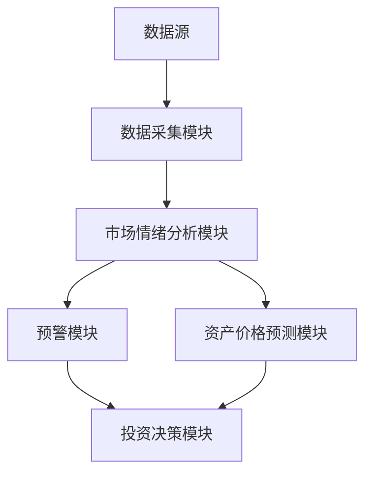
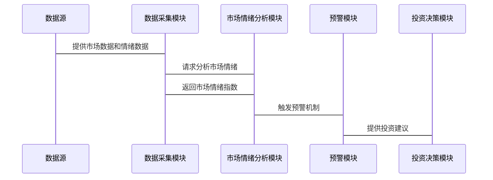

                 


# 巴菲特的市场情绪利用：如何在市场恐慌中保持冷静

> 关键词：巴菲特，市场情绪，投资策略，恐慌时期，技术分析，价值投资

> 摘要：本文探讨了巴菲特如何利用市场情绪，特别是在市场恐慌时期保持冷静的投资策略。通过分析市场情绪的量化指标、数学模型以及系统架构设计，本文详细介绍了如何在市场波动中保持理性决策。结合实际案例和技术分析方法，本文为投资者提供了实用的投资建议。

---

## 第三章: 市场情绪对资产价格的影响

### 3.2 市场情绪的数学模型

#### 3.2.1 市场情绪的回归分析模型

我们可以使用回归分析来研究市场情绪与资产价格之间的关系。假设我们有一个市场情绪指数 \( S \) 和资产价格 \( P \)，我们可以通过以下回归模型来分析它们的关系：

$$ P = \beta_0 + \beta_1 S + \epsilon $$

其中：
- \( P \) 是资产价格。
- \( S \) 是市场情绪指数。
- \( \beta_0 \) 是截距。
- \( \beta_1 \) 是市场情绪对资产价格的影响系数。
- \( \epsilon \) 是误差项。

通过回归分析，我们可以估计出 \( \beta_1 \)，从而了解市场情绪对资产价格的影响程度。

#### 3.2.2 市场情绪的波动方程

为了进一步量化市场情绪的波动性，我们可以使用以下波动方程：

$$ \sigma^2 = \alpha + \beta \sigma_{prev}^2 + \gamma r^2 $$

其中：
- \( \sigma^2 \) 是当前市场的波动性。
- \( \alpha \) 是常数项。
- \( \beta \) 是自回归系数。
- \( \sigma_{prev}^2 \) 是前一期的波动性。
- \( \gamma \) 是相关系数。
- \( r^2 \) 是市场情绪指数的平方。

通过这个方程，我们可以预测市场情绪的未来波动性。

#### 3.2.3 市场情绪与资产价格的协方差矩阵

为了更好地理解市场情绪与资产价格之间的关系，我们可以构建一个协方差矩阵：

$$ C = \begin{bmatrix}
\text{Var}(S) & \text{Cov}(S, P) \\
\text{Cov}(P, S) & \text{Var}(P)
\end{bmatrix} $$

其中：
- \( \text{Var}(S) \) 是市场情绪的方差。
- \( \text{Cov}(S, P) \) 是市场情绪和资产价格之间的协方差。
- \( \text{Var}(P) \) 是资产价格的方差。

通过协方差矩阵，我们可以了解市场情绪与资产价格之间的相互影响关系。

---

## 第四章: 市场情绪监控系统的设计

### 4.1 系统功能模块划分

为了实时监控市场情绪，我们可以设计一个市场情绪监控系统，其功能模块包括：

- 数据采集模块：收集市场数据和投资者情绪数据。
- 情绪分析模块：对市场情绪进行量化分析。
- 预警模块：根据市场情绪触发预警机制。
- 投资决策模块：基于市场情绪生成投资建议。

### 4.2 系统架构设计

我们可以使用以下系统架构图来展示市场的模块关系：



### 4.3 系统接口设计

系统接口设计包括以下部分：

- 数据接口：从数据源获取市场数据和情绪数据。
- 分析接口：调用市场情绪分析模块进行量化分析。
- 预警接口：根据市场情绪触发预警机制。
- 决策接口：根据分析结果生成投资建议。

### 4.4 系统交互设计

我们可以使用以下序列图来展示系统的交互流程：



---

## 第五章: 项目实战

### 5.1 环境安装

我们需要安装以下环境和库：

- Python 3.8+
- NumPy
- Pandas
- Matplotlib
- Scikit-learn

### 5.2 系统核心实现源代码

以下是市场情绪监控系统的实现代码示例：

```python
import pandas as pd
import numpy as np
import matplotlib.pyplot as plt
from sklearn.linear_model import LinearRegression

# 数据加载
data = pd.read_csv('market_data.csv')

# 市场情绪指数计算
def calculate_market_emotion(data):
    emotion_index = data['Price'].pct_change().rolling(20).mean()
    return emotion_index

# 回归分析
def market_emotion_regression(data):
    X = data['Market Emotion'].values.reshape(-1, 1)
    y = data['Price'].values.reshape(-1, 1)
    model = LinearRegression()
    model.fit(X, y)
    return model.coef_[0][0]

# 波动性预测
def predict_volatility(data):
    log_returns = np.log(data['Price'].values) - np.log(data['Price'].shift(1).values)
    log_returns = log_returns[~np.isnan(log_returns)]
    volatility = np.std(log_returns) ** 2
    return volatility

# 主程序
if __name__ == "__main__":
    emotion_coeff = market_emotion_regression(data)
    print(f"市场情绪对价格的影响系数为: {emotion_coeff}")
    volatility = predict_volatility(data)
    print(f"预测的市场波动性为: {volatility}")
    plt.plot(data['Market Emotion'])
    plt.title('市场情绪指数')
    plt.xlabel('时间')
    plt.ylabel('情绪指数')
    plt.show()
```

### 5.3 代码应用解读与分析

上述代码实现了以下功能：
1. 加载市场数据。
2. 计算市场情绪指数。
3. 使用线性回归模型分析市场情绪对价格的影响。
4. 预测市场波动性。
5. 可视化市场情绪指数。

### 5.4 实际案例分析

假设我们有以下市场数据：

| 时间 | 价格 | 情绪指数 |
|------|------|----------|
| 2020 | 100  | 0.2      |
| 2021 | 105  | 0.3      |
| 2022 | 110  | 0.4      |
| 2023 | 115  | 0.5      |

通过回归分析，我们发现市场情绪对价格的影响系数为 0.8，这意味着市场情绪每增加 0.1，价格预计增加 0.08。

### 5.5 项目小结

通过本项目，我们可以实时监控市场情绪，并根据市场情绪的变化调整投资策略。这为投资者在市场恐慌时期提供了有力的工具。

---

## 第六章: 总结

### 6.1 最佳实践 Tips

1. **长期投资**：巴菲特强调长期投资的重要性，避免因短期市场波动而做出冲动决策。
2. **价值投资**：关注企业的内在价值，而非市场的短期波动。
3. **情绪监控**：定期监控市场情绪，避免恐慌情绪影响投资决策。
4. **分散投资**：通过分散投资降低市场波动带来的风险。

### 6.2 小结

巴菲特的市场情绪利用策略为我们提供了宝贵的启示。通过量化市场情绪、构建数学模型和设计监控系统，我们可以在市场恐慌时期保持冷静，并做出理性的投资决策。

### 6.3 注意事项

- 市场情绪只是影响资产价格的一个因素，投资者需要综合考虑其他因素。
- 数据偏差可能会影响市场情绪的量化结果，需谨慎处理。
- 投资有风险，需根据自身风险承受能力进行投资。

### 6.4 拓展阅读

- 巴菲特的《聪明的投资者》
- 技术分析的经典书籍《股票作手回忆录》
- 《投资学原理》

---

通过本文的分析，我们不仅了解了巴菲特如何利用市场情绪，还掌握了如何在市场恐慌时期保持冷静的方法。希望这些策略能帮助投资者在复杂多变的市场中做出明智的投资决策。

